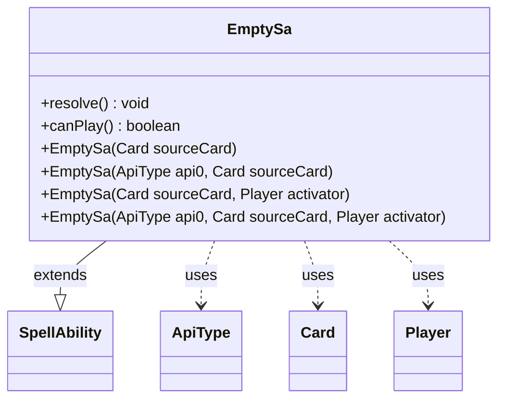

---
aliases:
  - EmptySa
tags:
  - java/class
  - module/forge-game
  - pkg/forge/game/spellability
fqn: forge.game.spellability.SpellAbility.EmptySa
package: forge.game.spellability
module: forge-game
kind: Class
---

# EmptySa

**Package:** `forge.game.spellability` &nbsp; **Module:** `forge-game` &nbsp; **Kind:** Class



## Relationships
**Extends:**
- [[forge.game.spellability.SpellAbility|SpellAbility]]
**Uses:**
- [[forge.game.ability.ApiType|ApiType]]
- [[forge.game.card.Card|Card]]
- [[forge.game.player.Player|Player]]

## Source
`forge-game/src/main/java/forge/game/spellability/SpellAbility.java` — declaration excerpt

```java
    public static class EmptySa extends SpellAbility {
        public EmptySa(Card sourceCard) { super(sourceCard, Cost.Zero); setActivatingPlayer(sourceCard.getController());}
        public EmptySa(ApiType api0, Card sourceCard) { super(sourceCard, Cost.Zero); setActivatingPlayer(sourceCard.getController()); api = api0;}
        public EmptySa(Card sourceCard, Player activator) { super(sourceCard, Cost.Zero); setActivatingPlayer(activator);}
        public EmptySa(ApiType api0, Card sourceCard, Player activator) { super(sourceCard, Cost.Zero); setActivatingPlayer(activator); api = api0;}
        @Override public void resolve() {}
        @Override public boolean canPlay() { return false; }
    }
```
