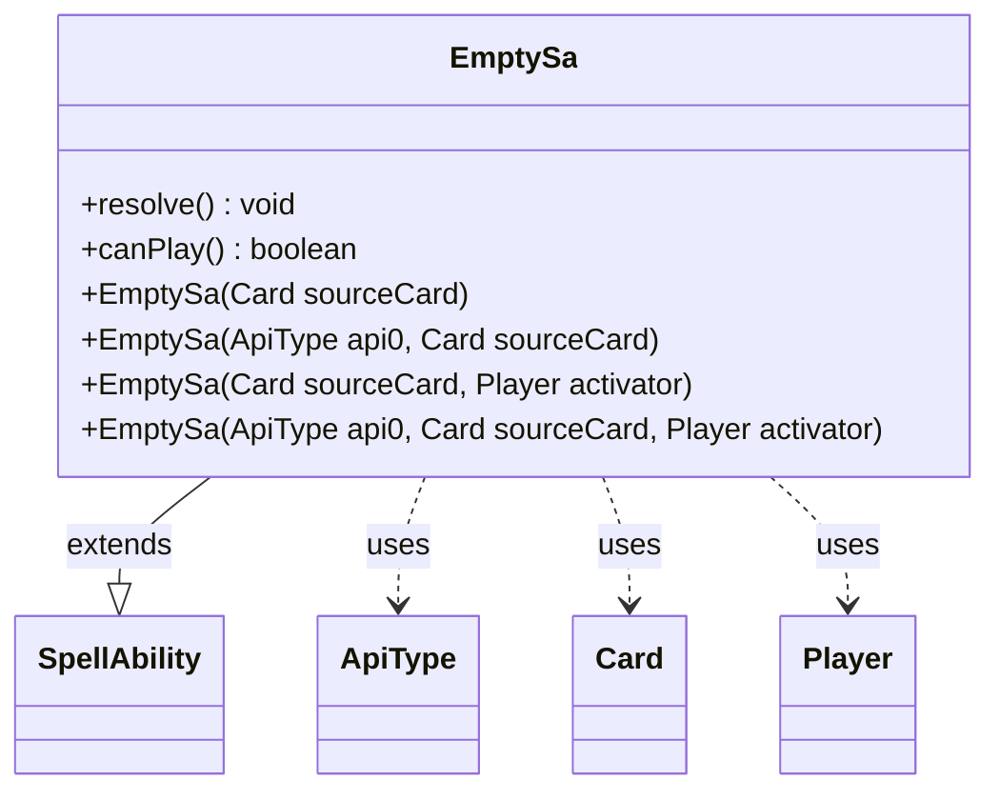

---
aliases:
  - EmptySa
tags:
  - java/class
  - module/forge-game
  - pkg/forge/game/spellability
fqn: forge.game.spellability.SpellAbility.EmptySa
package: forge.game.spellability
module: forge-game
kind: Class
---

# EmptySa

**Package:** `forge.game.spellability`   **Module:** `forge-game`   **Kind:** Class



## Relationships
**Extends:**
- [[forge.game.spellability.SpellAbility|SpellAbility]]
**Uses:**
- [[forge.game.ability.ApiType|ApiType]]
- [[forge.game.card.Card|Card]]
- [[forge.game.player.Player|Player]]

## Design Description

EmptySa is a static nested no-op specialization of SpellAbility, serving as a null-object placeholder where a non-null ability instance is required but no real spell or activated-ability behavior should occur. Its four constructors all delegate to the SpellAbility superclass with `Cost.Zero`, varying only in whether an explicit ApiType is assigned and whether the activating Player is supplied directly or derived from the source Card's controller. By overriding `resolve()` to do nothing and `canPlay()` to always return false, it guarantees the ability can never be cast or take effect, making it a safe inert stand-in. Its collaboration with Card, Player, and ApiType is confined to construction-time wiring, reflecting a deliberately minimal, side-effect-free design.

## Source
`forge-game/src/main/java/forge/game/spellability/SpellAbility.java` — declaration excerpt

```java
    public static class EmptySa extends SpellAbility {
        public EmptySa(Card sourceCard) { super(sourceCard, Cost.Zero); setActivatingPlayer(sourceCard.getController());}
        public EmptySa(ApiType api0, Card sourceCard) { super(sourceCard, Cost.Zero); setActivatingPlayer(sourceCard.getController()); api = api0;}
        public EmptySa(Card sourceCard, Player activator) { super(sourceCard, Cost.Zero); setActivatingPlayer(activator);}
        public EmptySa(ApiType api0, Card sourceCard, Player activator) { super(sourceCard, Cost.Zero); setActivatingPlayer(activator); api = api0;}
        @Override public void resolve() {}
        @Override public boolean canPlay() { return false; }
    }
```

## Python
`forge/game/spellability/SpellAbility/EmptySa.py`

```python
from forge.game.spellability.SpellAbility import SpellAbility
from forge.game.ability.ApiType import ApiType
from forge.game.card.Card import Card
from forge.game.player.Player import Player
from forge.game.cost.Cost import Cost


class EmptySa(SpellAbility):
    def __init__(self, *args):
        if len(args) == 1:
            sourceCard = args[0]
            super().__init__(sourceCard, Cost.Zero)
            self.setActivatingPlayer(sourceCard.getController())
        elif len(args) == 2 and isinstance(args[0], ApiType):
            api0, sourceCard = args
            super().__init__(sourceCard, Cost.Zero)
            self.setActivatingPlayer(sourceCard.getController())
            self.api = api0
        elif len(args) == 2:
            sourceCard, activator = args
            super().__init__(sourceCard, Cost.Zero)
            self.setActivatingPlayer(activator)
        elif len(args) == 3:
            api0, sourceCard, activator = args
            super().__init__(sourceCard, Cost.Zero)
            self.setActivatingPlayer(activator)
            self.api = api0

    def resolve(self):
        pass

    def canPlay(self):
        return False
```
