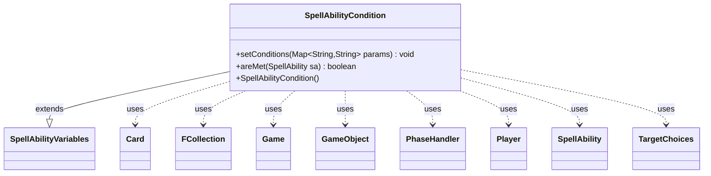

---
aliases:
  - SpellAbilityCondition
tags:
  - java/class
  - module/forge-game
  - pkg/forge/game/spellability
fqn: forge.game.spellability.SpellAbilityCondition
package: forge.game.spellability
module: forge-game
kind: Class
---

# SpellAbilityCondition

**Package:** `forge.game.spellability`   **Module:** `forge-game`   **Kind:** Class



## Relationships
**Extends:**
- [[forge.game.spellability.SpellAbilityVariables|SpellAbilityVariables]]
**Uses:**
- [[forge.game.Game|Game]]
- [[forge.game.GameObject|GameObject]]
- [[forge.game.card.Card|Card]]
- [[forge.game.phase.PhaseHandler|PhaseHandler]]
- [[forge.game.player.Player|Player]]
- [[forge.game.spellability.SpellAbility|SpellAbility]]
- [[forge.game.spellability.TargetChoices|TargetChoices]]
- [[forge.util.collect.FCollection|FCollection]]

## Design Description

SpellAbilityCondition encapsulates the gating logic that determines whether a SpellAbility may legally be played or activated under the current game state. Extending SpellAbilityVariables—which supplies the backing fields for each restriction (zone, phase, turn ownership, sorcery speed, threshold, metalcraft, kicker and other paid costs, presence checks, life totals, mana spent, SVar comparisons, etc.)—it adds two responsibilities: `setConditions` parses a raw `Map<String,String>` of script parameters (typically from AbilityFactory) into those typed fields, and `areMet` evaluates them against a given SpellAbility.

During evaluation it collaborates with the SpellAbility's activating Player, the Game and its PhaseHandler, the host Card, and TargetChoices, using FCollection and GameObject restrictions to count matching permanents. The design favors a flat, fail-fast sequence of independent guard checks—each returning false on the first unmet condition—keeping the data-driven card-scripting system declarative and easily extensible.

## Source
`forge-game/src/main/java/forge/game/spellability/SpellAbilityCondition.java`

```java
/*
 * Forge: Play Magic: the Gathering.
 * Copyright (C) 2011  Forge Team
 *
 * This program is free software: you can redistribute it and/or modify
 * it under the terms of the GNU General Public License as published by
 * the Free Software Foundation, either version 3 of the License, or
 * (at your option) any later version.
 * 
 * This program is distributed in the hope that it will be useful,
 * but WITHOUT ANY WARRANTY; without even the implied warranty of
 * MERCHANTABILITY or FITNESS FOR A PARTICULAR PURPOSE.  See the
 * GNU General Public License for more details.
 * 
 * You should have received a copy of the GNU General Public License
 * along with this program.  If not, see <http://www.gnu.org/licenses/>.
 */
package forge.game.spellability;

import com.google.common.collect.Iterables;
import forge.card.ColorSet;
import forge.game.Game;
import forge.game.GameObject;
import forge.game.GameObjectPredicates;
import forge.game.GameType;
import forge.game.ability.AbilityUtils;
import forge.game.card.Card;
import forge.game.phase.PhaseHandler;
import forge.game.phase.PhaseType;
import forge.game.player.Player;
import forge.game.zone.ZoneType;
import forge.util.Expressions;
import forge.util.collect.FCollection;
import org.apache.commons.lang3.StringUtils;

import java.util.*;
import java.util.function.Predicate;

/**
 * <p>
 * SpellAbility_Condition class.
 * </p>
 * 
 * @author Forge
 * @version $Id$
 * @since 1.0.15
 */
public class SpellAbilityCondition extends SpellAbilityVariables {
    // A class for handling SpellAbility Conditions. These restrictions include:
    // Zone, Phase, OwnTurn, Speed (instant/sorcery), Amount per Turn, Player,
    // Threshold, Metalcraft, LevelRange, etc
    // Each value will have a default, that can be overridden (mostly by
    // AbilityFactory)
    // The CanPlay function will use these values to determine if the current
    // game state is ok with these restrictions

    /**
     * <p>
     * Constructor for SpellAbility_Condition.
     * </p>
     */
    public SpellAbilityCondition() {
    }

    /**
     * <p>
     * setConditions.
     * </p>
     * 
     * @param params
     *            a {@link java.util.HashMap} object.
     */
    public final void setConditions(final Map<String, String> params) {
        if (params.containsKey("Condition")) {
            final String value = params.get("Condition");
            if (value.equals("Threshold")) {
                this.setThreshold(true);
            }
            if (value.equals("Metalcraft")) {
                this.setMetalcraft(true);
            }
            if (value.equals("Delirium")) {
                this.setDelirium(true);
            }
            if (value.equals("Hellbent")) {
                this.setHellbent(true);
            }
            if (value.equals("Revolt")) {
                this.setRevolt(true);
            }
            if (value.equals("Desert")) {
                this.setDesert(true);
            }
            if (value.equals("Blessing")) {
                this.setBlessing(true);
            }
            if (value.equals("Kicked")) {
                this.kicked = true;
            }
            if (value.equals("Kicked 1")) {
                this.kicked1 = true;
            }
            if (value.equals("Kicked 2")) {
                this.kicked2 = true;
            }
            if (value.equals("Surge")) {
                this.surgeCostPaid = true;
            }
            if (value.equals("Bargain")) {
                this.bargain = true;
            }
            if (value.equals("AltCost"))
                this.altCostPaid = true;

            if (value.equals("OptionalCost")) {
                this.optionalCostPaid = true;
            }

            if (value.equals("Foretold")) {
                this.foretold = true;
            }

            if (params.containsKey("ConditionOptionalPaid")) {
                this.optionalBoolean = Boolean.parseBoolean(params.get("ConditionOptionalPaid"));
            }
        }

        if (params.containsKey("ConditionSorcerySpeed")) {
            this.setSorcerySpeed(true);
        }

        if (params.containsKey("ConditionPlayerTurn")) {
            this.setPlayerTurn(true);
        }

        if (params.containsKey("ConditionOpponentTurn")) {
            this.setOpponentTurn(true);
        }

        if (params.containsKey("ConditionPhases")) {
            this.setPhases(PhaseType.parseRange(params.get("ConditionPhases")));
        }

        if (params.containsKey("ConditionFirstCombat")) {
            this.setFirstCombatOnly(true);
        }

        if (params.containsKey("ConditionGameTypes")) {
            this.setGameTypes(GameType.listValueOf(params.get("ConditionGameTypes")));
        }

        if (params.containsKey("ConditionActivationLimit")) {
            this.setLimitToCheck(params.get("ConditionActivationLimit"));
        }

        if (params.containsKey("ConditionChosenColor")) {
            this.setColorToCheck(params.get("ConditionChosenColor"));
        }

        // Condition version of IsPresent stuff
        if (params.containsKey("ConditionPresent")) {
            this.setIsPresent(params.get("ConditionPresent"));
            if (params.containsKey("ConditionCompare")) {
                this.setPresentCompare(params.get("ConditionCompare"));
            }
            if (params.containsKey("ConditionPresent2")) {
                this.setIsPresent2(params.get("ConditionPresent2"));
                if (params.containsKey("ConditionCompare2")) {
                    this.setPresentCompare2(params.get("ConditionCompare2"));
                }
            }
        }

        if (params.containsKey("ConditionDefined")) {
            this.setPresentDefined(params.get("ConditionDefined"));
        }
        if (params.containsKey("ConditionDefined2")) {
            this.setPresentDefined2(params.get("ConditionDefined2"));
        }

        if (params.containsKey("ConditionZone")) {
            this.setPresentZone(ZoneType.smartValueOf(params.get("ConditionZone")));
        }

        if (params.containsKey("ConditionPlayerDefined")) {
            this.setPlayerDefined(params.get("ConditionPlayerDefined"));
        }

        if (params.containsKey("ConditionPlayerContains")) {
            this.setPlayerContains(params.get("ConditionPlayerContains"));
        }

        if (params.containsKey("ConditionNotPresent")) {
            this.setIsPresent(params.get("ConditionNotPresent"));
            this.setPresentCompare("EQ0");
        }

        // basically PresentCompare for life totals:
        if (params.containsKey("ConditionLifeTotal")) {
            this.setLifeTotal(params.get("ConditionLifeTotal"));
            if (params.containsKey("ConditionLifeAmount")) {
                this.setLifeAmount(params.get("ConditionLifeAmount"));
            }
        }

        if (params.containsKey("ConditionNoDifferentColors")) {
            this.setNoDifferentColors(params.get("ConditionNoDifferentColors"));
        }

        if (params.containsKey("ConditionManaSpent")) {
            this.setManaSpent(params.get("ConditionManaSpent"));
        }

        if (params.containsKey("ConditionManaNotSpent")) {
            this.setManaNotSpent(params.get("ConditionManaNotSpent"));
        }

        if (params.containsKey("ConditionCheckSVar")) {
            this.setSvarToCheck(params.get("ConditionCheckSVar"));
        }
        if (params.containsKey("ConditionSVarCompare")) {
            this.setSvarOperator(params.get("ConditionSVarCompare").substring(0, 2));
            this.setSvarOperand(params.get("ConditionSVarCompare").substring(2));
        }
        if (params.containsKey("OrOtherConditionSVarCompare")) {
            //unless another SVar is specified, check against the same one
            if (params.containsKey("OrConditionCheckSVar")) {
                this.setSvarToCheck2(params.get("OrConditionCheckSVar"));
            } else {
                this.setSvarToCheck2(params.get("ConditionCheckSVar"));
            }
            this.setSvarOperator2(params.get("OrOtherConditionSVarCompare").substring(0, 2));
            this.setSvarOperand2(params.get("OrOtherConditionSVarCompare").substring(2));
        }
        if (params.containsKey("ConditionTargetValidTargeting")) {
            this.setTargetValidTargeting(params.get("ConditionTargetValidTargeting"));
        }
        if (params.containsKey("ConditionTargetsSingleTarget")) {
            this.setTargetsSingleTarget(true);
        }
    }

    /**
     * <p>
     * checkConditions.
     * </p>
     * 
     * @param sa
     *            a {@link forge.game.spellability.SpellAbility} object.
     * @return a boolean.
     */
    public final boolean areMet(final SpellAbility sa) {
        Player activator = sa.getActivatingPlayer();
        if (activator == null) {
            activator = sa.getHostCard().getController();
            System.out.println(sa.getHostCard().getName()
                    + " Did not have activator set in SpellAbility_Condition.checkConditions()");
        }
        final Game game = activator.getGame();
        final PhaseHandler phase = game.getPhaseHandler();
        final Card host = sa.getHostCard();

        if (this.isHellbent() && !activator.hasHellbent()) return false;
        if (this.isThreshold() && !activator.hasThreshold()) return false;
        if (this.isMetalcraft() && !activator.hasMetalcraft()) return false;
        if (this.isDelirium() && !activator.hasDelirium()) return false;
        if (this.isRevolt() && !activator.hasRevolt()) return false;
        if (this.isDesert() && !activator.hasDesert()) return false;
        if (this.isBlessing() && !activator.hasBlessing()) return false;

        if (this.kicked && !sa.isKicked()) return false;
        if (this.kicked1 && !sa.isOptionalCostPaid(OptionalCost.Kicker1)) return false;
        if (this.kicked2 && !sa.isOptionalCostPaid(OptionalCost.Kicker2)) return false;
        if (this.altCostPaid && !sa.isOptionalCostPaid(OptionalCost.AltCost)) return false;
        if (this.surgeCostPaid && !sa.isSurged()) return false;
        if (this.bargain && !sa.isBargained()) return false;
        if (this.foretold && !sa.isForetold()) return false;

        if (this.optionalCostPaid && this.optionalBoolean && !sa.isOptionalCostPaid(OptionalCost.Generic)) return false;
        if (this.optionalCostPaid && !this.optionalBoolean && sa.isOptionalCostPaid(OptionalCost.Generic)) return false;

        if (this.getNoDifferentColors() != null) {
            List<Card> tgts = AbilityUtils.getDefinedCards(host, this.getNoDifferentColors(), sa);
            Card first = Iterables.getFirst(tgts, null);
            if (first == null) {
                return false;
            }
            byte firstColor = first.getColor().getColor();
            for (Card c : tgts) {
                if (c.getColor().getColor() != firstColor) {
                    return false;
                }
            }
        }

        if (this.isSorcerySpeed() && !activator.canCastSorcery()) {
            return false;
        }

        if (this.isPlayerTurn()) {
            boolean b = !sa.getParam("ConditionPlayerTurn").equals("False");
            if (!b && phase.isPlayerTurn(activator)) {
                return false;
            } else if (b && !phase.isPlayerTurn((activator))) {
                return false;
            }
        }

        if (this.isOpponentTurn() && !phase.getPlayerTurn().isOpponentOf(activator)) {
            return false;
        }

        if (this.getFirstCombatOnly() && !phase.isFirstCombat()) {
            return false;
        }

        if (this.getLimitToCheck() != null) {
            String comp = getLimitToCheck();
            int right = Integer.parseInt(comp.substring(2));
            int activationNum =  sa.getActivationsThisTurn();
            if (!Expressions.compare(activationNum, comp, right)) {
                return false;
            }
        }

        if (this.getPhases().size() > 0) {
            if (!this.getPhases().contains(phase.getPhase())) {
                return false;
            }
        }

        if (this.getGameTypes().size() > 0) {
            if (!getGameTypes().contains(game.getRules().getGameType())) {
                return false;
            }
        }

        if (this.getColorToCheck() != null) {
            if (!host.hasChosenColor(this.getColorToCheck())) {
                return false;
            }
        }

        if (getIsPresent() != null) {
            FCollection<GameObject> list = null;
            if (getPresentDefined() != null) {
                list = AbilityUtils.getDefinedObjects(host, getPresentDefined(), sa);
            } else {
                boolean usedLastState = false;
                if (sa.isReplacementAbility()) {
                    if (getPresentZone().equals(ZoneType.Battlefield)) {
                        list = new FCollection<>(sa.getRootAbility().getLastStateBattlefield());
                        usedLastState = true;
                    } else if (getPresentZone().equals(ZoneType.Graveyard)) {
                        list = new FCollection<>(sa.getRootAbility().getLastStateGraveyard());
                        usedLastState = true;
                    }
                }
                if (!usedLastState) {
                    list = new FCollection<>(game.getCardsIn(getPresentZone()));
                }
            }

            Predicate<GameObject> restriction = GameObjectPredicates.restriction(getIsPresent().split(","), activator, host, sa);
            final int left = (int) list.stream().filter(restriction).count();

            final String rightString = this.getPresentCompare().substring(2);
            int right = AbilityUtils.calculateAmount(host, rightString, sa);

            if (!Expressions.compare(left, this.getPresentCompare(), right)) {
                return false;
            }
        }

        if (getIsPresent2() != null) {
            FCollection<GameObject> list = null;
            if (getPresentDefined2() != null) {
                list = AbilityUtils.getDefinedObjects(host, getPresentDefined2(), sa);
            } else {
                boolean usedLastState = false;
                if (sa.isReplacementAbility()) {
                    //for now, we will always look in the same zone as the other present
                    if (getPresentZone().equals(ZoneType.Battlefield)) {
                        list = new FCollection<>(sa.getRootAbility().getLastStateBattlefield());
                        usedLastState = true;
                    } else if (getPresentZone().equals(ZoneType.Graveyard)) {
                        list = new FCollection<>(sa.getRootAbility().getLastStateGraveyard());
                        usedLastState = true;
                    }
                }
                if (!usedLastState) {
                    list = new FCollection<>(game.getCardsIn(getPresentZone()));
                }
            }

            Predicate<GameObject> restriction = GameObjectPredicates.restriction(getIsPresent2().split(","), activator, host, sa);
            final int left = (int) list.stream().filter(restriction).count();

            final String rightString = this.getPresentCompare2().substring(2);
            int right = AbilityUtils.calculateAmount(host, rightString, sa);

            if (!Expressions.compare(left, this.getPresentCompare2(), right)) {
                return false;
            }
        }

        if (this.getPlayerContains() != null) {
            List<Player> list = new ArrayList<>();
            if (this.getPlayerDefined() != null) {
                list.addAll(AbilityUtils.getDefinedPlayers(host, this.getPlayerDefined(), sa));
            }
            List<Player> contains = AbilityUtils.getDefinedPlayers(host, this.getPlayerContains(), sa);
            if (contains.isEmpty() || !list.containsAll(contains)) {
                return false;
            }
        }

        if (this.getLifeTotal() != null) {
            int life = AbilityUtils.getDefinedPlayers(host, this.getLifeTotal(), sa).getFirst().getLife();

            int right = 1;
            final String rightString = this.getLifeAmount().substring(2);
            if (rightString.equals("X")) {
                right = AbilityUtils.calculateAmount(host, host.getSVar("X"), sa);
            } else {
                right = Integer.parseInt(this.getLifeAmount().substring(2));
            }

            if (!Expressions.compare(life, this.getLifeAmount(), right)) {
                return false;
            }
        }

        if (this.getTargetValidTargeting() != null) {
            final TargetChoices matchTgt = sa.getTargets();
            if (matchTgt == null || matchTgt.getFirstTargetedSpell() == null
            		|| matchTgt.getFirstTargetedSpell().getTargets() == null) {
                return false;
            }

            boolean result = false;

            SpellAbility abSub = matchTgt.getFirstTargetedSpell();

            while (abSub != null && !result) {
                for (final GameObject o : abSub.getTargets()) {
                    if (o.isValid(this.getTargetValidTargeting().split(","), activator, host, sa)) {
                        result = true;
                        break;
                    }
                }

                abSub = sa.getSubAbility();
            }

            if (!result) {
                return false;
            }
        }
        if (this.targetsSingleTarget()) {
            final TargetChoices matchTgt = sa.getTargets();
            if (matchTgt == null || matchTgt.getFirstTargetedSpell() == null
            		|| matchTgt.getFirstTargetedSpell().getTargets() == null) {
                return false;
            }

            Set<GameObject> targets = new HashSet<>();
            for (TargetChoices tc : sa.getAllTargetChoices()) {
                targets.addAll(tc);
                if (targets.size() > 1) {
                    return false;
                }
            }
            if (targets.size() != 1) {
                return false;
            }
        }

        if (StringUtils.isNotEmpty(getManaSpent())) {
            SpellAbility castSa = host.getCastSA();
            if (castSa == null) {
                return false;
            }
            if (!castSa.getPayingColors().hasAllColors(ColorSet.fromNames(getManaSpent().split(" ")).getColor())) {
                return false;
            }
        }
        if (StringUtils.isNotEmpty(getManaNotSpent())) {
            SpellAbility castSa = host.getCastSA();
            if (castSa != null && castSa.getPayingColors().hasAllColors(ColorSet.fromNames(getManaNotSpent().split(" ")).getColor())) {
                return false;
            }
        }

        if (this.getsVarToCheck() != null) {
            final int svarValue = AbilityUtils.calculateAmount(host, this.getsVarToCheck(), sa);
            final int operandValue = AbilityUtils.calculateAmount(host, this.getsVarOperand(), sa);
            boolean secondCheck = false;
            if (this.getsVarToCheck2() != null) {
                final int svarValue2 = AbilityUtils.calculateAmount(host, this.getsVarToCheck2(), sa);
                final int operandValue2 = AbilityUtils.calculateAmount(host, this.getsVarOperand2(), sa);
                if (Expressions.compare(svarValue2, this.getsVarOperator2(), operandValue2)) {
                    secondCheck = true;
                }
            }

            if (!Expressions.compare(svarValue, this.getsVarOperator(), operandValue) && !secondCheck) {
                return false;
            }
        }

        return true;
    }

}
```

## Python
`forge/game/spellability/SpellAbilityCondition.py`

```python
from forge.card.ColorSet import ColorSet
from forge.game.Game import Game
from forge.game.GameObject import GameObject
from forge.game.GameObjectPredicates import GameObjectPredicates
from forge.game.GameType import GameType
from forge.game.ability.AbilityUtils import AbilityUtils
from forge.game.card.Card import Card
from forge.game.phase.PhaseHandler import PhaseHandler
from forge.game.phase.PhaseType import PhaseType
from forge.game.player.Player import Player
from forge.game.zone.ZoneType import ZoneType
from forge.util.Expressions import Expressions
from forge.util.collect.FCollection import FCollection
from forge.game.spellability.OptionalCost import OptionalCost
from forge.game.spellability.SpellAbility import SpellAbility
from forge.game.spellability.SpellAbilityVariables import SpellAbilityVariables
from forge.game.spellability.TargetChoices import TargetChoices


class SpellAbilityCondition(SpellAbilityVariables):
    # A class for handling SpellAbility Conditions. These restrictions include:
    # Zone, Phase, OwnTurn, Speed (instant/sorcery), Amount per Turn, Player,
    # Threshold, Metalcraft, LevelRange, etc
    # Each value will have a default, that can be overridden (mostly by
    # AbilityFactory)
    # The CanPlay function will use these values to determine if the current
    # game state is ok with these restrictions

    def __init__(self) -> None:
        super().__init__()

    def setConditions(self, params: dict[str, str]) -> None:
        if "Condition" in params:
            value = params.get("Condition")
            if value == "Threshold":
                self.setThreshold(True)
            if value == "Metalcraft":
                self.setMetalcraft(True)
            if value == "Delirium":
                self.setDelirium(True)
            if value == "Hellbent":
                self.setHellbent(True)
            if value == "Revolt":
                self.setRevolt(True)
            if value == "Desert":
                self.setDesert(True)
            if value == "Blessing":
                self.setBlessing(True)
            if value == "Kicked":
                self.kicked = True
            if value == "Kicked 1":
                self.kicked1 = True
            if value == "Kicked 2":
                self.kicked2 = True
            if value == "Surge":
                self.surgeCostPaid = True
            if value == "Bargain":
                self.bargain = True
            if value == "AltCost":
                self.altCostPaid = True

            if value == "OptionalCost":
                self.optionalCostPaid = True

            if value == "Foretold":
                self.foretold = True

            if "ConditionOptionalPaid" in params:
                self.optionalBoolean = params.get("ConditionOptionalPaid").lower() == "true"

        if "ConditionSorcerySpeed" in params:
            self.setSorcerySpeed(True)

        if "ConditionPlayerTurn" in params:
            self.setPlayerTurn(True)

        if "ConditionOpponentTurn" in params:
            self.setOpponentTurn(True)

        if "ConditionPhases" in params:
            self.setPhases(PhaseType.parseRange(params.get("ConditionPhases")))

        if "ConditionFirstCombat" in params:
            self.setFirstCombatOnly(True)

        if "ConditionGameTypes" in params:
            self.setGameTypes(GameType.listValueOf(params.get("ConditionGameTypes")))

        if "ConditionActivationLimit" in params:
            self.setLimitToCheck(params.get("ConditionActivationLimit"))

        if "ConditionChosenColor" in params:
            self.setColorToCheck(params.get("ConditionChosenColor"))

        # Condition version of IsPresent stuff
        if "ConditionPresent" in params:
            self.setIsPresent(params.get("ConditionPresent"))
            if "ConditionCompare" in params:
                self.setPresentCompare(params.get("ConditionCompare"))
            if "ConditionPresent2" in params:
                self.setIsPresent2(params.get("ConditionPresent2"))
                if "ConditionCompare2" in params:
                    self.setPresentCompare2(params.get("ConditionCompare2"))

        if "ConditionDefined" in params:
            self.setPresentDefined(params.get("ConditionDefined"))
        if "ConditionDefined2" in params:
            self.setPresentDefined2(params.get("ConditionDefined2"))

        if "ConditionZone" in params:
            self.setPresentZone(ZoneType.smartValueOf(params.get("ConditionZone")))

        if "ConditionPlayerDefined" in params:
            self.setPlayerDefined(params.get("ConditionPlayerDefined"))

        if "ConditionPlayerContains" in params:
            self.setPlayerContains(params.get("ConditionPlayerContains"))

        if "ConditionNotPresent" in params:
            self.setIsPresent(params.get("ConditionNotPresent"))
            self.setPresentCompare("EQ0")

        # basically PresentCompare for life totals:
        if "ConditionLifeTotal" in params:
            self.setLifeTotal(params.get("ConditionLifeTotal"))
            if "ConditionLifeAmount" in params:
                self.setLifeAmount(params.get("ConditionLifeAmount"))

        if "ConditionNoDifferentColors" in params:
            self.setNoDifferentColors(params.get("ConditionNoDifferentColors"))

        if "ConditionManaSpent" in params:
            self.setManaSpent(params.get("ConditionManaSpent"))

        if "ConditionManaNotSpent" in params:
            self.setManaNotSpent(params.get("ConditionManaNotSpent"))

        if "ConditionCheckSVar" in params:
            self.setSvarToCheck(params.get("ConditionCheckSVar"))
        if "ConditionSVarCompare" in params:
            self.setSvarOperator(params.get("ConditionSVarCompare")[0:2])
            self.setSvarOperand(params.get("ConditionSVarCompare")[2:])
        if "OrOtherConditionSVarCompare" in params:
            # unless another SVar is specified, check against the same one
            if "OrConditionCheckSVar" in params:
                self.setSvarToCheck2(params.get("OrConditionCheckSVar"))
            else:
                self.setSvarToCheck2(params.get("ConditionCheckSVar"))
            self.setSvarOperator2(params.get("OrOtherConditionSVarCompare")[0:2])
            self.setSvarOperand2(params.get("OrOtherConditionSVarCompare")[2:])
        if "ConditionTargetValidTargeting" in params:
            self.setTargetValidTargeting(params.get("ConditionTargetValidTargeting"))
        if "ConditionTargetsSingleTarget" in params:
            self.setTargetsSingleTarget(True)

    def areMet(self, sa: SpellAbility) -> bool:
        activator = sa.getActivatingPlayer()
        if activator is None:
            activator = sa.getHostCard().getController()
            print(sa.getHostCard().getName()
                  + " Did not have activator set in SpellAbility_Condition.checkConditions()")
        game = activator.getGame()
        phase = game.getPhaseHandler()
        host = sa.getHostCard()

        if self.isHellbent() and not activator.hasHellbent():
            return False
        if self.isThreshold() and not activator.hasThreshold():
            return False
        if self.isMetalcraft() and not activator.hasMetalcraft():
            return False
        if self.isDelirium() and not activator.hasDelirium():
            return False
        if self.isRevolt() and not activator.hasRevolt():
            return False
        if self.isDesert() and not activator.hasDesert():
            return False
        if self.isBlessing() and not activator.hasBlessing():
            return False

        if self.kicked and not sa.isKicked():
            return False
        if self.kicked1 and not sa.isOptionalCostPaid(OptionalCost.Kicker1):
            return False
        if self.kicked2 and not sa.isOptionalCostPaid(OptionalCost.Kicker2):
            return False
        if self.altCostPaid and not sa.isOptionalCostPaid(OptionalCost.AltCost):
            return False
        if self.surgeCostPaid and not sa.isSurged():
            return False
        if self.bargain and not sa.isBargained():
            return False
        if self.foretold and not sa.isForetold():
            return False

        if self.optionalCostPaid and self.optionalBoolean and not sa.isOptionalCostPaid(OptionalCost.Generic):
            return False
        if self.optionalCostPaid and not self.optionalBoolean and sa.isOptionalCostPaid(OptionalCost.Generic):
            return False

        if self.getNoDifferentColors() is not None:
            tgts = AbilityUtils.getDefinedCards(host, self.getNoDifferentColors(), sa)
            first = tgts[0] if tgts else None
            if first is None:
                return False
            firstColor = first.getColor().getColor()
            for c in tgts:
                if c.getColor().getColor() != firstColor:
                    return False

        if self.isSorcerySpeed() and not activator.canCastSorcery():
            return False

        if self.isPlayerTurn():
            b = sa.getParam("ConditionPlayerTurn") != "False"
            if not b and phase.isPlayerTurn(activator):
                return False
            elif b and not phase.isPlayerTurn(activator):
                return False

        if self.isOpponentTurn() and not phase.getPlayerTurn().isOpponentOf(activator):
            return False

        if self.getFirstCombatOnly() and not phase.isFirstCombat():
            return False

        if self.getLimitToCheck() is not None:
            comp = self.getLimitToCheck()
            right = int(comp[2:])
            activationNum = sa.getActivationsThisTurn()
            if not Expressions.compare(activationNum, comp, right):
                return False

        if len(self.getPhases()) > 0:
            if phase.getPhase() not in self.getPhases():
                return False

        if len(self.getGameTypes()) > 0:
            if game.getRules().getGameType() not in self.getGameTypes():
                return False

        if self.getColorToCheck() is not None:
            if not host.hasChosenColor(self.getColorToCheck()):
                return False

        if self.getIsPresent() is not None:
            list = None
            if self.getPresentDefined() is not None:
                list = AbilityUtils.getDefinedObjects(host, self.getPresentDefined(), sa)
            else:
                usedLastState = False
                if sa.isReplacementAbility():
                    if self.getPresentZone() == ZoneType.Battlefield:
                        list = FCollection(sa.getRootAbility().getLastStateBattlefield())
                        usedLastState = True
                    elif self.getPresentZone() == ZoneType.Graveyard:
                        list = FCollection(sa.getRootAbility().getLastStateGraveyard())
                        usedLastState = True
                if not usedLastState:
                    list = FCollection(game.getCardsIn(self.getPresentZone()))

            restriction = GameObjectPredicates.restriction(self.getIsPresent().split(","), activator, host, sa)
            left = int(sum(1 for o in list if restriction(o)))

            rightString = self.getPresentCompare()[2:]
            right = AbilityUtils.calculateAmount(host, rightString, sa)

            if not Expressions.compare(left, self.getPresentCompare(), right):
                return False

        if self.getIsPresent2() is not None:
            list = None
            if self.getPresentDefined2() is not None:
                list = AbilityUtils.getDefinedObjects(host, self.getPresentDefined2(), sa)
            else:
                usedLastState = False
                if sa.isReplacementAbility():
                    # for now, we will always look in the same zone as the other present
                    if self.getPresentZone() == ZoneType.Battlefield:
                        list = FCollection(sa.getRootAbility().getLastStateBattlefield())
                        usedLastState = True
                    elif self.getPresentZone() == ZoneType.Graveyard:
                        list = FCollection(sa.getRootAbility().getLastStateGraveyard())
                        usedLastState = True
                if not usedLastState:
                    list = FCollection(game.getCardsIn(self.getPresentZone()))

            restriction = GameObjectPredicates.restriction(self.getIsPresent2().split(","), activator, host, sa)
            left = int(sum(1 for o in list if restriction(o)))

            rightString = self.getPresentCompare2()[2:]
            right = AbilityUtils.calculateAmount(host, rightString, sa)

            if not Expressions.compare(left, self.getPresentCompare2(), right):
                return False

        if self.getPlayerContains() is not None:
            list = []
            if self.getPlayerDefined() is not None:
                list.extend(AbilityUtils.getDefinedPlayers(host, self.getPlayerDefined(), sa))
            contains = AbilityUtils.getDefinedPlayers(host, self.getPlayerContains(), sa)
            if len(contains) == 0 or not all(p in list for p in contains):
                return False

        if self.getLifeTotal() is not None:
            life = AbilityUtils.getDefinedPlayers(host, self.getLifeTotal(), sa).getFirst().getLife()

            right = 1
            rightString = self.getLifeAmount()[2:]
            if rightString == "X":
                right = AbilityUtils.calculateAmount(host, host.getSVar("X"), sa)
            else:
                right = int(self.getLifeAmount()[2:])

            if not Expressions.compare(life, self.getLifeAmount(), right):
                return False

        if self.getTargetValidTargeting() is not None:
            matchTgt = sa.getTargets()
            if matchTgt is None or matchTgt.getFirstTargetedSpell() is None \
                    or matchTgt.getFirstTargetedSpell().getTargets() is None:
                return False

            result = False

            abSub = matchTgt.getFirstTargetedSpell()

            while abSub is not None and not result:
                for o in abSub.getTargets():
                    if o.isValid(self.getTargetValidTargeting().split(","), activator, host, sa):
                        result = True
                        break

                abSub = sa.getSubAbility()

            if not result:
                return False

        if self.targetsSingleTarget():
            matchTgt = sa.getTargets()
            if matchTgt is None or matchTgt.getFirstTargetedSpell() is None \
                    or matchTgt.getFirstTargetedSpell().getTargets() is None:
                return False

            targets = set()
            for tc in sa.getAllTargetChoices():
                targets.update(tc)
                if len(targets) > 1:
                    return False
            if len(targets) != 1:
                return False

        if self.getManaSpent():
            castSa = host.getCastSA()
            if castSa is None:
                return False
            if not castSa.getPayingColors().hasAllColors(ColorSet.fromNames(self.getManaSpent().split(" ")).getColor()):
                return False
        if self.getManaNotSpent():
            castSa = host.getCastSA()
            if castSa is not None and castSa.getPayingColors().hasAllColors(ColorSet.fromNames(self.getManaNotSpent().split(" ")).getColor()):
                return False

        if self.getsVarToCheck() is not None:
            svarValue = AbilityUtils.calculateAmount(host, self.getsVarToCheck(), sa)
            operandValue = AbilityUtils.calculateAmount(host, self.getsVarOperand(), sa)
            secondCheck = False
            if self.getsVarToCheck2() is not None:
                svarValue2 = AbilityUtils.calculateAmount(host, self.getsVarToCheck2(), sa)
                operandValue2 = AbilityUtils.calculateAmount(host, self.getsVarOperand2(), sa)
                if Expressions.compare(svarValue2, self.getsVarOperator2(), operandValue2):
                    secondCheck = True

            if not Expressions.compare(svarValue, self.getsVarOperator(), operandValue) and not secondCheck:
                return False

        return True
```
