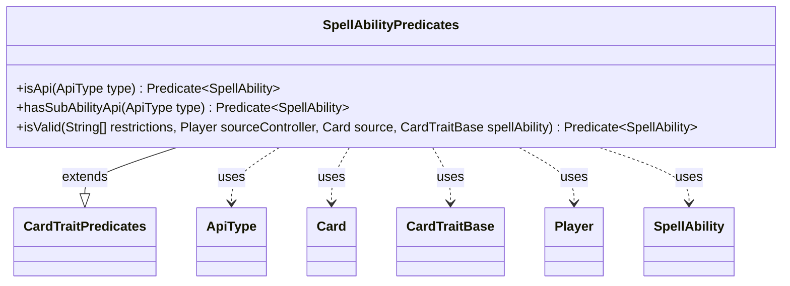

---
aliases:
  - SpellAbilityPredicates
tags:
  - java/class
  - module/forge-game
  - pkg/forge/game/spellability
fqn: forge.game.spellability.SpellAbilityPredicates
package: forge.game.spellability
module: forge-game
kind: Class
---

# SpellAbilityPredicates

**Package:** `forge.game.spellability`   **Module:** `forge-game`   **Kind:** Class



## Relationships
**Extends:**
- [[forge.game.CardTraitPredicates|CardTraitPredicates]]
**Uses:**
- [[forge.game.CardTraitBase|CardTraitBase]]
- [[forge.game.ability.ApiType|ApiType]]
- [[forge.game.card.Card|Card]]
- [[forge.game.player.Player|Player]]
- [[forge.game.spellability.SpellAbility|SpellAbility]]

## Design Description

SpellAbilityPredicates is a final utility class that supplies reusable `Predicate<SpellAbility>` factories for filtering and matching spell abilities by their characteristics. Each static method returns a lambda predicate: `isApi` tests a SpellAbility's ApiType, `hasSubAbilityApi` detects a sub-ability of a given ApiType, and `isValid` defers to the ability's own validity check against restriction strings, a controlling Player, and a source Card.

By extending CardTraitPredicates, it specializes the generic card-trait predicate family for the SpellAbility domain, layering ability-specific tests onto the shared base. It collaborates with ApiType, Card, Player, and CardTraitBase purely as parameters, holding no state of its own. The final class plus exclusively static factory methods signals deliberate stateless, functional design intent—predicates are meant to be composed into streams and queries elsewhere in the engine rather than instantiated.

## Source
`forge-game/src/main/java/forge/game/spellability/SpellAbilityPredicates.java`

```java
package forge.game.spellability;

import forge.game.CardTraitBase;
import forge.game.CardTraitPredicates;
import forge.game.ability.ApiType;
import forge.game.card.Card;
import forge.game.player.Player;

import java.util.function.Predicate;

public final class SpellAbilityPredicates extends CardTraitPredicates {
    public static Predicate<SpellAbility> isApi(final ApiType type) {
        return sa -> type.equals(sa.getApi());
    }

    public static Predicate<SpellAbility> hasSubAbilityApi(final ApiType type) {
        return sa -> sa.findSubAbilityByType(type) != null;
    }

    public static Predicate<SpellAbility> isValid(String[] restrictions, Player sourceController, Card source, CardTraitBase spellAbility) {
        return sa -> sa.isValid(restrictions, sourceController, source, spellAbility);
    }
}
```

## Python
`forge/game/spellability/SpellAbilityPredicates.py`

```python
from forge.game.CardTraitBase import CardTraitBase
from forge.game.CardTraitPredicates import CardTraitPredicates
from forge.game.ability.ApiType import ApiType
from forge.game.card.Card import Card
from forge.game.player.Player import Player
from forge.game.spellability.SpellAbility import SpellAbility

from typing import Callable


class SpellAbilityPredicates(CardTraitPredicates):
    @staticmethod
    def isApi(type: ApiType) -> Callable[[SpellAbility], bool]:
        return lambda sa: type == sa.getApi()

    @staticmethod
    def hasSubAbilityApi(type: ApiType) -> Callable[[SpellAbility], bool]:
        return lambda sa: sa.findSubAbilityByType(type) is not None

    @staticmethod
    def isValid(restrictions: list[str], sourceController: Player, source: Card, spellAbility: CardTraitBase) -> Callable[[SpellAbility], bool]:
        return lambda sa: sa.isValid(restrictions, sourceController, source, spellAbility)
```
