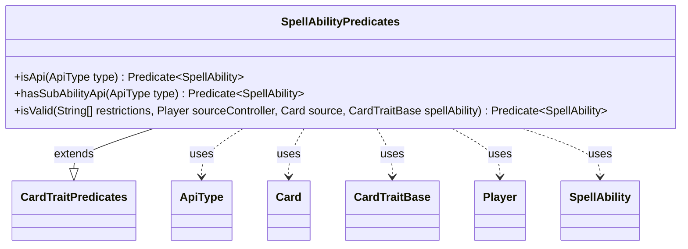

---
aliases:
  - SpellAbilityPredicates
tags:
  - java/class
  - module/forge-game
  - pkg/forge/game/spellability
fqn: forge.game.spellability.SpellAbilityPredicates
package: forge.game.spellability
module: forge-game
kind: Class
---

# SpellAbilityPredicates

**Package:** `forge.game.spellability` &nbsp; **Module:** `forge-game` &nbsp; **Kind:** Class



## Relationships
**Extends:**
- [[forge.game.CardTraitPredicates|CardTraitPredicates]]
**Uses:**
- [[forge.game.CardTraitBase|CardTraitBase]]
- [[forge.game.ability.ApiType|ApiType]]
- [[forge.game.card.Card|Card]]
- [[forge.game.player.Player|Player]]
- [[forge.game.spellability.SpellAbility|SpellAbility]]

## Source
`forge-game/src/main/java/forge/game/spellability/SpellAbilityPredicates.java`

```java
package forge.game.spellability;

import forge.game.CardTraitBase;
import forge.game.CardTraitPredicates;
import forge.game.ability.ApiType;
import forge.game.card.Card;
import forge.game.player.Player;

import java.util.function.Predicate;

public final class SpellAbilityPredicates extends CardTraitPredicates {
    public static Predicate<SpellAbility> isApi(final ApiType type) {
        return sa -> type.equals(sa.getApi());
    }

    public static Predicate<SpellAbility> hasSubAbilityApi(final ApiType type) {
        return sa -> sa.findSubAbilityByType(type) != null;
    }

    public static Predicate<SpellAbility> isValid(String[] restrictions, Player sourceController, Card source, CardTraitBase spellAbility) {
        return sa -> sa.isValid(restrictions, sourceController, source, spellAbility);
    }
}
```
