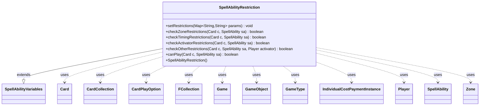

---
aliases:
  - SpellAbilityRestriction
tags:
  - java/class
  - module/forge-game
  - pkg/forge/game/spellability
fqn: forge.game.spellability.SpellAbilityRestriction
package: forge.game.spellability
module: forge-game
kind: Class
---

# SpellAbilityRestriction

**Package:** `forge.game.spellability`   **Module:** `forge-game`   **Kind:** Class



## Relationships
**Extends:**
- [[forge.game.spellability.SpellAbilityVariables|SpellAbilityVariables]]
**Uses:**
- [[forge.game.Game|Game]]
- [[forge.game.GameObject|GameObject]]
- [[forge.game.GameType|GameType]]
- [[forge.game.card.Card|Card]]
- [[forge.game.card.CardCollection|CardCollection]]
- [[forge.game.card.CardPlayOption|CardPlayOption]]
- [[forge.game.cost.IndividualCostPaymentInstance|IndividualCostPaymentInstance]]
- [[forge.game.player.Player|Player]]
- [[forge.game.spellability.SpellAbility|SpellAbility]]
- [[forge.game.zone.Zone|Zone]]
- [[forge.util.collect.FCollection|FCollection]]

## Design Description

SpellAbilityRestriction encapsulates the conditions that govern whether a spell or activated ability may legally be played in the current game state. Extending SpellAbilityVariables—the data holder for restriction fields such as zone, timing, speed, activator, and threshold-style conditions—it parses raw card-script parameters via setRestrictions and exposes a layered set of predicate checks: checkZoneRestrictions, checkTimingRestrictions, checkActivatorRestrictions, and checkOtherRestrictions, all orchestrated by canPlay.

Collaborating with Card, SpellAbility, Player, Zone, and Game, it evaluates contextual rules ranging from comprehensive-rules legality (legendary instants/sorceries, mana-ability timing) to mechanic-specific gates (Bestow, Aftermath, morph, prowl, planeswalker activation limits). The design intent is a single, declarative restriction object populated from card data and reused as the authoritative play-legality gatekeeper, cleanly separating restriction state from the staged validation logic that consumes it.

## Source
`forge-game/src/main/java/forge/game/spellability/SpellAbilityRestriction.java`

```java
/*
 * Forge: Play Magic: the Gathering.
 * Copyright (C) 2011  Forge Team
 *
 * This program is free software: you can redistribute it and/or modify
 * it under the terms of the GNU General Public License as published by
 * the Free Software Foundation, either version 3 of the License, or
 * (at your option) any later version.
 *
 * This program is distributed in the hope that it will be useful,
 * but WITHOUT ANY WARRANTY; without even the implied warranty of
 * MERCHANTABILITY or FITNESS FOR A PARTICULAR PURPOSE.  See the
 * GNU General Public License for more details.
 *
 * You should have received a copy of the GNU General Public License
 * along with this program.  If not, see <http://www.gnu.org/licenses/>.
 */
package forge.game.spellability;

import java.util.List;
import java.util.Map;
import java.util.function.Predicate;

import com.google.common.collect.Sets;

import forge.game.Game;
import forge.game.GameObject;
import forge.game.GameObjectPredicates;
import forge.game.GameType;
import forge.game.ability.AbilityUtils;
import forge.game.card.*;
import forge.game.cost.IndividualCostPaymentInstance;
import forge.game.keyword.Keyword;
import forge.game.phase.PhaseType;
import forge.game.player.Player;
import forge.game.staticability.StaticAbilityCastWithFlash;
import forge.game.staticability.StaticAbilityExhaust;
import forge.game.staticability.StaticAbilityNumLoyaltyAct;
import forge.game.zone.Zone;
import forge.game.zone.ZoneType;
import forge.util.Expressions;
import forge.util.collect.FCollection;

/**
 * <p>
 * SpellAbilityRestriction class.
 * </p>
 *
 * @author Forge
 * @version $Id$
 */
public class SpellAbilityRestriction extends SpellAbilityVariables {
    // A class for handling SpellAbility Restrictions. These restrictions include:
    // Zone, Phase, OwnTurn, Speed (instant/sorcery), Amount per Turn, Player,
    // Threshold, Metalcraft, LevelRange, etc
    // Each value will have a default, that can be overridden (mostly by AbilityFactory)
    // The canPlay function will use these values to determine if the current
    // game state is ok with these restrictions

    /**
     * <p>
     * Constructor for SpellAbilityRestriction.
     * </p>
     */
    public SpellAbilityRestriction() {
    }

    /**
     * <p>
     * setRestrictions.
     * </p>
     *
     * @param params
     *            a {@link java.util.HashMap} object.
     * @since 1.0.15
     */
    public final void setRestrictions(final Map<String, String> params) {
        if (params.containsKey("Activation")) {
            final String value = params.get("Activation");
            if (value.equals("Threshold")) {
                this.setThreshold(true);
            }
            if (value.equals("Metalcraft")) {
                this.setMetalcraft(true);
            }
            if (value.equals("Delirium")) {
                this.setDelirium(true);
            }
            if (value.equals("Hellbent")) {
                this.setHellbent(true);
            }
            if (value.equals("Desert")) {
                this.setDesert(true);
            }
            if (value.equals("Blessing")) {
                this.setBlessing(true);
            }
            if (value.equals("Solved")) {
                this.setSolved(true);
            }
        }

        if (params.containsKey("ActivationZone")) {
            this.setZone(ZoneType.smartValueOf(params.get("ActivationZone")));
        }

        if (params.containsKey("SorcerySpeed")) {
            this.setSorcerySpeed(true);
        }

        if (params.containsKey("InstantSpeed")) {
            this.setInstantSpeed(true);
        }

        if (params.containsKey("PlayerTurn")) {
            this.setPlayerTurn(true);
        }

        if (params.containsKey("OpponentTurn")) {
            this.setOpponentTurn(true);
        }

        if (params.containsKey("Activator")) {
            this.setActivator(params.get("Activator"));
        }

        if (params.containsKey("ActivationLimit")) {
            this.setLimitToCheck(params.get("ActivationLimit"));
        }

        if (params.containsKey("GameActivationLimit")) {
            this.setGameLimitToCheck(params.get("GameActivationLimit"));
        }

        if (params.containsKey("ActivationPhases")) {
            this.setPhases(PhaseType.parseRange(params.get("ActivationPhases")));
        }

        if (params.containsKey("ActivationFirstCombat")) {
            this.setFirstCombatOnly(true);
        }

        if (params.containsKey("ActivationAfterBlockers")) {
            this.setAfterBlockersOnly(true);
        }

        if (params.containsKey("ActivationGameTypes")) {
            this.setGameTypes(GameType.listValueOf(params.get("ActivationGameTypes")));
        }

        if (params.containsKey("IsPresent")) {
            this.setIsPresent(params.get("IsPresent"));
            if (params.containsKey("PresentCompare")) {
                this.setPresentCompare(params.get("PresentCompare"));
            }
            if (params.containsKey("PresentZone")) {
                this.setPresentZone(ZoneType.smartValueOf(params.get("PresentZone")));
            }
        }

        if (params.containsKey("PresentDefined")) {
            this.setPresentDefined(params.get("PresentDefined"));
        }

        // basically PresentCompare for life totals:
        if (params.containsKey("ActivationLifeTotal")) {
            this.setLifeTotal(params.get("ActivationLifeTotal"));
            if (params.containsKey("ActivationLifeAmount")) {
                this.setLifeAmount(params.get("ActivationLifeAmount"));
            }
        }

        if (params.containsKey("CheckSVar")) {
            this.setSvarToCheck(params.get("CheckSVar"));
        }
        if (params.containsKey("SVarCompare")) {
            this.setSvarOperator(params.get("SVarCompare").substring(0, 2));
            this.setSvarOperand(params.get("SVarCompare").substring(2));
        }

        if (params.containsKey("ClassLevel")) {
            this.setClassLevelOperator(params.get("ClassLevel").substring(0, 2));
            this.setClassLevel(params.get("ClassLevel").substring(2));
        }
    }

    /**
     * <p>
     * checkZoneRestrictions.
     * </p>
     * @param c
     *            a {@link forge.game.card.Card} object.
     * @param sa
     *            a {@link forge.game.spellability.SpellAbility} object.
     * @return a boolean.
     */
    public final boolean checkZoneRestrictions(final Card c, final SpellAbility sa) {
        final Player activator = sa.getActivatingPlayer();
        final Zone cardZone = c.getLastKnownZone();
        Card cp = c;

        // for Bestow need to check the animated State
        if (sa.isSpell() && sa.isBestow()) {
            // already bestowed or in battlefield, no need to check for spell
            if (c.isInPlay()) {
                return false;
            }

            // if card is lki and bestowed, then do nothing there, it got already animated
            if (!(c.isLKI() && c.isBestowed())) {
                if (!c.isLKI()) {
                    cp = CardCopyService.getLKICopy(c);
                }

                cp.animateBestow(!cp.isLKI());
            }
        }

        if (cardZone == null || this.getZone() == null || !cardZone.is(this.getZone())) {
            // If Card is not in the default activating zone, do some additional checks
            if (sa.hasParam("AdditionalActivationZone")) {
                if (cardZone != null && cardZone.is(ZoneType.valueOf(sa.getParam("AdditionalActivationZone")))) {
                    return true;
                }
            }
            // Not a Spell, or on Battlefield, return false
            if (!sa.isSpell() || (cardZone != null && ZoneType.Battlefield.equals(cardZone.getZoneType()))
                    || (this.getZone() != null && !this.getZone().equals(ZoneType.Hand))) {
                return false;
            }
            // Prevent AI from casting spells with "May be played" from the Stack
            if (cardZone != null && cardZone.is(ZoneType.Stack)) {
                return false;
            }
            if (sa.isSpell()) {
                final CardPlayOption o = c.mayPlay(sa.getMayPlay());
                if (o == null || sa.isCastFromPlayEffect()) {
                    return this.getZone() == null || (cardZone != null && cardZone.is(this.getZone()));
                } else if (o.getPlayer() == activator) {
                    Map<String,String> params = sa.getMayPlay().getMapParams();

                    // NOTE: this assumes that it's always possible to cast cards from hand and you don't
                    // need special permissions for that. If WotC ever prints a card that forbids casting
                    // cards from hand, this may become relevant.
                    if (!o.grantsZonePermissions() && cardZone != null && (!cardZone.is(ZoneType.Hand) || activator != c.getOwner())) {
                        final List<CardPlayOption> opts = c.mayPlay(activator);
                        boolean hasOtherGrantor = false;
                        for (CardPlayOption opt : opts) {
                            if (opt.grantsZonePermissions()) {
                                hasOtherGrantor = true;
                                break;
                            }
                        }
                        if (cardZone.is(ZoneType.Graveyard) && sa.isAftermath()) {
                            // Special exclusion for Aftermath, useful for e.g. As Foretold
                            return true;
                        }
                        if (!hasOtherGrantor) {
                            return false;
                        }
                    }

                    if (params.containsKey("Affected")) {
                        if (!cp.isValid(params.get("Affected").split(","), activator, o.getHost(), o.getAbility())) {
                            return false;
                        }
                    }

                    if (params.containsKey("ValidSA")) {
                        if (!sa.isValid(params.get("ValidSA").split(","), activator, o.getHost(), o.getAbility())) {
                            return false;
                        }
                    }

                    // TODO: this is an exception for Aftermath. Needs to be somehow generalized.
                    if (this.getZone() != ZoneType.Graveyard && sa.isAftermath() && sa.getCardState() != null) {
                        return false;
                    }

                    return true;
                }
            }
            return false;
        }

        return true;
    }

    /**
     * <p>
     * checkTimingRestrictions.
     * </p>
     * @param c
     *            a {@link forge.game.card.Card} object.
     * @param sa
     *            a {@link forge.game.spellability.SpellAbility} object.
     * @return a boolean.
     */
    public final boolean checkTimingRestrictions(final Card c, final SpellAbility sa) {
        Player activator = sa.getActivatingPlayer();
        final Game game = activator.getGame();

        if (this.isPlayerTurn() && !game.getPhaseHandler().isPlayerTurn(activator)) {
            return false;
        }

        if (this.isOpponentTurn() && !game.getPhaseHandler().getPlayerTurn().isOpponentOf(activator)) {
            return false;
        }

        if (this.getPhases().size() > 0) {
            if (!this.getPhases().contains(game.getPhaseHandler().getPhase())) {
                return false;
            }
        }

        if (this.getFirstCombatOnly()) {
            if (game.getPhaseHandler().getNumCombat() > (game.getPhaseHandler().inCombat() ? 1 : 0)) {
                return false;
            }
        }

        // CR 506.7f
        if (this.getAfterBlockersOnly()) {
            if (game.getPhaseHandler().skippedDeclareBlockers()) {
                return false;
            }
        }
        if (sa.isSneak()) {
            if (!game.getPhaseHandler().is(PhaseType.COMBAT_DECLARE_BLOCKERS)) {
                return false;
            }
        }
        return true;
    }

    /**
     * <p>
     * checkActivatorRestrictions.
     * </p>
     * @param c
     *            a {@link forge.game.card.Card} object.
     * @param sa
     *            a {@link forge.game.spellability.SpellAbility} object.
     * @return a boolean.
     */
    public final boolean checkActivatorRestrictions(final Card c, final SpellAbility sa) {
        Player activator = sa.getActivatingPlayer();

        if (sa.isCastFromPlayEffect()) {
            return true;
        }

        if (sa.isSpell()) {
            // Spells should always default to "controller" but use mayPlay check.
            final CardPlayOption o = c.mayPlay(sa.getMayPlay());
            if (o != null && o.getPlayer() == activator) {
                return true;
            }
        }

        String validPlayer = this.getActivator();
        return activator.isValid(validPlayer, c.getController(), c, sa);
    }

    public final boolean checkOtherRestrictions(final Card c, final SpellAbility sa, final Player activator) {
        final Game game = activator.getGame();

        // 205.4e. Any instant or sorcery spell with the supertype "legendary" is subject to a casting restriction
        if ((c.isSorcery() || c.isInstant()) && c.getType().isLegendary() && CardLists.getValidCardCount(
                activator.getCardsIn(ZoneType.Battlefield),
                "Creature.Legendary,Planeswalker.Legendary", c.getController(), c, sa) <= 0) {
            return false;
        }

        // Explicit Aftermath check there
        if ((sa.isAftermath() || sa.isDisturb()) && !c.isInZone(ZoneType.Graveyard)) {
            return false;
        }

        if (sa.isKeyword(Keyword.FUSE) && !c.isInZone(ZoneType.Hand)) {
            return false;
        }

        if (isHellbent()) {
            if (!activator.hasHellbent()) {
                return false;
            }
        }
        if (isThreshold()) {
            if (!activator.hasThreshold()) {
                return false;
            }
        }
        if (isMetalcraft()) {
            if (!activator.hasMetalcraft()) {
                return false;
            }
        }
        if (isDelirium()) {
            if (!activator.hasDelirium()) {
                return false;
            }
        }
        if (sa.isSurged()) {
            if (!activator.hasSurge()) {
                return false;
            }
        }
        if (sa.isSpectacle()) {
            if (activator.getOpponentLostLifeThisTurn() <= 0) {
                return false;
            }
        }
        if (isDesert()) {
            if (!activator.hasDesert()) {
                return false;
            }
        }
        if (isBlessing()) {
            if (!activator.hasBlessing()) {
                return false;
            }
        }
        if (isSolved()) {
            if (!c.isSolved()) {
                return false;
            }
        }
        if (sa.isProwl()) {
            if (!activator.hasProwl(sa)) {
                return false;
            }
        }
        if (sa.isFreerunning()) {
            if (!activator.hasFreerunning()) {
                return false;
            }
        }
        if (this.getIsPresent() != null) {
            FCollection<GameObject> list;
            if (getPresentDefined() != null) {
                list = AbilityUtils.getDefinedObjects(sa.getHostCard(), getPresentDefined(), sa);
            } else {
                list = new FCollection<>(game.getCardsIn(getPresentZone()));
            }

            Predicate<GameObject> restriction = GameObjectPredicates.restriction(getIsPresent().split(","), activator, c, sa);
            final int left = (int) list.stream().filter(restriction).count();

            final String rightString = this.getPresentCompare().substring(2);
            int right = AbilityUtils.calculateAmount(c, rightString, sa);

            if (!Expressions.compare(left, this.getPresentCompare(), right)) {
                return false;
            }
        }

        if (this.getLifeTotal() != null) {
            int life = 1;
            if (this.getLifeTotal().equals("You")) {
                life = activator.getLife();
            }

            int right = AbilityUtils.calculateAmount(sa.getHostCard(), this.getLifeAmount().substring(2), sa);

            if (!Expressions.compare(life, this.getLifeAmount(), right)) {
                return false;
            }
        }

        if (sa.isPwAbility()) {
            int numActivates = c.getPlaneswalkerAbilityActivated();
            int limit = StaticAbilityNumLoyaltyAct.limitIncrease(c) ? 2 : 1;

            if (numActivates >= limit) {
                // increased limit only counts if it's been used already
                limit += StaticAbilityNumLoyaltyAct.additionalActivations(c, sa) - (limit == 1 || c.planeswalkerActivationLimitUsed() ? 0 : 1);
                if (numActivates >= limit) {
                    return false;
                }
            }
        }

        // CR 702.37e / 702.168b
        // If the permanent wouldn't have a morph / disguise cost if it were face up, it can't be turned face up this way.
        if ((sa.isMorphUp() || sa.isDisguiseUp()) && c.isInPlay()) {
            Card cp = c;
            if (!c.isLKI()) {
                cp = CardCopyService.getLKICopy(c);
            }
            cp.forceTurnFaceUp();

            // check static abilities
            game.getTracker().freeze();
            cp.clearStaticChangedCardKeywords(false);
            CardCollection preList = new CardCollection(cp);
            game.getAction().checkStaticAbilities(false, Sets.newHashSet(cp), preList);

            boolean found = cp.hasSpellAbility(sa);

            game.getAction().checkStaticAbilities(false);
            // clear delayed changes, this check should not have updated the view
            game.getTracker().clearDelayed();
            // need to unfreeze tracker
            game.getTracker().unfreeze();

            if (!found) {
                return false;
            }
        }

        if (sa.isBoast()) {
            int limit = activator.hasKeyword("Creatures you control can boast twice during each of your turns rather than once.") ? 2 : 1;
            if (limit <= sa.getActivationsThisTurn()) {
                return false;
            }
        } else if (sa.isExhaust()) {
            if (sa.getActivationsThisGame() > 0 && !StaticAbilityExhaust.anyWithExhaust(activator)) {
                return false;
            }
        } else if (sa.isPowerUp()) {
            if (sa.getActivationsThisGame() > 0) {
                return false;
            }
        }

        // Rule 605.3c about Mana Abilities
        if (sa.isManaAbility()) {
            for (IndividualCostPaymentInstance i : game.costPaymentStack) {
                if (i.getPayment().getAbility().equals(sa)) {
                    return false;
                }
            }
        }

        if (this.getsVarToCheck() != null) {
            final int svarValue = AbilityUtils.calculateAmount(c, this.getsVarToCheck(), sa);
            final int operandValue = AbilityUtils.calculateAmount(c, this.getsVarOperand(), sa);

            if (!Expressions.compare(svarValue, this.getsVarOperator(), operandValue)) {
                return false;
            }
        }

        if (this.getClassLevel() != null) {
            final int level = c.getClassLevel();
            final int levelOperand = AbilityUtils.calculateAmount(c, this.getClassLevel(), sa);

            if (!Expressions.compare(level, this.getClassLevelOperator(), levelOperand)) {
                return false;
            }
        }

        if (this.getGameTypes().size() > 0) {
            Predicate<GameType> pgt = type -> game.getRules().hasAppliedVariant(type);
            if (getGameTypes().stream().noneMatch(pgt)) {
                return false;
            }
        }

    	return true;
    }

    /**
     * <p>
     * canPlay.
     * </p>
     *
     * @param c
     *            a {@link forge.game.card.Card} object.
     * @param sa
     *            a {@link forge.game.spellability.SpellAbility} object.
     * @return a boolean.
     */
    public final boolean canPlay(final Card c, final SpellAbility sa) {
        if (c.isPhasedOut() || c.isUsedToPay()) {
            return false;
        }

        Player activator = sa.getActivatingPlayer();
        if (activator == null) {
            activator = c.getController();
            sa.setActivatingPlayer(activator);
            System.out.println(c.getName() + " Did not have activator set in SpellAbilityRestriction.canPlay()");
        }

        if (!StaticAbilityCastWithFlash.anyWithFlashNeedsInfo(sa, c, activator)) {
            if (!sa.canCastTiming(c, activator)) {
                return false;
            }
        }

        // Special check for Lion's Eye Diamond
        if (sa.isManaAbility() && c.getGame().costPaymentStack.peek() != null && isInstantSpeed()) {
            return false;
        }

        if (!checkActivatorRestrictions(c, sa)) {
            return false;
        }

        if (!checkTimingRestrictions(c, sa)) {
            return false;
        }

        if (!checkZoneRestrictions(c, sa)) {
            return false;
        }

        if (!checkOtherRestrictions(c, sa, activator)) {
            return false;
        }

        if (this.getLimitToCheck() != null) {
            int limit = AbilityUtils.calculateAmount(c, getLimitToCheck(), sa);

            if (sa.getActivationsThisTurn() >= limit) {
                return false;
            }
        }

        if (this.getGameLimitToCheck() != null) {
            int limit = AbilityUtils.calculateAmount(c, getGameLimitToCheck(), sa);

            if (sa.getActivationsThisGame() >= limit) {
                return false;
            }
        }

        return true;
    }

}
```

## Python
`forge/game/spellability/SpellAbilityRestriction.py`

```python
/*
 * Forge: Play Magic: the Gathering.
 * Copyright (C) 2011  Forge Team
 *
 * This program is free software: you can redistribute it and/or modify
 * it under the terms of the GNU General Public License as published by
 * the Free Software Foundation, either version 3 of the License, or
 * (at your option) any later version.
 *
 * This program is distributed in the hope that it will be useful,
 * but WITHOUT ANY WARRANTY; without even the implied warranty of
 * MERCHANTABILITY or FITNESS FOR A PARTICULAR PURPOSE.  See the
 * GNU General Public License for more details.
 *
 * You should have received a copy of the GNU General Public License
 * along with this program.  If not, see <http://www.gnu.org/licenses/>.
 */

from typing import List, Map

from com.google.common.collect.Sets import Sets

from forge.game.Game import Game
from forge.game.GameObject import GameObject
from forge.game.GameObjectPredicates import GameObjectPredicates
from forge.game.GameType import GameType
from forge.game.ability.AbilityUtils import AbilityUtils
from forge.game.card.Card import Card
from forge.game.card.CardCollection import CardCollection
from forge.game.card.CardCopyService import CardCopyService
from forge.game.card.CardLists import CardLists
from forge.game.card.CardPlayOption import CardPlayOption
from forge.game.cost.IndividualCostPaymentInstance import IndividualCostPaymentInstance
from forge.game.keyword.Keyword import Keyword
from forge.game.phase.PhaseType import PhaseType
from forge.game.player.Player import Player
from forge.game.spellability.SpellAbility import SpellAbility
from forge.game.spellability.SpellAbilityVariables import SpellAbilityVariables
from forge.game.staticability.StaticAbilityCastWithFlash import StaticAbilityCastWithFlash
from forge.game.staticability.StaticAbilityExhaust import StaticAbilityExhaust
from forge.game.staticability.StaticAbilityNumLoyaltyAct import StaticAbilityNumLoyaltyAct
from forge.game.zone.Zone import Zone
from forge.game.zone.ZoneType import ZoneType
from forge.util.Expressions import Expressions
from forge.util.collect.FCollection import FCollection


class SpellAbilityRestriction(SpellAbilityVariables):
    # A class for handling SpellAbility Restrictions. These restrictions include:
    # Zone, Phase, OwnTurn, Speed (instant/sorcery), Amount per Turn, Player,
    # Threshold, Metalcraft, LevelRange, etc
    # Each value will have a default, that can be overridden (mostly by AbilityFactory)
    # The canPlay function will use these values to determine if the current
    # game state is ok with these restrictions

    def __init__(self):
        super().__init__()

    def setRestrictions(self, params):
        if "Activation" in params:
            value = params.get("Activation")
            if value == "Threshold":
                self.setThreshold(True)
            if value == "Metalcraft":
                self.setMetalcraft(True)
            if value == "Delirium":
                self.setDelirium(True)
            if value == "Hellbent":
                self.setHellbent(True)
            if value == "Desert":
                self.setDesert(True)
            if value == "Blessing":
                self.setBlessing(True)
            if value == "Solved":
                self.setSolved(True)

        if "ActivationZone" in params:
            self.setZone(ZoneType.smartValueOf(params.get("ActivationZone")))

        if "SorcerySpeed" in params:
            self.setSorcerySpeed(True)

        if "InstantSpeed" in params:
            self.setInstantSpeed(True)

        if "PlayerTurn" in params:
            self.setPlayerTurn(True)

        if "OpponentTurn" in params:
            self.setOpponentTurn(True)

        if "Activator" in params:
            self.setActivator(params.get("Activator"))

        if "ActivationLimit" in params:
            self.setLimitToCheck(params.get("ActivationLimit"))

        if "GameActivationLimit" in params:
            self.setGameLimitToCheck(params.get("GameActivationLimit"))

        if "ActivationPhases" in params:
            self.setPhases(PhaseType.parseRange(params.get("ActivationPhases")))

        if "ActivationFirstCombat" in params:
            self.setFirstCombatOnly(True)

        if "ActivationAfterBlockers" in params:
            self.setAfterBlockersOnly(True)

        if "ActivationGameTypes" in params:
            self.setGameTypes(GameType.listValueOf(params.get("ActivationGameTypes")))

        if "IsPresent" in params:
            self.setIsPresent(params.get("IsPresent"))
            if "PresentCompare" in params:
                self.setPresentCompare(params.get("PresentCompare"))
            if "PresentZone" in params:
                self.setPresentZone(ZoneType.smartValueOf(params.get("PresentZone")))

        if "PresentDefined" in params:
            self.setPresentDefined(params.get("PresentDefined"))

        # basically PresentCompare for life totals:
        if "ActivationLifeTotal" in params:
            self.setLifeTotal(params.get("ActivationLifeTotal"))
            if "ActivationLifeAmount" in params:
                self.setLifeAmount(params.get("ActivationLifeAmount"))

        if "CheckSVar" in params:
            self.setSvarToCheck(params.get("CheckSVar"))
        if "SVarCompare" in params:
            self.setSvarOperator(params.get("SVarCompare")[0:2])
            self.setSvarOperand(params.get("SVarCompare")[2:])

        if "ClassLevel" in params:
            self.setClassLevelOperator(params.get("ClassLevel")[0:2])
            self.setClassLevel(params.get("ClassLevel")[2:])

    def checkZoneRestrictions(self, c, sa):
        activator = sa.getActivatingPlayer()
        cardZone = c.getLastKnownZone()
        cp = c

        # for Bestow need to check the animated State
        if sa.isSpell() and sa.isBestow():
            # already bestowed or in battlefield, no need to check for spell
            if c.isInPlay():
                return False

            # if card is lki and bestowed, then do nothing there, it got already animated
            if not (c.isLKI() and c.isBestowed()):
                if not c.isLKI():
                    cp = CardCopyService.getLKICopy(c)

                cp.animateBestow(not cp.isLKI())

        if cardZone is None or self.getZone() is None or not cardZone.is_(self.getZone()):
            # If Card is not in the default activating zone, do some additional checks
            if sa.hasParam("AdditionalActivationZone"):
                if cardZone is not None and cardZone.is_(ZoneType.valueOf(sa.getParam("AdditionalActivationZone"))):
                    return True
            # Not a Spell, or on Battlefield, return false
            if not sa.isSpell() or (cardZone is not None and ZoneType.Battlefield == cardZone.getZoneType()) \
                    or (self.getZone() is not None and self.getZone() != ZoneType.Hand):
                return False
            # Prevent AI from casting spells with "May be played" from the Stack
            if cardZone is not None and cardZone.is_(ZoneType.Stack):
                return False
            if sa.isSpell():
                o = c.mayPlay(sa.getMayPlay())
                if o is None or sa.isCastFromPlayEffect():
                    return self.getZone() is None or (cardZone is not None and cardZone.is_(self.getZone()))
                elif o.getPlayer() == activator:
                    params = sa.getMayPlay().getMapParams()

                    # NOTE: this assumes that it's always possible to cast cards from hand and you don't
                    # need special permissions for that. If WotC ever prints a card that forbids casting
                    # cards from hand, this may become relevant.
                    if not o.grantsZonePermissions() and cardZone is not None and (not cardZone.is_(ZoneType.Hand) or activator != c.getOwner()):
                        opts = c.mayPlay(activator)
                        hasOtherGrantor = False
                        for opt in opts:
                            if opt.grantsZonePermissions():
                                hasOtherGrantor = True
                                break
                        if cardZone.is_(ZoneType.Graveyard) and sa.isAftermath():
                            # Special exclusion for Aftermath, useful for e.g. As Foretold
                            return True
                        if not hasOtherGrantor:
                            return False

                    if "Affected" in params:
                        if not cp.isValid(params.get("Affected").split(","), activator, o.getHost(), o.getAbility()):
                            return False

                    if "ValidSA" in params:
                        if not sa.isValid(params.get("ValidSA").split(","), activator, o.getHost(), o.getAbility()):
                            return False

                    # TODO: this is an exception for Aftermath. Needs to be somehow generalized.
                    if self.getZone() != ZoneType.Graveyard and sa.isAftermath() and sa.getCardState() is not None:
                        return False

                    return True
            return False

        return True

    def checkTimingRestrictions(self, c, sa):
        activator = sa.getActivatingPlayer()
        game = activator.getGame()

        if self.isPlayerTurn() and not game.getPhaseHandler().isPlayerTurn(activator):
            return False

        if self.isOpponentTurn() and not game.getPhaseHandler().getPlayerTurn().isOpponentOf(activator):
            return False

        if self.getPhases().size() > 0:
            if not self.getPhases().contains(game.getPhaseHandler().getPhase()):
                return False

        if self.getFirstCombatOnly():
            if game.getPhaseHandler().getNumCombat() > (1 if game.getPhaseHandler().inCombat() else 0):
                return False

        # CR 506.7f
        if self.getAfterBlockersOnly():
            if game.getPhaseHandler().skippedDeclareBlockers():
                return False
        if sa.isSneak():
            if not game.getPhaseHandler().is_(PhaseType.COMBAT_DECLARE_BLOCKERS):
                return False
        return True

    def checkActivatorRestrictions(self, c, sa):
        activator = sa.getActivatingPlayer()

        if sa.isCastFromPlayEffect():
            return True

        if sa.isSpell():
            # Spells should always default to "controller" but use mayPlay check.
            o = c.mayPlay(sa.getMayPlay())
            if o is not None and o.getPlayer() == activator:
                return True

        validPlayer = self.getActivator()
        return activator.isValid(validPlayer, c.getController(), c, sa)

    def checkOtherRestrictions(self, c, sa, activator):
        game = activator.getGame()

        # 205.4e. Any instant or sorcery spell with the supertype "legendary" is subject to a casting restriction
        if (c.isSorcery() or c.isInstant()) and c.getType().isLegendary() and CardLists.getValidCardCount(
                activator.getCardsIn(ZoneType.Battlefield),
                "Creature.Legendary,Planeswalker.Legendary", c.getController(), c, sa) <= 0:
            return False

        # Explicit Aftermath check there
        if (sa.isAftermath() or sa.isDisturb()) and not c.isInZone(ZoneType.Graveyard):
            return False

        if sa.isKeyword(Keyword.FUSE) and not c.isInZone(ZoneType.Hand):
            return False

        if self.isHellbent():
            if not activator.hasHellbent():
                return False
        if self.isThreshold():
            if not activator.hasThreshold():
                return False
        if self.isMetalcraft():
            if not activator.hasMetalcraft():
                return False
        if self.isDelirium():
            if not activator.hasDelirium():
                return False
        if sa.isSurged():
            if not activator.hasSurge():
                return False
        if sa.isSpectacle():
            if activator.getOpponentLostLifeThisTurn() <= 0:
                return False
        if self.isDesert():
            if not activator.hasDesert():
                return False
        if self.isBlessing():
            if not activator.hasBlessing():
                return False
        if self.isSolved():
            if not c.isSolved():
                return False
        if sa.isProwl():
            if not activator.hasProwl(sa):
                return False
        if sa.isFreerunning():
            if not activator.hasFreerunning():
                return False
        if self.getIsPresent() is not None:
            if self.getPresentDefined() is not None:
                list = AbilityUtils.getDefinedObjects(sa.getHostCard(), self.getPresentDefined(), sa)
            else:
                list = FCollection(game.getCardsIn(self.getPresentZone()))

            restriction = GameObjectPredicates.restriction(self.getIsPresent().split(","), activator, c, sa)
            left = int(sum(1 for x in list.stream() if restriction(x)))

            rightString = self.getPresentCompare()[2:]
            right = AbilityUtils.calculateAmount(c, rightString, sa)

            if not Expressions.compare(left, self.getPresentCompare(), right):
                return False

        if self.getLifeTotal() is not None:
            life = 1
            if self.getLifeTotal() == "You":
                life = activator.getLife()

            right = AbilityUtils.calculateAmount(sa.getHostCard(), self.getLifeAmount()[2:], sa)

            if not Expressions.compare(life, self.getLifeAmount(), right):
                return False

        if sa.isPwAbility():
            numActivates = c.getPlaneswalkerAbilityActivated()
            limit = 2 if StaticAbilityNumLoyaltyAct.limitIncrease(c) else 1

            if numActivates >= limit:
                # increased limit only counts if it's been used already
                limit += StaticAbilityNumLoyaltyAct.additionalActivations(c, sa) - (0 if limit == 1 or c.planeswalkerActivationLimitUsed() else 1)
                if numActivates >= limit:
                    return False

        # CR 702.37e / 702.168b
        # If the permanent wouldn't have a morph / disguise cost if it were face up, it can't be turned face up this way.
        if (sa.isMorphUp() or sa.isDisguiseUp()) and c.isInPlay():
            cp = c
            if not c.isLKI():
                cp = CardCopyService.getLKICopy(c)
            cp.forceTurnFaceUp()

            # check static abilities
            game.getTracker().freeze()
            cp.clearStaticChangedCardKeywords(False)
            preList = CardCollection(cp)
            game.getAction().checkStaticAbilities(False, Sets.newHashSet(cp), preList)

            found = cp.hasSpellAbility(sa)

            game.getAction().checkStaticAbilities(False)
            # clear delayed changes, this check should not have updated the view
            game.getTracker().clearDelayed()
            # need to unfreeze tracker
            game.getTracker().unfreeze()

            if not found:
                return False

        if sa.isBoast():
            limit = 2 if activator.hasKeyword("Creatures you control can boast twice during each of your turns rather than once.") else 1
            if limit <= sa.getActivationsThisTurn():
                return False
        elif sa.isExhaust():
            if sa.getActivationsThisGame() > 0 and not StaticAbilityExhaust.anyWithExhaust(activator):
                return False
        elif sa.isPowerUp():
            if sa.getActivationsThisGame() > 0:
                return False

        # Rule 605.3c about Mana Abilities
        if sa.isManaAbility():
            for i in game.costPaymentStack:
                if i.getPayment().getAbility().equals(sa):
                    return False

        if self.getsVarToCheck() is not None:
            svarValue = AbilityUtils.calculateAmount(c, self.getsVarToCheck(), sa)
            operandValue = AbilityUtils.calculateAmount(c, self.getsVarOperand(), sa)

            if not Expressions.compare(svarValue, self.getsVarOperator(), operandValue):
                return False

        if self.getClassLevel() is not None:
            level = c.getClassLevel()
            levelOperand = AbilityUtils.calculateAmount(c, self.getClassLevel(), sa)

            if not Expressions.compare(level, self.getClassLevelOperator(), levelOperand):
                return False

        if self.getGameTypes().size() > 0:
            pgt = lambda type: game.getRules().hasAppliedVariant(type)
            if not any(pgt(type) for type in self.getGameTypes()):
                return False

        return True

    def canPlay(self, c, sa):
        if c.isPhasedOut() or c.isUsedToPay():
            return False

        activator = sa.getActivatingPlayer()
        if activator is None:
            activator = c.getController()
            sa.setActivatingPlayer(activator)
            print(c.getName() + " Did not have activator set in SpellAbilityRestriction.canPlay()")

        if not StaticAbilityCastWithFlash.anyWithFlashNeedsInfo(sa, c, activator):
            if not sa.canCastTiming(c, activator):
                return False

        # Special check for Lion's Eye Diamond
        if sa.isManaAbility() and c.getGame().costPaymentStack.peek() is not None and self.isInstantSpeed():
            return False

        if not self.checkActivatorRestrictions(c, sa):
            return False

        if not self.checkTimingRestrictions(c, sa):
            return False

        if not self.checkZoneRestrictions(c, sa):
            return False

        if not self.checkOtherRestrictions(c, sa, activator):
            return False

        if self.getLimitToCheck() is not None:
            limit = AbilityUtils.calculateAmount(c, self.getLimitToCheck(), sa)

            if sa.getActivationsThisTurn() >= limit:
                return False

        if self.getGameLimitToCheck() is not None:
            limit = AbilityUtils.calculateAmount(c, self.getGameLimitToCheck(), sa)

            if sa.getActivationsThisGame() >= limit:
                return False

        return True
```
