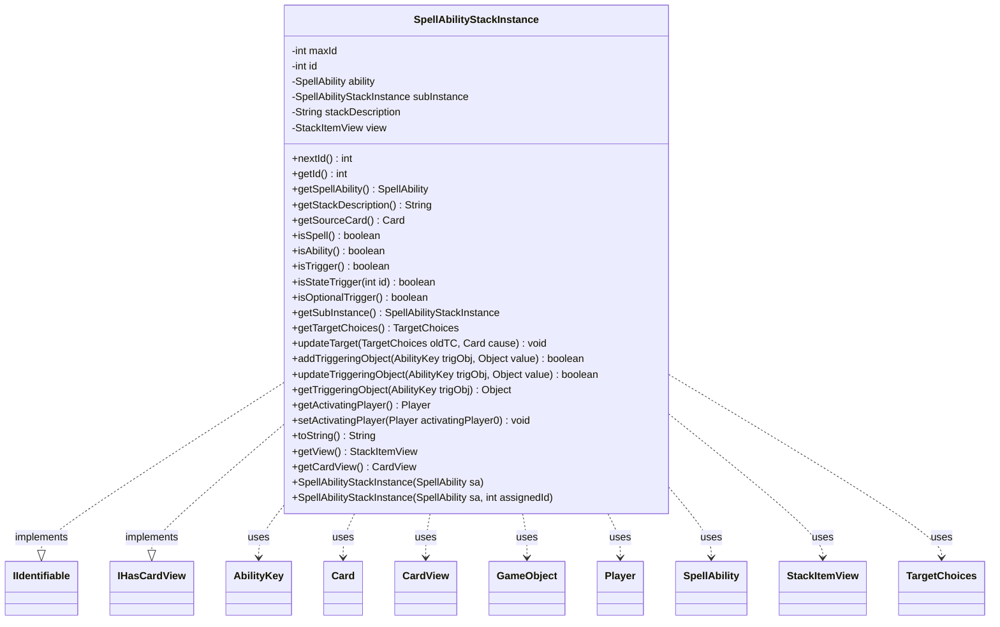

---
aliases:
  - SpellAbilityStackInstance
tags:
  - java/class
  - module/forge-game
  - pkg/forge/game/spellability
fqn: forge.game.spellability.SpellAbilityStackInstance
package: forge.game.spellability
module: forge-game
kind: Class
---

# SpellAbilityStackInstance

**Package:** `forge.game.spellability` &nbsp; **Module:** `forge-game` &nbsp; **Kind:** Class



## Relationships
**Implements:**
- [[forge.game.IIdentifiable|IIdentifiable]]
- [[forge.game.card.IHasCardView|IHasCardView]]
**Uses:**
- [[forge.game.GameObject|GameObject]]
- [[forge.game.ability.AbilityKey|AbilityKey]]
- [[forge.game.card.Card|Card]]
- [[forge.game.card.CardView|CardView]]
- [[forge.game.player.Player|Player]]
- [[forge.game.spellability.SpellAbility|SpellAbility]]
- [[forge.game.spellability.StackItemView|StackItemView]]
- [[forge.game.spellability.TargetChoices|TargetChoices]]

## Design Description

SpellAbilityStackInstance represents a single spell or ability while it sits on the game stack, capturing the state needed to resolve it independently of later mutations to the originating SpellAbility. It wraps the SpellAbility, assigns each entry a unique identity (implementing IIdentifiable via a static incrementing id), caches a cleaned-up stack description, and recursively builds a subInstance chain mirroring the ability's sub-abilities.

Most query methods (isSpell, isTrigger, getTargetChoices, triggering-object accessors) delegate to the wrapped ability, while updateTarget actively fires BecomesTarget and BecomesTargetOnce triggers when targets change and refreshes the paired StackItemView. By implementing IHasCardView and owning a StackItemView, it bridges game-engine state to the UI layer. A code comment signals design intent to evolve toward an "active instance" model akin to TargetChoices, indicating the current duplicated-parameter approach is provisional.

## Source
`forge-game/src/main/java/forge/game/spellability/SpellAbilityStackInstance.java`

```java
/*
 * Forge: Play Magic: the Gathering.
 * Copyright (C) 2011  Forge Team
 *
 * This program is free software: you can redistribute it and/or modify
 * it under the terms of the GNU General Public License as published by
 * the Free Software Foundation, either version 3 of the License, or
 * (at your option) any later version.
 *
 * This program is distributed in the hope that it will be useful,
 * but WITHOUT ANY WARRANTY; without even the implied warranty of
 * MERCHANTABILITY or FITNESS FOR A PARTICULAR PURPOSE.  See the
 * GNU General Public License for more details.
 *
 * You should have received a copy of the GNU General Public License
 * along with this program.  If not, see <http://www.gnu.org/licenses/>.
 */
package forge.game.spellability;

import java.util.Map;
import java.util.Set;

import com.google.common.collect.Sets;

import forge.game.GameObject;
import forge.game.IIdentifiable;
import forge.game.ability.AbilityKey;
import forge.game.ability.ApiType;
import forge.game.card.Card;
import forge.game.card.CardView;
import forge.game.card.IHasCardView;
import forge.game.player.Player;
import forge.game.trigger.TriggerType;
import forge.util.TextUtil;

/**
 * <p>
 * SpellAbility_StackInstance class.
 * </p>
 *
 * @author Forge
 * @version $Id$
 */
public class SpellAbilityStackInstance implements IIdentifiable, IHasCardView {
    private static int maxId = 0;
    public static int nextId() { return ++maxId; }

    // At some point I want this functioning more like Target/Target Choices
    // where the SA has an "active"
    // Stack Instance, and instead of having duplicate parameters, it adds
    // changes directly to the "active" one
    // When hitting the Stack, the active SI gets "applied" to the Stack and
    // gets cleared from the base SI
    // Coming off the Stack would work similarly, except it would just add the
    // full active SI instead of each of the parts

    private final int id;
    private final SpellAbility ability;

    private final SpellAbilityStackInstance subInstance;

    private String stackDescription = null;

    private final StackItemView view;

    public SpellAbilityStackInstance(final SpellAbility sa) {
        this(sa, nextId());
    }
    public SpellAbilityStackInstance(final SpellAbility sa, int assignedId) {
        // Base SA info
        id = assignedId;
        ability = sa;
        stackDescription = sa.getStackDescription();

        subInstance = ability.getSubAbility() == null ? null : new SpellAbilityStackInstance(ability.getSubAbility());

        if (ApiType.SetState == sa.getApi() && !ability.hasSVar("StoredTransform")) {
            // Record current state of Transformation if the ability might change state
            ability.setSVar("StoredTransform", String.valueOf(ability.getHostCard().getTransformedTimestamp()));
        }

        if (sa.getApi() == ApiType.Charm && sa.hasParam("ChoiceRestriction")) {
            // Remember the Choice here for later handling
            sa.getHostCard().addChosenModes(sa, sa.getSubAbility().getDescription(), sa.getHostCard().getGame().getPhaseHandler().inCombat());
        }

        view = new StackItemView(this);
    }

    @Override
    public int getId() {
        return id;
    }

    public final SpellAbility getSpellAbility() {
        return ability;
    }

    // A bit of SA shared abilities to restrict conflicts
    public final String getStackDescription() {
        return stackDescription.replaceAll("\\\\r\\\\n", "").replaceAll("\\.\u2022", ";").replaceAll("\u2022", "");
    }

    public final Card getSourceCard() {
        return ability.getHostCard();
    }

    public final boolean isSpell() {
        return ability.isSpell();
    }

    public final boolean isAbility() {
        return ability.isAbility();
    }

    public final boolean isTrigger() {
        return ability.isTrigger();
    }

    public final boolean isStateTrigger(final int id) {
        return ability.getSourceTrigger() == id;
    }

    public final boolean isOptionalTrigger() {
        return ability.isOptionalTrigger();
    }

    public final SpellAbilityStackInstance getSubInstance() {
        return subInstance;
    }

    public final TargetChoices getTargetChoices() {
        return ability.getTargets();
    }

    public void updateTarget(TargetChoices oldTC, Card cause) {
        if (oldTC != null) {
            stackDescription = ability.getStackDescription();
            view.updateTargetCards(this);
            view.updateTargetPlayers(this);
            view.updateText(this);

            Set<GameObject> distinctObjects = Sets.newHashSet();
            for (final GameObject tgt : ability.getTargets()) {
                if (oldTC.contains(tgt)) {
                    // it was an old target, so don't trigger becomes target
                    continue;
                }
                if (!distinctObjects.add(tgt)) {
                    continue;
                }

                Map<AbilityKey, Object> runParams = AbilityKey.newMap();
                runParams.put(AbilityKey.SourceSA, ability);
                runParams.put(AbilityKey.Target, tgt);
                if (tgt instanceof Card c) {
                    if (!c.hasBecomeTargetThisTurn()) {
                        runParams.put(AbilityKey.FirstTime, null);
                    }
                    if (c.isValiant(ability.getActivatingPlayer())) {
                        runParams.put(AbilityKey.Valiant, null);
                    }
                    c.addTargetFromThisTurn(ability.getActivatingPlayer());
                }
                getSourceCard().getGame().getTriggerHandler().runTrigger(TriggerType.BecomesTarget, runParams, false);
            }
            // Only run BecomesTargetOnce when at least one target is changed
            if (!distinctObjects.isEmpty()) {
                Map<AbilityKey, Object> runParams = AbilityKey.newMap();
                runParams.put(AbilityKey.SourceSA, ability);
                runParams.put(AbilityKey.Targets, distinctObjects);
                runParams.put(AbilityKey.Cause, cause);
                getSourceCard().getGame().getTriggerHandler().runTrigger(TriggerType.BecomesTargetOnce, runParams, false);
            }
        }
    }

    public boolean addTriggeringObject(AbilityKey trigObj, Object value) {
        if (!ability.hasTriggeringObject(trigObj)) {
            ability.setTriggeringObject(trigObj, value);
            return true;
        }
        return false;
    }
    public boolean updateTriggeringObject(AbilityKey trigObj, Object value) {
        if (ability.hasTriggeringObject(trigObj)) {
            ability.setTriggeringObject(trigObj, value);
            return true;
        }
        return false;
    }
    public Object getTriggeringObject(AbilityKey trigObj) {
        return ability.getTriggeringObject(trigObj);
    }

    public Player getActivatingPlayer() {
        return ability.getActivatingPlayer();
    }
    public void setActivatingPlayer(Player activatingPlayer0) {
        ability.setActivatingPlayer(activatingPlayer0);
        view.updateActivatingPlayer(this);
        if (subInstance != null) {
            subInstance.setActivatingPlayer(activatingPlayer0);
        }
    }

    @Override
    public String toString() {
        return TextUtil.concatNoSpace(getSourceCard().toString(), "->", getStackDescription());
    }

    public StackItemView getView() {
        return view;
    }

    @Override
    public CardView getCardView() {
        return CardView.get(getSourceCard());
    }
}
```

## Python
`forge/game/spellability/SpellAbilityStackInstance.py`

```python
from typing import Set, Dict

from forge.game.GameObject import GameObject
from forge.game.IIdentifiable import IIdentifiable
from forge.game.ability.AbilityKey import AbilityKey
from forge.game.ability.ApiType import ApiType
from forge.game.card.Card import Card
from forge.game.card.CardView import CardView
from forge.game.card.IHasCardView import IHasCardView
from forge.game.player.Player import Player
from forge.game.trigger.TriggerType import TriggerType
from forge.util.TextUtil import TextUtil

from forge.game.spellability.SpellAbility import SpellAbility
from forge.game.spellability.StackItemView import StackItemView
from forge.game.spellability.TargetChoices import TargetChoices


class SpellAbilityStackInstance(IIdentifiable, IHasCardView):
    maxId = 0

    @staticmethod
    def nextId() -> int:
        SpellAbilityStackInstance.maxId += 1
        return SpellAbilityStackInstance.maxId

    # At some point I want this functioning more like Target/Target Choices
    # where the SA has an "active"
    # Stack Instance, and instead of having duplicate parameters, it adds
    # changes directly to the "active" one
    # When hitting the Stack, the active SI gets "applied" to the Stack and
    # gets cleared from the base SI
    # Coming off the Stack would work similarly, except it would just add the
    # full active SI instead of each of the parts

    def __init__(self, sa: SpellAbility, assignedId: int = None):
        if assignedId is None:
            assignedId = SpellAbilityStackInstance.nextId()

        # Base SA info
        self.id = assignedId
        self.ability = sa
        self.stackDescription = sa.getStackDescription()

        self.subInstance = None if self.ability.getSubAbility() is None else SpellAbilityStackInstance(self.ability.getSubAbility())

        if ApiType.SetState == sa.getApi() and not self.ability.hasSVar("StoredTransform"):
            # Record current state of Transformation if the ability might change state
            self.ability.setSVar("StoredTransform", str(self.ability.getHostCard().getTransformedTimestamp()))

        if sa.getApi() == ApiType.Charm and sa.hasParam("ChoiceRestriction"):
            # Remember the Choice here for later handling
            sa.getHostCard().addChosenModes(sa, sa.getSubAbility().getDescription(), sa.getHostCard().getGame().getPhaseHandler().inCombat())

        self.view = StackItemView(self)

    def getId(self) -> int:
        return self.id

    def getSpellAbility(self) -> SpellAbility:
        return self.ability

    # A bit of SA shared abilities to restrict conflicts
    def getStackDescription(self) -> str:
        return self.stackDescription.replace("\\r\\n", "").replace(".\u2022", ";").replace("\u2022", "")

    def getSourceCard(self) -> Card:
        return self.ability.getHostCard()

    def isSpell(self) -> bool:
        return self.ability.isSpell()

    def isAbility(self) -> bool:
        return self.ability.isAbility()

    def isTrigger(self) -> bool:
        return self.ability.isTrigger()

    def isStateTrigger(self, id: int) -> bool:
        return self.ability.getSourceTrigger() == id

    def isOptionalTrigger(self) -> bool:
        return self.ability.isOptionalTrigger()

    def getSubInstance(self) -> "SpellAbilityStackInstance":
        return self.subInstance

    def getTargetChoices(self) -> TargetChoices:
        return self.ability.getTargets()

    def updateTarget(self, oldTC: TargetChoices, cause: Card) -> None:
        if oldTC is not None:
            self.stackDescription = self.ability.getStackDescription()
            self.view.updateTargetCards(self)
            self.view.updateTargetPlayers(self)
            self.view.updateText(self)

            distinctObjects: Set[GameObject] = set()
            for tgt in self.ability.getTargets():
                if oldTC.contains(tgt):
                    # it was an old target, so don't trigger becomes target
                    continue
                if tgt in distinctObjects:
                    continue
                distinctObjects.add(tgt)

                runParams: Dict[AbilityKey, object] = AbilityKey.newMap()
                runParams[AbilityKey.SourceSA] = self.ability
                runParams[AbilityKey.Target] = tgt
                if isinstance(tgt, Card):
                    c = tgt
                    if not c.hasBecomeTargetThisTurn():
                        runParams[AbilityKey.FirstTime] = None
                    if c.isValiant(self.ability.getActivatingPlayer()):
                        runParams[AbilityKey.Valiant] = None
                    c.addTargetFromThisTurn(self.ability.getActivatingPlayer())
                self.getSourceCard().getGame().getTriggerHandler().runTrigger(TriggerType.BecomesTarget, runParams, False)
            # Only run BecomesTargetOnce when at least one target is changed
            if len(distinctObjects) != 0:
                runParams: Dict[AbilityKey, object] = AbilityKey.newMap()
                runParams[AbilityKey.SourceSA] = self.ability
                runParams[AbilityKey.Targets] = distinctObjects
                runParams[AbilityKey.Cause] = cause
                self.getSourceCard().getGame().getTriggerHandler().runTrigger(TriggerType.BecomesTargetOnce, runParams, False)

    def addTriggeringObject(self, trigObj: AbilityKey, value: object) -> bool:
        if not self.ability.hasTriggeringObject(trigObj):
            self.ability.setTriggeringObject(trigObj, value)
            return True
        return False

    def updateTriggeringObject(self, trigObj: AbilityKey, value: object) -> bool:
        if self.ability.hasTriggeringObject(trigObj):
            self.ability.setTriggeringObject(trigObj, value)
            return True
        return False

    def getTriggeringObject(self, trigObj: AbilityKey) -> object:
        return self.ability.getTriggeringObject(trigObj)

    def getActivatingPlayer(self) -> Player:
        return self.ability.getActivatingPlayer()

    def setActivatingPlayer(self, activatingPlayer0: Player) -> None:
        self.ability.setActivatingPlayer(activatingPlayer0)
        self.view.updateActivatingPlayer(self)
        if self.subInstance is not None:
            self.subInstance.setActivatingPlayer(activatingPlayer0)

    def toString(self) -> str:
        return TextUtil.concatNoSpace(self.getSourceCard().toString(), "->", self.getStackDescription())

    def __str__(self) -> str:
        return self.toString()

    def getView(self) -> StackItemView:
        return self.view

    def getCardView(self) -> CardView:
        return CardView.get(self.getSourceCard())
```
