---
aliases:
  - SpellAbilityVariables
tags:
  - java/class
  - module/forge-game
  - pkg/forge/game/spellability
fqn: forge.game.spellability.SpellAbilityVariables
package: forge.game.spellability
module: forge-game
kind: Class
---

# SpellAbilityVariables

**Package:** `forge.game.spellability`   **Module:** `forge-game`   **Kind:** Class



```mermaid
classDiagram
    class SpellAbilityVariables {
        -ZoneType zone
        -Set~PhaseType~ phases
        -boolean firstCombatOnly
        -boolean afterBlockersOnly
        -Set~GameType~ gameTypes
        -boolean sorcerySpeed
        -boolean instantSpeed
        -String activator
        -boolean opponentTurn
        -boolean playerTurn
        -String limitToCheck
        -String gameLimitToCheck
        -boolean threshold
        -boolean metalcraft
        -boolean delirium
        -boolean hellbent
        -boolean revolt
        -boolean desert
        -boolean blessing
        -boolean solved
        -String isPresent
        -String isPresent2
        -String presentCompare
        -String presentCompare2
        -String presentDefined
        -String presentDefined2
        -String playerDefined
        -String playerContains
        -ZoneType presentZone
        -String sVarToCheck
        -String sVarToCheck2
        -String sVarOperator
        -String sVarOperator2
        -String sVarOperand
        -String sVarOperand2
        -String lifeTotal
        -String lifeAmount
        -String noDifferentColors
        -String manaSpent
        -String manaNotSpent
        -String chosenColors
        -String targetValidTargeting
        -boolean targetsSingleTarget
        -String classLevel
        -String classLevelOperator
        #boolean kicked
        #boolean kicked1
        #boolean kicked2
        #boolean altCostPaid
        #boolean optionalCostPaid
        #boolean optionalBoolean
        #boolean surgeCostPaid
        #boolean bargain
        #boolean foretold
        +setManaSpent(String s) void
        +getManaSpent() String
        +setManaNotSpent(String s) void
        +getManaNotSpent() String
        +setZone(ZoneType zone) void
        +getZone() ZoneType
        +setSorcerySpeed(boolean bSpeed) void
        +isSorcerySpeed() boolean
        +setInstantSpeed(boolean bSpeed) void
        +isInstantSpeed() boolean
        +setActivator(String player) void
        +getActivator() String
        +setPlayerTurn(boolean bTurn) void
        +getPlayerTurn() boolean
        +setOpponentTurn(boolean bTurn) void
        +getOpponentTurn() boolean
        +setPhases(Set~PhaseType~ phases) void
        +getGameTypes() Set~GameType~
        +setGameTypes(Set~GameType~ gameTypes) void
        +setHellbent(boolean bHellbent) void
        +setThreshold(boolean bThreshold) void
        +setMetalcraft(boolean bMetalcraft) void
        +setDelirium(boolean delirium) void
        +setRevolt(boolean bRevolt) void
        +setDesert(boolean bDesert) void
        +setBlessing(boolean bBlessing) void
        +setSolved(boolean bSolved) void
        +setIsPresent(String present) void
        +setIsPresent2(String present) void
        +setPresentCompare(String compare) void
        +setPresentCompare2(String compare) void
        +getPresentZone() ZoneType
        +setPresentZone(ZoneType presentZone) void
        +setPresentDefined(String defined) void
        +setPresentDefined2(String defined) void
        +setSvarToCheck(String sVar) void
        +setSvarToCheck2(String sVar) void
        +setSvarOperator(String operator) void
        +setSvarOperand(String operand) void
        +setSvarOperator2(String operator) void
        +setSvarOperand2(String operand) void
        +setLimitToCheck(String limit) void
        +setGameLimitToCheck(String limit) void
        +getLimitToCheck() String
        +getGameLimitToCheck() String
        +isThreshold() boolean
        +isMetalcraft() boolean
        +isDelirium() boolean
        +isHellbent() boolean
        +isRevolt() boolean
        +isDesert() boolean
        +isBlessing() boolean
        +isSolved() boolean
        +getNoDifferentColors() String
        +setNoDifferentColors(String noDifferentColors) void
        +isPlayerTurn() boolean
        +getPresentCompare() String
        +getPresentCompare2() String
        +getLifeTotal() String
        +setLifeTotal(String lifeTotal0) void
        +getLifeAmount() String
        +setLifeAmount(String lifeAmount0) void
        +getPhases() Set~PhaseType~
        +getFirstCombatOnly() boolean
        +setFirstCombatOnly(boolean first) boolean
        +getAfterBlockersOnly() boolean
        +setAfterBlockersOnly(boolean first) boolean
        +getPresentDefined() String
        +getPresentDefined2() String
        +setPlayerDefined(String b) void
        +getPlayerDefined() String
        +getPlayerContains() String
        +setPlayerContains(String contains) void
        +getsVarOperand() String
        +getsVarOperand2() String
        +setsVarOperand(String sVarOperand0) void
        +setsVarOperand2(String sVarOperand0) void
        +getsVarToCheck() String
        +getsVarToCheck2() String
        +setsVarToCheck(String sVarToCheck) void
        +setsVarToCheck2(String sVarToCheck) void
        +getsVarOperator() String
        +getsVarOperator2() String
        +setsVarOperator(String sVarOperator0) void
        +setsVarOperator2(String sVarOperator0) void
        +isOpponentTurn() boolean
        +getIsPresent() String
        +getIsPresent2() String
        +setColorToCheck(String s) void
        +getColorToCheck() String
        +getTargetValidTargeting() String
        +setTargetValidTargeting(String targetValidTargeting) void
        +targetsSingleTarget() boolean
        +setTargetsSingleTarget(boolean b) void
        +copy() SpellAbilityVariables
        +getClassLevel() String
        +setClassLevel(String level) void
        +getClassLevelOperator() String
        +setClassLevelOperator(String op) void
        +SpellAbilityVariables()
    }
    SpellAbilityVariables ..|> Cloneable : implements
    SpellAbilityVariables ..> GameType : uses
    SpellAbilityVariables ..> PhaseType : uses
    SpellAbilityVariables ..> ZoneType : uses
```

## Relationships
**Uses:**
- [[forge.game.GameType|GameType]]
- [[forge.game.phase.PhaseType|PhaseType]]
- [[forge.game.zone.ZoneType|ZoneType]]

## Design Description

SpellAbilityVariables is a plain mutable data holder that captures the activation and condition restrictions governing when a SpellAbility may be cast or activated. It stores casting constraints — legal zone, permitted phases, instant/sorcery speed, whose turn it is, per-turn and per-game usage limits — alongside conditional-state flags for ability words and mechanics (threshold, metalcraft, delirium, hellbent, revolt, desert, blessing), SVar comparison operands/operators, presence checks, mana-spent conditions, and optional-cost markers (kicked, bargain, foretold). Exposed almost entirely through getters and setters, each field carries a sensible default (Battlefield zone, "GE1" comparisons, sorcery speed) intended to be overridden by AbilityFactory during parsing.

It collaborates with the enums it references — ZoneType, PhaseType, and GameType — to type its restriction values, and implements Cloneable so copy() can produce a shallow duplicate, letting each ability instance hold an independent set of variables.

## Source
`forge-game/src/main/java/forge/game/spellability/SpellAbilityVariables.java`

```java
/*
 * Forge: Play Magic: the Gathering.
 * Copyright (C) 2011  Forge Team
 *
 * This program is free software: you can redistribute it and/or modify
 * it under the terms of the GNU General Public License as published by
 * the Free Software Foundation, either version 3 of the License, or
 * (at your option) any later version.
 *
 * This program is distributed in the hope that it will be useful,
 * but WITHOUT ANY WARRANTY; without even the implied warranty of
 * MERCHANTABILITY or FITNESS FOR A PARTICULAR PURPOSE.  See the
 * GNU General Public License for more details.
 *
 * You should have received a copy of the GNU General Public License
 * along with this program.  If not, see <http://www.gnu.org/licenses/>.
 */
package forge.game.spellability;

import forge.game.GameType;
import forge.game.phase.PhaseType;
import forge.game.zone.ZoneType;

import java.util.EnumSet;
import java.util.Set;

/**
 * <p>
 * SpellAbilityVariables class.
 * </p>
 *
 * @author Forge
 * @version $Id$
 * @since 1.0.15
 */
public class SpellAbilityVariables implements Cloneable {
    // A class for handling SpellAbility Variables. These restrictions include:
    // Zone, Phase, OwnTurn, Speed (instant/sorcery), Amount per Turn, Player,
    // Threshold, Metalcraft, Hellbent, LevelRange, etc
    // Each value will have a default, that can be overridden (mostly by
    // AbilityFactory)

    /**
     * <p>
     * Constructor for SpellAbility_Variables.
     * </p>
     */
    public SpellAbilityVariables() {
    }

    // default values for Sorcery speed abilities
    /** The zone. */
    private ZoneType zone = ZoneType.Battlefield;

    /** The phases. */
    private Set<PhaseType> phases = EnumSet.noneOf(PhaseType.class);

    private boolean firstCombatOnly = false;

    private boolean afterBlockersOnly = false;

    /** The GameTypes */
    private Set<GameType> gameTypes = EnumSet.noneOf(GameType.class);

    /** The b sorcery speed. */
    private boolean sorcerySpeed = false;

    /** The b instant speed. */
    private boolean instantSpeed = false;

    /** The b any player. */
    private String activator = "You";

    /** The b opponent turn. */
    private boolean opponentTurn = false;

    /** The b player turn. */
    private boolean playerTurn = false;

    /** The limitToCheck to check. */
    private String limitToCheck = null;

    /** The gameLimitToCheck to check. */
    private String gameLimitToCheck = null;

    // Conditional States for Cards
    private boolean threshold = false;
    private boolean metalcraft = false;
    private boolean delirium = false;
    private boolean hellbent = false;
    private boolean revolt = false;
    private boolean desert = false;
    private boolean blessing = false;
    private boolean solved = false;

    /** The s is present. */
    private String isPresent = null;
    private String isPresent2 = null;

    /** The present compare. */
    private String presentCompare = "GE1"; // Default: greater than or equal to 1
    private String presentCompare2 = "GE1";

    /** The present defined. */
    private String presentDefined = null;
    private String presentDefined2 = null;

    /** The player defined. */
    private String playerDefined = null;

    /** The player contains. */
    private String playerContains = null;

    /** The present zone. */
    private ZoneType presentZone = ZoneType.Battlefield;

    /** The svar to check. */
    private String sVarToCheck = null;
    private String sVarToCheck2 = null;

    /** The svar operator. */
    private String sVarOperator = "GE";
    private String sVarOperator2 = "GE";

    /** The svar operand. */
    private String sVarOperand = "1";
    private String sVarOperand2 = "1";

    /** The life total. */
    private String lifeTotal = null;

    /** The life amount. */
    private String lifeAmount = "GE1";

    /** The shareAllColors. */
    private String noDifferentColors = null;

    /** The mana spent. */
    private String manaSpent = "";
    private String manaNotSpent = "";

    /** The chosen colors string. */
    private String chosenColors = null;

    /** The target valid targeting */
    private String targetValidTargeting = null;

    /** The b targetsSingleTargeting */
    private boolean targetsSingleTarget = false;

    /** The class level. */
    private String classLevel = null;
    private String classLevelOperator = "EQ";

    /**
     * <p>
     * Setter for the field <code>manaSpent</code>.
     * </p>
     *
     * @param s
     *            a {@link java.lang.String} object.
     */
    public final void setManaSpent(final String s) {
        this.manaSpent = s;
    }

    /**
     * <p>
     * Getter for the field <code>manaSpent</code>.
     * </p>
     *
     * @return a {@link java.lang.String} object.
     */
    public final String getManaSpent() {
        return this.manaSpent;
    }

    public final void setManaNotSpent(final String s) {
        this.manaNotSpent = s;
    }
    public final String getManaNotSpent() {
        return this.manaNotSpent;
    }

    /**
     * <p>
     * Setter for the field <code>zone</code>.
     * </p>
     *
     * @param zone
     *            a {@link java.lang.String} object.
     */
    public final void setZone(final ZoneType zone) {
        this.zone = zone;
    }

    /**
     * <p>
     * Getter for the field <code>zone</code>.
     * </p>
     *
     * @return a {@link java.lang.String} object.
     */
    public final ZoneType getZone() {
        return this.zone;
    }

    public final void setSorcerySpeed(final boolean bSpeed) {
        this.sorcerySpeed = bSpeed;
    }

    public final boolean isSorcerySpeed() {
        return this.sorcerySpeed;
    }

    public final void setInstantSpeed(final boolean bSpeed) {
        this.instantSpeed = bSpeed;
    }

    public final boolean isInstantSpeed() {
        return this.instantSpeed;
    }

    public final void setActivator(final String player) {
        this.activator = player;
    }

    public String getActivator() {
        return this.activator;
    }

    /**
     * <p>
     * setPlayerTurn.
     * </p>
     *
     * @param bTurn
     *            a boolean.
     */
    public final void setPlayerTurn(final boolean bTurn) {
        this.playerTurn = bTurn;
    }

    /**
     * <p>
     * getPlayerTurn.
     * </p>
     *
     * @return a boolean.
     */
    public final boolean getPlayerTurn() {
        return this.isPlayerTurn();
    }

    /**
     * <p>
     * setOpponentTurn.
     * </p>
     *
     * @param bTurn
     *            a boolean.
     */
    public final void setOpponentTurn(final boolean bTurn) {
        this.opponentTurn = bTurn;
    }

    /**
     * <p>
     * getOpponentTurn.
     * </p>
     *
     * @return a boolean.
     */
    public final boolean getOpponentTurn() {
        return this.isOpponentTurn();
    }

    /**
     * <p>
     * Setter for the field <code>phases</code>.
     * </p>
     *
     * @param phases
     *            a {@link java.lang.String} object.
     */
    public final void setPhases(final Set<PhaseType> phases) {
        this.phases.addAll(phases);
    }

    /**
     * Gets the game types.
     *
     * @return the game types
     */
    public final Set<GameType> getGameTypes() {
        return this.gameTypes;
    }

    /**
     * <p>
     * Setter for the field <code>gameTypes</code>.
     * </p>
     *
     * @param gameTypes
     */
    public final void setGameTypes(final Set<GameType> gameTypes) {
        this.gameTypes.clear();
        this.gameTypes.addAll(gameTypes);
    }

    public final void setHellbent(final boolean bHellbent) {
        this.hellbent = bHellbent;
    }

    public final void setThreshold(final boolean bThreshold) {
        this.threshold = bThreshold;
    }

    public final void setMetalcraft(final boolean bMetalcraft) {  this.metalcraft = bMetalcraft;  }

    public void setDelirium(boolean delirium) {  this.delirium = delirium; }

    public void setRevolt(final boolean bRevolt) { revolt = bRevolt; }
    public void setDesert(final boolean bDesert) { desert = bDesert; }
    public void setBlessing(final boolean bBlessing) { blessing = bBlessing; }
    public void setSolved(final boolean bSolved) { solved = bSolved; }

    /** Optional Costs */
    protected boolean kicked = false;
    protected boolean kicked1 = false; // http://magiccards.info/query?q=o%3A%22kicker%22+not+o%3A%22multikicker%22+o%3A%22and%2For+{%22
    protected boolean kicked2 = false; // Some spells have 2 kickers with different effects
    protected boolean altCostPaid = false;
    protected boolean optionalCostPaid = false; // Undergrowth other Pseudo-kickers
    protected boolean optionalBoolean = true; // Just in case you need to check if something wasn't kicked, etc
    protected boolean surgeCostPaid = false;
    protected boolean bargain = false;
    protected boolean foretold = false;

    // IsPresent for Valid battlefield stuff

    /**
     * <p>
     * setIsPresent.
     * </p>
     *
     * @param present
     *            a {@link java.lang.String} object.
     */
    public final void setIsPresent(final String present) {
        this.isPresent = present;
    }

    public final void setIsPresent2(final String present) {
        this.isPresent2 = present;
    }

    /**
     * <p>
     * Setter for the field <code>presentCompare</code>.
     * </p>
     *
     * @param compare
     *            a {@link java.lang.String} object.
     */
    public final void setPresentCompare(final String compare) {
        this.presentCompare = compare;
    }

    public final void setPresentCompare2(final String compare) {
        this.presentCompare2 = compare;
    }

    /**
     * Gets the present zone.
     *
     * @return the present zone
     */
    public final ZoneType getPresentZone() {
        return this.presentZone;
    }

    /**
     * Sets the present zone.
     *
     * @param presentZone
     *            the new present zone
     */
    public final void setPresentZone(final ZoneType presentZone) {
        this.presentZone = presentZone;
    }

    /**
     * <p>
     * Setter for the field <code>presentDefined</code>.
     * </p>
     *
     * @param defined
     *            a {@link java.lang.String} object.
     */
    public final void setPresentDefined(final String defined) {
        this.presentDefined = defined;
    }

    public final void setPresentDefined2(final String defined) {
        this.presentDefined2 = defined;
    }

    // Checking the values of SVars (Mostly for Traps)
    /**
     * <p>
     * Setter for the field <code>svarToCheck</code>.
     * </p>
     *
     * @param sVar
     *            a {@link java.lang.String} object.
     */
    public final void setSvarToCheck(final String sVar) {
        this.setsVarToCheck(sVar);
    }
    public final void setSvarToCheck2(final String sVar) {
        this.setsVarToCheck2(sVar);
    }

    /**
     * <p>
     * Setter for the field <code>svarOperator</code>.
     * </p>
     *
     * @param operator
     *            a {@link java.lang.String} object.
     */
    public final void setSvarOperator(final String operator) {
        this.setsVarOperator(operator);
    }

    /**
     * <p>
     * Setter for the field <code>svarOperand</code>.
     * </p>
     *
     * @param operand
     *            a {@link java.lang.String} object.
     */
    public final void setSvarOperand(final String operand) {
        this.setsVarOperand(operand);
    }

    //for second possible SVar condition
    public final void setSvarOperator2(final String operator) {
        this.setsVarOperator2(operator);
    }
    public final void setSvarOperand2(final String operand) {
        this.setsVarOperand2(operand);
    }

    /**
     * <p>
     * Setter for the field <code>limitToCheck</code>.
     * </p>
     *
     * @param limit
     *            a {@link java.lang.String} object.
     */
    public final void setLimitToCheck(final String limit) {
        this.limitToCheck = limit;
    }

    /**
     * <p>
     * Setter for the field <code>GamelimitToCheck</code>.
     * </p>
     *
     * @param limit
     *            a {@link java.lang.String} object.
     */
    public final void setGameLimitToCheck(final String limit) {
        this.gameLimitToCheck = limit;
    }

    /**
     * <p>
     * Getter for the field <code>limitToCheck</code>.
     * </p>
     *
     * @return the limitToCheck
     *            a {@link java.lang.String} object.
     */
    public final String getLimitToCheck() {
        return this.limitToCheck;
    }

    /**
     * <p>
     * Getter for the field <code>getGameLimitToCheck</code>.
     * </p>
     *
     * @return the getGameLimitToCheck
     *            a {@link java.lang.String} object.
     */
    public final String getGameLimitToCheck() {
        return this.gameLimitToCheck;
    }

    public final boolean isThreshold() {    return this.threshold;  }

    public final boolean isMetalcraft() {   return this.metalcraft; }

    public final boolean isDelirium() {     return this.delirium;  }

    public final boolean isHellbent() {     return this.hellbent;  }

    public final boolean isRevolt() {     return this.revolt;  }

    public final boolean isDesert() {     return this.desert;  }
    public final boolean isBlessing() {     return this.blessing;  }

    public final boolean isSolved() {     return this.solved;  }

    public String getNoDifferentColors() {
        return noDifferentColors;
    }
    public void setNoDifferentColors(String noDifferentColors) {
        this.noDifferentColors = noDifferentColors;
    }

    /**
     * Checks if is player turn.
     *
     * @return the playerTurn
     */
    public final boolean isPlayerTurn() {
        return this.playerTurn;
    }

    /**
     * Gets the present compare.
     *
     * @return the presentCompare
     */
    public final String getPresentCompare() {
        return this.presentCompare;
    }
    public final String getPresentCompare2() {
        return this.presentCompare2;
    }

    /**
     * Gets the life total.
     *
     * @return the lifeTotal
     */
    public final String getLifeTotal() {
        return this.lifeTotal;
    }

    /**
     * Sets the life total.
     *
     * @param lifeTotal0
     *            the lifeTotal to set
     */
    public final void setLifeTotal(final String lifeTotal0) {
        this.lifeTotal = lifeTotal0;
    }

    /**
     * Gets the life amount.
     *
     * @return the lifeAmount
     */
    public final String getLifeAmount() {
        return this.lifeAmount;
    }

    /**
     * Sets the life amount.
     *
     * @param lifeAmount0
     *            the lifeAmount to set
     */
    public final void setLifeAmount(final String lifeAmount0) {
        this.lifeAmount = lifeAmount0;
    }

    /**
     * Gets the phases.
     *
     * @return the phases
     */
    public final Set<PhaseType> getPhases() {
        return this.phases;
    }

    /**
     * Gets the first combat.
     *
     * @return first combat
     */
    public final boolean getFirstCombatOnly() {
        return this.firstCombatOnly;
    }
    public final boolean setFirstCombatOnly(boolean first) {
        return this.firstCombatOnly = first;
    }

    /**
     * Gets the declared blockers.
     *
     * @return declared blockers
     */
    public final boolean getAfterBlockersOnly() {
        return this.afterBlockersOnly;
    }
    public final boolean setAfterBlockersOnly(boolean first) {
        return this.afterBlockersOnly = first;
    }

    /**
     * Gets the present defined.
     *
     * @return the presentDefined
     */
    public final String getPresentDefined() {
        return this.presentDefined;
    }
    public final String getPresentDefined2() {
        return this.presentDefined2;
    }


    /**
     * Set the player defined.
     *
     */
    public final void setPlayerDefined(final String b) {
        this.playerDefined = b;
    }

    /**
     * Gets the player defined.
     *
     * @return the playerDefined
     */
    public final String getPlayerDefined() {
        return this.playerDefined;
    }

    /**
     * Gets the player contains.
     *
     * @return the playerContains
     */
    public final String getPlayerContains() {
        return this.playerContains;
    }

    /**
     * Set the player contains.
     *
     */
    public final void setPlayerContains(final String contains) {
        this.playerContains = contains;
    }

    /**
     * Gets the s var operand.
     *
     * @return the sVarOperand
     */
    public final String getsVarOperand() {
        return this.sVarOperand;
    }
    public final String getsVarOperand2() {
        return this.sVarOperand2;
    }

    /**
     * Sets the s var operand.
     *
     * @param sVarOperand0
     *            the sVarOperand to set
     */
    public final void setsVarOperand(final String sVarOperand0) {
        this.sVarOperand = sVarOperand0;
    }
    public final void setsVarOperand2(final String sVarOperand0) {
        this.sVarOperand2 = sVarOperand0;
    }

    /**
     * Gets the s var to check.
     *
     * @return the sVarToCheck
     */
    public final String getsVarToCheck() {
        return this.sVarToCheck;
    }
    public final String getsVarToCheck2() {
        return this.sVarToCheck2;
    }

    /**
     * Sets the s var to check.
     *
     * @param sVarToCheck
     *            the sVarToCheck to set
     */
    public final void setsVarToCheck(final String sVarToCheck) {
        this.sVarToCheck = sVarToCheck;
    }
    public final void setsVarToCheck2(final String sVarToCheck) {
        this.sVarToCheck2 = sVarToCheck;
    }

    /**
     * Gets the s var operator.
     *
     * @return the sVarOperator
     */
    public final String getsVarOperator() {
        return this.sVarOperator;
    }
    public final String getsVarOperator2() {
        return this.sVarOperator2;
    }

    /**
     * Sets the s var operator.
     *
     * @param sVarOperator0
     *            the sVarOperator to set
     */
    public final void setsVarOperator(final String sVarOperator0) {
        this.sVarOperator = sVarOperator0;
    }
    public final void setsVarOperator2(final String sVarOperator0) {
        this.sVarOperator2 = sVarOperator0;
    }

    /**
     * Checks if is opponent turn.
     *
     * @return the opponentTurn
     */
    public final boolean isOpponentTurn() {
        return this.opponentTurn;
    }

    /**
     * Gets the checks if is present.
     *
     * @return the isPresent
     */
    public final String getIsPresent() {
        return this.isPresent;
    }
    public final String getIsPresent2() {
        return this.isPresent2;
    }

    public final void setColorToCheck(final String s) {
        this.chosenColors = s;
    }

    /**
     * <p>
     * Getter for the field <code>ColorToCheck</code>.
     * </p>
     *
     * @return the String, chosenColors.
     */
    public final String getColorToCheck() {
        return this.chosenColors;
    }

	/**
	 * @return the targetValidTargeting
	 */
	public String getTargetValidTargeting() {
		return targetValidTargeting;
	}

	/**
	 * @param targetValidTargeting the targetValidTargeting to set
	 */
	public void setTargetValidTargeting(String targetValidTargeting) {
		this.targetValidTargeting = targetValidTargeting;
	}

    /**
     * @return the targetsSingleTarget
     */
	public boolean targetsSingleTarget() {
		return targetsSingleTarget;
	}

    /**
     * @param b the targetsSingleTarget to set
     */
    public void setTargetsSingleTarget(boolean b) {
        this.targetsSingleTarget = b;
    }

    public SpellAbilityVariables copy() {
        try {
            return (SpellAbilityVariables) clone();
        } catch (final CloneNotSupportedException e) {
            System.err.println(e);
        }
        return null;
    }

    public String getClassLevel() {
        return classLevel;
    }
    public void setClassLevel(String level) {
        classLevel = level;
    }

    public String getClassLevelOperator() {
        return classLevelOperator;
    }
    public void setClassLevelOperator(String op) {
        classLevelOperator = op;
    }
}
```

## Python
`forge/game/spellability/SpellAbilityVariables.py`

```python
from forge.game.GameType import GameType
from forge.game.phase.PhaseType import PhaseType
from forge.game.zone.ZoneType import ZoneType

import copy


class SpellAbilityVariables:
    # A class for handling SpellAbility Variables. These restrictions include:
    # Zone, Phase, OwnTurn, Speed (instant/sorcery), Amount per Turn, Player,
    # Threshold, Metalcraft, Hellbent, LevelRange, etc
    # Each value will have a default, that can be overridden (mostly by
    # AbilityFactory)

    def __init__(self):
        # default values for Sorcery speed abilities
        # The zone.
        self.zone = ZoneType.Battlefield

        # The phases.
        self.phases = set()

        self.firstCombatOnly = False

        self.afterBlockersOnly = False

        # The GameTypes
        self.gameTypes = set()

        # The b sorcery speed.
        self.sorcerySpeed = False

        # The b instant speed.
        self.instantSpeed = False

        # The b any player.
        self.activator = "You"

        # The b opponent turn.
        self.opponentTurn = False

        # The b player turn.
        self.playerTurn = False

        # The limitToCheck to check.
        self.limitToCheck = None

        # The gameLimitToCheck to check.
        self.gameLimitToCheck = None

        # Conditional States for Cards
        self.threshold = False
        self.metalcraft = False
        self.delirium = False
        self.hellbent = False
        self.revolt = False
        self.desert = False
        self.blessing = False
        self.solved = False

        # The s is present.
        self.isPresent = None
        self.isPresent2 = None

        # The present compare.
        self.presentCompare = "GE1"  # Default: greater than or equal to 1
        self.presentCompare2 = "GE1"

        # The present defined.
        self.presentDefined = None
        self.presentDefined2 = None

        # The player defined.
        self.playerDefined = None

        # The player contains.
        self.playerContains = None

        # The present zone.
        self.presentZone = ZoneType.Battlefield

        # The svar to check.
        self.sVarToCheck = None
        self.sVarToCheck2 = None

        # The svar operator.
        self.sVarOperator = "GE"
        self.sVarOperator2 = "GE"

        # The svar operand.
        self.sVarOperand = "1"
        self.sVarOperand2 = "1"

        # The life total.
        self.lifeTotal = None

        # The life amount.
        self.lifeAmount = "GE1"

        # The shareAllColors.
        self.noDifferentColors = None

        # The mana spent.
        self.manaSpent = ""
        self.manaNotSpent = ""

        # The chosen colors string.
        self.chosenColors = None

        # The target valid targeting
        self.targetValidTargeting = None

        # The b targetsSingleTargeting
        self.targetsSingleTarget = False

        # The class level.
        self.classLevel = None
        self.classLevelOperator = "EQ"

        # Optional Costs
        self.kicked = False
        self.kicked1 = False  # http://magiccards.info/query?q=o%3A%22kicker%22+not+o%3A%22multikicker%22+o%3A%22and%2For+{%22
        self.kicked2 = False  # Some spells have 2 kickers with different effects
        self.altCostPaid = False
        self.optionalCostPaid = False  # Undergrowth other Pseudo-kickers
        self.optionalBoolean = True  # Just in case you need to check if something wasn't kicked, etc
        self.surgeCostPaid = False
        self.bargain = False
        self.foretold = False

    def setManaSpent(self, s: str) -> None:
        self.manaSpent = s

    def getManaSpent(self) -> str:
        return self.manaSpent

    def setManaNotSpent(self, s: str) -> None:
        self.manaNotSpent = s

    def getManaNotSpent(self) -> str:
        return self.manaNotSpent

    def setZone(self, zone: ZoneType) -> None:
        self.zone = zone

    def getZone(self) -> ZoneType:
        return self.zone

    def setSorcerySpeed(self, bSpeed: bool) -> None:
        self.sorcerySpeed = bSpeed

    def isSorcerySpeed(self) -> bool:
        return self.sorcerySpeed

    def setInstantSpeed(self, bSpeed: bool) -> None:
        self.instantSpeed = bSpeed

    def isInstantSpeed(self) -> bool:
        return self.instantSpeed

    def setActivator(self, player: str) -> None:
        self.activator = player

    def getActivator(self) -> str:
        return self.activator

    def setPlayerTurn(self, bTurn: bool) -> None:
        self.playerTurn = bTurn

    def getPlayerTurn(self) -> bool:
        return self.isPlayerTurn()

    def setOpponentTurn(self, bTurn: bool) -> None:
        self.opponentTurn = bTurn

    def getOpponentTurn(self) -> bool:
        return self.isOpponentTurn()

    def setPhases(self, phases: set) -> None:
        self.phases.update(phases)

    def getGameTypes(self) -> set:
        return self.gameTypes

    def setGameTypes(self, gameTypes: set) -> None:
        self.gameTypes.clear()
        self.gameTypes.update(gameTypes)

    def setHellbent(self, bHellbent: bool) -> None:
        self.hellbent = bHellbent

    def setThreshold(self, bThreshold: bool) -> None:
        self.threshold = bThreshold

    def setMetalcraft(self, bMetalcraft: bool) -> None:
        self.metalcraft = bMetalcraft

    def setDelirium(self, delirium: bool) -> None:
        self.delirium = delirium

    def setRevolt(self, bRevolt: bool) -> None:
        self.revolt = bRevolt

    def setDesert(self, bDesert: bool) -> None:
        self.desert = bDesert

    def setBlessing(self, bBlessing: bool) -> None:
        self.blessing = bBlessing

    def setSolved(self, bSolved: bool) -> None:
        self.solved = bSolved

    # IsPresent for Valid battlefield stuff

    def setIsPresent(self, present: str) -> None:
        self.isPresent = present

    def setIsPresent2(self, present: str) -> None:
        self.isPresent2 = present

    def setPresentCompare(self, compare: str) -> None:
        self.presentCompare = compare

    def setPresentCompare2(self, compare: str) -> None:
        self.presentCompare2 = compare

    def getPresentZone(self) -> ZoneType:
        return self.presentZone

    def setPresentZone(self, presentZone: ZoneType) -> None:
        self.presentZone = presentZone

    def setPresentDefined(self, defined: str) -> None:
        self.presentDefined = defined

    def setPresentDefined2(self, defined: str) -> None:
        self.presentDefined2 = defined

    # Checking the values of SVars (Mostly for Traps)
    def setSvarToCheck(self, sVar: str) -> None:
        self.setsVarToCheck(sVar)

    def setSvarToCheck2(self, sVar: str) -> None:
        self.setsVarToCheck2(sVar)

    def setSvarOperator(self, operator: str) -> None:
        self.setsVarOperator(operator)

    def setSvarOperand(self, operand: str) -> None:
        self.setsVarOperand(operand)

    # for second possible SVar condition
    def setSvarOperator2(self, operator: str) -> None:
        self.setsVarOperator2(operator)

    def setSvarOperand2(self, operand: str) -> None:
        self.setsVarOperand2(operand)

    def setLimitToCheck(self, limit: str) -> None:
        self.limitToCheck = limit

    def setGameLimitToCheck(self, limit: str) -> None:
        self.gameLimitToCheck = limit

    def getLimitToCheck(self) -> str:
        return self.limitToCheck

    def getGameLimitToCheck(self) -> str:
        return self.gameLimitToCheck

    def isThreshold(self) -> bool:
        return self.threshold

    def isMetalcraft(self) -> bool:
        return self.metalcraft

    def isDelirium(self) -> bool:
        return self.delirium

    def isHellbent(self) -> bool:
        return self.hellbent

    def isRevolt(self) -> bool:
        return self.revolt

    def isDesert(self) -> bool:
        return self.desert

    def isBlessing(self) -> bool:
        return self.blessing

    def isSolved(self) -> bool:
        return self.solved

    def getNoDifferentColors(self) -> str:
        return self.noDifferentColors

    def setNoDifferentColors(self, noDifferentColors: str) -> None:
        self.noDifferentColors = noDifferentColors

    def isPlayerTurn(self) -> bool:
        return self.playerTurn

    def getPresentCompare(self) -> str:
        return self.presentCompare

    def getPresentCompare2(self) -> str:
        return self.presentCompare2

    def getLifeTotal(self) -> str:
        return self.lifeTotal

    def setLifeTotal(self, lifeTotal0: str) -> None:
        self.lifeTotal = lifeTotal0

    def getLifeAmount(self) -> str:
        return self.lifeAmount

    def setLifeAmount(self, lifeAmount0: str) -> None:
        self.lifeAmount = lifeAmount0

    def getPhases(self) -> set:
        return self.phases

    def getFirstCombatOnly(self) -> bool:
        return self.firstCombatOnly

    def setFirstCombatOnly(self, first: bool) -> bool:
        self.firstCombatOnly = first
        return self.firstCombatOnly

    def getAfterBlockersOnly(self) -> bool:
        return self.afterBlockersOnly

    def setAfterBlockersOnly(self, first: bool) -> bool:
        self.afterBlockersOnly = first
        return self.afterBlockersOnly

    def getPresentDefined(self) -> str:
        return self.presentDefined

    def getPresentDefined2(self) -> str:
        return self.presentDefined2

    def setPlayerDefined(self, b: str) -> None:
        self.playerDefined = b

    def getPlayerDefined(self) -> str:
        return self.playerDefined

    def getPlayerContains(self) -> str:
        return self.playerContains

    def setPlayerContains(self, contains: str) -> None:
        self.playerContains = contains

    def getsVarOperand(self) -> str:
        return self.sVarOperand

    def getsVarOperand2(self) -> str:
        return self.sVarOperand2

    def setsVarOperand(self, sVarOperand0: str) -> None:
        self.sVarOperand = sVarOperand0

    def setsVarOperand2(self, sVarOperand0: str) -> None:
        self.sVarOperand2 = sVarOperand0

    def getsVarToCheck(self) -> str:
        return self.sVarToCheck

    def getsVarToCheck2(self) -> str:
        return self.sVarToCheck2

    def setsVarToCheck(self, sVarToCheck: str) -> None:
        self.sVarToCheck = sVarToCheck

    def setsVarToCheck2(self, sVarToCheck: str) -> None:
        self.sVarToCheck2 = sVarToCheck

    def getsVarOperator(self) -> str:
        return self.sVarOperator

    def getsVarOperator2(self) -> str:
        return self.sVarOperator2

    def setsVarOperator(self, sVarOperator0: str) -> None:
        self.sVarOperator = sVarOperator0

    def setsVarOperator2(self, sVarOperator0: str) -> None:
        self.sVarOperator2 = sVarOperator0

    def isOpponentTurn(self) -> bool:
        return self.opponentTurn

    def getIsPresent(self) -> str:
        return self.isPresent

    def getIsPresent2(self) -> str:
        return self.isPresent2

    def setColorToCheck(self, s: str) -> None:
        self.chosenColors = s

    def getColorToCheck(self) -> str:
        return self.chosenColors

    def getTargetValidTargeting(self) -> str:
        return self.targetValidTargeting

    def setTargetValidTargeting(self, targetValidTargeting: str) -> None:
        self.targetValidTargeting = targetValidTargeting

    def targetsSingleTarget(self) -> bool:
        return self.targetsSingleTarget

    def setTargetsSingleTarget(self, b: bool) -> None:
        self.targetsSingleTarget = b

    def copy(self) -> "SpellAbilityVariables":
        try:
            return copy.copy(self)
        except Exception as e:
            import sys
            print(e, file=sys.stderr)
        return None

    def getClassLevel(self) -> str:
        return self.classLevel

    def setClassLevel(self, level: str) -> None:
        self.classLevel = level

    def getClassLevelOperator(self) -> str:
        return self.classLevelOperator

    def setClassLevelOperator(self, op: str) -> None:
        self.classLevelOperator = op
```
