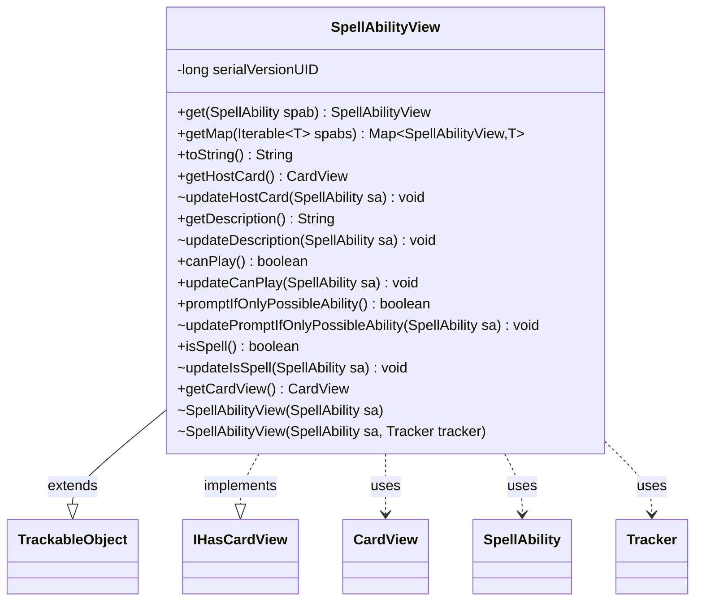

---
aliases:
  - SpellAbilityView
tags:
  - java/class
  - module/forge-game
  - pkg/forge/game/spellability
fqn: forge.game.spellability.SpellAbilityView
package: forge.game.spellability
module: forge-game
kind: Class
---

# SpellAbilityView

**Package:** `forge.game.spellability`   **Module:** `forge-game`   **Kind:** Class



## Relationships
**Extends:**
- [[forge.trackable.TrackableObject|TrackableObject]]
**Implements:**
- [[forge.game.card.IHasCardView|IHasCardView]]
**Uses:**
- [[forge.game.card.CardView|CardView]]
- [[forge.game.spellability.SpellAbility|SpellAbility]]
- [[forge.trackable.Tracker|Tracker]]

## Design Description

SpellAbilityView is a read-only, client-facing snapshot of a `SpellAbility`, exposing display-oriented properties—host card, description, playability, spell status, and the prompt-if-only-possible flag—without leaking the underlying game-logic object to the UI. As a `TrackableObject` subclass, it stores these values through `TrackableProperty` keys so changes can be tracked and synchronized incrementally to remote views, and its paired getter/`update` methods let the engine refresh individual fields on demand. By implementing `IHasCardView`, it advertises an associated `CardView` (its host card) to view consumers.

The class is constructed only from a `SpellAbility` and shares that ability's id and game `Tracker`, deriving its tracker defensively when the host card or game is absent. The static `get` and `getMap` helpers funnel access through `SpellAbility.getView()`, and a deliberate omission of `updateIsSpell` during construction—deferred to lazy initialization—avoids touching not-yet-initialized subclasses such as `WrappedAbility`.

## Source
`forge-game/src/main/java/forge/game/spellability/SpellAbilityView.java`

```java
package forge.game.spellability;

import java.util.Map;

import com.google.common.collect.Maps;

import forge.game.card.CardView;
import forge.game.card.IHasCardView;
import forge.trackable.TrackableObject;
import forge.trackable.TrackableProperty;
import forge.trackable.Tracker;

public class SpellAbilityView extends TrackableObject implements IHasCardView {
    private static final long serialVersionUID = 2514234930798754769L;

    public static SpellAbilityView get(SpellAbility spab) {
        return spab == null ? null : spab.getView();
    }

    public static <T extends SpellAbility>  Map<SpellAbilityView, T> getMap(Iterable<T> spabs) {
        Map<SpellAbilityView, T> spellViewCache = Maps.newLinkedHashMap();
        for (T spellAbility : spabs) {
            spellViewCache.put(spellAbility.getView(), spellAbility);
        }
        return spellViewCache;
    }

    SpellAbilityView(final SpellAbility sa) {
        this(sa, sa.getHostCard() == null || sa.getHostCard().getGame() == null ? null : sa.getHostCard().getGame().getTracker());
    }
    SpellAbilityView(final SpellAbility sa, Tracker tracker) {
        super(sa.getId(), tracker);
        updateHostCard(sa);
        updateDescription(sa);
        updatePromptIfOnlyPossibleAbility(sa);
        // Note: updateIsSpell NOT called
        // here because subclasses (e.g. WrappedAbility) may not be fully initialized yet
        // during super() construction. These are updated lazily in SpellAbility.getView().
    }

    @Override
    public String toString() {
        return this.getDescription();
    }

    public CardView getHostCard() {
        return get(TrackableProperty.HostCard);
    }
    void updateHostCard(SpellAbility sa) {
        set(TrackableProperty.HostCard, CardView.get(sa.getHostCard()));
    }

    public String getDescription() {
        return get(TrackableProperty.Description);
    }
    void updateDescription(SpellAbility sa) {
        set(TrackableProperty.Description, sa.toUnsuppressedString());
    }

    public boolean canPlay() {
        return get(TrackableProperty.CanPlay);
    }
    public void updateCanPlay(SpellAbility sa) {
        set(TrackableProperty.CanPlay, sa.canPlay(true));
    }

    public boolean promptIfOnlyPossibleAbility() {
        return get(TrackableProperty.PromptIfOnlyPossibleAbility);
    }
    void updatePromptIfOnlyPossibleAbility(SpellAbility sa) {
        set(TrackableProperty.PromptIfOnlyPossibleAbility, sa.promptIfOnlyPossibleAbility());
    }

    public boolean isSpell() {
        return get(TrackableProperty.SA_IsSpell);
    }
    void updateIsSpell(SpellAbility sa) {
        set(TrackableProperty.SA_IsSpell, sa.isSpell());
    }

    @Override
    public CardView getCardView() {
        return getHostCard();
    }
}
```

## Python
`forge/game/spellability/SpellAbilityView.py`

```python
from forge.game.card.CardView import CardView
from forge.game.card.IHasCardView import IHasCardView
from forge.game.spellability.SpellAbility import SpellAbility
from forge.trackable.TrackableObject import TrackableObject
from forge.trackable.TrackableProperty import TrackableProperty
from forge.trackable.Tracker import Tracker


class SpellAbilityView(TrackableObject, IHasCardView):
    serialVersionUID = 2514234930798754769

    @staticmethod
    def get(spab):
        return None if spab is None else spab.getView()

    @staticmethod
    def getMap(spabs):
        spellViewCache = {}
        for spellAbility in spabs:
            spellViewCache[spellAbility.getView()] = spellAbility
        return spellViewCache

    def __init__(self, sa, tracker=...):
        if tracker is ...:
            tracker = None if sa.getHostCard() is None or sa.getHostCard().getGame() is None else sa.getHostCard().getGame().getTracker()
        super().__init__(sa.getId(), tracker)
        self.updateHostCard(sa)
        self.updateDescription(sa)
        self.updatePromptIfOnlyPossibleAbility(sa)
        # Note: updateIsSpell NOT called
        # here because subclasses (e.g. WrappedAbility) may not be fully initialized yet
        # during super() construction. These are updated lazily in SpellAbility.getView().

    def toString(self):
        return self.getDescription()

    def getHostCard(self):
        return self.get(TrackableProperty.HostCard)

    def updateHostCard(self, sa):
        self.set(TrackableProperty.HostCard, CardView.get(sa.getHostCard()))

    def getDescription(self):
        return self.get(TrackableProperty.Description)

    def updateDescription(self, sa):
        self.set(TrackableProperty.Description, sa.toUnsuppressedString())

    def canPlay(self):
        return self.get(TrackableProperty.CanPlay)

    def updateCanPlay(self, sa):
        self.set(TrackableProperty.CanPlay, sa.canPlay(True))

    def promptIfOnlyPossibleAbility(self):
        return self.get(TrackableProperty.PromptIfOnlyPossibleAbility)

    def updatePromptIfOnlyPossibleAbility(self, sa):
        self.set(TrackableProperty.PromptIfOnlyPossibleAbility, sa.promptIfOnlyPossibleAbility())

    def isSpell(self):
        return self.get(TrackableProperty.SA_IsSpell)

    def updateIsSpell(self, sa):
        self.set(TrackableProperty.SA_IsSpell, sa.isSpell())

    def getCardView(self):
        return self.getHostCard()
```
