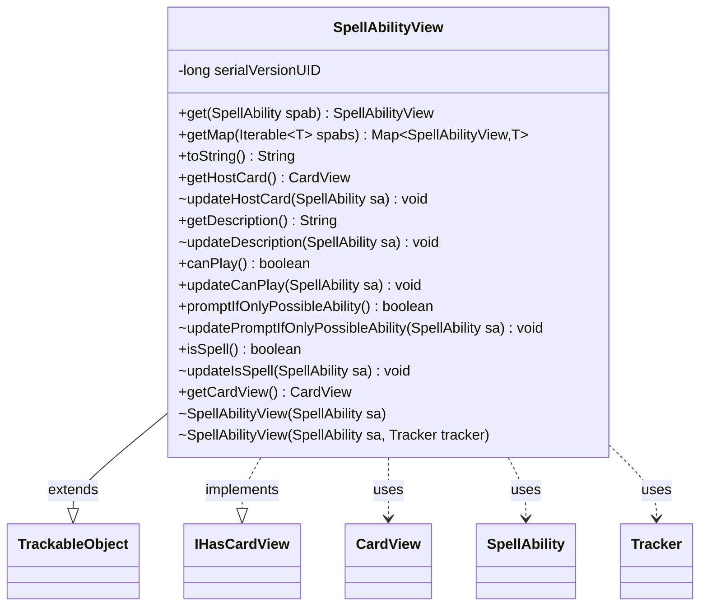

---
aliases:
  - SpellAbilityView
tags:
  - java/class
  - module/forge-game
  - pkg/forge/game/spellability
fqn: forge.game.spellability.SpellAbilityView
package: forge.game.spellability
module: forge-game
kind: Class
---

# SpellAbilityView

**Package:** `forge.game.spellability` &nbsp; **Module:** `forge-game` &nbsp; **Kind:** Class



## Relationships
**Extends:**
- [[forge.trackable.TrackableObject|TrackableObject]]
**Implements:**
- [[forge.game.card.IHasCardView|IHasCardView]]
**Uses:**
- [[forge.game.card.CardView|CardView]]
- [[forge.game.spellability.SpellAbility|SpellAbility]]
- [[forge.trackable.Tracker|Tracker]]

## Source
`forge-game/src/main/java/forge/game/spellability/SpellAbilityView.java`

```java
package forge.game.spellability;

import java.util.Map;

import com.google.common.collect.Maps;

import forge.game.card.CardView;
import forge.game.card.IHasCardView;
import forge.trackable.TrackableObject;
import forge.trackable.TrackableProperty;
import forge.trackable.Tracker;

public class SpellAbilityView extends TrackableObject implements IHasCardView {
    private static final long serialVersionUID = 2514234930798754769L;

    public static SpellAbilityView get(SpellAbility spab) {
        return spab == null ? null : spab.getView();
    }

    public static <T extends SpellAbility>  Map<SpellAbilityView, T> getMap(Iterable<T> spabs) {
        Map<SpellAbilityView, T> spellViewCache = Maps.newLinkedHashMap();
        for (T spellAbility : spabs) {
            spellViewCache.put(spellAbility.getView(), spellAbility);
        }
        return spellViewCache;
    }

    SpellAbilityView(final SpellAbility sa) {
        this(sa, sa.getHostCard() == null || sa.getHostCard().getGame() == null ? null : sa.getHostCard().getGame().getTracker());
    }
    SpellAbilityView(final SpellAbility sa, Tracker tracker) {
        super(sa.getId(), tracker);
        updateHostCard(sa);
        updateDescription(sa);
        updatePromptIfOnlyPossibleAbility(sa);
        // Note: updateIsSpell NOT called
        // here because subclasses (e.g. WrappedAbility) may not be fully initialized yet
        // during super() construction. These are updated lazily in SpellAbility.getView().
    }

    @Override
    public String toString() {
        return this.getDescription();
    }

    public CardView getHostCard() {
        return get(TrackableProperty.HostCard);
    }
    void updateHostCard(SpellAbility sa) {
        set(TrackableProperty.HostCard, CardView.get(sa.getHostCard()));
    }

    public String getDescription() {
        return get(TrackableProperty.Description);
    }
    void updateDescription(SpellAbility sa) {
        set(TrackableProperty.Description, sa.toUnsuppressedString());
    }

    public boolean canPlay() {
        return get(TrackableProperty.CanPlay);
    }
    public void updateCanPlay(SpellAbility sa) {
        set(TrackableProperty.CanPlay, sa.canPlay(true));
    }

    public boolean promptIfOnlyPossibleAbility() {
        return get(TrackableProperty.PromptIfOnlyPossibleAbility);
    }
    void updatePromptIfOnlyPossibleAbility(SpellAbility sa) {
        set(TrackableProperty.PromptIfOnlyPossibleAbility, sa.promptIfOnlyPossibleAbility());
    }

    public boolean isSpell() {
        return get(TrackableProperty.SA_IsSpell);
    }
    void updateIsSpell(SpellAbility sa) {
        set(TrackableProperty.SA_IsSpell, sa.isSpell());
    }

    @Override
    public CardView getCardView() {
        return getHostCard();
    }
}
```
