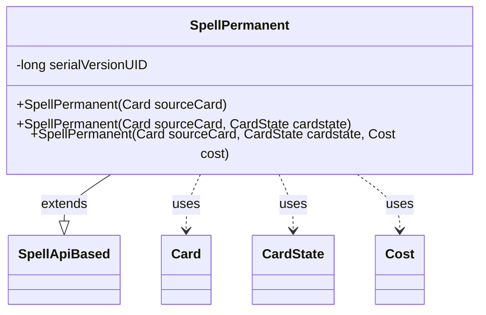

---
aliases:
  - SpellPermanent
tags:
  - java/class
  - module/forge-game
  - pkg/forge/game/spellability
fqn: forge.game.spellability.SpellPermanent
package: forge.game.spellability
module: forge-game
kind: Class
---

# SpellPermanent

**Package:** `forge.game.spellability`   **Module:** `forge-game`   **Kind:** Class



## Relationships
**Extends:**
- [[forge.game.ability.SpellApiBased|SpellApiBased]]
**Uses:**
- [[forge.game.card.Card|Card]]
- [[forge.game.card.CardState|CardState]]
- [[forge.game.cost.Cost|Cost]]

## Design Description

Spell that represents casting a permanent card—lands, creatures, artifacts, enchantments, and planeswalkers—onto the battlefield. As a concrete extension of `SpellApiBased`, it wires a permanent card into the engine's API-driven ability framework rather than implementing bespoke resolution logic, delegating actual resolution to the inherited API mechanism.

The constructors progressively default the spell's parameters: from a `Card` alone it derives the current `CardState` and builds a `Cost` from the card's mana cost, ultimately funneling into the full constructor. There it inspects the `CardState`'s type to select the appropriate `ApiType`—`PermanentCreature` or `PermanentNoncreature`—binding the spell to the correct resolution API. It pins the spell to a specific `CardState`, then deliberately clears the stack description and mirrors it into the description, reflecting that a permanent spell carries no rules text of its own on the stack.

## Source
`forge-game/src/main/java/forge/game/spellability/SpellPermanent.java`

```java
/*
 * Forge: Play Magic: the Gathering.
 * Copyright (C) 2011  Forge Team
 *
 * This program is free software: you can redistribute it and/or modify
 * it under the terms of the GNU General Public License as published by
 * the Free Software Foundation, either version 3 of the License, or
 * (at your option) any later version.
 * 
 * This program is distributed in the hope that it will be useful,
 * but WITHOUT ANY WARRANTY; without even the implied warranty of
 * MERCHANTABILITY or FITNESS FOR A PARTICULAR PURPOSE.  See the
 * GNU General Public License for more details.
 * 
 * You should have received a copy of the GNU General Public License
 * along with this program.  If not, see <http://www.gnu.org/licenses/>.
 */
package forge.game.spellability;

import com.google.common.collect.Maps;

import forge.game.ability.ApiType;
import forge.game.ability.SpellApiBased;
import forge.game.card.Card;
import forge.game.card.CardState;
import forge.game.cost.Cost;

/**
 * <p>
 * Spell_Permanent class.
 * </p>
 * 
 * @author Forge
 * @version $Id$
 */
public class SpellPermanent extends SpellApiBased {
    /** Constant <code>serialVersionUID=2413495058630644447L</code>. */
    private static final long serialVersionUID = 2413495058630644447L;

    /**
     * <p>
     * Constructor for Spell_Permanent.
     * </p>
     * 
     * @param sourceCard
     *            a {@link forge.game.card.Card} object.
     */
    public SpellPermanent(final Card sourceCard) {
        this(sourceCard, sourceCard.getCurrentState(), new Cost(sourceCard.getManaCost(), false));
    }
    public SpellPermanent(final Card sourceCard, final CardState cardstate) {
        this(sourceCard, cardstate, new Cost(cardstate.getManaCost(), false));
    }
    public SpellPermanent(final Card sourceCard, final CardState cardstate, final Cost cost) {
        super(cardstate.getType().isCreature() ? ApiType.PermanentCreature : ApiType.PermanentNoncreature, sourceCard,
                cost, null, Maps.newHashMap());

        setCardState(cardstate);

        // reset StackDescription for something with Text
        this.setStackDescription("");
        this.setDescription(this.getStackDescription());
    }

}
```

## Python
`forge/game/spellability/SpellPermanent.py`

```python
from forge.game.ability.ApiType import ApiType
from forge.game.ability.SpellApiBased import SpellApiBased
from forge.game.card.Card import Card
from forge.game.card.CardState import CardState
from forge.game.cost.Cost import Cost


class SpellPermanent(SpellApiBased):
    serialVersionUID = 2413495058630644447

    def __init__(self, sourceCard: Card, cardstate: CardState = None, cost: Cost = None):
        if cardstate is None:
            cardstate = sourceCard.getCurrentState()
            cost = Cost(sourceCard.getManaCost(), False)
        elif cost is None:
            cost = Cost(cardstate.getManaCost(), False)

        super().__init__(
            ApiType.PermanentCreature if cardstate.getType().isCreature() else ApiType.PermanentNoncreature,
            sourceCard,
            cost,
            None,
            {},
        )

        self.setCardState(cardstate)

        # reset StackDescription for something with Text
        self.setStackDescription("")
        self.setDescription(self.getStackDescription())
```
