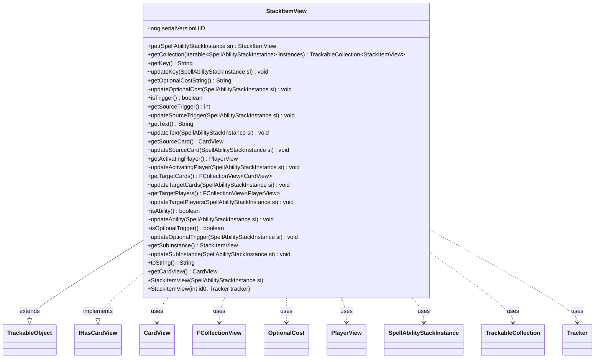

---
aliases:
  - StackItemView
tags:
  - java/class
  - module/forge-game
  - pkg/forge/game/spellability
fqn: forge.game.spellability.StackItemView
package: forge.game.spellability
module: forge-game
kind: Class
---

# StackItemView

**Package:** `forge.game.spellability`   **Module:** `forge-game`   **Kind:** Class



## Relationships
**Extends:**
- [[forge.trackable.TrackableObject|TrackableObject]]
**Implements:**
- [[forge.game.card.IHasCardView|IHasCardView]]
**Uses:**
- [[forge.game.card.CardView|CardView]]
- [[forge.game.player.PlayerView|PlayerView]]
- [[forge.game.spellability.OptionalCost|OptionalCost]]
- [[forge.game.spellability.SpellAbilityStackInstance|SpellAbilityStackInstance]]
- [[forge.trackable.TrackableCollection|TrackableCollection]]
- [[forge.trackable.Tracker|Tracker]]
- [[forge.util.collect.FCollectionView|FCollectionView]]

## Design Description

Backed by Forge's trackable framework, `StackItemView` is a read-only, serializable snapshot of a `SpellAbilityStackInstance`, exposing the data the UI and networked clients need to render an item on the spell stack — its key, descriptive text, source card, activating player, target cards and players, optional-cost annotations, and trigger flags. Extending `TrackableObject`, it stores every field as a `TrackableProperty` so changes propagate through the shared `Tracker`, and it implements `IHasCardView` to surface its source card. Each getter is paired with a package-private `update*` method that pulls fresh values from the originating stack instance, while static `get`/`getCollection` helpers and a deserialization constructor support view creation and network reconstruction. Notably, `updateOptionalCost` translates the instance's `OptionalCost` set into a human-readable label, and `getSubInstance` recursively wraps nested stack items.

## Source
`forge-game/src/main/java/forge/game/spellability/StackItemView.java`

```java
package forge.game.spellability;

import forge.game.card.CardView;
import forge.game.card.IHasCardView;
import forge.game.player.PlayerView;
import forge.trackable.TrackableCollection;
import forge.trackable.TrackableObject;
import forge.trackable.Tracker;
import forge.trackable.TrackableProperty;
import forge.util.collect.FCollectionView;

public class StackItemView extends TrackableObject implements IHasCardView {
    private static final long serialVersionUID = 6733415646691356052L;

    public static StackItemView get(SpellAbilityStackInstance si) {
        return si == null ? null : si.getView();
    }

    public static TrackableCollection<StackItemView> getCollection(Iterable<SpellAbilityStackInstance> instances) {
        if (instances == null) {
            return null;
        }
        TrackableCollection<StackItemView> collection = new TrackableCollection<>();
        for (SpellAbilityStackInstance si : instances) {
            collection.add(si.getView());
        }
        return collection;
    }

    public StackItemView(SpellAbilityStackInstance si) {
        super(si.getId(), si.getSourceCard().getGame().getTracker());
        updateKey(si);
        updateSourceTrigger(si);
        updateText(si);
        updateSourceCard(si);
        updateActivatingPlayer(si);
        updateTargetCards(si);
        updateTargetPlayers(si);
        updateAbility(si);
        updateOptionalTrigger(si);
        updateSubInstance(si);
        updateOptionalCost(si);
    }

    /**
     * Constructor for network deserialization.
     * Creates an empty StackItemView that will be populated via property deserialization.
     */
    public StackItemView(final int id0, final Tracker tracker) {
        super(id0, tracker);
    }

    public String getKey() {
        return get(TrackableProperty.Key);
    }
    void updateKey(SpellAbilityStackInstance si) {
    	set(TrackableProperty.Key, si.getSpellAbility().yieldKey());
    }

    public String getOptionalCostString() {
        return get(TrackableProperty.OptionalCosts);
    }
    void updateOptionalCost(SpellAbilityStackInstance si) {
        String OptionalCostString = "";
        boolean kicked = false;
        boolean entwined = false;
        boolean buyback = false;
        boolean retraced = false;
        boolean jumpstart = false;
        boolean additional = false;
        boolean alternate = false;
        boolean generic = false;

        for (OptionalCost cost : si.getSpellAbility().getOptionalCosts()) {
            if (cost == OptionalCost.Kicker1 || cost == OptionalCost.Kicker2)
                kicked = true;
            if (cost == OptionalCost.Entwine)
                entwined = true;
            if (cost == OptionalCost.Buyback)
                buyback = true;
            if (cost == OptionalCost.Retrace)
                retraced = true;
            if (cost == OptionalCost.Jumpstart)
                jumpstart = true;
            if (cost == OptionalCost.Flash)
                additional = true;
            if (cost == OptionalCost.Generic)
                generic = true;
            if (cost == OptionalCost.AltCost)
                alternate = true;
        }
        if (!alternate) {
            if (kicked && !generic)
                OptionalCostString += "Kicked";
            if (entwined)
                OptionalCostString += OptionalCostString.isEmpty() ? "Entwined" : ", Entwined";
            if (buyback)
                OptionalCostString += OptionalCostString.isEmpty() ? "Buyback" : ", Buyback";
            if (retraced)
                OptionalCostString += OptionalCostString.isEmpty() ? "Retraced" : ", Retraced";
            if (jumpstart)
                OptionalCostString += OptionalCostString.isEmpty() ? "Jumpstart" : ", Jumpstart";
            if (additional || generic)
                OptionalCostString += OptionalCostString.isEmpty() ? "Additional" : ", Additional";
        }
        set(TrackableProperty.OptionalCosts, OptionalCostString);
    }

    public boolean isTrigger() {
        return getSourceTrigger() > 0;
    }

    public int getSourceTrigger() {
        return get(TrackableProperty.SourceTrigger);
    }
    void updateSourceTrigger(SpellAbilityStackInstance si) {
        set(TrackableProperty.SourceTrigger, si.getSpellAbility().getSourceTrigger());
    }

    public String getText() {
        return get(TrackableProperty.Text);
    }
    void updateText(SpellAbilityStackInstance si) {
        set(TrackableProperty.Text, si.getStackDescription());
    }

    public CardView getSourceCard() {
        return get(TrackableProperty.SourceCard);
    }
    void updateSourceCard(SpellAbilityStackInstance si) {
        set(TrackableProperty.SourceCard, CardView.get(si.getSourceCard()));
    }

    public PlayerView getActivatingPlayer() {
        return get(TrackableProperty.ActivatingPlayer);
    }
    void updateActivatingPlayer(SpellAbilityStackInstance si) {
        set(TrackableProperty.ActivatingPlayer, PlayerView.get(si.getActivatingPlayer()));
    }

    public FCollectionView<CardView> getTargetCards() {
        return get(TrackableProperty.TargetCards);
    }
    void updateTargetCards(SpellAbilityStackInstance si) {
        set(TrackableProperty.TargetCards, CardView.getCollection(si.getTargetChoices().getTargetCards()));
    }

    public FCollectionView<PlayerView> getTargetPlayers() {
        return get(TrackableProperty.TargetPlayers);
    }
    void updateTargetPlayers(SpellAbilityStackInstance si) {
        set(TrackableProperty.TargetPlayers, PlayerView.getCollection(si.getTargetChoices().getTargetPlayers()));
    }

    public boolean isAbility() {
        return get(TrackableProperty.Ability);
    }
    void updateAbility(SpellAbilityStackInstance si) {
        set(TrackableProperty.Ability, si.isAbility());
    }

    public boolean isOptionalTrigger() {
        return get(TrackableProperty.OptionalTrigger);
    }
    void updateOptionalTrigger(SpellAbilityStackInstance si) {
        set(TrackableProperty.OptionalTrigger, si.isOptionalTrigger());
    }

    public StackItemView getSubInstance() {
        return get(TrackableProperty.SubInstance);
    }
    void updateSubInstance(SpellAbilityStackInstance si) {
        set(TrackableProperty.SubInstance, si.getSubInstance() == null ? null : new StackItemView(si.getSubInstance()));
    }

    @Override
    public String toString() {
        return getText();
    }

    @Override
    public CardView getCardView() {
        return getSourceCard();
    }
}
```

## Python
`forge/game/spellability/StackItemView.py`

```python
from forge.game.card.CardView import CardView
from forge.game.card.IHasCardView import IHasCardView
from forge.game.player.PlayerView import PlayerView
from forge.game.spellability.OptionalCost import OptionalCost
from forge.game.spellability.SpellAbilityStackInstance import SpellAbilityStackInstance
from forge.trackable.TrackableCollection import TrackableCollection
from forge.trackable.TrackableObject import TrackableObject
from forge.trackable.Tracker import Tracker
from forge.trackable.TrackableProperty import TrackableProperty
from forge.util.collect.FCollectionView import FCollectionView


class StackItemView(TrackableObject, IHasCardView):
    serialVersionUID = 6733415646691356052

    @staticmethod
    def get(si):
        return None if si is None else si.getView()

    @staticmethod
    def getCollection(instances):
        if instances is None:
            return None
        collection = TrackableCollection()
        for si in instances:
            collection.add(si.getView())
        return collection

    def __init__(self, *args):
        if len(args) == 1:
            si = args[0]
            super().__init__(si.getId(), si.getSourceCard().getGame().getTracker())
            self.updateKey(si)
            self.updateSourceTrigger(si)
            self.updateText(si)
            self.updateSourceCard(si)
            self.updateActivatingPlayer(si)
            self.updateTargetCards(si)
            self.updateTargetPlayers(si)
            self.updateAbility(si)
            self.updateOptionalTrigger(si)
            self.updateSubInstance(si)
            self.updateOptionalCost(si)
        else:
            # Constructor for network deserialization.
            # Creates an empty StackItemView that will be populated via property deserialization.
            id0, tracker = args
            super().__init__(id0, tracker)

    def getKey(self):
        return self.get(TrackableProperty.Key)

    def updateKey(self, si):
        self.set(TrackableProperty.Key, si.getSpellAbility().yieldKey())

    def getOptionalCostString(self):
        return self.get(TrackableProperty.OptionalCosts)

    def updateOptionalCost(self, si):
        OptionalCostString = ""
        kicked = False
        entwined = False
        buyback = False
        retraced = False
        jumpstart = False
        additional = False
        alternate = False
        generic = False

        for cost in si.getSpellAbility().getOptionalCosts():
            if cost == OptionalCost.Kicker1 or cost == OptionalCost.Kicker2:
                kicked = True
            if cost == OptionalCost.Entwine:
                entwined = True
            if cost == OptionalCost.Buyback:
                buyback = True
            if cost == OptionalCost.Retrace:
                retraced = True
            if cost == OptionalCost.Jumpstart:
                jumpstart = True
            if cost == OptionalCost.Flash:
                additional = True
            if cost == OptionalCost.Generic:
                generic = True
            if cost == OptionalCost.AltCost:
                alternate = True
        if not alternate:
            if kicked and not generic:
                OptionalCostString += "Kicked"
            if entwined:
                OptionalCostString += "Entwined" if OptionalCostString == "" else ", Entwined"
            if buyback:
                OptionalCostString += "Buyback" if OptionalCostString == "" else ", Buyback"
            if retraced:
                OptionalCostString += "Retraced" if OptionalCostString == "" else ", Retraced"
            if jumpstart:
                OptionalCostString += "Jumpstart" if OptionalCostString == "" else ", Jumpstart"
            if additional or generic:
                OptionalCostString += "Additional" if OptionalCostString == "" else ", Additional"
        self.set(TrackableProperty.OptionalCosts, OptionalCostString)

    def isTrigger(self):
        return self.getSourceTrigger() > 0

    def getSourceTrigger(self):
        return self.get(TrackableProperty.SourceTrigger)

    def updateSourceTrigger(self, si):
        self.set(TrackableProperty.SourceTrigger, si.getSpellAbility().getSourceTrigger())

    def getText(self):
        return self.get(TrackableProperty.Text)

    def updateText(self, si):
        self.set(TrackableProperty.Text, si.getStackDescription())

    def getSourceCard(self):
        return self.get(TrackableProperty.SourceCard)

    def updateSourceCard(self, si):
        self.set(TrackableProperty.SourceCard, CardView.get(si.getSourceCard()))

    def getActivatingPlayer(self):
        return self.get(TrackableProperty.ActivatingPlayer)

    def updateActivatingPlayer(self, si):
        self.set(TrackableProperty.ActivatingPlayer, PlayerView.get(si.getActivatingPlayer()))

    def getTargetCards(self):
        return self.get(TrackableProperty.TargetCards)

    def updateTargetCards(self, si):
        self.set(TrackableProperty.TargetCards, CardView.getCollection(si.getTargetChoices().getTargetCards()))

    def getTargetPlayers(self):
        return self.get(TrackableProperty.TargetPlayers)

    def updateTargetPlayers(self, si):
        self.set(TrackableProperty.TargetPlayers, PlayerView.getCollection(si.getTargetChoices().getTargetPlayers()))

    def isAbility(self):
        return self.get(TrackableProperty.Ability)

    def updateAbility(self, si):
        self.set(TrackableProperty.Ability, si.isAbility())

    def isOptionalTrigger(self):
        return self.get(TrackableProperty.OptionalTrigger)

    def updateOptionalTrigger(self, si):
        self.set(TrackableProperty.OptionalTrigger, si.isOptionalTrigger())

    def getSubInstance(self):
        return self.get(TrackableProperty.SubInstance)

    def updateSubInstance(self, si):
        self.set(TrackableProperty.SubInstance, None if si.getSubInstance() is None else StackItemView(si.getSubInstance()))

    def toString(self):
        return self.getText()

    def getCardView(self):
        return self.getSourceCard()
```
