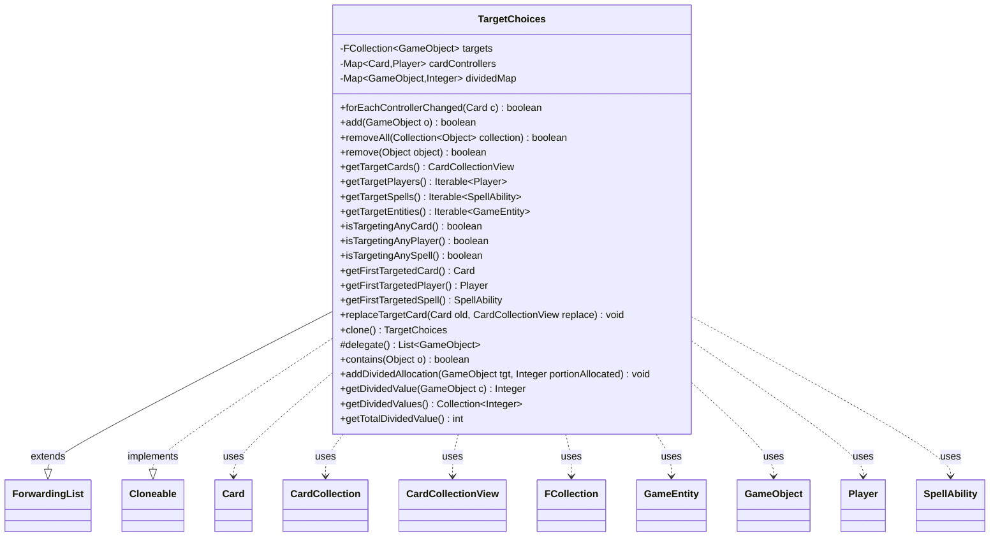

---
aliases:
  - TargetChoices
tags:
  - java/class
  - module/forge-game
  - pkg/forge/game/spellability
fqn: forge.game.spellability.TargetChoices
package: forge.game.spellability
module: forge-game
kind: Class
---

# TargetChoices

**Package:** `forge.game.spellability` &nbsp; **Module:** `forge-game` &nbsp; **Kind:** Class



## Relationships
**Uses:**
- [[forge.game.GameEntity|GameEntity]]
- [[forge.game.GameObject|GameObject]]
- [[forge.game.card.Card|Card]]
- [[forge.game.card.CardCollection|CardCollection]]
- [[forge.game.card.CardCollectionView|CardCollectionView]]
- [[forge.game.player.Player|Player]]
- [[forge.game.spellability.SpellAbility|SpellAbility]]
- [[forge.util.collect.FCollection|FCollection]]

## Source
`forge-game/src/main/java/forge/game/spellability/TargetChoices.java`

```java
/*
 * Forge: Play Magic: the Gathering.
 * Copyright (C) 2011  Forge Team
 *
 * This program is free software: you can redistribute it and/or modify
 * it under the terms of the GNU General Public License as published by
 * the Free Software Foundation, either version 3 of the License, or
 * (at your option) any later version.
 *
 * This program is distributed in the hope that it will be useful,
 * but WITHOUT ANY WARRANTY; without even the implied warranty of
 * MERCHANTABILITY or FITNESS FOR A PARTICULAR PURPOSE.  See the
 * GNU General Public License for more details.
 *
 * You should have received a copy of the GNU General Public License
 * along with this program.  If not, see <http://www.gnu.org/licenses/>.
 */
package forge.game.spellability;

import java.util.Collection;
import java.util.List;
import java.util.Map;

import com.google.common.collect.ForwardingList;
import com.google.common.collect.Iterables;
import com.google.common.collect.Maps;

import forge.game.GameEntity;
import forge.game.GameObject;
import forge.game.card.Card;
import forge.game.card.CardCollection;
import forge.game.card.CardCollectionView;
import forge.game.player.Player;
import forge.util.IterableUtil;
import forge.util.collect.FCollection;

/**
 * <p>
 * Target_Choices class.
 * </p>
 *
 * @author Forge
 * @version $Id$
 */
public class TargetChoices extends ForwardingList<GameObject> implements Cloneable {

    private final FCollection<GameObject> targets = new FCollection<>();

    private final Map<Card, Player> cardControllers = Maps.newHashMap();

    private final Map<GameObject, Integer> dividedMap = Maps.newHashMap();

    public final boolean forEachControllerChanged(Card c) {
        return !c.getController().equals(cardControllers.get(c));
    }

    public final boolean add(final GameObject o) {
        if (o instanceof Player || o instanceof Card || o instanceof SpellAbility) {
            if (o instanceof Card c) {
                cardControllers.put(c, c.getController());
            }
            return super.add(o);
        }
        return false;
    }

    @Override
    public boolean removeAll(Collection<?> collection) {
        boolean result = super.removeAll(collection);
        for (Object e : collection) {
            this.dividedMap.remove(e);
        }
        for (Object e : collection) {
            this.cardControllers.remove(e);
        }
        return result;
    }

    @Override
    public boolean remove(Object object) {
        boolean result = super.remove(object);
        dividedMap.remove(object);
        cardControllers.remove(object);
        return result;
    }

    public final CardCollectionView getTargetCards() {
        return new CardCollection(IterableUtil.filter(targets, Card.class));
    }

    public final Iterable<Player> getTargetPlayers() {
        return IterableUtil.filter(targets, Player.class);
    }

    public final Iterable<SpellAbility> getTargetSpells() {
        return IterableUtil.filter(targets, SpellAbility.class);
    }

    public final Iterable<GameEntity> getTargetEntities() {
        return IterableUtil.filter(targets, GameEntity.class);
    }

    public final boolean isTargetingAnyCard() {
        return targets.stream().anyMatch(Card.class::isInstance);
    }

    public final boolean isTargetingAnyPlayer() {
        return targets.stream().anyMatch(Player.class::isInstance);
    }

    public final boolean isTargetingAnySpell() {
        return targets.stream().anyMatch(SpellAbility.class::isInstance);
    }

    public final Card getFirstTargetedCard() {
        return Iterables.getFirst(getTargetCards(), null);
    }

    public final Player getFirstTargetedPlayer() {
        return Iterables.getFirst(getTargetPlayers(), null);
    }

    public final SpellAbility getFirstTargetedSpell() {
        return Iterables.getFirst(getTargetSpells(), null);
    }

    public final void replaceTargetCard(final Card old, final CardCollectionView replace) {
        targets.remove(old);
        targets.addAll(replace);
    }

    @Override
    public TargetChoices clone() {
        TargetChoices tc = new TargetChoices();
        tc.targets.addAll(targets);
        tc.dividedMap.putAll(dividedMap);
        tc.cardControllers.putAll(cardControllers);
        return tc;
    }
    @Override
    protected List<GameObject> delegate() {
        return targets;
    }

    @Override
    public boolean contains(Object o) {
        if (o instanceof Card) {
            return IterableUtil.any(IterableUtil.filter(targets, Card.class), c -> c.equalsWithGameTimestamp((Card) o));
        }
        return super.contains(o);
    }

    public final void addDividedAllocation(final GameObject tgt, final Integer portionAllocated) {
        this.dividedMap.put(tgt, portionAllocated);
    }
    public Integer getDividedValue(GameObject c) {
        return dividedMap.get(c);
    }

    public Collection<Integer> getDividedValues() {
        return dividedMap.values();
    }

    public int getTotalDividedValue() {
        int result = 0;
        for (Integer i : getDividedValues()) {
            if (i != null)
                result += i;
        }
        return result;
    }
}
```
