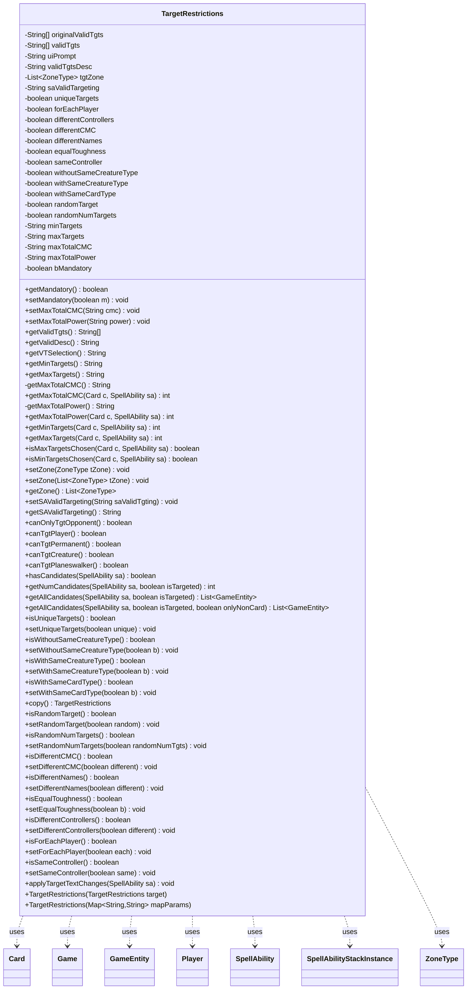

---
aliases:
  - TargetRestrictions
tags:
  - java/class
  - module/forge-game
  - pkg/forge/game/spellability
fqn: forge.game.spellability.TargetRestrictions
package: forge.game.spellability
module: forge-game
kind: Class
---

# TargetRestrictions

**Package:** `forge.game.spellability`   **Module:** `forge-game`   **Kind:** Class



## Relationships
**Uses:**
- [[forge.game.Game|Game]]
- [[forge.game.GameEntity|GameEntity]]
- [[forge.game.card.Card|Card]]
- [[forge.game.player.Player|Player]]
- [[forge.game.spellability.SpellAbility|SpellAbility]]
- [[forge.game.spellability.SpellAbilityStackInstance|SpellAbilityStackInstance]]
- [[forge.game.zone.ZoneType|ZoneType]]

## Design Description

TargetRestrictions is a mutable data holder that captures all the targeting rules attached to a single SpellAbility: which game objects are legal targets (the valid-target string array and description), how many may be chosen (min/max, plus caps on total CMC or power), the zones to search, and a large set of optional constraints such as uniqueness, differing or matching controllers, creature/card-type sameness, equal toughness, random selection, and mandatoriness. It is typically built from a card-script parameter map, and provides a copy constructor and `copy()` for cloning per ability instance.

Beyond storing restrictions, it actively enumerates legality: `hasCandidates`, `getNumCandidates`, and `getAllCandidates` walk the Game's players and cards in the target zones, validating each against the spell's source and activating player, while `canTgt*` helpers classify what kinds of GameEntity the ability may hit. It collaborates with SpellAbility, Card, Player, Game, GameEntity, ZoneType, and SpellAbilityStackInstance, and delegates dynamic numeric/text resolution to AbilityUtils — keeping the rules declarative while deferring evaluation to call time, including applying text-change effects to the valid-target list.

## Source
`forge-game/src/main/java/forge/game/spellability/TargetRestrictions.java`

```java
/*
 * Forge: Play Magic: the Gathering.
 * Copyright (C) 2011  Forge Team
 *
 * This program is free software: you can redistribute it and/or modify
 * it under the terms of the GNU General Public License as published by
 * the Free Software Foundation, either version 3 of the License, or
 * (at your option) any later version.
 * 
 * This program is distributed in the hope that it will be useful,
 * but WITHOUT ANY WARRANTY; without even the implied warranty of
 * MERCHANTABILITY or FITNESS FOR A PARTICULAR PURPOSE.  See the
 * GNU General Public License for more details.
 * 
 * You should have received a copy of the GNU General Public License
 * along with this program.  If not, see <http://www.gnu.org/licenses/>.
 */
package forge.game.spellability;

import java.util.Arrays;
import java.util.List;
import java.util.Map;
import java.util.Objects;

import com.google.common.collect.Lists;

import forge.card.CardType;
import forge.game.Game;
import forge.game.GameEntity;
import forge.game.ability.AbilityUtils;
import forge.game.card.Card;
import forge.game.player.Player;
import forge.game.zone.ZoneType;
import forge.util.Lang;
import forge.util.TextUtil;

/**
 * <p>
 * Target class.
 * </p>
 * 
 * @author Forge
 * @version $Id$
 */
public class TargetRestrictions {
    // Target has two things happening:
    // Targeting restrictions (Creature, Min/Maxm etc) which are true for this
    // What this Object is restricted to targeting
    private String[] originalValidTgts,
        validTgts;
    private String uiPrompt = "";
    private String validTgtsDesc = "";
    private List<ZoneType> tgtZone = Arrays.asList(ZoneType.Battlefield);

    // The target SA of this SA must be targeting a Valid X
    private String saValidTargeting = null;

    // Additional restrictions that may not fit into Valid
    private boolean uniqueTargets = false;
    private boolean forEachPlayer = false;
    private boolean differentControllers = false;
    private boolean differentCMC = false;
    private boolean differentNames = false;
    private boolean equalToughness = false;
    private boolean sameController = false;
    private boolean withoutSameCreatureType = false;
    private boolean withSameCreatureType = false;
    private boolean withSameCardType = false;
    private boolean randomTarget = false;
    private boolean randomNumTargets = false;

    // How many can be targeted?
    private String minTargets;
    private String maxTargets;

    // What's the max total CMC of targets?
    private String maxTotalCMC;

    // What's the max total power of targets?
    private String maxTotalPower;

    // Not sure what's up with Mandatory? Why wouldn't targeting be mandatory?
    private boolean bMandatory = false;

    /**
     * <p>
     * Copy Constructor for Target.
     * </p>
     * 
     * @param target
     *            a {@link forge.game.spellability.TargetRestrictions} object.
     */
    public TargetRestrictions(final TargetRestrictions target) {
        this.uiPrompt = target.getVTSelection();
        this.originalValidTgts = target.getValidTgts();
        this.validTgts = this.originalValidTgts.clone();
        this.minTargets = target.getMinTargets();
        this.maxTargets = target.getMaxTargets();
        this.maxTotalCMC = target.getMaxTotalCMC();
        this.maxTotalPower = target.getMaxTotalPower();
        this.tgtZone = target.getZone();
        this.saValidTargeting = target.getSAValidTargeting();
        this.uniqueTargets = target.isUniqueTargets();
        this.forEachPlayer = target.isForEachPlayer();
        this.differentControllers = target.isDifferentControllers();
        this.differentCMC = target.isDifferentCMC();
        this.equalToughness = target.isEqualToughness();
        this.sameController = target.isSameController();
        this.withoutSameCreatureType = target.isWithoutSameCreatureType();
        this.withSameCreatureType = target.isWithSameCreatureType();
        this.withSameCardType = target.isWithSameCardType();
        this.randomTarget = target.isRandomTarget();
        this.randomNumTargets = target.isRandomNumTargets();
    }

    /**
     * <p>
     * Constructor for Target.
     * </p>
     *
     * @param prompt
     *            a {@link java.lang.String} object.
     * @param valid
     *            an array of {@link java.lang.String} objects.
     * @param min
     *            a {@link java.lang.String} object.
     * @param max
     *            a {@link java.lang.String} object.
     */
    public TargetRestrictions(Map<String, String> mapParams) {
        this.originalValidTgts = mapParams.get("ValidTgts").split(",");
        this.validTgts = this.originalValidTgts.clone();
        this.minTargets = mapParams.getOrDefault("TargetMin", "1");
        this.maxTargets = mapParams.getOrDefault("TargetMax", "1");

        if (mapParams.containsKey("ValidTgtsDesc")) {
            this.validTgtsDesc = mapParams.get("ValidTgtsDesc");
        } else if ("Any".equals(mapParams.get("ValidTgts"))) {
            this.validTgtsDesc = "damage target";
        } else {
            this.validTgtsDesc = Lang.getInstance().buildValidDesc(Arrays.asList(this.validTgts), maxTargets != "1");
        }

        if (mapParams.containsKey("TgtPrompt")) {
            this.uiPrompt = mapParams.get("TgtPrompt");
        } else if ("Any".equals(mapParams.get("ValidTgts"))) {
            this.uiPrompt = "Select any target";
        } else {
            this.uiPrompt = "Select target " + validTgtsDesc;
        }

        if (mapParams.containsKey("TgtZone")) {
            // if Targeting something not in play, this Key should be set
            setZone(ZoneType.listValueOf(mapParams.get("TgtZone")));
        }

        if (mapParams.containsKey("MaxTotalTargetCMC")) {
            // only target cards up to a certain total max CMC
            setMaxTotalCMC(mapParams.get("MaxTotalTargetCMC"));
        }

        if (mapParams.containsKey("MaxTotalTargetPower")) {
            // only target cards up to a certain total max power
            setMaxTotalPower(mapParams.get("MaxTotalTargetPower"));
        }

        // TargetValidTargeting most for Counter: e.g. target spell that targets X.
        if (mapParams.containsKey("TargetValidTargeting")) {
            setSAValidTargeting(mapParams.get("TargetValidTargeting"));
        }

        if (mapParams.containsKey("TargetUnique")) {
            setUniqueTargets(true);
        }
        if (mapParams.containsKey("TargetsWithoutSameCreatureType")) {
            setWithoutSameCreatureType(true);
        }
        if (mapParams.containsKey("TargetsWithSameCreatureType")) {
            setWithSameCreatureType(true);
        }
        if (mapParams.containsKey("TargetsWithSameCardType")) {
            setWithSameCardType(true);
        }
        if (mapParams.containsKey("TargetsWithSameController")) {
            setSameController(true);
        }
        if (mapParams.containsKey("TargetsWithDifferentControllers")) {
            setDifferentControllers(true);
        }
        if (mapParams.containsKey("TargetsForEachPlayer")) {
            setForEachPlayer(true);
        }
        if (mapParams.containsKey("TargetsWithDifferentCMC")) {
            setDifferentCMC(true);
        }
        if (mapParams.containsKey("TargetsWithDifferentNames")) {
            setDifferentNames(true);
        }
        if (mapParams.containsKey("TargetsWithEqualToughness")) {
            setEqualToughness(true);
        }
        if (mapParams.containsKey("TargetsAtRandom")) {
            setRandomTarget(true);
        }
        if (mapParams.containsKey("RandomNumTargets")) {
            setRandomNumTargets(true);
        }
        if (mapParams.containsKey("TargetingPlayer")) {
            setMandatory(true);
        }
    }

    public final boolean getMandatory() {
        return this.bMandatory;
    }
    public final void setMandatory(final boolean m) {
        this.bMandatory = m;
    }

    /**
     * <p>
     * setMaxTotalCMC.
     * </p>
     * 
     * @param cmc
     *            a String.
     */
    public final void setMaxTotalCMC(final String cmc) {
        this.maxTotalCMC = cmc;
    }

    /**
     * <p>
     * setMaxTotalPower.
     * </p>
     *
     * @param power
     *              a String.
     */
    public final void setMaxTotalPower(final String power) {
        this.maxTotalPower = power;
    }

    /**
     * <p>
     * getValidTgts.
     * </p>
     * 
     * @return an array of {@link java.lang.String} objects.
     */
    public final String[] getValidTgts() {
        return this.validTgts;
    }

    public final String getValidDesc() {
        return this.validTgtsDesc;
    }

    /**
     * <p>
     * getVTSelection.
     * </p>
     * 
     * @return a {@link java.lang.String} object.
     */
    public final String getVTSelection() {
        return this.uiPrompt;
    }

    /**
     * Gets the min targets.
     *
     * @return the min targets
     */
    public final String getMinTargets() {
        return this.minTargets;
    }

    /**
     * Gets the max targets.
     *
     * @return the max targets
     */
    public final String getMaxTargets() {
        return this.maxTargets;
    }

    /**
     * Gets the max targets.
     *
     * @return the max targets
     */
    private String getMaxTotalCMC() {
        return this.maxTotalCMC;
    }

    public final int getMaxTotalCMC(final Card c, final SpellAbility sa) {
        return AbilityUtils.calculateAmount(c, this.maxTotalCMC, sa);
    }

    /**
     * Gets the max targets.
     *
     * @return the max targets
     */
    private String getMaxTotalPower() {
        return this.maxTotalPower;
    }

    public final int getMaxTotalPower(final Card c, final SpellAbility sa) {
        return AbilityUtils.calculateAmount(c, this.maxTotalPower, sa);
    }

    /**
     * <p>
     * Getter for the field <code>minTargets</code>.
     * </p>
     * 
     * @param c
     *            a {@link forge.game.card.Card} object.
     * @param sa
     *            a {@link forge.game.spellability.SpellAbility} object.
     * @return a int.
     */
    public final int getMinTargets(final Card c, final SpellAbility sa) {
        return AbilityUtils.calculateAmount(c, this.minTargets, sa);
    }

    /**
     * <p>
     * Getter for the field <code>maxTargets</code>.
     * </p>
     * 
     * @param c
     *            a {@link forge.game.card.Card} object.
     * @param sa
     *            a {@link forge.game.spellability.SpellAbility} object.
     * @return a int.
     */
    public final int getMaxTargets(final Card c, final SpellAbility sa) {
        return AbilityUtils.calculateAmount(c, this.maxTargets, sa);
    }

    /**
     * <p>
     * isMaxTargetsChosen.
     * </p>
     * 
     * @param c
     *            a {@link forge.game.card.Card} object.
     * @param sa
     *            a {@link forge.game.spellability.SpellAbility} object.
     * @return a boolean.
     */
    public final boolean isMaxTargetsChosen(final Card c, final SpellAbility sa) {
        return this.getMaxTargets(c, sa) == sa.getTargets().size();
    }

    /**
     * <p>
     * isMinTargetsChosen.
     * </p>
     * 
     * @param c
     *            a {@link forge.game.card.Card} object.
     * @param sa
     *            a {@link forge.game.spellability.SpellAbility} object.
     * @return a boolean.
     */
    public final boolean isMinTargetsChosen(final Card c, final SpellAbility sa) {
        int min = getMinTargets(c, sa);
        if (min == 0 || (sa.isDividedAsYouChoose() && Objects.requireNonNullElse(sa.getDividedValue(), 0) == 0)) {
            return true;
        }
        return min <= sa.getTargets().size();
    }

    /**
     * <p>
     * setZone.
     * </p>
     * 
     * @param tZone
     *            a {@link java.lang.String} object.
     */
    public final void setZone(final ZoneType tZone) {
        this.tgtZone = Arrays.asList(tZone);
    }

    /**
     * Sets the zone.
     * 
     * @param tZone
     *            the new zone
     */
    public final void setZone(final List<ZoneType> tZone) {
        this.tgtZone = tZone;
    }

    /**
     * <p>
     * getZone.
     * </p>
     * 
     * @return a {@link java.lang.String} object.
     */
    public final List<ZoneType> getZone() {
        return this.tgtZone;
    }

    /**
     * <p>
     * setSAValidTargeting.
     * </p>
     * 
     * @param saValidTgting
     *            a {@link java.lang.String} object.
     */
    public final void setSAValidTargeting(final String saValidTgting) {
        this.saValidTargeting = saValidTgting;
    }

    /**
     * <p>
     * getSAValidTargeting.
     * </p>
     * 
     * @return a {@link java.lang.String} object.
     */
    public final String getSAValidTargeting() {
        return this.saValidTargeting;
    }

    /**
     * <p>
     * canOnlyTgtOpponent.
     * </p>
     * 
     * @return a boolean.
     */
    public final boolean canOnlyTgtOpponent() {
        boolean player = false;
        boolean opponent = false;
        for (final String s : this.validTgts) {
            if (s.startsWith("Opponent")) {
                opponent = true;
            } else if (s.startsWith("Player")) {
                player = true;
            }
        }
        return opponent && !player;
    }

    public final boolean canTgtPlayer() {
        for (final String s : this.validTgts) {
            if (s.startsWith("Player") || s.startsWith("Opponent") || s.startsWith("Any")) {
                return true;
            }
        }
        return false;
    }

    public final boolean canTgtPermanent() {
        for (final String s : this.validTgts) {
            if (s.contains("Permanent")) {
                return true;
            }
        }
        return false;
    }

    public final boolean canTgtCreature() {
        for (final String s : this.validTgts) {
            // TODO check IsCommander when in that variant
            if ((s.contains("Creature") || s.startsWith("Permanent") || s.startsWith("Any"))
                    && !s.contains("nonCreature")) {
                return true;
            }
            String[] tgtParams = TextUtil.split(s, '.');
            for (String param : tgtParams) {
                if (CardType.isACreatureType(param)) {
                    return true;
                }
            }
        }
        return false;
    }

    public final boolean canTgtPlaneswalker() {
        for (final String s : this.validTgts) {
            if (s.startsWith("Planeswalker") || s.startsWith("Any")) {
                return true;
            }
        }
        return false;
    }

    /**
     * <p>
     * hasCandidates.
     * </p>
     * 
     * @param sa
     *            the sa
     * @return a boolean.
     */
    public final boolean hasCandidates(final SpellAbility sa) {
        final Card srcCard = sa.getHostCard(); // should there be OrginalHost at any moment?
        final Game game = srcCard.getGame();

        this.applyTargetTextChanges(sa);

        for (Player player : game.getPlayers()) {
            if (!player.isValid(this.validTgts, sa.getActivatingPlayer(), srcCard, sa)) {
                continue;
            }
            if (!sa.canTarget(player)) {
                continue;
            }
            if (sa.getTargets().contains(player)) {
                continue;
            }
            return true;
        }

        if (this.tgtZone.contains(ZoneType.Stack)) {
            // Stack Zone targets are considered later
            return true;
        }
        for (final Card c : game.getCardsIn(this.tgtZone)) {
            if (!c.isValid(this.validTgts, sa.getActivatingPlayer(), srcCard, sa)) {
                continue;
            }
            if (!sa.canTarget(c)) {
                continue;
            }
            if (sa.getTargets().contains(c)) {
                continue;
            }
            return true;
        }

        return false;
    }

    /**
     * <p>
     * getNumCandidates.
     * </p>
     * 
     * @param sa
     *            the sa
     * @param isTargeted
     *            Check Valid Candidates and Targeting
     * @return a int.
     */
    public final int getNumCandidates(final SpellAbility sa, final boolean isTargeted) {
        int num = 0;
        if (this.tgtZone.contains(ZoneType.Stack)) {
            for (final SpellAbilityStackInstance si : sa.getHostCard().getGame().getStack()) {
                SpellAbility abilityOnStack = si.getSpellAbility();
                if (sa.canTargetSpellAbility(abilityOnStack)) {
                    num++;
                }
            }
        }
        // TODO this may count some SA twice
        return num + getAllCandidates(sa, isTargeted).size();
    }

    public final List<GameEntity> getAllCandidates(final SpellAbility sa, final boolean isTargeted) {
        return getAllCandidates(sa, isTargeted, false);
    }

    public final List<GameEntity> getAllCandidates(final SpellAbility sa, final boolean isTargeted, final boolean onlyNonCard) {
        final Game game = sa.getActivatingPlayer().getGame();
        final List<GameEntity> candidates = Lists.newArrayList();
        for (Player player : game.getPlayers()) {
            if (sa.canTarget(player)) {
                candidates.add(player);
            }
        }

        this.applyTargetTextChanges(sa);

        if (onlyNonCard) {
            return candidates;
        }

        final Card srcCard = sa.getHostCard(); // should there be OrginalHost at any moment?

        for (final Card c : game.getCardsIn(this.tgtZone)) {
            if (c.isValid(this.validTgts, sa.getActivatingPlayer(), srcCard, sa)
                    && (!isTargeted || sa.canTarget(c))
                    && !sa.getTargets().contains(c)) {
                candidates.add(c);
            }
        }

        return candidates;
    }

    public final boolean isUniqueTargets() {
        return this.uniqueTargets;
    }
    public final void setUniqueTargets(final boolean unique) {
        this.uniqueTargets = unique;
    }
    public boolean isWithoutSameCreatureType() {
        return withoutSameCreatureType;
    }
    public void setWithoutSameCreatureType(boolean b) {
        this.withoutSameCreatureType = b;
    }
    public boolean isWithSameCreatureType() {
        return withSameCreatureType;
    }
    public void setWithSameCreatureType(boolean b) {
        this.withSameCreatureType = b;
    }
    public boolean isWithSameCardType() {
        return withSameCardType;
    }
    public void setWithSameCardType(boolean b) {
        this.withSameCardType = b;
    }

    /**
     * <p>
     * copy.
     * </p>
     * 
     * @return a {@link forge.game.spellability.TargetRestrictions} object.
     */
    public TargetRestrictions copy() {
        TargetRestrictions clone = null;
        try {
            clone = (TargetRestrictions) this.clone();
        } catch (final CloneNotSupportedException e) {
            System.err.println(e);
        }
        return clone;
    }

    /**
     * @return the randomTarget
     */
    public boolean isRandomTarget() {
        return randomTarget;
    }

    /**
     * @param random the randomTarget to set
     */
    public void setRandomTarget(boolean random) {
        this.randomTarget = random;
    }

    /**
     * @return the randomNumTargets
     */
    public boolean isRandomNumTargets() {
        return randomNumTargets;
    }

    /**
     * @param randomNumTgts the randomNumTarget to set
     */
    public void setRandomNumTargets(boolean randomNumTgts) {
        this.randomNumTargets = randomNumTgts;
    }

    /**
     * @return the differentCMC
     */
    public boolean isDifferentCMC() {
        return differentCMC;
    }

    /**
     * @param different the differentCMC to set
     */
    public void setDifferentCMC(boolean different) {
        this.differentCMC = different;
    }

    public boolean isDifferentNames() {
        return differentNames;
    }
    public void setDifferentNames(boolean different) {
        this.differentNames = different;
    }

    /**
     * @return the equalToughness
     */
    public boolean isEqualToughness() {
        return equalToughness;
    }

    /**
     * @param b the equalToughness to set
     */
    public void setEqualToughness(boolean b) {
        this.equalToughness = b;
    }

    /**
     * @return the differentControllers
     */
    public boolean isDifferentControllers() {
        return differentControllers;
    }

    /**
     * @param different the differentControllers to set
     */
    public void setDifferentControllers(boolean different) {
        this.differentControllers = different;
    }

    public boolean isForEachPlayer() {
        return forEachPlayer;
    }
    public void setForEachPlayer(boolean each) {
        this.forEachPlayer = each;
    }

    /**
     * Checks if is same controller.
     * 
     * @return true, if it targets same controller
     */
    public final boolean isSameController() {
        return this.sameController;
    }

    /**
     * Sets the same controller.
     * 
     * @param same
     *            the new unique targets
     */
    public final void setSameController(final boolean same) {
        this.sameController = same;
    }

    public final void applyTargetTextChanges(final SpellAbility sa) {
        for (int i = 0; i < validTgts.length; i++) {
            validTgts[i] = AbilityUtils.applyAbilityTextChangeEffects(originalValidTgts[i], sa);
        }
    }
}
```

## Python
`forge/game/spellability/TargetRestrictions.py`

```python
from forge.card.CardType import CardType
from forge.game.Game import Game
from forge.game.GameEntity import GameEntity
from forge.game.ability.AbilityUtils import AbilityUtils
from forge.game.card.Card import Card
from forge.game.player.Player import Player
from forge.game.zone.ZoneType import ZoneType
from forge.util.Lang import Lang
from forge.util.TextUtil import TextUtil
from forge.game.spellability.SpellAbility import SpellAbility
from forge.game.spellability.SpellAbilityStackInstance import SpellAbilityStackInstance

import copy as _copy


class TargetRestrictions:
    # Target has two things happening:
    # Targeting restrictions (Creature, Min/Maxm etc) which are true for this
    # What this Object is restricted to targeting

    def __init__(self, arg):
        # Default field values
        self.originalValidTgts = None
        self.validTgts = None
        self.uiPrompt = ""
        self.validTgtsDesc = ""
        self.tgtZone = [ZoneType.Battlefield]

        # The target SA of this SA must be targeting a Valid X
        self.saValidTargeting = None

        # Additional restrictions that may not fit into Valid
        self.uniqueTargets = False
        self.forEachPlayer = False
        self.differentControllers = False
        self.differentCMC = False
        self.differentNames = False
        self.equalToughness = False
        self.sameController = False
        self.withoutSameCreatureType = False
        self.withSameCreatureType = False
        self.withSameCardType = False
        self.randomTarget = False
        self.randomNumTargets = False

        # How many can be targeted?
        self.minTargets = None
        self.maxTargets = None

        # What's the max total CMC of targets?
        self.maxTotalCMC = None

        # What's the max total power of targets?
        self.maxTotalPower = None

        # Not sure what's up with Mandatory? Why wouldn't targeting be mandatory?
        self.bMandatory = False

        if isinstance(arg, TargetRestrictions):
            self._init_from_target(arg)
        else:
            self._init_from_map(arg)

    def _init_from_target(self, target):
        self.uiPrompt = target.getVTSelection()
        self.originalValidTgts = target.getValidTgts()
        self.validTgts = list(self.originalValidTgts)
        self.minTargets = target.getMinTargets()
        self.maxTargets = target.getMaxTargets()
        self.maxTotalCMC = target._getMaxTotalCMC()
        self.maxTotalPower = target._getMaxTotalPower()
        self.tgtZone = target.getZone()
        self.saValidTargeting = target.getSAValidTargeting()
        self.uniqueTargets = target.isUniqueTargets()
        self.forEachPlayer = target.isForEachPlayer()
        self.differentControllers = target.isDifferentControllers()
        self.differentCMC = target.isDifferentCMC()
        self.equalToughness = target.isEqualToughness()
        self.sameController = target.isSameController()
        self.withoutSameCreatureType = target.isWithoutSameCreatureType()
        self.withSameCreatureType = target.isWithSameCreatureType()
        self.withSameCardType = target.isWithSameCardType()
        self.randomTarget = target.isRandomTarget()
        self.randomNumTargets = target.isRandomNumTargets()

    def _init_from_map(self, mapParams):
        self.originalValidTgts = mapParams.get("ValidTgts").split(",")
        self.validTgts = list(self.originalValidTgts)
        self.minTargets = mapParams.get("TargetMin", "1")
        self.maxTargets = mapParams.get("TargetMax", "1")

        if "ValidTgtsDesc" in mapParams:
            self.validTgtsDesc = mapParams.get("ValidTgtsDesc")
        elif "Any" == mapParams.get("ValidTgts"):
            self.validTgtsDesc = "damage target"
        else:
            self.validTgtsDesc = Lang.getInstance().buildValidDesc(list(self.validTgts), self.maxTargets != "1")

        if "TgtPrompt" in mapParams:
            self.uiPrompt = mapParams.get("TgtPrompt")
        elif "Any" == mapParams.get("ValidTgts"):
            self.uiPrompt = "Select any target"
        else:
            self.uiPrompt = "Select target " + self.validTgtsDesc

        if "TgtZone" in mapParams:
            # if Targeting something not in play, this Key should be set
            self.setZone(ZoneType.listValueOf(mapParams.get("TgtZone")))

        if "MaxTotalTargetCMC" in mapParams:
            # only target cards up to a certain total max CMC
            self.setMaxTotalCMC(mapParams.get("MaxTotalTargetCMC"))

        if "MaxTotalTargetPower" in mapParams:
            # only target cards up to a certain total max power
            self.setMaxTotalPower(mapParams.get("MaxTotalTargetPower"))

        # TargetValidTargeting most for Counter: e.g. target spell that targets X.
        if "TargetValidTargeting" in mapParams:
            self.setSAValidTargeting(mapParams.get("TargetValidTargeting"))

        if "TargetUnique" in mapParams:
            self.setUniqueTargets(True)
        if "TargetsWithoutSameCreatureType" in mapParams:
            self.setWithoutSameCreatureType(True)
        if "TargetsWithSameCreatureType" in mapParams:
            self.setWithSameCreatureType(True)
        if "TargetsWithSameCardType" in mapParams:
            self.setWithSameCardType(True)
        if "TargetsWithSameController" in mapParams:
            self.setSameController(True)
        if "TargetsWithDifferentControllers" in mapParams:
            self.setDifferentControllers(True)
        if "TargetsForEachPlayer" in mapParams:
            self.setForEachPlayer(True)
        if "TargetsWithDifferentCMC" in mapParams:
            self.setDifferentCMC(True)
        if "TargetsWithDifferentNames" in mapParams:
            self.setDifferentNames(True)
        if "TargetsWithEqualToughness" in mapParams:
            self.setEqualToughness(True)
        if "TargetsAtRandom" in mapParams:
            self.setRandomTarget(True)
        if "RandomNumTargets" in mapParams:
            self.setRandomNumTargets(True)
        if "TargetingPlayer" in mapParams:
            self.setMandatory(True)

    def getMandatory(self) -> bool:
        return self.bMandatory

    def setMandatory(self, m: bool) -> None:
        self.bMandatory = m

    def setMaxTotalCMC(self, cmc: str) -> None:
        self.maxTotalCMC = cmc

    def setMaxTotalPower(self, power: str) -> None:
        self.maxTotalPower = power

    def getValidTgts(self) -> list[str]:
        return self.validTgts

    def getValidDesc(self) -> str:
        return self.validTgtsDesc

    def getVTSelection(self) -> str:
        return self.uiPrompt

    def getMinTargets(self) -> str:
        return self.minTargets

    def getMaxTargets(self) -> str:
        return self.maxTargets

    def _getMaxTotalCMC(self) -> str:
        return self.maxTotalCMC

    def getMaxTotalCMC(self, c: Card, sa: SpellAbility) -> int:
        return AbilityUtils.calculateAmount(c, self.maxTotalCMC, sa)

    def _getMaxTotalPower(self) -> str:
        return self.maxTotalPower

    def getMaxTotalPower(self, c: Card, sa: SpellAbility) -> int:
        return AbilityUtils.calculateAmount(c, self.maxTotalPower, sa)

    def getMinTargets(self, c: Card, sa: SpellAbility) -> int:
        return AbilityUtils.calculateAmount(c, self.minTargets, sa)

    def getMaxTargets(self, c: Card, sa: SpellAbility) -> int:
        return AbilityUtils.calculateAmount(c, self.maxTargets, sa)

    def isMaxTargetsChosen(self, c: Card, sa: SpellAbility) -> bool:
        return self.getMaxTargets(c, sa) == len(sa.getTargets())

    def isMinTargetsChosen(self, c: Card, sa: SpellAbility) -> bool:
        min = self.getMinTargets(c, sa)
        if min == 0 or (sa.isDividedAsYouChoose() and (sa.getDividedValue() if sa.getDividedValue() is not None else 0) == 0):
            return True
        return min <= len(sa.getTargets())

    def setZone(self, tZone) -> None:
        if isinstance(tZone, list):
            self.tgtZone = tZone
        else:
            self.tgtZone = [tZone]

    def getZone(self) -> list[ZoneType]:
        return self.tgtZone

    def setSAValidTargeting(self, saValidTgting: str) -> None:
        self.saValidTargeting = saValidTgting

    def getSAValidTargeting(self) -> str:
        return self.saValidTargeting

    def canOnlyTgtOpponent(self) -> bool:
        player = False
        opponent = False
        for s in self.validTgts:
            if s.startswith("Opponent"):
                opponent = True
            elif s.startswith("Player"):
                player = True
        return opponent and not player

    def canTgtPlayer(self) -> bool:
        for s in self.validTgts:
            if s.startswith("Player") or s.startswith("Opponent") or s.startswith("Any"):
                return True
        return False

    def canTgtPermanent(self) -> bool:
        for s in self.validTgts:
            if "Permanent" in s:
                return True
        return False

    def canTgtCreature(self) -> bool:
        for s in self.validTgts:
            # TODO check IsCommander when in that variant
            if ("Creature" in s or s.startswith("Permanent") or s.startswith("Any")) \
                    and "nonCreature" not in s:
                return True
            tgtParams = TextUtil.split(s, '.')
            for param in tgtParams:
                if CardType.isACreatureType(param):
                    return True
        return False

    def canTgtPlaneswalker(self) -> bool:
        for s in self.validTgts:
            if s.startswith("Planeswalker") or s.startswith("Any"):
                return True
        return False

    def hasCandidates(self, sa: SpellAbility) -> bool:
        srcCard = sa.getHostCard()  # should there be OrginalHost at any moment?
        game = srcCard.getGame()

        self.applyTargetTextChanges(sa)

        for player in game.getPlayers():
            if not player.isValid(self.validTgts, sa.getActivatingPlayer(), srcCard, sa):
                continue
            if not sa.canTarget(player):
                continue
            if player in sa.getTargets():
                continue
            return True

        if ZoneType.Stack in self.tgtZone:
            # Stack Zone targets are considered later
            return True
        for c in game.getCardsIn(self.tgtZone):
            if not c.isValid(self.validTgts, sa.getActivatingPlayer(), srcCard, sa):
                continue
            if not sa.canTarget(c):
                continue
            if c in sa.getTargets():
                continue
            return True

        return False

    def getNumCandidates(self, sa: SpellAbility, isTargeted: bool) -> int:
        num = 0
        if ZoneType.Stack in self.tgtZone:
            for si in sa.getHostCard().getGame().getStack():
                abilityOnStack = si.getSpellAbility()
                if sa.canTargetSpellAbility(abilityOnStack):
                    num += 1
        # TODO this may count some SA twice
        return num + len(self.getAllCandidates(sa, isTargeted))

    def getAllCandidates(self, sa: SpellAbility, isTargeted: bool, onlyNonCard: bool = False) -> list[GameEntity]:
        game = sa.getActivatingPlayer().getGame()
        candidates = []
        for player in game.getPlayers():
            if sa.canTarget(player):
                candidates.append(player)

        self.applyTargetTextChanges(sa)

        if onlyNonCard:
            return candidates

        srcCard = sa.getHostCard()  # should there be OrginalHost at any moment?

        for c in game.getCardsIn(self.tgtZone):
            if c.isValid(self.validTgts, sa.getActivatingPlayer(), srcCard, sa) \
                    and (not isTargeted or sa.canTarget(c)) \
                    and c not in sa.getTargets():
                candidates.append(c)

        return candidates

    def isUniqueTargets(self) -> bool:
        return self.uniqueTargets

    def setUniqueTargets(self, unique: bool) -> None:
        self.uniqueTargets = unique

    def isWithoutSameCreatureType(self) -> bool:
        return self.withoutSameCreatureType

    def setWithoutSameCreatureType(self, b: bool) -> None:
        self.withoutSameCreatureType = b

    def isWithSameCreatureType(self) -> bool:
        return self.withSameCreatureType

    def setWithSameCreatureType(self, b: bool) -> None:
        self.withSameCreatureType = b

    def isWithSameCardType(self) -> bool:
        return self.withSameCardType

    def setWithSameCardType(self, b: bool) -> None:
        self.withSameCardType = b

    def copy(self) -> "TargetRestrictions":
        clone = None
        try:
            clone = _copy.copy(self)
        except Exception as e:
            import sys
            print(e, file=sys.stderr)
        return clone

    def isRandomTarget(self) -> bool:
        return self.randomTarget

    def setRandomTarget(self, random: bool) -> None:
        self.randomTarget = random

    def isRandomNumTargets(self) -> bool:
        return self.randomNumTargets

    def setRandomNumTargets(self, randomNumTgts: bool) -> None:
        self.randomNumTargets = randomNumTgts

    def isDifferentCMC(self) -> bool:
        return self.differentCMC

    def setDifferentCMC(self, different: bool) -> None:
        self.differentCMC = different

    def isDifferentNames(self) -> bool:
        return self.differentNames

    def setDifferentNames(self, different: bool) -> None:
        self.differentNames = different

    def isEqualToughness(self) -> bool:
        return self.equalToughness

    def setEqualToughness(self, b: bool) -> None:
        self.equalToughness = b

    def isDifferentControllers(self) -> bool:
        return self.differentControllers

    def setDifferentControllers(self, different: bool) -> None:
        self.differentControllers = different

    def isForEachPlayer(self) -> bool:
        return self.forEachPlayer

    def setForEachPlayer(self, each: bool) -> None:
        self.forEachPlayer = each

    def isSameController(self) -> bool:
        return self.sameController

    def setSameController(self, same: bool) -> None:
        self.sameController = same

    def applyTargetTextChanges(self, sa: SpellAbility) -> None:
        for i in range(len(self.validTgts)):
            self.validTgts[i] = AbilityUtils.applyAbilityTextChangeEffects(self.originalValidTgts[i], sa)
```
