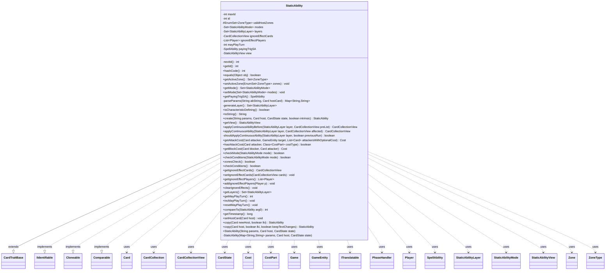

---
aliases:
  - StaticAbility
tags:
  - java/class
  - module/forge-game
  - pkg/forge/game/staticability
fqn: forge.game.staticability.StaticAbility
package: forge.game.staticability
module: forge-game
kind: Class
---

# StaticAbility

**Package:** `forge.game.staticability` &nbsp; **Module:** `forge-game` &nbsp; **Kind:** Class



## Relationships
**Extends:**
- [[forge.game.CardTraitBase|CardTraitBase]]
**Implements:**
- [[forge.game.IIdentifiable|IIdentifiable]]
**Uses:**
- [[forge.game.Game|Game]]
- [[forge.game.GameEntity|GameEntity]]
- [[forge.game.card.Card|Card]]
- [[forge.game.card.CardCollection|CardCollection]]
- [[forge.game.card.CardCollectionView|CardCollectionView]]
- [[forge.game.card.CardState|CardState]]
- [[forge.game.cost.Cost|Cost]]
- [[forge.game.cost.CostPart|CostPart]]
- [[forge.game.phase.PhaseHandler|PhaseHandler]]
- [[forge.game.player.Player|Player]]
- [[forge.game.spellability.SpellAbility|SpellAbility]]
- [[forge.game.staticability.StaticAbilityLayer|StaticAbilityLayer]]
- [[forge.game.staticability.StaticAbilityMode|StaticAbilityMode]]
- [[forge.game.staticability.StaticAbilityView|StaticAbilityView]]
- [[forge.game.zone.Zone|Zone]]
- [[forge.game.zone.ZoneType|ZoneType]]
- [[forge.util.ITranslatable|ITranslatable]]

## Design Description

StaticAbility models a continuous or rules-modifying static effect attached to a Magic card, the engine's representation of "as long as..." abilities that alter the game state without using the stack. Extending CardTraitBase, it inherits host-card and parameter-map machinery while adding identity (IIdentifiable, with a static id counter), ordering (Comparable, by host then id), and Cloneable-based copying for last-known-information and text-change handling. It parses its dollar-separated parameter string into modes (StaticAbilityMode) and the continuous-effect layers (StaticAbilityLayer) it touches, derived from which parameters are present per rule 613's layer system. checkConditions and zonesCheck gate applicability against zone, phase, controller state, and SVar comparisons, while attack/block cost queries and continuous application delegate to companion helpers (StaticAbilityContinuous, StaticAbilityCantAttackBlock). A lazily built StaticAbilityView supplies UI state, keeping presentation concerns separate from rules evaluation.

## Source
`forge-game/src/main/java/forge/game/staticability/StaticAbility.java`

```java
/*
 * Forge: Play Magic: the Gathering.
 * Copyright (C) 2011  Forge Team
 *
 * This program is free software: you can redistribute it and/or modify
 * it under the terms of the GNU General Public License as published by
 * the Free Software Foundation, either version 3 of the License, or
 * (at your option) any later version.
 *
 * This program is distributed in the hope that it will be useful,
 * but WITHOUT ANY WARRANTY; without even the implied warranty of
 * MERCHANTABILITY or FITNESS FOR A PARTICULAR PURPOSE.  See the
 * GNU General Public License for more details.
 *
 * You should have received a copy of the GNU General Public License
 * along with this program.  If not, see <http://www.gnu.org/licenses/>.
 */
package forge.game.staticability;

import java.util.EnumSet;
import java.util.List;
import java.util.Map;
import java.util.Objects;
import java.util.Set;

import com.google.common.collect.*;

import forge.game.CardTraitBase;
import forge.game.Game;
import forge.game.GameEntity;
import forge.game.GameStage;
import forge.game.IIdentifiable;
import forge.game.ability.AbilityFactory;
import forge.game.ability.AbilityUtils;
import forge.game.card.Card;
import forge.game.card.CardCollection;
import forge.game.card.CardCollectionView;
import forge.game.card.CardLists;
import forge.game.card.CardState;
import forge.game.cost.Cost;
import forge.game.cost.CostPart;
import forge.game.phase.PhaseHandler;
import forge.game.phase.PhaseType;
import forge.game.player.Player;
import forge.game.spellability.SpellAbility;
import forge.game.zone.Zone;
import forge.game.zone.ZoneType;
import forge.util.*;

/**
 * The Class StaticAbility.
 */
public class StaticAbility extends CardTraitBase implements IIdentifiable, Cloneable, Comparable<StaticAbility> {
    private static int maxId = 0;
    private static int nextId() { return ++maxId; }

    private int id;

    protected EnumSet<ZoneType> validHostZones;
    private Set<StaticAbilityMode> modes;
    private Set<StaticAbilityLayer> layers;
    private CardCollectionView ignoreEffectCards = new CardCollection();
    private final List<Player> ignoreEffectPlayers = Lists.newArrayList();
    private int mayPlayTurn = 0;

    private SpellAbility payingTrigSA;
    private StaticAbilityView view = null;

    @Override
    public final int getId() {
        return id;
    }

    @Override
    public int hashCode() {
        return Objects.hash(StaticAbility.class, getId());
    }

    @Override
    public boolean equals(final Object obj) {
        return obj instanceof StaticAbility && this.id == ((StaticAbility) obj).id;
    }

    public Set<ZoneType> getActiveZone() {
        return validHostZones;
    }
    public void setActiveZone(EnumSet<ZoneType> zones) {
        validHostZones = zones;
    }

    public Set<StaticAbilityMode> getMode() {
        return this.modes;
    }
    public void setMode(Set<StaticAbilityMode> modes) {
        this.modes = modes;
    }

    public SpellAbility getPayingTrigSA() {
        // already cached?
        if (payingTrigSA == null && hasParam("Trigger")) {
            payingTrigSA = AbilityFactory.getAbility(getSVar(getParam("Trigger")), getHostCard());
            payingTrigSA.setIntrinsic(true);
        }
        return payingTrigSA;
    }

    /**
     * <p>
     * Getter for the field <code>mapParams</code>.
     * </p>
     *
     * @param abString
     *            a {@link java.lang.String} object.
     * @param hostCard
     *            a {@link forge.game.card.Card} object.
     * @return a {@link java.util.HashMap} object.
     */
    private static Map<String, String> parseParams(final String abString, final Card hostCard) {
        if (!(abString.length() > 0)) {
            throw new RuntimeException("StaticEffectFactory : getAbility -- abString too short in "
                    + hostCard.getName() + ": [" + abString + "]");
        }

        return FileSection.parseToMap(abString, FileSection.DOLLAR_SIGN_KV_SEPARATOR);
    }

    /**
     * Gets the {@link Set} of {@link StaticAbilityLayer}s in which this
     * {@link StaticAbility} is to be applied.
     *
     * @return the applicable layers.
     */
    private Set<StaticAbilityLayer> generateLayer() {
        if (!checkMode(StaticAbilityMode.Continuous)) {
            return EnumSet.noneOf(StaticAbilityLayer.class);
        }

        final Set<StaticAbilityLayer> layers = EnumSet.noneOf(StaticAbilityLayer.class);
        if (hasParam("GainControl")) {
            layers.add(StaticAbilityLayer.CONTROL);
        }

        if (hasParam("ChangeColorWordsTo") || hasParam("GainTextOf") || hasParam("AddNames") ||
                hasParam("SetName") || hasParam("Incorporate") || hasParam("ManaCost")) {
            layers.add(StaticAbilityLayer.TEXT);
        }

        if (hasParam("AddType") || hasParam("RemoveType")
                || hasParam("AddAllCreatureTypes")
                || hasParam("RemoveCardTypes") || hasParam("RemoveSubTypes")
                || hasParam("RemoveSuperTypes") || hasParam("RemoveLandTypes")
                || hasParam("RemoveCreatureTypes") || hasParam("RemoveArtifactTypes")
                || hasParam("RemoveEnchantmentTypes")) {
            layers.add(StaticAbilityLayer.TYPE);
        }

        if (hasParam("AddColor") || hasParam("RemoveColor") || hasParam("SetColor")) {
            layers.add(StaticAbilityLayer.COLOR);
        }

        if (hasParam("RemoveAllAbilities") || hasParam("RemoveNonManaAbilities") || hasParam("GainsAbilitiesOf")
                || hasParam("GainsAbilitiesOfDefined") || hasParam("GainsTriggerAbsOf")
                || hasParam("AddKeyword") || hasParam("AddAbility")
                || hasParam("AddTrigger") || hasParam("AddReplacementEffect")
                || hasParam("AddStaticAbility") || hasParam("AddSVar")
                || hasParam("CantHaveKeyword") || hasParam("ShareRememberedKeywords")
                || hasParam("RemoveKeyword")) {
            layers.add(StaticAbilityLayer.ABILITIES);
        }

        if (hasParam("SetPower") || hasParam("SetToughness")) {
            layers.add(isCharacteristicDefining() ? StaticAbilityLayer.CHARACTERISTIC :
                StaticAbilityLayer.SETPT);
        }
        if (hasParam("AddPower") || hasParam("AddToughness")) {
            layers.add(StaticAbilityLayer.MODIFYPT);
        }

        if (hasParam("AddHiddenKeyword") || hasParam("MayPlay")
                || hasParam("IgnoreEffectCost") || hasParam("Goad") || hasParam("CanBlockAny") || hasParam("CanBlockAmount")
                || hasParam("AdjustLandPlays") || hasParam("ControlVote") || hasParam("AdditionalVote") || hasParam("AdditionalOptionalVote")
                || hasParam("DeclaresAttackers") || hasParam("DeclaresBlockers")) {
            layers.add(StaticAbilityLayer.RULES);
        }

        if (layers.isEmpty()) {
            layers.add(StaticAbilityLayer.RULES);
        }

        return layers;
    }

    public boolean isCharacteristicDefining() {
        return hasParam("CharacteristicDefining");
    }

    /**
     * <p>
     * toString.
     * </p>
     *
     * @return a {@link java.lang.String} object.
     */
    @Override
    public final String toString() {
        if (hasParam("Description") && !this.isSuppressed()) {
            ITranslatable nameSource = getHostName(this);
            String desc = CardTranslation.translateSingleDescriptionText(getParam("Description"), nameSource);
            String translatedName = nameSource.getTranslatedName();
            desc = TextUtil.fastReplace(desc, "CARDNAME", translatedName);
            desc = TextUtil.fastReplace(desc, "NICKNAME", Lang.getInstance().getNickName(translatedName));

            return desc;
        } else {
            return "";
        }
    }

    // main constructor
    /**
     * Instantiates a new static ability.
     *
     * @param params
     *            the params
     * @param host
     *            the host
     */
    public StaticAbility(final String params, final Card host, CardState state) {
        this(parseParams(params, host), host, state);
    }

    public static StaticAbility create(final String params, final Card host, CardState state, boolean intrinsic) {
        StaticAbility st = new StaticAbility(params, host, state);
        st.setIntrinsic(intrinsic);
        return st;
    }

    /**
     * Instantiates a new static ability.
     *
     * @param params
     *            the params
     * @param host
     *            the host
     */
    private StaticAbility(final Map<String, String> params, final Card host, CardState state) {
        this.id = nextId();
        this.originalMapParams.putAll(params);
        this.mapParams.putAll(params);
        this.hostCard = host;
        this.setCardState(state);
        if (hasParam("EffectZone")) {
            setActiveZone(EnumSet.copyOf(ZoneType.listValueOf(getParam("EffectZone"))));
        }
        if (hasParam("Mode")) {
            setMode(StaticAbilityMode.setValueOf(getParam("Mode")));
        }
        this.layers = this.generateLayer();
    }

    public StaticAbilityView getView() {
        if (view == null)
            view = new StaticAbilityView(this);
        else {
            view.updateHostCard(this);
            view.updateDescription(this);
        }
        return view;
    }

    public final CardCollectionView applyContinuousAbilityBefore(final StaticAbilityLayer layer, final CardCollectionView preList) {
        if (!shouldApplyContinuousAbility(layer, false)) {
            return null;
        }
        return StaticAbilityContinuous.applyContinuousAbility(this, layer, preList);
    }

    public final CardCollectionView applyContinuousAbility(final StaticAbilityLayer layer, final CardCollectionView affected) {
        if (!shouldApplyContinuousAbility(layer, true)) {
            return null;
        }
        return StaticAbilityContinuous.applyContinuousAbility(this, affected, layer);
    }

    /**
     * Check whether a continuous ability should be applied.
     *
     * @param layer
     *            the {@link StaticAbilityLayer} under investigation.
     * @param ignoreTempSuppression
     *            whether to ignore temporary suppression of this ability, to be
     *            used when this ability has already begun applying in another
     *            layer and has since been removed from its host card by another
     *            effect (see rule 613.5).
     * @return {@code true} if and only if this is a continuous ability that
     *         affects the specified layer, it's not suppressed, and its
     *         conditions are fulfilled.
     */
    private boolean shouldApplyContinuousAbility(final StaticAbilityLayer layer, final boolean previousRun) {
        return layers.contains(layer) && checkConditions(StaticAbilityMode.Continuous) && ( previousRun ||
                getHostCard().getStaticAbilities().contains(this) ||
                getHostCard().getHiddenStaticAbilities().contains(this));
    }

    public final Cost getAttackCost(final Card attacker, final GameEntity target, final List<Card> attackersWithOptionalCost) {
        if (!checkMode(StaticAbilityMode.CantAttackUnless) && (!checkMode(StaticAbilityMode.OptionalAttackCost) || !attackersWithOptionalCost.contains(attacker))) {
            return null;
        }
        if (!checkConditions()) {
            return null;
        }
        return StaticAbilityCantAttackBlock.getAttackCost(this, attacker, target);
    }

    public final boolean hasAttackCost(final Card attacker, Class<? extends CostPart> costType) {
        if (!checkConditions(StaticAbilityMode.OptionalAttackCost)) {
            return false;
        }
        return StaticAbilityCantAttackBlock.getAttackCost(this, attacker, null).hasSpecificCostType(costType);
    }

    public final Cost getBlockCost(final Card blocker, final Card attacker) {
        if (!checkConditions(StaticAbilityMode.CantBlockUnless)) {
            return null;
        }
        return StaticAbilityCantAttackBlock.getBlockCost(this, blocker, attacker);
    }

    public final boolean checkMode(StaticAbilityMode mode) {
        return this.modes.contains(mode);
    }

    public final boolean checkConditions(StaticAbilityMode mode) {
        return checkMode(mode) && checkConditions();
    }

    public final boolean zonesCheck() {
        if (isSuppressed()) {
            return false;
        }
        if (getHostCard().isPhasedOut()) {
            return false;
        }
        if (!isCharacteristicDefining()) {
            if (this.validHostZones != null) {
                Zone zone = getHostCard().getGame().getZoneOf(getHostCard());
                if (zone == null || !this.validHostZones.contains(zone.getZoneType())) {
                    return false;
                }
            } else if (!getHostCard().isInPlay()) { // default
                return false;
            }
        }
        return true;
    }

    /**
     * Check conditions.
     *
     * @return true, if the static ability is applicable.
     */
    public final boolean checkConditions() {
        final Player controller = getHostCard().getController();
        final Game game = getHostCard().getGame();
        final PhaseHandler ph = game.getPhaseHandler();

        if (!zonesCheck()) {
            return false;
        }

        String condition = getParam("Condition");
        if (null != condition) {
            if (condition.equals("Threshold") && !controller.hasThreshold()) return false;
            if (condition.equals("Hellbent") && !controller.hasHellbent()) return false;
            if (condition.equals("Metalcraft") && !controller.hasMetalcraft()) return false;
            if (condition.equals("Delirium") && !controller.hasDelirium()) return false;
            if (condition.equals("Ferocious") && !controller.hasFerocious()) return false;
            if (condition.equals("Desert") && !controller.hasDesert()) return false;
            if (condition.equals("Blessing") && !controller.hasBlessing()) return false;
            if (condition.equals("Monarch") & !controller.isMonarch()) return false;
            if (condition.equals("Night") & !game.isNight()) return false;
            if (condition.equals("MaxSpeed") && !controller.maxSpeed()) return false;

            if (condition.equals("PlayerTurn")) {
                if (!ph.isPlayerTurn(controller)) {
                    return false;
                }
            } else if (condition.equals("NotPlayerTurn")) {
                if (ph.isPlayerTurn(controller)) {
                    return false;
                }
            } else if (condition.equals("ExtraTurn")) {
                if (!game.getPhaseHandler().getPlayerTurn().isExtraTurn()) {
                    return false;
                }
            } else if (condition.equals("FatefulHour")) {
                if (controller.getLife() > 5) {
                    return false;
                }
            }
        }

        if (hasParam("Phases")) {
            if (!PhaseType.parseRange(getParam("Phases")).contains(ph.getPhase())) {
                return false;
            }
        }

        if (hasParam("PlayerTurn")) {
            List<Player> players = AbilityUtils.getDefinedPlayers(hostCard, getParam("PlayerTurn"), this);
            if (!players.contains(ph.getPlayerTurn())) {
                return false;
            }
        }

        if (hasParam("TopCardOfLibraryIs")) {
            if (controller.getCardsIn(ZoneType.Library).isEmpty()) {
                return false;
            }
            final Card topCard = controller.getCardsIn(ZoneType.Library).get(0);
            if (!topCard.isValid(getParam("TopCardOfLibraryIs").split(","), controller, this.hostCard, this)) {
                return false;
            }
        }

        if (hasParam("IsPresent")) {
            final ZoneType zone = hasParam("PresentZone") ? ZoneType.valueOf(getParam("PresentZone")) : ZoneType.Battlefield;
            final String compare = getParamOrDefault("PresentCompare", "GE1");
            CardCollectionView list = game.getCardsIn(zone);
            final String present = getParam("IsPresent");

            list = CardLists.getValidCards(list, present, controller, hostCard, this);

            int right = 1;
            final String rightString = compare.substring(2);
            right = AbilityUtils.calculateAmount(hostCard, rightString, this);
            final int left = list.size();

            if (!Expressions.compare(left, compare, right)) {
                return false;
            }
        }

        if (hasParam("GameStage")) {
            String[] stageDefs = TextUtil.split(getParam("GameStage"), ',');
            boolean isRelevantStage = false;
            for (String stage : stageDefs) {
                isRelevantStage |= (game.getAge() == GameStage.valueOf(stage));
            }
            return isRelevantStage;
        }

        if (hasParam("ClassLevel")) {
            final int level = this.hostCard.getClassLevel();
            final int levelMin = Integer.parseInt(getParam("ClassLevel"));
            if (level < levelMin) {
                return false;
            }
        }

        if (hasParam("CheckSVar")) {
            final int sVar = AbilityUtils.calculateAmount(this.hostCard, getParam("CheckSVar"), this);
            final String comparator = getParamOrDefault("SVarCompare", "GE1");
            final String svarOperator = comparator.substring(0, 2);
            final String svarOperand = comparator.substring(2);
            final int operandValue = AbilityUtils.calculateAmount(this.hostCard, svarOperand, this);
            if (!Expressions.compare(sVar, svarOperator, operandValue)) {
                return false;
            }
        } else { //no need to check the others
            return true;
        }

        if (hasParam("CheckSecondSVar")) {
            final int sVar = AbilityUtils.calculateAmount(this.hostCard, getParam("CheckSecondSVar"), this);
            final String comparator = getParamOrDefault("SecondSVarCompare", "GE1");
            final String svarOperator = comparator.substring(0, 2);
            final String svarOperand = comparator.substring(2);
            final int operandValue = AbilityUtils.calculateAmount(this.hostCard, svarOperand, this);
            if (!Expressions.compare(sVar, svarOperator, operandValue)) {
                return false;
            }
        } else { //no need to check the others
            return true;
        }

        if (hasParam("CheckThirdSVar")) {
            final int sVar = AbilityUtils.calculateAmount(this.hostCard, getParam("CheckThirdSVar"), this);
            final String comparator = getParamOrDefault("ThirdSVarCompare", "GE1");
            final String svarOperator = comparator.substring(0, 2);
            final String svarOperand = comparator.substring(2);
            final int operandValue = AbilityUtils.calculateAmount(this.hostCard, svarOperand, this);
            if (!Expressions.compare(sVar, svarOperator, operandValue)) {
                return false;
            }
        } else { //no need to check the others
            return true;
        }

        if (hasParam("CheckFourthSVar")) {
            final int sVar = AbilityUtils.calculateAmount(this.hostCard, getParam("CheckFourthSVar"), this);
            final String comparator = getParamOrDefault("FourthSVarCompare", "GE1");
            final String svarOperator = comparator.substring(0, 2);
            final String svarOperand = comparator.substring(2);
            final int operandValue = AbilityUtils.calculateAmount(this.hostCard, svarOperand, this);
            if (!Expressions.compare(sVar, svarOperator, operandValue)) {
                return false;
            }
        }

        return true;
    }

    /**
     * @return the ignoreEffectCards
     */
    public CardCollectionView getIgnoreEffectCards() {
        return ignoreEffectCards;
    }

    /**
     * @param cards the ignoreEffectCards to set
     */
    public void setIgnoreEffectCards(final CardCollectionView cards) {
        ignoreEffectCards = cards;
    }

    /**
     * @return the ignoreEffectPlayers
     */
    public List<Player> getIgnoreEffectPlayers() {
        return ignoreEffectPlayers;
    }

    /**
     * @param p the ignoreEffectPlayers to add
     */
    public void addIgnoreEffectPlayers(final Player p) {
        ignoreEffectPlayers.add(p);
    }

    public void clearIgnoreEffects() {
        ignoreEffectPlayers.clear();
        ignoreEffectCards = new CardCollection();
    }

    /**
     * @return the layer
     */
    public Set<StaticAbilityLayer> getLayers() {
        return layers;
    }

    public int getMayPlayTurn() {
        return mayPlayTurn;
    }

    public void incMayPlayTurn() {
        this.mayPlayTurn++;
    }

    public void resetMayPlayTurn() {
        this.mayPlayTurn = 0;
    }

    @Override
    public int compareTo(StaticAbility arg0) {
        return ComparisonChain.start()
        .compare(getHostCard(),arg0.getHostCard())
        .compare(getId(), arg0.getId())
        .result();
    }

    public long getTimestamp() {
        if (hasParam("Timestamp")) {
            return Long.valueOf(getParam("Timestamp"));
        }
        return getHostCard().getLayerTimestamp();
    }

    @Override
    public void setHostCard(Card host) {
        super.setHostCard(host);
        if (payingTrigSA != null) {
            payingTrigSA.setHostCard(host);
        }
    }

    public final StaticAbility copy(Card newHost, boolean lki) {
        return copy(newHost, lki, false);
    }
    public StaticAbility copy(Card host, final boolean lki, boolean keepTextChanges) {
        StaticAbility clone = null;
        try {
            clone = (StaticAbility) clone();
            clone.id = lki ? id : nextId();

            copyHelper(clone, host, lki || keepTextChanges);

            // reset to force refresh if needed
            clone.payingTrigSA = null;

            if (!lki) {
                clone.mayPlayTurn = 0;
            }

            clone.layers = this.generateLayer();
            if (validHostZones != null) {
                clone.setActiveZone(EnumSet.copyOf(validHostZones));
            }
            if (modes != null) {
                clone.setMode(EnumSet.copyOf(modes));
            }
        } catch (final CloneNotSupportedException e) {
            System.err.println(e);
        }
        return clone;
    }

}
```

## Python
`forge/game/staticability/StaticAbility.py`

```python
from typing import List, Map, Set

from forge.game.CardTraitBase import CardTraitBase
from forge.game.Game import Game
from forge.game.GameEntity import GameEntity
from forge.game.GameStage import GameStage
from forge.game.IIdentifiable import IIdentifiable
from forge.game.ability.AbilityFactory import AbilityFactory
from forge.game.ability.AbilityUtils import AbilityUtils
from forge.game.card.Card import Card
from forge.game.card.CardCollection import CardCollection
from forge.game.card.CardCollectionView import CardCollectionView
from forge.game.card.CardLists import CardLists
from forge.game.card.CardState import CardState
from forge.game.cost.Cost import Cost
from forge.game.cost.CostPart import CostPart
from forge.game.phase.PhaseHandler import PhaseHandler
from forge.game.phase.PhaseType import PhaseType
from forge.game.player.Player import Player
from forge.game.spellability.SpellAbility import SpellAbility
from forge.game.staticability.StaticAbilityLayer import StaticAbilityLayer
from forge.game.staticability.StaticAbilityMode import StaticAbilityMode
from forge.game.staticability.StaticAbilityView import StaticAbilityView
from forge.game.staticability.StaticAbilityContinuous import StaticAbilityContinuous
from forge.game.staticability.StaticAbilityCantAttackBlock import StaticAbilityCantAttackBlock
from forge.game.zone.Zone import Zone
from forge.game.zone.ZoneType import ZoneType
from forge.util.ITranslatable import ITranslatable
from forge.util.FileSection import FileSection
from forge.util.CardTranslation import CardTranslation
from forge.util.TextUtil import TextUtil
from forge.util.Lang import Lang
from forge.util.Expressions import Expressions


class StaticAbility(CardTraitBase, IIdentifiable):
    """The Class StaticAbility."""

    maxId = 0

    @staticmethod
    def nextId():
        StaticAbility.maxId += 1
        return StaticAbility.maxId

    def getId(self):
        return self.id

    def __hash__(self):
        return hash((StaticAbility, self.getId()))

    def equals(self, obj):
        return isinstance(obj, StaticAbility) and self.id == obj.id

    def __eq__(self, obj):
        return isinstance(obj, StaticAbility) and self.id == obj.id

    def getActiveZone(self):
        return self.validHostZones

    def setActiveZone(self, zones):
        self.validHostZones = zones

    def getMode(self):
        return self.modes

    def setMode(self, modes):
        self.modes = modes

    def getPayingTrigSA(self):
        # already cached?
        if self.payingTrigSA is None and self.hasParam("Trigger"):
            self.payingTrigSA = AbilityFactory.getAbility(self.getSVar(self.getParam("Trigger")), self.getHostCard())
            self.payingTrigSA.setIntrinsic(True)
        return self.payingTrigSA

    @staticmethod
    def parseParams(abString, hostCard):
        """
        Getter for the field mapParams.

        @param abString a str object.
        @param hostCard a Card object.
        @return a dict object.
        """
        if not (len(abString) > 0):
            raise RuntimeError("StaticEffectFactory : getAbility -- abString too short in "
                    + hostCard.getName() + ": [" + abString + "]")

        return FileSection.parseToMap(abString, FileSection.DOLLAR_SIGN_KV_SEPARATOR)

    def generateLayer(self):
        """
        Gets the set of StaticAbilityLayers in which this
        StaticAbility is to be applied.

        @return the applicable layers.
        """
        if not self.checkMode(StaticAbilityMode.Continuous):
            return set()

        layers = set()
        if self.hasParam("GainControl"):
            layers.add(StaticAbilityLayer.CONTROL)

        if (self.hasParam("ChangeColorWordsTo") or self.hasParam("GainTextOf") or self.hasParam("AddNames") or
                self.hasParam("SetName") or self.hasParam("Incorporate") or self.hasParam("ManaCost")):
            layers.add(StaticAbilityLayer.TEXT)

        if (self.hasParam("AddType") or self.hasParam("RemoveType")
                or self.hasParam("AddAllCreatureTypes")
                or self.hasParam("RemoveCardTypes") or self.hasParam("RemoveSubTypes")
                or self.hasParam("RemoveSuperTypes") or self.hasParam("RemoveLandTypes")
                or self.hasParam("RemoveCreatureTypes") or self.hasParam("RemoveArtifactTypes")
                or self.hasParam("RemoveEnchantmentTypes")):
            layers.add(StaticAbilityLayer.TYPE)

        if self.hasParam("AddColor") or self.hasParam("RemoveColor") or self.hasParam("SetColor"):
            layers.add(StaticAbilityLayer.COLOR)

        if (self.hasParam("RemoveAllAbilities") or self.hasParam("RemoveNonManaAbilities") or self.hasParam("GainsAbilitiesOf")
                or self.hasParam("GainsAbilitiesOfDefined") or self.hasParam("GainsTriggerAbsOf")
                or self.hasParam("AddKeyword") or self.hasParam("AddAbility")
                or self.hasParam("AddTrigger") or self.hasParam("AddReplacementEffect")
                or self.hasParam("AddStaticAbility") or self.hasParam("AddSVar")
                or self.hasParam("CantHaveKeyword") or self.hasParam("ShareRememberedKeywords")
                or self.hasParam("RemoveKeyword")):
            layers.add(StaticAbilityLayer.ABILITIES)

        if self.hasParam("SetPower") or self.hasParam("SetToughness"):
            layers.add(StaticAbilityLayer.CHARACTERISTIC if self.isCharacteristicDefining() else
                StaticAbilityLayer.SETPT)
        if self.hasParam("AddPower") or self.hasParam("AddToughness"):
            layers.add(StaticAbilityLayer.MODIFYPT)

        if (self.hasParam("AddHiddenKeyword") or self.hasParam("MayPlay")
                or self.hasParam("IgnoreEffectCost") or self.hasParam("Goad") or self.hasParam("CanBlockAny") or self.hasParam("CanBlockAmount")
                or self.hasParam("AdjustLandPlays") or self.hasParam("ControlVote") or self.hasParam("AdditionalVote") or self.hasParam("AdditionalOptionalVote")
                or self.hasParam("DeclaresAttackers") or self.hasParam("DeclaresBlockers")):
            layers.add(StaticAbilityLayer.RULES)

        if not layers:
            layers.add(StaticAbilityLayer.RULES)

        return layers

    def isCharacteristicDefining(self):
        return self.hasParam("CharacteristicDefining")

    def toString(self):
        """
        toString.

        @return a str object.
        """
        if self.hasParam("Description") and not self.isSuppressed():
            nameSource = self.getHostName(self)
            desc = CardTranslation.translateSingleDescriptionText(self.getParam("Description"), nameSource)
            translatedName = nameSource.getTranslatedName()
            desc = TextUtil.fastReplace(desc, "CARDNAME", translatedName)
            desc = TextUtil.fastReplace(desc, "NICKNAME", Lang.getInstance().getNickName(translatedName))

            return desc
        else:
            return ""

    def __str__(self):
        return self.toString()

    # main constructor
    def __init__(self, params, host, state):
        """
        Instantiates a new static ability.

        @param params the params
        @param host the host
        """
        if isinstance(params, dict):
            self._init_from_map(params, host, state)
        else:
            self._init_from_map(StaticAbility.parseParams(params, host), host, state)

    @staticmethod
    def create(params, host, state, intrinsic):
        st = StaticAbility(params, host, state)
        st.setIntrinsic(intrinsic)
        return st

    def _init_from_map(self, params, host, state):
        """
        Instantiates a new static ability.

        @param params the params
        @param host the host
        """
        super().__init__()
        self.validHostZones = None
        self.modes = None
        self.layers = None
        self.ignoreEffectCards = CardCollection()
        self.ignoreEffectPlayers = []
        self.mayPlayTurn = 0
        self.payingTrigSA = None
        self.view = None

        self.id = StaticAbility.nextId()
        self.originalMapParams.update(params)
        self.mapParams.update(params)
        self.hostCard = host
        self.setCardState(state)
        if self.hasParam("EffectZone"):
            self.setActiveZone(set(ZoneType.listValueOf(self.getParam("EffectZone"))))
        if self.hasParam("Mode"):
            self.setMode(StaticAbilityMode.setValueOf(self.getParam("Mode")))
        self.layers = self.generateLayer()

    def getView(self):
        if self.view is None:
            self.view = StaticAbilityView(self)
        else:
            self.view.updateHostCard(self)
            self.view.updateDescription(self)
        return self.view

    def applyContinuousAbilityBefore(self, layer, preList):
        if not self.shouldApplyContinuousAbility(layer, False):
            return None
        return StaticAbilityContinuous.applyContinuousAbility(self, layer, preList)

    def applyContinuousAbility(self, layer, affected):
        if not self.shouldApplyContinuousAbility(layer, True):
            return None
        return StaticAbilityContinuous.applyContinuousAbility(self, affected, layer)

    def shouldApplyContinuousAbility(self, layer, previousRun):
        """
        Check whether a continuous ability should be applied.

        @param layer the StaticAbilityLayer under investigation.
        @param previousRun whether to ignore temporary suppression of this
            ability, to be used when this ability has already begun applying in
            another layer and has since been removed from its host card by
            another effect (see rule 613.5).
        @return True if and only if this is a continuous ability that affects
            the specified layer, it's not suppressed, and its conditions are
            fulfilled.
        """
        return layer in self.layers and self.checkConditions(StaticAbilityMode.Continuous) and (previousRun or
                self in self.getHostCard().getStaticAbilities() or
                self in self.getHostCard().getHiddenStaticAbilities())

    def getAttackCost(self, attacker, target, attackersWithOptionalCost):
        if not self.checkMode(StaticAbilityMode.CantAttackUnless) and (not self.checkMode(StaticAbilityMode.OptionalAttackCost) or attacker not in attackersWithOptionalCost):
            return None
        if not self.checkConditions():
            return None
        return StaticAbilityCantAttackBlock.getAttackCost(self, attacker, target)

    def hasAttackCost(self, attacker, costType):
        if not self.checkConditions(StaticAbilityMode.OptionalAttackCost):
            return False
        return StaticAbilityCantAttackBlock.getAttackCost(self, attacker, None).hasSpecificCostType(costType)

    def getBlockCost(self, blocker, attacker):
        if not self.checkConditions(StaticAbilityMode.CantBlockUnless):
            return None
        return StaticAbilityCantAttackBlock.getBlockCost(self, blocker, attacker)

    def checkMode(self, mode):
        return mode in self.modes

    def checkConditions(self, mode=None):
        if mode is not None:
            return self.checkMode(mode) and self.checkConditions()

        return self._checkConditions()

    def zonesCheck(self):
        if self.isSuppressed():
            return False
        if self.getHostCard().isPhasedOut():
            return False
        if not self.isCharacteristicDefining():
            if self.validHostZones is not None:
                zone = self.getHostCard().getGame().getZoneOf(self.getHostCard())
                if zone is None or zone.getZoneType() not in self.validHostZones:
                    return False
            elif not self.getHostCard().isInPlay():  # default
                return False
        return True

    def _checkConditions(self):
        """
        Check conditions.

        @return True, if the static ability is applicable.
        """
        controller = self.getHostCard().getController()
        game = self.getHostCard().getGame()
        ph = game.getPhaseHandler()

        if not self.zonesCheck():
            return False

        condition = self.getParam("Condition")
        if None is not condition:
            if condition == "Threshold" and not controller.hasThreshold(): return False
            if condition == "Hellbent" and not controller.hasHellbent(): return False
            if condition == "Metalcraft" and not controller.hasMetalcraft(): return False
            if condition == "Delirium" and not controller.hasDelirium(): return False
            if condition == "Ferocious" and not controller.hasFerocious(): return False
            if condition == "Desert" and not controller.hasDesert(): return False
            if condition == "Blessing" and not controller.hasBlessing(): return False
            if condition == "Monarch" and not controller.isMonarch(): return False
            if condition == "Night" and not game.isNight(): return False
            if condition == "MaxSpeed" and not controller.maxSpeed(): return False

            if condition == "PlayerTurn":
                if not ph.isPlayerTurn(controller):
                    return False
            elif condition == "NotPlayerTurn":
                if ph.isPlayerTurn(controller):
                    return False
            elif condition == "ExtraTurn":
                if not game.getPhaseHandler().getPlayerTurn().isExtraTurn():
                    return False
            elif condition == "FatefulHour":
                if controller.getLife() > 5:
                    return False

        if self.hasParam("Phases"):
            if ph.getPhase() not in PhaseType.parseRange(self.getParam("Phases")):
                return False

        if self.hasParam("PlayerTurn"):
            players = AbilityUtils.getDefinedPlayers(self.hostCard, self.getParam("PlayerTurn"), self)
            if ph.getPlayerTurn() not in players:
                return False

        if self.hasParam("TopCardOfLibraryIs"):
            if controller.getCardsIn(ZoneType.Library).isEmpty():
                return False
            topCard = controller.getCardsIn(ZoneType.Library).get(0)
            if not topCard.isValid(self.getParam("TopCardOfLibraryIs").split(","), controller, self.hostCard, self):
                return False

        if self.hasParam("IsPresent"):
            zone = ZoneType.valueOf(self.getParam("PresentZone")) if self.hasParam("PresentZone") else ZoneType.Battlefield
            compare = self.getParamOrDefault("PresentCompare", "GE1")
            list = game.getCardsIn(zone)
            present = self.getParam("IsPresent")

            list = CardLists.getValidCards(list, present, controller, self.hostCard, self)

            right = 1
            rightString = compare[2:]
            right = AbilityUtils.calculateAmount(self.hostCard, rightString, self)
            left = list.size()

            if not Expressions.compare(left, compare, right):
                return False

        if self.hasParam("GameStage"):
            stageDefs = TextUtil.split(self.getParam("GameStage"), ',')
            isRelevantStage = False
            for stage in stageDefs:
                isRelevantStage |= (game.getAge() == GameStage.valueOf(stage))
            return isRelevantStage

        if self.hasParam("ClassLevel"):
            level = self.hostCard.getClassLevel()
            levelMin = int(self.getParam("ClassLevel"))
            if level < levelMin:
                return False

        if self.hasParam("CheckSVar"):
            sVar = AbilityUtils.calculateAmount(self.hostCard, self.getParam("CheckSVar"), self)
            comparator = self.getParamOrDefault("SVarCompare", "GE1")
            svarOperator = comparator[0:2]
            svarOperand = comparator[2:]
            operandValue = AbilityUtils.calculateAmount(self.hostCard, svarOperand, self)
            if not Expressions.compare(sVar, svarOperator, operandValue):
                return False
        else:  # no need to check the others
            return True

        if self.hasParam("CheckSecondSVar"):
            sVar = AbilityUtils.calculateAmount(self.hostCard, self.getParam("CheckSecondSVar"), self)
            comparator = self.getParamOrDefault("SecondSVarCompare", "GE1")
            svarOperator = comparator[0:2]
            svarOperand = comparator[2:]
            operandValue = AbilityUtils.calculateAmount(self.hostCard, svarOperand, self)
            if not Expressions.compare(sVar, svarOperator, operandValue):
                return False
        else:  # no need to check the others
            return True

        if self.hasParam("CheckThirdSVar"):
            sVar = AbilityUtils.calculateAmount(self.hostCard, self.getParam("CheckThirdSVar"), self)
            comparator = self.getParamOrDefault("ThirdSVarCompare", "GE1")
            svarOperator = comparator[0:2]
            svarOperand = comparator[2:]
            operandValue = AbilityUtils.calculateAmount(self.hostCard, svarOperand, self)
            if not Expressions.compare(sVar, svarOperator, operandValue):
                return False
        else:  # no need to check the others
            return True

        if self.hasParam("CheckFourthSVar"):
            sVar = AbilityUtils.calculateAmount(self.hostCard, self.getParam("CheckFourthSVar"), self)
            comparator = self.getParamOrDefault("FourthSVarCompare", "GE1")
            svarOperator = comparator[0:2]
            svarOperand = comparator[2:]
            operandValue = AbilityUtils.calculateAmount(self.hostCard, svarOperand, self)
            if not Expressions.compare(sVar, svarOperator, operandValue):
                return False

        return True

    def getIgnoreEffectCards(self):
        """@return the ignoreEffectCards"""
        return self.ignoreEffectCards

    def setIgnoreEffectCards(self, cards):
        """@param cards the ignoreEffectCards to set"""
        self.ignoreEffectCards = cards

    def getIgnoreEffectPlayers(self):
        """@return the ignoreEffectPlayers"""
        return self.ignoreEffectPlayers

    def addIgnoreEffectPlayers(self, p):
        """@param p the ignoreEffectPlayers to add"""
        self.ignoreEffectPlayers.append(p)

    def clearIgnoreEffects(self):
        self.ignoreEffectPlayers.clear()
        self.ignoreEffectCards = CardCollection()

    def getLayers(self):
        """@return the layer"""
        return self.layers

    def getMayPlayTurn(self):
        return self.mayPlayTurn

    def incMayPlayTurn(self):
        self.mayPlayTurn += 1

    def resetMayPlayTurn(self):
        self.mayPlayTurn = 0

    def compareTo(self, arg0):
        if self.getHostCard() < arg0.getHostCard():
            return -1
        if self.getHostCard() > arg0.getHostCard():
            return 1
        if self.getId() < arg0.getId():
            return -1
        if self.getId() > arg0.getId():
            return 1
        return 0

    def getTimestamp(self):
        if self.hasParam("Timestamp"):
            return int(self.getParam("Timestamp"))
        return self.getHostCard().getLayerTimestamp()

    def setHostCard(self, host):
        super().setHostCard(host)
        if self.payingTrigSA is not None:
            self.payingTrigSA.setHostCard(host)

    def copy(self, host, lki, keepTextChanges=None):
        if keepTextChanges is None:
            return self.copy(host, lki, False)
        clone = None
        try:
            clone = self.clone()
            clone.id = self.id if lki else StaticAbility.nextId()

            self.copyHelper(clone, host, lki or keepTextChanges)

            # reset to force refresh if needed
            clone.payingTrigSA = None

            if not lki:
                clone.mayPlayTurn = 0

            clone.layers = self.generateLayer()
            if self.validHostZones is not None:
                clone.setActiveZone(set(self.validHostZones))
            if self.modes is not None:
                clone.setMode(set(self.modes))
        except CloneNotSupportedException as e:
            print(e, file=sys.stderr)
        return clone
```
