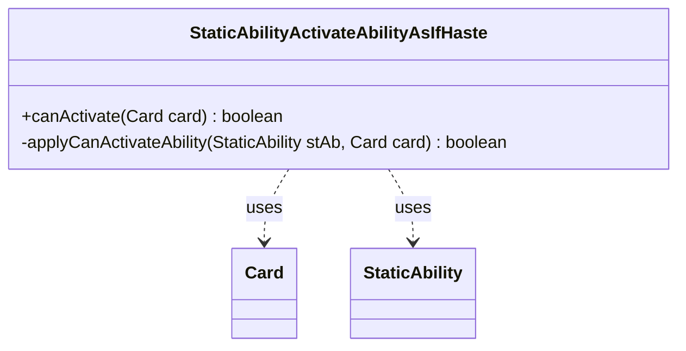

---
aliases:
  - StaticAbilityActivateAbilityAsIfHaste
tags:
  - java/class
  - module/forge-game
  - pkg/forge/game/staticability
fqn: forge.game.staticability.StaticAbilityActivateAbilityAsIfHaste
package: forge.game.staticability
module: forge-game
kind: Class
---

# StaticAbilityActivateAbilityAsIfHaste

**Package:** `forge.game.staticability`   **Module:** `forge-game`   **Kind:** Class



## Relationships
**Uses:**
- [[forge.game.card.Card|Card]]
- [[forge.game.staticability.StaticAbility|StaticAbility]]

## Design Description

StaticAbilityActivateAbilityAsIfHaste is a stateless utility that implements the "activate abilities as if it had haste" static effect, letting a card bypass the summoning-sickness restriction on its activated abilities. Its sole public entry point, `canActivate(Card)`, scans every card in the game's static-ability source zones, examines each card's StaticAbilities, and—via the private `applyCanActivateAbility` helper—returns true when one whose mode is ActivateAbilityAsIfHaste passes its conditions and matches the card against its `ValidCard` parameter.

Rather than implementing an interface or extending a supertype, it follows the package convention of a final-style static helper keyed to a single StaticAbilityMode, collaborating with Card for zone and ability lookup and with StaticAbility for condition and validity checks. Delegating matching to the data-driven `ValidCard`/`checkConditions` mechanism keeps the rule generic, so any card definition can grant the haste-like permission without bespoke code.

## Source
`forge-game/src/main/java/forge/game/staticability/StaticAbilityActivateAbilityAsIfHaste.java`

```java
/*
 * Forge: Play Magic: the Gathering.
 * Copyright (C) 2011  Forge Team
 *
 * This program is free software: you can redistribute it and/or modify
 * it under the terms of the GNU General Public License as published by
 * the Free Software Foundation, either version 3 of the License, or
 * (at your option) any later version.
 *
 * This program is distributed in the hope that it will be useful,
 * but WITHOUT ANY WARRANTY; without even the implied warranty of
 * MERCHANTABILITY or FITNESS FOR A PARTICULAR PURPOSE.  See the
 * GNU General Public License for more details.
 *
 * You should have received a copy of the GNU General Public License
 * along with this program.  If not, see <http://www.gnu.org/licenses/>.
 */
package forge.game.staticability;

import forge.game.card.Card;
import forge.game.zone.ZoneType;

/**
 * The Class StaticAbility_ActivateAbilityAsIfHaste.
 *  - used to allow cards to activate abilities as if they had haste
 */
public class StaticAbilityActivateAbilityAsIfHaste {

    public static boolean canActivate(final Card card) {
        for (final Card ca : card.getGame().getCardsIn(ZoneType.STATIC_ABILITIES_SOURCE_ZONES)) {
            for (final StaticAbility stAb : ca.getStaticAbilities()) {
                if (!stAb.checkConditions(StaticAbilityMode.ActivateAbilityAsIfHaste)) {
                    continue;
                }

                if (applyCanActivateAbility(stAb, card)) {
                    return true;
                }
            }
        }
        return false;
    }

    private static boolean applyCanActivateAbility(final StaticAbility stAb, final Card card) {
        if (!stAb.matchesValidParam("ValidCard", card)) {
            return false;
        }

        return true;
    }
}
```

## Python
`forge/game/staticability/StaticAbilityActivateAbilityAsIfHaste.py`

```python
from forge.game.card.Card import Card
from forge.game.zone.ZoneType import ZoneType
from forge.game.staticability.StaticAbility import StaticAbility
from forge.game.staticability.StaticAbilityMode import StaticAbilityMode


class StaticAbilityActivateAbilityAsIfHaste:
    """
    The Class StaticAbility_ActivateAbilityAsIfHaste.
     - used to allow cards to activate abilities as if they had haste
    """

    @staticmethod
    def canActivate(card: Card) -> bool:
        for ca in card.getGame().getCardsIn(ZoneType.STATIC_ABILITIES_SOURCE_ZONES):
            for stAb in ca.getStaticAbilities():
                if not stAb.checkConditions(StaticAbilityMode.ActivateAbilityAsIfHaste):
                    continue

                if StaticAbilityActivateAbilityAsIfHaste.applyCanActivateAbility(stAb, card):
                    return True
        return False

    @staticmethod
    def applyCanActivateAbility(stAb: StaticAbility, card: Card) -> bool:
        if not stAb.matchesValidParam("ValidCard", card):
            return False

        return True
```
