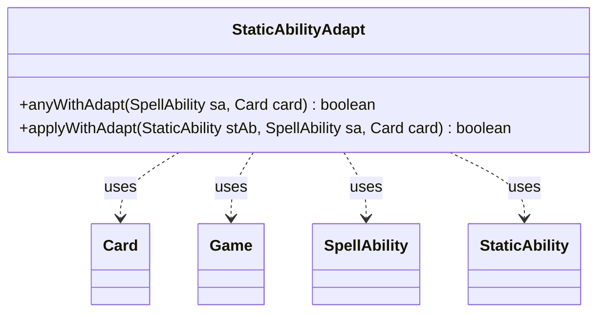

---
aliases:
  - StaticAbilityAdapt
tags:
  - java/class
  - module/forge-game
  - pkg/forge/game/staticability
fqn: forge.game.staticability.StaticAbilityAdapt
package: forge.game.staticability
module: forge-game
kind: Class
---

# StaticAbilityAdapt

**Package:** `forge.game.staticability` &nbsp; **Module:** `forge-game` &nbsp; **Kind:** Class



## Relationships
**Uses:**
- [[forge.game.Game|Game]]
- [[forge.game.card.Card|Card]]
- [[forge.game.spellability.SpellAbility|SpellAbility]]
- [[forge.game.staticability.StaticAbility|StaticAbility]]

## Design Description

StaticAbilityAdapt is a stateless utility class in the `forge.game.staticability` package that determines whether any active static ability grants a creature the ability to adapt (a Magic: The Gathering keyword action). Exposing only two static methods, it sweeps every card in the zones that can host static abilities, filters for those whose conditions match the `CanAdapt` mode, and validates each candidate against the affected card and triggering spell ability via `ValidCard` and `ValidSA` parameters.

Rather than implementing an interface or extending a supertype, it follows the package's convention of grouping mode-specific static-ability evaluation logic into a dedicated helper. It collaborates with `Game` to enumerate cards, `Card` to access game state and per-card `StaticAbility` lists, and `SpellAbility` as the contextual action being checked, keeping the adapt-permission rule isolated and reusable.

## Source
`forge-game/src/main/java/forge/game/staticability/StaticAbilityAdapt.java`

```java
package forge.game.staticability;

import forge.game.Game;
import forge.game.card.Card;
import forge.game.spellability.SpellAbility;
import forge.game.zone.ZoneType;

public class StaticAbilityAdapt {

    public static boolean anyWithAdapt(final SpellAbility sa, final Card card) {
        final Game game = card.getGame();
        for (final Card ca : game.getCardsIn(ZoneType.STATIC_ABILITIES_SOURCE_ZONES)) {
            for (final StaticAbility stAb : ca.getStaticAbilities()) {
                if (!stAb.checkConditions(StaticAbilityMode.CanAdapt)) {
                    continue;
                }
                if (applyWithAdapt(stAb, sa, card)) {
                    return true;
                }
            }
        }
        return false;
    }

    public static boolean applyWithAdapt(final StaticAbility stAb, final SpellAbility sa, final Card card) {
        if (!stAb.matchesValidParam("ValidCard", card)) {
            return false;
        }

        if (!stAb.matchesValidParam("ValidSA", sa)) {
            return false;
        }
        return true;
    }
}
```

## Python
`forge/game/staticability/StaticAbilityAdapt.py`

```python
from forge.game.Game import Game
from forge.game.card.Card import Card
from forge.game.spellability.SpellAbility import SpellAbility
from forge.game.staticability.StaticAbility import StaticAbility
from forge.game.staticability.StaticAbilityMode import StaticAbilityMode
from forge.game.zone.ZoneType import ZoneType


class StaticAbilityAdapt:

    @staticmethod
    def anyWithAdapt(sa: SpellAbility, card: Card) -> bool:
        game = card.getGame()
        for ca in game.getCardsIn(ZoneType.STATIC_ABILITIES_SOURCE_ZONES):
            for stAb in ca.getStaticAbilities():
                if not stAb.checkConditions(StaticAbilityMode.CanAdapt):
                    continue
                if StaticAbilityAdapt.applyWithAdapt(stAb, sa, card):
                    return True
        return False

    @staticmethod
    def applyWithAdapt(stAb: StaticAbility, sa: SpellAbility, card: Card) -> bool:
        if not stAb.matchesValidParam("ValidCard", card):
            return False

        if not stAb.matchesValidParam("ValidSA", sa):
            return False
        return True
```
