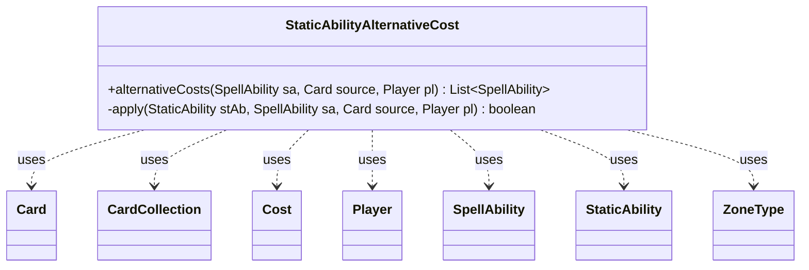

---
aliases:
  - StaticAbilityAlternativeCost
tags:
  - java/class
  - module/forge-game
  - pkg/forge/game/staticability
fqn: forge.game.staticability.StaticAbilityAlternativeCost
package: forge.game.staticability
module: forge-game
kind: Class
---

# StaticAbilityAlternativeCost

**Package:** `forge.game.staticability` &nbsp; **Module:** `forge-game` &nbsp; **Kind:** Class



## Relationships
**Uses:**
- [[forge.game.card.Card|Card]]
- [[forge.game.card.CardCollection|CardCollection]]
- [[forge.game.cost.Cost|Cost]]
- [[forge.game.player.Player|Player]]
- [[forge.game.spellability.SpellAbility|SpellAbility]]
- [[forge.game.staticability.StaticAbility|StaticAbility]]
- [[forge.game.zone.ZoneType|ZoneType]]

## Source
`forge-game/src/main/java/forge/game/staticability/StaticAbilityAlternativeCost.java`

```java
package forge.game.staticability;

import java.util.List;
import java.util.Set;

import com.google.common.collect.Lists;

import forge.card.mana.ManaCostParser;
import forge.game.card.Card;
import forge.game.card.CardCollection;
import forge.game.cost.Cost;
import forge.game.player.Player;
import forge.game.spellability.OptionalCost;
import forge.game.spellability.SpellAbility;
import forge.game.zone.ZoneType;

public class StaticAbilityAlternativeCost {

    public static List<SpellAbility> alternativeCosts(final SpellAbility sa, final Card source, final Player pl) {
        List<SpellAbility> result = Lists.newArrayList();
        // add source first in case it's LKI (alternate host)
        CardCollection list = new CardCollection(source);
        list.addAll(source.getGame().getCardsIn(ZoneType.STATIC_ABILITIES_SOURCE_ZONES));
        for (final Card ca : list) {
            for (final StaticAbility stAb : ca.getStaticAbilities()) {
                if (!stAb.checkConditions(StaticAbilityMode.AlternativeCost)) {
                    continue;
                }

                if (!apply(stAb, sa, source, pl)) {
                    continue;
                }

                String costTemplate = stAb.getParam("Cost");
                costTemplate = costTemplate.replace("ConvertedManaCost", Integer.toString(source.getCMC()));

                Cost cost = new Cost(costTemplate, sa.isAbility());
                // set the cost to this directly to bypass non mana cost
                final SpellAbility newSA = sa.isAbility() ? sa.copyWithDefinedCost(cost) : sa.copyWithManaCostReplaced(pl, cost);
                newSA.setActivatingPlayer(pl);
                newSA.setBasicSpell(false);

                if (stAb.hasParam("XAlternative")) {
                    newSA.putParam("XAlternative", stAb.getParam("XAlternative"));
                }

                if (stAb.hasParam("Announce")) {
                    newSA.putParam("Announce", stAb.getParam("Announce"));
                }

                if (stAb.hasParam("ManaRestriction")) {
                    newSA.putParam("ManaRestriction", stAb.getParam("ManaRestriction"));
                }

                if (!stAb.getHostCard().isImmutable()) {
                    Set<ZoneType> zones = stAb.getActiveZone();
                    if (zones != null && zones.size() == 1) {
                        newSA.getRestrictions().setZone(zones.stream().findFirst().get());
                    }
                }

                if (stAb.hasParam("StackDescription")) {
                    newSA.putParam("StackDescription", stAb.getParam("StackDescription"));
                }

                // makes new SpellDescription
                final StringBuilder sb = new StringBuilder();

                // CostDesc only for ManaCost?
                if (sa.isAbility()) {
                    newSA.putParam("CostDesc", stAb.hasParam("CostDesc") ? ManaCostParser.parse(stAb.getParam("CostDesc")) : cost.toSimpleString());
                    sb.append(newSA.getCostDescription());
                }

                // skip reminder text for now, Keywords might be too complicated
                //sb.append("(").append(newKi.getReminderText()).append(")");
                if (sa.isSpell()) {
                    sb.append(sa.getDescription());
                    if (source.equals(stAb.getHostCard())) {
                        newSA.addOptionalCost(OptionalCost.AltCost);
                        sb.append(" ("+ stAb.getParam("Description") +") ");
                    } else {
                        sb.append(" (by paying " + cost.toSimpleString() + " instead of its mana cost)");
                    }
                }
                newSA.setDescription(sb.toString());

                // Support for custom cards alternative costs targeting
                if (stAb.hasParam("Named")) {
                    newSA.setName(stAb.getParam("Named"));
                }

                result.add(newSA);
            }
        }
        return result;
    }

    private static boolean apply(final StaticAbility stAb, final SpellAbility sa, final Card source, final Player pl) {
        if (!stAb.matchesValidParam("ValidSA", sa)) {
            return false;
        }
        if (!stAb.matchesValidParam("ValidCard", source)) {
            return false;
        }
        if (!stAb.matchesValidParam("ValidPlayer", pl)) {
            return false;
        }

        return true;
    }

}
```
