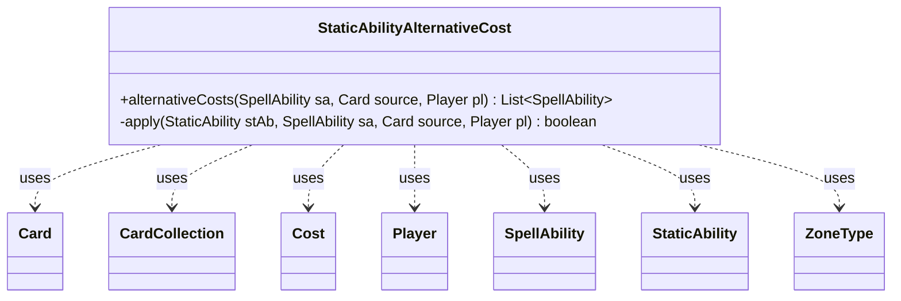

---
aliases:
  - StaticAbilityAlternativeCost
tags:
  - java/class
  - module/forge-game
  - pkg/forge/game/staticability
fqn: forge.game.staticability.StaticAbilityAlternativeCost
package: forge.game.staticability
module: forge-game
kind: Class
---

# StaticAbilityAlternativeCost

**Package:** `forge.game.staticability` &nbsp; **Module:** `forge-game` &nbsp; **Kind:** Class



## Relationships
**Uses:**
- [[forge.game.card.Card|Card]]
- [[forge.game.card.CardCollection|CardCollection]]
- [[forge.game.cost.Cost|Cost]]
- [[forge.game.player.Player|Player]]
- [[forge.game.spellability.SpellAbility|SpellAbility]]
- [[forge.game.staticability.StaticAbility|StaticAbility]]
- [[forge.game.zone.ZoneType|ZoneType]]

## Design Description

StaticAbilityAlternativeCost is a stateless utility that resolves alternative-cost static abilities into playable spell/ability variants. Its central method, `alternativeCosts`, scans the source card and all cards in the static-ability source zones, filters their StaticAbilities by the `AlternativeCost` mode and the private `apply` validity checks (ValidSA, ValidCard, ValidPlayer), then builds replacement-cost SpellAbilities. For each match it parses the configured `Cost` (substituting the host's converted mana cost), copies the original SpellAbility with the cost swapped in, sets the activating player, and propagates optional parameters such as XAlternative, Announce, ManaRestriction, StackDescription, and Named.

As a helper in the `staticability` package, it collaborates with Card, CardCollection, Cost, Player, SpellAbility, StaticAbility, and ZoneType rather than extending a supertype, reflecting Forge's pattern of grouping static-ability logic into dedicated static-method classes. Notable design intent includes adding the source first to handle last-known-information hosts, distinguishing spell versus activated-ability cost handling, and synthesizing tailored stack/description text so the alternative cost surfaces correctly to players.

## Source
`forge-game/src/main/java/forge/game/staticability/StaticAbilityAlternativeCost.java`

```java
package forge.game.staticability;

import java.util.List;
import java.util.Set;

import com.google.common.collect.Lists;

import forge.card.mana.ManaCostParser;
import forge.game.card.Card;
import forge.game.card.CardCollection;
import forge.game.cost.Cost;
import forge.game.player.Player;
import forge.game.spellability.OptionalCost;
import forge.game.spellability.SpellAbility;
import forge.game.zone.ZoneType;

public class StaticAbilityAlternativeCost {

    public static List<SpellAbility> alternativeCosts(final SpellAbility sa, final Card source, final Player pl) {
        List<SpellAbility> result = Lists.newArrayList();
        // add source first in case it's LKI (alternate host)
        CardCollection list = new CardCollection(source);
        list.addAll(source.getGame().getCardsIn(ZoneType.STATIC_ABILITIES_SOURCE_ZONES));
        for (final Card ca : list) {
            for (final StaticAbility stAb : ca.getStaticAbilities()) {
                if (!stAb.checkConditions(StaticAbilityMode.AlternativeCost)) {
                    continue;
                }

                if (!apply(stAb, sa, source, pl)) {
                    continue;
                }

                String costTemplate = stAb.getParam("Cost");
                costTemplate = costTemplate.replace("ConvertedManaCost", Integer.toString(source.getCMC()));

                Cost cost = new Cost(costTemplate, sa.isAbility());
                // set the cost to this directly to bypass non mana cost
                final SpellAbility newSA = sa.isAbility() ? sa.copyWithDefinedCost(cost) : sa.copyWithManaCostReplaced(pl, cost);
                newSA.setActivatingPlayer(pl);
                newSA.setBasicSpell(false);

                if (stAb.hasParam("XAlternative")) {
                    newSA.putParam("XAlternative", stAb.getParam("XAlternative"));
                }

                if (stAb.hasParam("Announce")) {
                    newSA.putParam("Announce", stAb.getParam("Announce"));
                }

                if (stAb.hasParam("ManaRestriction")) {
                    newSA.putParam("ManaRestriction", stAb.getParam("ManaRestriction"));
                }

                if (!stAb.getHostCard().isImmutable()) {
                    Set<ZoneType> zones = stAb.getActiveZone();
                    if (zones != null && zones.size() == 1) {
                        newSA.getRestrictions().setZone(zones.stream().findFirst().get());
                    }
                }

                if (stAb.hasParam("StackDescription")) {
                    newSA.putParam("StackDescription", stAb.getParam("StackDescription"));
                }

                // makes new SpellDescription
                final StringBuilder sb = new StringBuilder();

                // CostDesc only for ManaCost?
                if (sa.isAbility()) {
                    newSA.putParam("CostDesc", stAb.hasParam("CostDesc") ? ManaCostParser.parse(stAb.getParam("CostDesc")) : cost.toSimpleString());
                    sb.append(newSA.getCostDescription());
                }

                // skip reminder text for now, Keywords might be too complicated
                //sb.append("(").append(newKi.getReminderText()).append(")");
                if (sa.isSpell()) {
                    sb.append(sa.getDescription());
                    if (source.equals(stAb.getHostCard())) {
                        newSA.addOptionalCost(OptionalCost.AltCost);
                        sb.append(" ("+ stAb.getParam("Description") +") ");
                    } else {
                        sb.append(" (by paying " + cost.toSimpleString() + " instead of its mana cost)");
                    }
                }
                newSA.setDescription(sb.toString());

                // Support for custom cards alternative costs targeting
                if (stAb.hasParam("Named")) {
                    newSA.setName(stAb.getParam("Named"));
                }

                result.add(newSA);
            }
        }
        return result;
    }

    private static boolean apply(final StaticAbility stAb, final SpellAbility sa, final Card source, final Player pl) {
        if (!stAb.matchesValidParam("ValidSA", sa)) {
            return false;
        }
        if (!stAb.matchesValidParam("ValidCard", source)) {
            return false;
        }
        if (!stAb.matchesValidParam("ValidPlayer", pl)) {
            return false;
        }

        return true;
    }

}
```

## Python
`forge/game/staticability/StaticAbilityAlternativeCost.py`

```python
from typing import List, Set

from forge.card.mana.ManaCostParser import ManaCostParser
from forge.game.card.Card import Card
from forge.game.card.CardCollection import CardCollection
from forge.game.cost.Cost import Cost
from forge.game.player.Player import Player
from forge.game.spellability.OptionalCost import OptionalCost
from forge.game.spellability.SpellAbility import SpellAbility
from forge.game.staticability.StaticAbility import StaticAbility
from forge.game.staticability.StaticAbilityMode import StaticAbilityMode
from forge.game.zone.ZoneType import ZoneType


class StaticAbilityAlternativeCost:

    @staticmethod
    def alternativeCosts(sa: SpellAbility, source: Card, pl: Player) -> List[SpellAbility]:
        result: List[SpellAbility] = []
        # add source first in case it's LKI (alternate host)
        list = CardCollection(source)
        list.addAll(source.getGame().getCardsIn(ZoneType.STATIC_ABILITIES_SOURCE_ZONES))
        for ca in list:
            for stAb in ca.getStaticAbilities():
                if not stAb.checkConditions(StaticAbilityMode.AlternativeCost):
                    continue

                if not StaticAbilityAlternativeCost.apply(stAb, sa, source, pl):
                    continue

                costTemplate = stAb.getParam("Cost")
                costTemplate = costTemplate.replace("ConvertedManaCost", str(source.getCMC()))

                cost = Cost(costTemplate, sa.isAbility())
                # set the cost to this directly to bypass non mana cost
                newSA = sa.copyWithDefinedCost(cost) if sa.isAbility() else sa.copyWithManaCostReplaced(pl, cost)
                newSA.setActivatingPlayer(pl)
                newSA.setBasicSpell(False)

                if stAb.hasParam("XAlternative"):
                    newSA.putParam("XAlternative", stAb.getParam("XAlternative"))

                if stAb.hasParam("Announce"):
                    newSA.putParam("Announce", stAb.getParam("Announce"))

                if stAb.hasParam("ManaRestriction"):
                    newSA.putParam("ManaRestriction", stAb.getParam("ManaRestriction"))

                if not stAb.getHostCard().isImmutable():
                    zones: Set[ZoneType] = stAb.getActiveZone()
                    if zones is not None and len(zones) == 1:
                        newSA.getRestrictions().setZone(next(iter(zones)))

                if stAb.hasParam("StackDescription"):
                    newSA.putParam("StackDescription", stAb.getParam("StackDescription"))

                # makes new SpellDescription
                sb = []

                # CostDesc only for ManaCost?
                if sa.isAbility():
                    newSA.putParam("CostDesc", ManaCostParser.parse(stAb.getParam("CostDesc")) if stAb.hasParam("CostDesc") else cost.toSimpleString())
                    sb.append(newSA.getCostDescription())

                # skip reminder text for now, Keywords might be too complicated
                # sb.append("(").append(newKi.getReminderText()).append(")")
                if sa.isSpell():
                    sb.append(sa.getDescription())
                    if source.equals(stAb.getHostCard()):
                        newSA.addOptionalCost(OptionalCost.AltCost)
                        sb.append(" (" + stAb.getParam("Description") + ") ")
                    else:
                        sb.append(" (by paying " + cost.toSimpleString() + " instead of its mana cost)")
                newSA.setDescription("".join(sb))

                # Support for custom cards alternative costs targeting
                if stAb.hasParam("Named"):
                    newSA.setName(stAb.getParam("Named"))

                result.append(newSA)
        return result

    @staticmethod
    def apply(stAb: StaticAbility, sa: SpellAbility, source: Card, pl: Player) -> bool:
        if not stAb.matchesValidParam("ValidSA", sa):
            return False
        if not stAb.matchesValidParam("ValidCard", source):
            return False
        if not stAb.matchesValidParam("ValidPlayer", pl):
            return False

        return True
```
