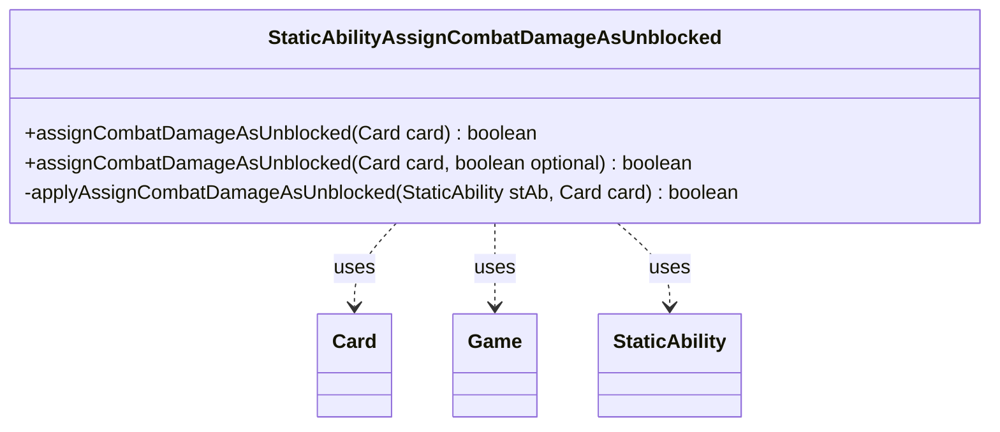

---
aliases:
  - StaticAbilityAssignCombatDamageAsUnblocked
tags:
  - java/class
  - module/forge-game
  - pkg/forge/game/staticability
fqn: forge.game.staticability.StaticAbilityAssignCombatDamageAsUnblocked
package: forge.game.staticability
module: forge-game
kind: Class
---

# StaticAbilityAssignCombatDamageAsUnblocked

**Package:** `forge.game.staticability` &nbsp; **Module:** `forge-game` &nbsp; **Kind:** Class



## Relationships
**Uses:**
- [[forge.game.Game|Game]]
- [[forge.game.card.Card|Card]]
- [[forge.game.staticability.StaticAbility|StaticAbility]]

## Design Description

StaticAbilityAssignCombatDamageAsUnblocked is a stateless utility that resolves whether a given attacking creature may assign its combat damage as though it were unblocked, a continuous effect granted by static abilities elsewhere in the game state. Its static `assignCombatDamageAsUnblocked` entry points scan every card in the static-ability source zones, examining each `StaticAbility` whose mode and optional flag match the query, and delegate the final eligibility test to the private `applyAssignCombatDamageAsUnblocked` helper, which validates the candidate card against the ability's `ValidCard` parameter.

Rather than extending a common base type, the class collaborates with `Card`, `Game`, and `StaticAbility` purely through static methods, reflecting Forge's convention of grouping each `StaticAbilityMode` into a dedicated dispatcher. The split between the public scanning loop and the private per-ability match keeps condition-checking and card-validation concerns cleanly separated, and the `optional` overload lets callers distinguish mandatory from optional grants.

## Source
`forge-game/src/main/java/forge/game/staticability/StaticAbilityAssignCombatDamageAsUnblocked.java`

```java
package forge.game.staticability;

import forge.game.Game;
import forge.game.card.Card;
import forge.game.zone.ZoneType;

public class StaticAbilityAssignCombatDamageAsUnblocked {

    public static boolean assignCombatDamageAsUnblocked(final Card card) {
        return assignCombatDamageAsUnblocked(card, true);
    }

    public static boolean assignCombatDamageAsUnblocked(final Card card, final boolean optional)  {
        final Game game = card.getGame();
        for (final Card ca : game.getCardsIn(ZoneType.STATIC_ABILITIES_SOURCE_ZONES)) {
            for (final StaticAbility stAb : ca.getStaticAbilities()) {
                if (!stAb.checkConditions(StaticAbilityMode.AssignCombatDamageAsUnblocked)) {
                    continue;
                }

                if (stAb.hasParam("Optional") != optional) {
                    continue;
                }

                if (applyAssignCombatDamageAsUnblocked(stAb, card)) {
                    return true;
                }
            }
        }
        return false;
    }

    private static boolean applyAssignCombatDamageAsUnblocked(final StaticAbility stAb, final Card card) {
        if (!stAb.matchesValidParam("ValidCard", card)) {
            return false;
        }
        return true;
    }
}
```

## Python
`forge/game/staticability/StaticAbilityAssignCombatDamageAsUnblocked.py`

```python
from forge.game.Game import Game
from forge.game.card.Card import Card
from forge.game.zone.ZoneType import ZoneType
from forge.game.staticability.StaticAbility import StaticAbility
from forge.game.staticability.StaticAbilityMode import StaticAbilityMode


class StaticAbilityAssignCombatDamageAsUnblocked:

    @staticmethod
    def assignCombatDamageAsUnblocked(card: Card, optional: bool = True) -> bool:
        game = card.getGame()
        for ca in game.getCardsIn(ZoneType.STATIC_ABILITIES_SOURCE_ZONES):
            for stAb in ca.getStaticAbilities():
                if not stAb.checkConditions(StaticAbilityMode.AssignCombatDamageAsUnblocked):
                    continue

                if stAb.hasParam("Optional") != optional:
                    continue

                if StaticAbilityAssignCombatDamageAsUnblocked.applyAssignCombatDamageAsUnblocked(stAb, card):
                    return True
        return False

    @staticmethod
    def applyAssignCombatDamageAsUnblocked(stAb: StaticAbility, card: Card) -> bool:
        if not stAb.matchesValidParam("ValidCard", card):
            return False
        return True
```
