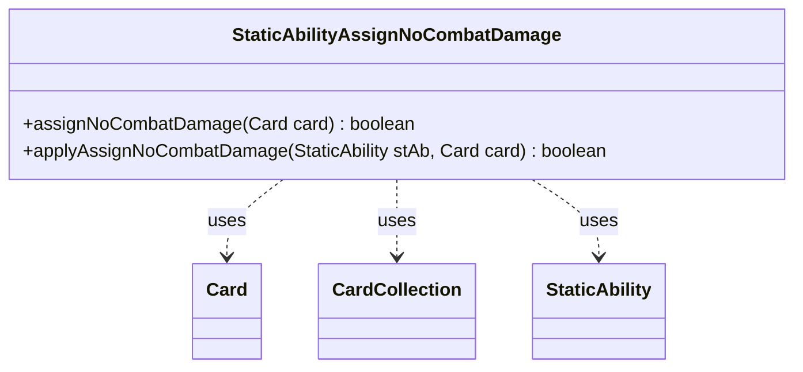

---
aliases:
  - StaticAbilityAssignNoCombatDamage
tags:
  - java/class
  - module/forge-game
  - pkg/forge/game/staticability
fqn: forge.game.staticability.StaticAbilityAssignNoCombatDamage
package: forge.game.staticability
module: forge-game
kind: Class
---

# StaticAbilityAssignNoCombatDamage

**Package:** `forge.game.staticability`   **Module:** `forge-game`   **Kind:** Class



## Relationships
**Uses:**
- [[forge.game.card.Card|Card]]
- [[forge.game.card.CardCollection|CardCollection]]
- [[forge.game.staticability.StaticAbility|StaticAbility]]

## Design Description

StaticAbilityAssignNoCombatDamage is a stateless utility that resolves whether a creature should deal no combat damage, implementing one of Forge's "static ability" rules checks. Its static entry point `assignNoCombatDamage` gathers all cards in the relevant static-ability source zones (plus the card itself) into a CardCollection, then scans each card's StaticAbility list for those matching the AssignNoCombatDamage mode whose conditions hold, delegating each candidate to `applyAssignNoCombatDamage`.

That helper applies the actual predicate, returning true when the ability's `ValidCard` parameter matches the target card. Rather than modeling abilities as objects, the class collaborates with Card and StaticAbility purely through static methods—a procedural, side-effect-free design mirroring Forge's other StaticAbility* checkers, where short-circuit iteration returns as soon as any source grants the effect.

## Source
`forge-game/src/main/java/forge/game/staticability/StaticAbilityAssignNoCombatDamage.java`

```java
package forge.game.staticability;

import forge.game.card.Card;
import forge.game.card.CardCollection;
import forge.game.zone.ZoneType;

public class StaticAbilityAssignNoCombatDamage {

    public static boolean assignNoCombatDamage(final Card card) {
        CardCollection list = new CardCollection(card.getGame().getCardsIn(ZoneType.STATIC_ABILITIES_SOURCE_ZONES));
        list.add(card);
        for (final Card ca : list) {
            for (final StaticAbility stAb : ca.getStaticAbilities()) {
                if (!stAb.checkConditions(StaticAbilityMode.AssignNoCombatDamage)) {
                    continue;
                }
                if (applyAssignNoCombatDamage(stAb, card)) {
                    return true;
                }
            }
        }
        return false;
    }

    public static boolean applyAssignNoCombatDamage(final StaticAbility stAb, final Card card) {
        if (!stAb.matchesValidParam("ValidCard", card)) {
            return false;
        }
        return true;
    }

}
```

## Python
`forge/game/staticability/StaticAbilityAssignNoCombatDamage.py`

```python
from forge.game.card.Card import Card
from forge.game.card.CardCollection import CardCollection
from forge.game.zone.ZoneType import ZoneType
from forge.game.staticability.StaticAbility import StaticAbility
from forge.game.staticability.StaticAbilityMode import StaticAbilityMode


class StaticAbilityAssignNoCombatDamage:

    @staticmethod
    def assignNoCombatDamage(card: Card) -> bool:
        list = CardCollection(card.getGame().getCardsIn(ZoneType.STATIC_ABILITIES_SOURCE_ZONES))
        list.add(card)
        for ca in list:
            for stAb in ca.getStaticAbilities():
                if not stAb.checkConditions(StaticAbilityMode.AssignNoCombatDamage):
                    continue
                if StaticAbilityAssignNoCombatDamage.applyAssignNoCombatDamage(stAb, card):
                    return True
        return False

    @staticmethod
    def applyAssignNoCombatDamage(stAb: StaticAbility, card: Card) -> bool:
        if not stAb.matchesValidParam("ValidCard", card):
            return False
        return True
```
