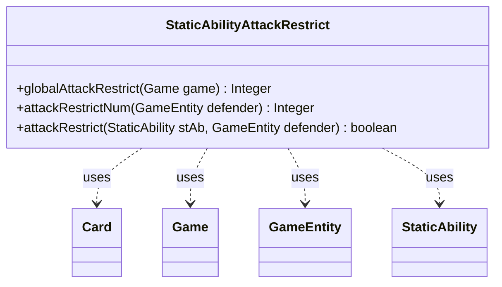

---
aliases:
  - StaticAbilityAttackRestrict
tags:
  - java/class
  - module/forge-game
  - pkg/forge/game/staticability
fqn: forge.game.staticability.StaticAbilityAttackRestrict
package: forge.game.staticability
module: forge-game
kind: Class
---

# StaticAbilityAttackRestrict

**Package:** `forge.game.staticability` &nbsp; **Module:** `forge-game` &nbsp; **Kind:** Class



## Relationships
**Uses:**
- [[forge.game.Game|Game]]
- [[forge.game.GameEntity|GameEntity]]
- [[forge.game.card.Card|Card]]
- [[forge.game.staticability.StaticAbility|StaticAbility]]

## Design Description

Static helper that enforces "can't attack" / attacker-count restrictions during the combat declare-attackers step. Its three static methods scan every static-ability source zone for abilities whose mode is `AttackRestrict`: `globalAttackRestrict` computes the most restrictive cap on total attackers from defender-agnostic abilities, while `attackRestrictNum` computes the tightest cap that applies to a specific defender, and `attackRestrict` tests whether a given ability's `ValidDefender` filter matches that defender.

Although it manipulates no state of its own, the class collaborates closely with the broader game model: it iterates `Card` static abilities obtained from `Game`, evaluates each `StaticAbility` against a `GameEntity` defender, and delegates numeric `MaxAttackers` resolution to `AbilityUtils`. The split between global and per-defender queries, the `ValidDefender` presence check that partitions abilities between the two methods, and the consistent "take the minimum" logic reflect a deliberate design where multiple overlapping restrictions combine into the single strictest limit.

## Source
`forge-game/src/main/java/forge/game/staticability/StaticAbilityAttackRestrict.java`

```java
package forge.game.staticability;

import forge.game.Game;
import forge.game.GameEntity;
import forge.game.ability.AbilityUtils;
import forge.game.card.Card;
import forge.game.zone.ZoneType;

public class StaticAbilityAttackRestrict {

    static public Integer globalAttackRestrict(Game game) {
        Integer max = null;
        for (final Card ca : game.getCardsIn(ZoneType.STATIC_ABILITIES_SOURCE_ZONES)) {
            for (final StaticAbility stAb : ca.getStaticAbilities()) {
                if (!stAb.checkConditions(StaticAbilityMode.AttackRestrict)
                        || stAb.hasParam("ValidDefender")) {
                    continue;
                }
                int stMax = AbilityUtils.calculateAmount(stAb.getHostCard(),
                        stAb.getParamOrDefault("MaxAttackers", "1"), stAb);
                if (null == max || stMax < max) {
                    max = stMax;
                }
            }
        }
        return max;
    }

    static public Integer attackRestrictNum(GameEntity defender) {
        final Game game = defender.getGame();
        Integer num = null;
        for (final Card ca : game.getCardsIn(ZoneType.STATIC_ABILITIES_SOURCE_ZONES)) {
            for (final StaticAbility stAb : ca.getStaticAbilities()) {
                if (!stAb.checkConditions(StaticAbilityMode.AttackRestrict)
                        || !stAb.hasParam("ValidDefender")) {
                    continue;
                }
                if (attackRestrict(stAb, defender)) {
                    int stNum = AbilityUtils.calculateAmount(stAb.getHostCard(),
                            stAb.getParamOrDefault("MaxAttackers", "1"), stAb);
                    if (null == num || stNum < num) {
                        num = stNum;
                    }
                }
            }
        }
        return num;
    }

    static public boolean attackRestrict(StaticAbility stAb, GameEntity defender) {
        if (!stAb.matchesValidParam("ValidDefender", defender)) {
            return false;
        }
        return true;
    }
}
```

## Python
`forge/game/staticability/StaticAbilityAttackRestrict.py`

```python
package forge.game.staticability

from forge.game.Game import Game
from forge.game.GameEntity import GameEntity
from forge.game.ability.AbilityUtils import AbilityUtils
from forge.game.card.Card import Card
from forge.game.zone.ZoneType import ZoneType
from forge.game.staticability.StaticAbility import StaticAbility
from forge.game.staticability.StaticAbilityMode import StaticAbilityMode


class StaticAbilityAttackRestrict:

    @staticmethod
    def globalAttackRestrict(game):
        max = None
        for ca in game.getCardsIn(ZoneType.STATIC_ABILITIES_SOURCE_ZONES):
            for stAb in ca.getStaticAbilities():
                if (not stAb.checkConditions(StaticAbilityMode.AttackRestrict)
                        or stAb.hasParam("ValidDefender")):
                    continue
                stMax = AbilityUtils.calculateAmount(stAb.getHostCard(),
                        stAb.getParamOrDefault("MaxAttackers", "1"), stAb)
                if max is None or stMax < max:
                    max = stMax
        return max

    @staticmethod
    def attackRestrictNum(defender):
        game = defender.getGame()
        num = None
        for ca in game.getCardsIn(ZoneType.STATIC_ABILITIES_SOURCE_ZONES):
            for stAb in ca.getStaticAbilities():
                if (not stAb.checkConditions(StaticAbilityMode.AttackRestrict)
                        or not stAb.hasParam("ValidDefender")):
                    continue
                if StaticAbilityAttackRestrict.attackRestrict(stAb, defender):
                    stNum = AbilityUtils.calculateAmount(stAb.getHostCard(),
                            stAb.getParamOrDefault("MaxAttackers", "1"), stAb)
                    if num is None or stNum < num:
                        num = stNum
        return num

    @staticmethod
    def attackRestrict(stAb, defender):
        if not stAb.matchesValidParam("ValidDefender", defender):
            return False
        return True
```
