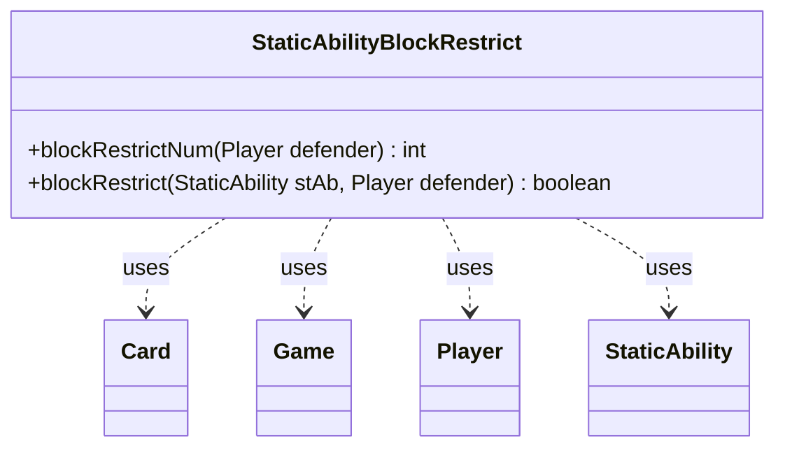

---
aliases:
  - StaticAbilityBlockRestrict
tags:
  - java/class
  - module/forge-game
  - pkg/forge/game/staticability
fqn: forge.game.staticability.StaticAbilityBlockRestrict
package: forge.game.staticability
module: forge-game
kind: Class
---

# StaticAbilityBlockRestrict

**Package:** `forge.game.staticability`   **Module:** `forge-game`   **Kind:** Class



## Relationships
**Uses:**
- [[forge.game.Game|Game]]
- [[forge.game.card.Card|Card]]
- [[forge.game.player.Player|Player]]
- [[forge.game.staticability.StaticAbility|StaticAbility]]

## Design Description

Static helper that computes block restrictions imposed by static abilities. `blockRestrictNum` scans every card in the zones that can host static abilities, and for each ability operating in `BlockRestrict` mode that applies to the given defending `Player`, evaluates the `MaxBlockers` parameter to find the most restrictive (smallest) limit on how many creatures that player may block with—returning `Integer.MAX_VALUE` when no restriction applies. `blockRestrict` is a predicate testing whether a single `StaticAbility` targets the defender via its `ValidDefender` parameter.

As a stateless utility class with only static methods, it embodies Forge's pattern of grouping the resolution logic for one `StaticAbilityMode` into a dedicated class. It collaborates with `Game` and `Card` to enumerate ability sources, delegates numeric expression evaluation to `AbilityUtils`, and reads filtering parameters from `StaticAbility`, keeping rule logic decoupled from the static-ability framework itself.

## Source
`forge-game/src/main/java/forge/game/staticability/StaticAbilityBlockRestrict.java`

```java
package forge.game.staticability;

import forge.game.Game;
import forge.game.ability.AbilityUtils;
import forge.game.card.Card;
import forge.game.player.Player;
import forge.game.zone.ZoneType;

public class StaticAbilityBlockRestrict {

    static public int blockRestrictNum(Player defender) {
        final Game game = defender.getGame();
        int num = Integer.MAX_VALUE;
        for (final Card ca : game.getCardsIn(ZoneType.STATIC_ABILITIES_SOURCE_ZONES)) {
            for (final StaticAbility stAb : ca.getStaticAbilities()) {
                if (!stAb.checkConditions(StaticAbilityMode.BlockRestrict)) {
                    continue;
                }
                if (blockRestrict(stAb, defender)) {
                    int stNum = AbilityUtils.calculateAmount(stAb.getHostCard(),
                            stAb.getParamOrDefault("MaxBlockers", "1"), stAb);
                    if (stNum < num) {
                        num = stNum;
                    }
                }

            }
        }
        return num;
    }

    static public boolean blockRestrict(StaticAbility stAb, Player defender) {
        if (!stAb.matchesValidParam("ValidDefender", defender)) {
            return false;
        }
        return true;
    }
}
```

## Python
`forge/game/staticability/StaticAbilityBlockRestrict.py`

```python
from forge.game.Game import Game
from forge.game.ability.AbilityUtils import AbilityUtils
from forge.game.card.Card import Card
from forge.game.player.Player import Player
from forge.game.zone.ZoneType import ZoneType
from forge.game.staticability.StaticAbility import StaticAbility
from forge.game.staticability.StaticAbilityMode import StaticAbilityMode


class StaticAbilityBlockRestrict:

    @staticmethod
    def blockRestrictNum(defender: Player) -> int:
        game = defender.getGame()
        num = 2147483647
        for ca in game.getCardsIn(ZoneType.STATIC_ABILITIES_SOURCE_ZONES):
            for stAb in ca.getStaticAbilities():
                if not stAb.checkConditions(StaticAbilityMode.BlockRestrict):
                    continue
                if StaticAbilityBlockRestrict.blockRestrict(stAb, defender):
                    stNum = AbilityUtils.calculateAmount(stAb.getHostCard(),
                            stAb.getParamOrDefault("MaxBlockers", "1"), stAb)
                    if stNum < num:
                        num = stNum

        return num

    @staticmethod
    def blockRestrict(stAb: StaticAbility, defender: Player) -> bool:
        if not stAb.matchesValidParam("ValidDefender", defender):
            return False
        return True
```
