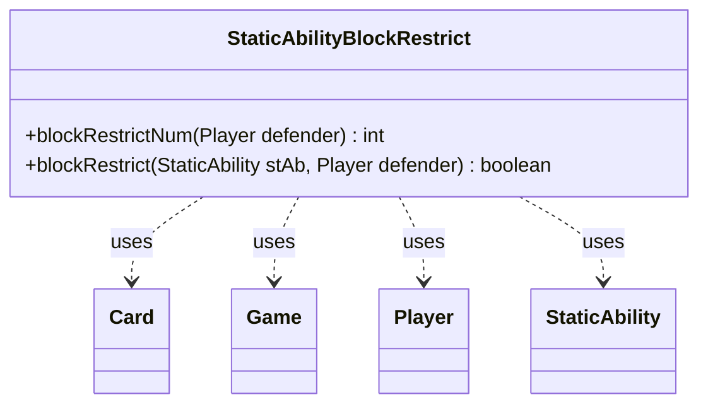

---
aliases:
  - StaticAbilityBlockRestrict
tags:
  - java/class
  - module/forge-game
  - pkg/forge/game/staticability
fqn: forge.game.staticability.StaticAbilityBlockRestrict
package: forge.game.staticability
module: forge-game
kind: Class
---

# StaticAbilityBlockRestrict

**Package:** `forge.game.staticability` &nbsp; **Module:** `forge-game` &nbsp; **Kind:** Class



## Relationships
**Uses:**
- [[forge.game.Game|Game]]
- [[forge.game.card.Card|Card]]
- [[forge.game.player.Player|Player]]
- [[forge.game.staticability.StaticAbility|StaticAbility]]

## Source
`forge-game/src/main/java/forge/game/staticability/StaticAbilityBlockRestrict.java`

```java
package forge.game.staticability;

import forge.game.Game;
import forge.game.ability.AbilityUtils;
import forge.game.card.Card;
import forge.game.player.Player;
import forge.game.zone.ZoneType;

public class StaticAbilityBlockRestrict {

    static public int blockRestrictNum(Player defender) {
        final Game game = defender.getGame();
        int num = Integer.MAX_VALUE;
        for (final Card ca : game.getCardsIn(ZoneType.STATIC_ABILITIES_SOURCE_ZONES)) {
            for (final StaticAbility stAb : ca.getStaticAbilities()) {
                if (!stAb.checkConditions(StaticAbilityMode.BlockRestrict)) {
                    continue;
                }
                if (blockRestrict(stAb, defender)) {
                    int stNum = AbilityUtils.calculateAmount(stAb.getHostCard(),
                            stAb.getParamOrDefault("MaxBlockers", "1"), stAb);
                    if (stNum < num) {
                        num = stNum;
                    }
                }

            }
        }
        return num;
    }

    static public boolean blockRestrict(StaticAbility stAb, Player defender) {
        if (!stAb.matchesValidParam("ValidDefender", defender)) {
            return false;
        }
        return true;
    }
}
```
