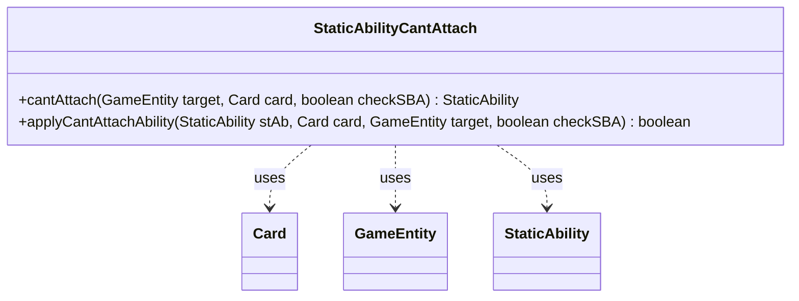

---
aliases:
  - StaticAbilityCantAttach
tags:
  - java/class
  - module/forge-game
  - pkg/forge/game/staticability
fqn: forge.game.staticability.StaticAbilityCantAttach
package: forge.game.staticability
module: forge-game
kind: Class
---

# StaticAbilityCantAttach

**Package:** `forge.game.staticability` &nbsp; **Module:** `forge-game` &nbsp; **Kind:** Class



## Relationships
**Uses:**
- [[forge.game.GameEntity|GameEntity]]
- [[forge.game.card.Card|Card]]
- [[forge.game.staticability.StaticAbility|StaticAbility]]

## Design Description

StaticAbilityCantAttach is a stateless utility class that centralizes the rules logic for preventing one object from attaching (as an Aura, Equipment, or Fortification) to a given game entity. It is not part of the StaticAbility type hierarchy; rather, it interprets `CantAttach`-mode StaticAbility instances on behalf of the attachment rules. Its `cantAttach` method scans every card in the static-ability source zones, filters to abilities whose conditions match, and returns the first one that forbids the attachment. The `applyCantAttachAbility` helper performs the predicate check, validating the candidate Card and target GameEntity against the ability's `ValidCard`, `Target`, and `ValidCardToTarget` parameters while honoring `Exceptions` and the state-based-action `ExceptionSBA` carve-out. The static, parameter-driven design reflects Forge's data-oriented approach, keeping per-card behavior in card script parameters rather than code.

## Source
`forge-game/src/main/java/forge/game/staticability/StaticAbilityCantAttach.java`

```java
package forge.game.staticability;

import forge.game.GameEntity;
import forge.game.card.Card;
import forge.game.zone.ZoneType;

public class StaticAbilityCantAttach {

    public static StaticAbility cantAttach(final GameEntity target, final Card card, boolean checkSBA) {
        // CantTarget static abilities
        for (final Card ca : target.getGame().getCardsIn(ZoneType.STATIC_ABILITIES_SOURCE_ZONES)) {
            for (final StaticAbility stAb : ca.getStaticAbilities()) {
                if (!stAb.checkConditions(StaticAbilityMode.CantAttach)) {
                    continue;
                }

                if (applyCantAttachAbility(stAb, card, target, checkSBA)) {
                    return stAb;
                }
            }
        }
        return null;
    }

    public static boolean applyCantAttachAbility(final StaticAbility stAb, final Card card, final GameEntity target, boolean checkSBA) {
        if (!stAb.matchesValidParam("ValidCard", card)) {
            return false;
        }

        if (!stAb.matchesValidParam("Target", target)) {
            return false;
        }

        if (stAb.hasParam("ValidCardToTarget")) {
            if (!(target instanceof Card)) {
                return false;
            }
            Card tcard = (Card) target;

            if (!stAb.matchesValid(card, stAb.getParam("ValidCardToTarget").split(","), tcard)) {
                return false;
            }
        }

        if ((checkSBA || !stAb.hasParam("ExceptionSBA")) && stAb.hasParam("Exceptions") && stAb.matchesValidParam("Exceptions", card)) {
            return false;
        }

        return true;
    }
}
```

## Python
`forge/game/staticability/StaticAbilityCantAttach.py`

```python
from forge.game.GameEntity import GameEntity
from forge.game.card.Card import Card
from forge.game.staticability.StaticAbility import StaticAbility
from forge.game.zone.ZoneType import ZoneType


class StaticAbilityCantAttach:

    @staticmethod
    def cantAttach(target: GameEntity, card: Card, checkSBA: bool) -> StaticAbility:
        # CantTarget static abilities
        for ca in target.getGame().getCardsIn(ZoneType.STATIC_ABILITIES_SOURCE_ZONES):
            for stAb in ca.getStaticAbilities():
                if not stAb.checkConditions(StaticAbilityMode.CantAttach):
                    continue

                if StaticAbilityCantAttach.applyCantAttachAbility(stAb, card, target, checkSBA):
                    return stAb
        return None

    @staticmethod
    def applyCantAttachAbility(stAb: StaticAbility, card: Card, target: GameEntity, checkSBA: bool) -> bool:
        if not stAb.matchesValidParam("ValidCard", card):
            return False

        if not stAb.matchesValidParam("Target", target):
            return False

        if stAb.hasParam("ValidCardToTarget"):
            if not isinstance(target, Card):
                return False
            tcard = target

            if not stAb.matchesValid(card, stAb.getParam("ValidCardToTarget").split(","), tcard):
                return False

        if (checkSBA or not stAb.hasParam("ExceptionSBA")) and stAb.hasParam("Exceptions") and stAb.matchesValidParam("Exceptions", card):
            return False

        return True
```
