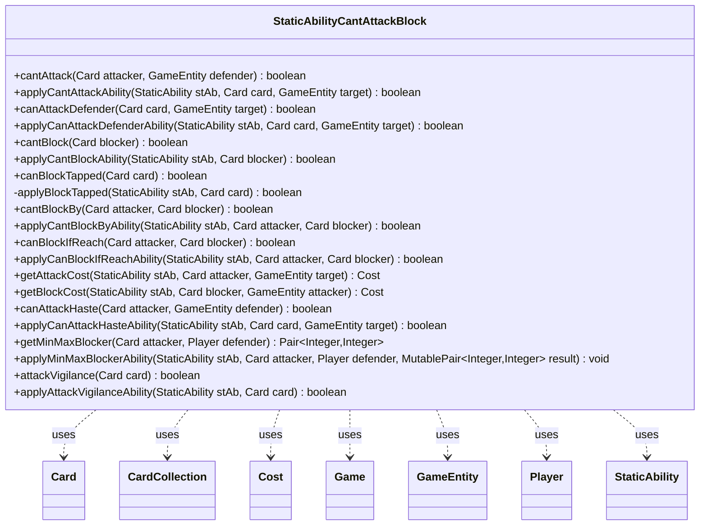

---
aliases:
  - StaticAbilityCantAttackBlock
tags:
  - java/class
  - module/forge-game
  - pkg/forge/game/staticability
fqn: forge.game.staticability.StaticAbilityCantAttackBlock
package: forge.game.staticability
module: forge-game
kind: Class
---

# StaticAbilityCantAttackBlock

**Package:** `forge.game.staticability`   **Module:** `forge-game`   **Kind:** Class



## Relationships
**Uses:**
- [[forge.game.Game|Game]]
- [[forge.game.GameEntity|GameEntity]]
- [[forge.game.card.Card|Card]]
- [[forge.game.card.CardCollection|CardCollection]]
- [[forge.game.cost.Cost|Cost]]
- [[forge.game.player.Player|Player]]
- [[forge.game.staticability.StaticAbility|StaticAbility]]

## Design Description

StaticAbilityCantAttackBlock is a stateless utility class that centralizes the evaluation of combat-related static abilities—restrictions and permissions governing whether creatures may attack or block. Rather than holding state, it exposes paired static methods: public query methods (cantAttack, cantBlock, cantBlockBy, canBlockIfReach, canAttackHaste, getMinMaxBlocker, attackVigilance, getAttackCost) that sweep every StaticAbility on cards in the relevant zones, and corresponding applyXxxAbility helpers that test a single StaticAbility's validity parameters against the candidate Card, GameEntity, or Player.

It collaborates closely with StaticAbility (the rule source it interprets), Card and GameEntity (attackers, blockers, and defenders), Game (to enumerate ability sources), and Cost (for attack/block taxes). The design intent is a single dispatch point that combat code consults, keeping creature combat legality and keyword interactions (Defender, Menace, Landwalk, Reach) data-driven and decoupled from individual card implementations.

## Source
`forge-game/src/main/java/forge/game/staticability/StaticAbilityCantAttackBlock.java`

```java
/*
 * Forge: Play Magic: the Gathering.
 * Copyright (C) 2011  Forge Team
 *
 * This program is free software: you can redistribute it and/or modify
 * it under the terms of the GNU General Public License as published by
 * the Free Software Foundation, either version 3 of the License, or
 * (at your option) any later version.
 *
 * This program is distributed in the hope that it will be useful,
 * but WITHOUT ANY WARRANTY; without even the implied warranty of
 * MERCHANTABILITY or FITNESS FOR A PARTICULAR PURPOSE.  See the
 * GNU General Public License for more details.
 *
 * You should have received a copy of the GNU General Public License
 * along with this program.  If not, see <http://www.gnu.org/licenses/>.
 */
package forge.game.staticability;

import org.apache.commons.lang3.tuple.MutablePair;
import org.apache.commons.lang3.tuple.Pair;

import forge.game.Game;
import forge.game.GameEntity;
import forge.game.ability.AbilityUtils;
import forge.game.card.Card;
import forge.game.card.CardCollection;
import forge.game.cost.Cost;
import forge.game.keyword.Keyword;
import forge.game.player.Player;
import forge.game.zone.ZoneType;

/**
 * The Class StaticAbility_CantBeCast.
 */
public class StaticAbilityCantAttackBlock {

    public static boolean cantAttack(final Card attacker, final GameEntity defender) {
        // Keywords
        // replace with Static Ability if able
        if (attacker.hasKeyword("CARDNAME can't attack.") || attacker.hasKeyword("CARDNAME can't attack or block.")) {
            return true;
        }

        if (attacker.isDetained()) {
            return true;
        }

        for (final Card ca : attacker.getGame().getCardsIn(ZoneType.STATIC_ABILITIES_SOURCE_ZONES)) {
            for (final StaticAbility stAb : ca.getStaticAbilities()) {
                if (!stAb.checkConditions(StaticAbilityMode.CantAttack)) {
                    continue;
                }

                if (applyCantAttackAbility(stAb, attacker, defender)) {
                    return true;
                }
            }
        }
        return false;
    }

    /**
     * TODO Write javadoc for this method.
     *
     * @param stAb a StaticAbility
     * @param card the card
     * @return a Cost
     */
    public static boolean applyCantAttackAbility(final StaticAbility stAb, final Card card, final GameEntity target) {
        final Card hostCard = stAb.getHostCard();
        final Game game = hostCard.getGame();

        if (!stAb.matchesValidParam("ValidCard", card)) {
            return false;
        }
        if (stAb.getIgnoreEffectCards().contains(card)) {
            return false;
        }

        if (!stAb.matchesValidParam("Target", target)) {
            return false;
        }

        // check for "can attack as if didn't have defender" static
        if (stAb.isKeyword(Keyword.DEFENDER) && canAttackDefender(card, target)) {
            return false;
        }

        final Player defender;
        if (target instanceof Player) {
            defender = (Player) target;
        } else {
            Card c = (Card) target;
            if (c.isBattle()) {
                defender = c.getProtectingPlayer();
            } else {
                defender = c.getController();
            }
        }

        if (stAb.hasParam("DefenderNotNearestToYouInChosenDirection")) {
            if (hostCard.getChosenDirection() == null) {
                return false;
            }
            if (target instanceof Card && ((Card) target).isBattle()) {
                return false;
            }
            Player next = card.getController();
            while (!next.isOpponentOf(card.getController())) {
                next = game.getNextPlayerAfter(next, hostCard.getChosenDirection());
            }
            if (defender.equals(next)) {
                return false;
            }
        }
        if (stAb.hasParam("UnlessDefender")) {
            final String type = stAb.getParam("UnlessDefender");
            if (defender.hasProperty(type, hostCard.getController(), hostCard, stAb)) {
                return false;
            }
        }

        return true;
    }

    public static boolean canAttackDefender(final Card card, final GameEntity target) {
        for (final Card ca : card.getGame().getCardsIn(ZoneType.STATIC_ABILITIES_SOURCE_ZONES)) {
            for (final StaticAbility stAb : ca.getStaticAbilities()) {
                if (!stAb.checkConditions(StaticAbilityMode.CanAttackDefender)) {
                    continue;
                }

                if (applyCanAttackDefenderAbility(stAb, card, target)) {
                    return true;
                }
            }
        }
        return false;
    }

    public static boolean applyCanAttackDefenderAbility(final StaticAbility stAb, final Card card, final GameEntity target) {
        if (!stAb.matchesValidParam("ValidCard", card)) {
            return false;
        }

        if (!stAb.matchesValidParam("ValidAttacked", target)) {
            return false;
        }

        return true;
    }

    public static boolean cantBlock(final Card blocker) {
        if (blocker.isDetained()) {
            return true;
        }

        CardCollection list = new CardCollection(blocker);
        list.addAll(blocker.getGame().getCardsIn(ZoneType.STATIC_ABILITIES_SOURCE_ZONES));
        for (final Card ca : list) {
            for (final StaticAbility stAb : ca.getStaticAbilities()) {
                if (!stAb.checkConditions(StaticAbilityMode.CantBlock)) {
                    continue;
                }
                if (applyCantBlockAbility(stAb, blocker)) {
                    return true;
                }
            }
        }
        return false;
    }

    public static boolean applyCantBlockAbility(final StaticAbility stAb, final Card blocker) {
        if (!stAb.matchesValidParam("ValidCard", blocker)) {
            return false;
        }
        if (stAb.getIgnoreEffectCards().contains(blocker)) {
            return false;
        }
        return true;
    }

    public static boolean canBlockTapped(final Card card)  {
        final Game game = card.getGame();
        for (final Card ca : game.getCardsIn(ZoneType.STATIC_ABILITIES_SOURCE_ZONES)) {
            for (final StaticAbility stAb : ca.getStaticAbilities()) {
                if (!stAb.checkConditions(StaticAbilityMode.BlockTapped)) {
                    continue;
                }

                if (applyBlockTapped(stAb, card)) {
                    return true;
                }
            }
        }
        return false;
    }

    private static boolean applyBlockTapped(final StaticAbility stAb, final Card card) {
        if (!stAb.matchesValidParam("ValidCard", card)) {
            return false;
        }
        return true;
    }

    public static boolean cantBlockBy(final Card attacker, final Card blocker) {
        // add attacker and blocker first in case of LKI
        CardCollection list = new CardCollection(attacker);
        if (blocker != null) {
            list.add(blocker);
        }
        list.addAll(attacker.getGame().getCardsIn(ZoneType.STATIC_ABILITIES_SOURCE_ZONES));
        for (final Card ca : list) {
            for (final StaticAbility stAb : ca.getStaticAbilities()) {
                if (!stAb.checkConditions(StaticAbilityMode.CantBlockBy)) {
                    continue;
                }
                if (applyCantBlockByAbility(stAb, attacker, blocker)) {
                    return true;
                }
            }
        }
        return false;
    }

    /**
     * returns true if attacker can't be blocked by blocker
     *
     * @param stAb
     * @param attacker
     * @param blocker
     * @return boolean
     */
    public static boolean applyCantBlockByAbility(final StaticAbility stAb, final Card attacker, final Card blocker) {
        final Card host = stAb.getHostCard();
        if (!stAb.matchesValidParam("ValidAttacker", attacker)) {
            return false;
        }
        if (stAb.hasParam("ValidBlocker")) {
            boolean stillblock = true;
            for (final String v : stAb.getParam("ValidBlocker").split(",")) {
                if (blocker != null && blocker.isValid(v, host.getController(), host, stAb)) {
                    stillblock = false;
                    // Dragon Hunter check
                    if (v.contains("withoutReach") && canBlockIfReach(attacker, blocker)) {
                        stillblock = true;
                    }
                    if (!stillblock) {
                        break;
                    }
                }
            }
            if (stillblock) {
                return false;
            }
        }
        // relative valid relative to each other
        if (!stAb.matchesValidParam("ValidAttackerRelative", attacker, blocker)) {
            return false;
        }
        if (!stAb.matchesValidParam("ValidBlockerRelative", blocker, attacker)) {
            return false;
        }
        if (blocker == null || !stAb.matchesValidParam("ValidDefender", blocker.getController())) {
            return false;
        }
        if (stAb.isKeyword(Keyword.LANDWALK)) {
            if (StaticAbilityIgnoreLandwalk.ignoreLandWalk(attacker, blocker, stAb.getKeyword())) {
                return false;
            }
        }
        return true;
    }

    public static boolean canBlockIfReach(final Card attacker, final Card blocker) {
        for (final Card ca : attacker.getGame().getCardsIn(ZoneType.STATIC_ABILITIES_SOURCE_ZONES)) {
            for (final StaticAbility stAb : ca.getStaticAbilities()) {
                if (!stAb.checkConditions(StaticAbilityMode.CanBlockIfReach)) {
                    continue;
                }
                if (applyCanBlockIfReachAbility(stAb, attacker, blocker)) {
                    return true;
                }
            }
        }
        return false;
    }

    public static boolean applyCanBlockIfReachAbility(final StaticAbility stAb, final Card attacker, final Card blocker) {
        if (!stAb.matchesValidParam("ValidAttacker", attacker)) {
            return false;
        }
        if (!stAb.matchesValidParam("ValidBlocker", blocker)) {
            return false;
        }
        return true;
    }

    /**
     * TODO Write javadoc for this method.
     *
     * @param stAb     a StaticAbility
     * @param attacker the card
     * @return a Cost
     */
    public static Cost getAttackCost(final StaticAbility stAb, final Card attacker, final GameEntity target) {
        final Card hostCard = stAb.getHostCard();

        if (!stAb.matchesValidParam("ValidCard", attacker)) {
            return null;
        }

        if (!stAb.matchesValidParam("Target", target)) {
            return null;
        }
        String costString = stAb.getParam("Cost");
        if (stAb.hasSVar(costString)) {
            boolean remember = stAb.hasParam("RememberingAttacker");
            if (remember) {
                hostCard.addRemembered(attacker);
            }
            // keep X shards
            boolean addX = costString.startsWith("X");
            costString = Integer.toString(AbilityUtils.calculateAmount(hostCard, stAb.getSVar(costString), stAb));
            if (addX) {
                costString += " X";
            }
            if (remember) {
                hostCard.removeRemembered(attacker);
            }
        }

        Cost cost = new Cost(costString, true);

        if (stAb.hasParam("Trigger")) {
            cost.getCostParts().get(0).setTrigger(stAb.getPayingTrigSA());
        }

        return cost;
    }

    /**
     * TODO Write javadoc for this method.
     *
     * @param stAb    a StaticAbility
     * @param blocker the card
     * @return a Cost
     */
    public static Cost getBlockCost(final StaticAbility stAb, final Card blocker, final GameEntity attacker) {
        final Card hostCard = stAb.getHostCard();

        if (!stAb.matchesValidParam("ValidCard", blocker)) {
            return null;
        }

        if (!stAb.matchesValidParam("Attacker", attacker)) {
            return null;
        }
        String costString = stAb.getParam("Cost");
        if (stAb.hasSVar(costString)) {
            boolean addX = costString.startsWith("X");
            costString = Integer.toString(AbilityUtils.calculateAmount(hostCard, stAb.getSVar(costString), stAb));
            if (addX) {
                costString += " X";
            }
        }

        return new Cost(costString, true);
    }

    public static boolean canAttackHaste(final Card attacker, final GameEntity defender) {
        final Game game = attacker.getGame();
        if (!attacker.isSick()) {
            return true;
        }
        for (final Card ca : game.getCardsIn(ZoneType.STATIC_ABILITIES_SOURCE_ZONES)) {
            for (final StaticAbility stAb : ca.getStaticAbilities()) {
                if (!stAb.checkConditions(StaticAbilityMode.CanAttackIfHaste)) {
                    continue;
                }
                if (applyCanAttackHasteAbility(stAb, attacker, defender)) {
                    return true;
                }
            }
        }
        return false;
    }

    public static boolean applyCanAttackHasteAbility(final StaticAbility stAb, final Card card,
            final GameEntity target) {
        if (!stAb.matchesValidParam("ValidCard", card)) {
            return false;
        }

        if (!stAb.matchesValidParam("ValidTarget", target)) {
            return false;
        }
        return true;
    }

    public static Pair<Integer, Integer> getMinMaxBlocker(final Card attacker, final Player defender) {
        MutablePair<Integer, Integer> result = MutablePair.of(1, Integer.MAX_VALUE);

        if (attacker.hasKeyword(Keyword.MENACE)) {
            result.setLeft(2);
        }

        final Game game = attacker.getGame();
        for (final Card ca : game.getCardsIn(ZoneType.STATIC_ABILITIES_SOURCE_ZONES)) {
            for (final StaticAbility stAb : ca.getStaticAbilities()) {
                if (!stAb.checkConditions(StaticAbilityMode.MinMaxBlocker)) {
                    continue;
                }
                applyMinMaxBlockerAbility(stAb, attacker, defender, result);
            }
        }
        return result;
    }

    public static void applyMinMaxBlockerAbility(final StaticAbility stAb, final Card attacker, final Player defender,
            MutablePair<Integer, Integer> result) {
        if (!stAb.matchesValidParam("ValidCard", attacker)) {
            return;
        }

        if (stAb.hasParam("Min")) {
            if ("All".equals(stAb.getParam("Min"))) {
                if (defender != null) {
                    result.setLeft(defender.getCreaturesInPlay().size());
                }
            } else {
                result.setLeft(AbilityUtils.calculateAmount(stAb.getHostCard(), stAb.getParam("Min"), stAb));
            }
        }

        if (stAb.hasParam("Max")) {
            result.setRight(AbilityUtils.calculateAmount(stAb.getHostCard(), stAb.getParam("Max"), stAb));
        }
    }

    public static boolean attackVigilance(final Card card)  {
        final Game game = card.getGame();
        for (final Card ca : game.getCardsIn(ZoneType.STATIC_ABILITIES_SOURCE_ZONES)) {
            for (final StaticAbility stAb : ca.getStaticAbilities()) {
                if (!stAb.checkConditions(StaticAbilityMode.AttackVigilance)) {
                    continue;
                }

                if (applyAttackVigilanceAbility(stAb, card)) {
                    return true;
                }
            }
        }
        return false;
    }

    public static boolean applyAttackVigilanceAbility(final StaticAbility stAb, final Card card) {
        if (!stAb.matchesValidParam("ValidCard", card)) {
            return false;
        }
        return true;
    }
}
```

## Python
`forge/game/staticability/StaticAbilityCantAttackBlock.py`

```python
from org.apache.commons.lang3.tuple.MutablePair import MutablePair
from org.apache.commons.lang3.tuple.Pair import Pair

from forge.game.Game import Game
from forge.game.GameEntity import GameEntity
from forge.game.ability.AbilityUtils import AbilityUtils
from forge.game.card.Card import Card
from forge.game.card.CardCollection import CardCollection
from forge.game.cost.Cost import Cost
from forge.game.keyword.Keyword import Keyword
from forge.game.player.Player import Player
from forge.game.zone.ZoneType import ZoneType
from forge.game.staticability.StaticAbility import StaticAbility
from forge.game.staticability.StaticAbilityMode import StaticAbilityMode
from forge.game.staticability.StaticAbilityIgnoreLandwalk import StaticAbilityIgnoreLandwalk

import sys


class StaticAbilityCantAttackBlock:
    """The Class StaticAbility_CantBeCast."""

    @staticmethod
    def cantAttack(attacker: Card, defender: GameEntity) -> bool:
        # Keywords
        # replace with Static Ability if able
        if attacker.hasKeyword("CARDNAME can't attack.") or attacker.hasKeyword("CARDNAME can't attack or block."):
            return True

        if attacker.isDetained():
            return True

        for ca in attacker.getGame().getCardsIn(ZoneType.STATIC_ABILITIES_SOURCE_ZONES):
            for stAb in ca.getStaticAbilities():
                if not stAb.checkConditions(StaticAbilityMode.CantAttack):
                    continue

                if StaticAbilityCantAttackBlock.applyCantAttackAbility(stAb, attacker, defender):
                    return True
        return False

    @staticmethod
    def applyCantAttackAbility(stAb: StaticAbility, card: Card, target: GameEntity) -> bool:
        """
        TODO Write javadoc for this method.

        @param stAb a StaticAbility
        @param card the card
        @return a Cost
        """
        hostCard = stAb.getHostCard()
        game = hostCard.getGame()

        if not stAb.matchesValidParam("ValidCard", card):
            return False
        if card in stAb.getIgnoreEffectCards():
            return False

        if not stAb.matchesValidParam("Target", target):
            return False

        # check for "can attack as if didn't have defender" static
        if stAb.isKeyword(Keyword.DEFENDER) and StaticAbilityCantAttackBlock.canAttackDefender(card, target):
            return False

        if isinstance(target, Player):
            defender = target
        else:
            c = target
            if c.isBattle():
                defender = c.getProtectingPlayer()
            else:
                defender = c.getController()

        if stAb.hasParam("DefenderNotNearestToYouInChosenDirection"):
            if hostCard.getChosenDirection() is None:
                return False
            if isinstance(target, Card) and target.isBattle():
                return False
            next = card.getController()
            while not next.isOpponentOf(card.getController()):
                next = game.getNextPlayerAfter(next, hostCard.getChosenDirection())
            if defender.equals(next):
                return False
        if stAb.hasParam("UnlessDefender"):
            type = stAb.getParam("UnlessDefender")
            if defender.hasProperty(type, hostCard.getController(), hostCard, stAb):
                return False

        return True

    @staticmethod
    def canAttackDefender(card: Card, target: GameEntity) -> bool:
        for ca in card.getGame().getCardsIn(ZoneType.STATIC_ABILITIES_SOURCE_ZONES):
            for stAb in ca.getStaticAbilities():
                if not stAb.checkConditions(StaticAbilityMode.CanAttackDefender):
                    continue

                if StaticAbilityCantAttackBlock.applyCanAttackDefenderAbility(stAb, card, target):
                    return True
        return False

    @staticmethod
    def applyCanAttackDefenderAbility(stAb: StaticAbility, card: Card, target: GameEntity) -> bool:
        if not stAb.matchesValidParam("ValidCard", card):
            return False

        if not stAb.matchesValidParam("ValidAttacked", target):
            return False

        return True

    @staticmethod
    def cantBlock(blocker: Card) -> bool:
        if blocker.isDetained():
            return True

        list = CardCollection(blocker)
        list.addAll(blocker.getGame().getCardsIn(ZoneType.STATIC_ABILITIES_SOURCE_ZONES))
        for ca in list:
            for stAb in ca.getStaticAbilities():
                if not stAb.checkConditions(StaticAbilityMode.CantBlock):
                    continue
                if StaticAbilityCantAttackBlock.applyCantBlockAbility(stAb, blocker):
                    return True
        return False

    @staticmethod
    def applyCantBlockAbility(stAb: StaticAbility, blocker: Card) -> bool:
        if not stAb.matchesValidParam("ValidCard", blocker):
            return False
        if blocker in stAb.getIgnoreEffectCards():
            return False
        return True

    @staticmethod
    def canBlockTapped(card: Card) -> bool:
        game = card.getGame()
        for ca in game.getCardsIn(ZoneType.STATIC_ABILITIES_SOURCE_ZONES):
            for stAb in ca.getStaticAbilities():
                if not stAb.checkConditions(StaticAbilityMode.BlockTapped):
                    continue

                if StaticAbilityCantAttackBlock.applyBlockTapped(stAb, card):
                    return True
        return False

    @staticmethod
    def applyBlockTapped(stAb: StaticAbility, card: Card) -> bool:
        if not stAb.matchesValidParam("ValidCard", card):
            return False
        return True

    @staticmethod
    def cantBlockBy(attacker: Card, blocker: Card) -> bool:
        # add attacker and blocker first in case of LKI
        list = CardCollection(attacker)
        if blocker is not None:
            list.add(blocker)
        list.addAll(attacker.getGame().getCardsIn(ZoneType.STATIC_ABILITIES_SOURCE_ZONES))
        for ca in list:
            for stAb in ca.getStaticAbilities():
                if not stAb.checkConditions(StaticAbilityMode.CantBlockBy):
                    continue
                if StaticAbilityCantAttackBlock.applyCantBlockByAbility(stAb, attacker, blocker):
                    return True
        return False

    @staticmethod
    def applyCantBlockByAbility(stAb: StaticAbility, attacker: Card, blocker: Card) -> bool:
        """
        returns true if attacker can't be blocked by blocker

        @param stAb
        @param attacker
        @param blocker
        @return boolean
        """
        host = stAb.getHostCard()
        if not stAb.matchesValidParam("ValidAttacker", attacker):
            return False
        if stAb.hasParam("ValidBlocker"):
            stillblock = True
            for v in stAb.getParam("ValidBlocker").split(","):
                if blocker is not None and blocker.isValid(v, host.getController(), host, stAb):
                    stillblock = False
                    # Dragon Hunter check
                    if "withoutReach" in v and StaticAbilityCantAttackBlock.canBlockIfReach(attacker, blocker):
                        stillblock = True
                    if not stillblock:
                        break
            if stillblock:
                return False
        # relative valid relative to each other
        if not stAb.matchesValidParam("ValidAttackerRelative", attacker, blocker):
            return False
        if not stAb.matchesValidParam("ValidBlockerRelative", blocker, attacker):
            return False
        if blocker is None or not stAb.matchesValidParam("ValidDefender", blocker.getController()):
            return False
        if stAb.isKeyword(Keyword.LANDWALK):
            if StaticAbilityIgnoreLandwalk.ignoreLandWalk(attacker, blocker, stAb.getKeyword()):
                return False
        return True

    @staticmethod
    def canBlockIfReach(attacker: Card, blocker: Card) -> bool:
        for ca in attacker.getGame().getCardsIn(ZoneType.STATIC_ABILITIES_SOURCE_ZONES):
            for stAb in ca.getStaticAbilities():
                if not stAb.checkConditions(StaticAbilityMode.CanBlockIfReach):
                    continue
                if StaticAbilityCantAttackBlock.applyCanBlockIfReachAbility(stAb, attacker, blocker):
                    return True
        return False

    @staticmethod
    def applyCanBlockIfReachAbility(stAb: StaticAbility, attacker: Card, blocker: Card) -> bool:
        if not stAb.matchesValidParam("ValidAttacker", attacker):
            return False
        if not stAb.matchesValidParam("ValidBlocker", blocker):
            return False
        return True

    @staticmethod
    def getAttackCost(stAb: StaticAbility, attacker: Card, target: GameEntity) -> Cost:
        """
        TODO Write javadoc for this method.

        @param stAb     a StaticAbility
        @param attacker the card
        @return a Cost
        """
        hostCard = stAb.getHostCard()

        if not stAb.matchesValidParam("ValidCard", attacker):
            return None

        if not stAb.matchesValidParam("Target", target):
            return None
        costString = stAb.getParam("Cost")
        if stAb.hasSVar(costString):
            remember = stAb.hasParam("RememberingAttacker")
            if remember:
                hostCard.addRemembered(attacker)
            # keep X shards
            addX = costString.startswith("X")
            costString = str(AbilityUtils.calculateAmount(hostCard, stAb.getSVar(costString), stAb))
            if addX:
                costString += " X"
            if remember:
                hostCard.removeRemembered(attacker)

        cost = Cost(costString, True)

        if stAb.hasParam("Trigger"):
            cost.getCostParts().get(0).setTrigger(stAb.getPayingTrigSA())

        return cost

    @staticmethod
    def getBlockCost(stAb: StaticAbility, blocker: Card, attacker: GameEntity) -> Cost:
        """
        TODO Write javadoc for this method.

        @param stAb    a StaticAbility
        @param blocker the card
        @return a Cost
        """
        hostCard = stAb.getHostCard()

        if not stAb.matchesValidParam("ValidCard", blocker):
            return None

        if not stAb.matchesValidParam("Attacker", attacker):
            return None
        costString = stAb.getParam("Cost")
        if stAb.hasSVar(costString):
            addX = costString.startswith("X")
            costString = str(AbilityUtils.calculateAmount(hostCard, stAb.getSVar(costString), stAb))
            if addX:
                costString += " X"

        return Cost(costString, True)

    @staticmethod
    def canAttackHaste(attacker: Card, defender: GameEntity) -> bool:
        game = attacker.getGame()
        if not attacker.isSick():
            return True
        for ca in game.getCardsIn(ZoneType.STATIC_ABILITIES_SOURCE_ZONES):
            for stAb in ca.getStaticAbilities():
                if not stAb.checkConditions(StaticAbilityMode.CanAttackIfHaste):
                    continue
                if StaticAbilityCantAttackBlock.applyCanAttackHasteAbility(stAb, attacker, defender):
                    return True
        return False

    @staticmethod
    def applyCanAttackHasteAbility(stAb: StaticAbility, card: Card, target: GameEntity) -> bool:
        if not stAb.matchesValidParam("ValidCard", card):
            return False

        if not stAb.matchesValidParam("ValidTarget", target):
            return False
        return True

    @staticmethod
    def getMinMaxBlocker(attacker: Card, defender: Player) -> Pair:
        result = MutablePair.of(1, sys.maxsize)

        if attacker.hasKeyword(Keyword.MENACE):
            result.setLeft(2)

        game = attacker.getGame()
        for ca in game.getCardsIn(ZoneType.STATIC_ABILITIES_SOURCE_ZONES):
            for stAb in ca.getStaticAbilities():
                if not stAb.checkConditions(StaticAbilityMode.MinMaxBlocker):
                    continue
                StaticAbilityCantAttackBlock.applyMinMaxBlockerAbility(stAb, attacker, defender, result)
        return result

    @staticmethod
    def applyMinMaxBlockerAbility(stAb: StaticAbility, attacker: Card, defender: Player, result: MutablePair) -> None:
        if not stAb.matchesValidParam("ValidCard", attacker):
            return

        if stAb.hasParam("Min"):
            if "All" == stAb.getParam("Min"):
                if defender is not None:
                    result.setLeft(defender.getCreaturesInPlay().size())
            else:
                result.setLeft(AbilityUtils.calculateAmount(stAb.getHostCard(), stAb.getParam("Min"), stAb))

        if stAb.hasParam("Max"):
            result.setRight(AbilityUtils.calculateAmount(stAb.getHostCard(), stAb.getParam("Max"), stAb))

    @staticmethod
    def attackVigilance(card: Card) -> bool:
        game = card.getGame()
        for ca in game.getCardsIn(ZoneType.STATIC_ABILITIES_SOURCE_ZONES):
            for stAb in ca.getStaticAbilities():
                if not stAb.checkConditions(StaticAbilityMode.AttackVigilance):
                    continue

                if StaticAbilityCantAttackBlock.applyAttackVigilanceAbility(stAb, card):
                    return True
        return False

    @staticmethod
    def applyAttackVigilanceAbility(stAb: StaticAbility, card: Card) -> bool:
        if not stAb.matchesValidParam("ValidCard", card):
            return False
        return True
```
