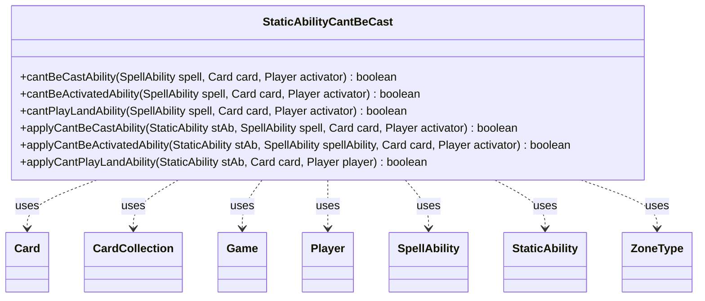

---
aliases:
  - StaticAbilityCantBeCast
tags:
  - java/class
  - module/forge-game
  - pkg/forge/game/staticability
fqn: forge.game.staticability.StaticAbilityCantBeCast
package: forge.game.staticability
module: forge-game
kind: Class
---

# StaticAbilityCantBeCast

**Package:** `forge.game.staticability` &nbsp; **Module:** `forge-game` &nbsp; **Kind:** Class



## Relationships
**Uses:**
- [[forge.game.Game|Game]]
- [[forge.game.card.Card|Card]]
- [[forge.game.card.CardCollection|CardCollection]]
- [[forge.game.player.Player|Player]]
- [[forge.game.spellability.SpellAbility|SpellAbility]]
- [[forge.game.staticability.StaticAbility|StaticAbility]]
- [[forge.game.zone.ZoneType|ZoneType]]

## Design Description

StaticAbilityCantBeCast is a stateless utility class that centralizes the rules logic for determining when a spell cannot be cast, an ability cannot be activated, or a land cannot be played due to continuous static effects in play. Its three public entry points (`cantBeCastAbility`, `cantBeActivatedAbility`, `cantPlayLandAbility`) sweep every Card in the static-ability source zones via the Game, evaluate each StaticAbility whose mode and conditions match, and delegate to the corresponding `applyXxx` predicate that tests the restriction's parameters against the affected Card, SpellAbility, and Player.

As a collection of static methods with no instance state, it acts as a focused helper within the staticability package rather than a polymorphic participant in a hierarchy. The design intent is data-driven evaluation: each restriction is expressed through declarative parameters (ValidCard, Caster, Origin, cmcGT, NumLimitEachTurn, AffectedZone), and the early-return guard chains keep each rule check isolated and short-circuiting, collaborating with CardCollection, CardLists, CardUtil, and ZoneType to resolve scope.

## Source
`forge-game/src/main/java/forge/game/staticability/StaticAbilityCantBeCast.java`

```java
/*
 * Forge: Play Magic: the Gathering.
 * Copyright (C) 2011  Forge Team
 *
 * This program is free software: you can redistribute it and/or modify
 * it under the terms of the GNU General Public License as published by
 * the Free Software Foundation, either version 3 of the License, or
 * (at your option) any later version.
 *
 * This program is distributed in the hope that it will be useful,
 * but WITHOUT ANY WARRANTY; without even the implied warranty of
 * MERCHANTABILITY or FITNESS FOR A PARTICULAR PURPOSE.  See the
 * GNU General Public License for more details.
 *
 * You should have received a copy of the GNU General Public License
 * along with this program.  If not, see <http://www.gnu.org/licenses/>.
 */
package forge.game.staticability;

import java.util.List;

import forge.game.Game;
import forge.game.card.Card;
import forge.game.card.CardCollection;
import forge.game.card.CardLists;
import forge.game.card.CardUtil;
import forge.game.player.Player;
import forge.game.spellability.SpellAbility;
import forge.game.zone.ZoneType;

/**
 * The Class StaticAbility_CantBeCast.
 */
public class StaticAbilityCantBeCast {

    public static boolean cantBeCastAbility(final SpellAbility spell, final Card card, final Player activator) {
        card.setCastSA(spell);

        final Game game = activator.getGame();
        final CardCollection allp = new CardCollection(game.getCardsIn(ZoneType.STATIC_ABILITIES_SOURCE_ZONES));
        allp.add(card);
        for (final Card ca : allp) {
            for (final StaticAbility stAb : ca.getStaticAbilities()) {
                if (!stAb.checkConditions(StaticAbilityMode.CantBeCast)) {
                    continue;
                }
                if (applyCantBeCastAbility(stAb, spell, card, activator)) {
                    return true;
                }
            }
        }
        return false;
    }

    public static boolean cantBeActivatedAbility(final SpellAbility spell, final Card card, final Player activator) {
        if (spell.isTrigger()) {
            return false;
        }
        final Game game = activator.getGame();
        for (final Card ca : game.getCardsIn(ZoneType.STATIC_ABILITIES_SOURCE_ZONES)) {
            for (final StaticAbility stAb : ca.getStaticAbilities()) {
                if (!stAb.checkConditions(StaticAbilityMode.CantBeActivated)) {
                    continue;
                }
                if (applyCantBeActivatedAbility(stAb, spell, card, activator)) {
                    return true;
                }
            }
        }
        return false;
    }

    public static boolean cantPlayLandAbility(final SpellAbility spell, final Card card, final Player activator) {
        final Game game = activator.getGame();
        for (final Card ca : game.getCardsIn(ZoneType.STATIC_ABILITIES_SOURCE_ZONES)) {
            for (final StaticAbility stAb : ca.getStaticAbilities()) {
                if (!stAb.checkConditions(StaticAbilityMode.CantPlayLand)) {
                    continue;
                }
                if (applyCantPlayLandAbility(stAb, card, activator)) {
                    return true;
                }
            }
        }
        return false;
    }

    /**
     * TODO Write javadoc for this method.
     *
     * @param stAb
     *            a StaticAbility
     * @param card
     *            the card
     * @param activator
     *            the activator
     * @return true, if successful
     */
    public static boolean applyCantBeCastAbility(final StaticAbility stAb, final SpellAbility spell, final Card card, final Player activator) {
        if (!stAb.matchesValidParam("ValidCard", card)) {
            return false;
        }

        if (!stAb.matchesValidParam("Caster", activator)) {
            return false;
        }
        if (stAb.getIgnoreEffectPlayers().contains(activator)) {
            return false;
        }

        if (stAb.hasParam("OnlySorcerySpeed") && activator != null && activator.canCastSorcery()) {
            return false;
        }

        if (stAb.hasParam("Origin")) {
            List<ZoneType> src = ZoneType.listValueOf(stAb.getParam("Origin"));
            if (card.getCastFrom() == null || !src.contains(card.getCastFrom().getZoneType())) {
                return false;
            }
        }

        if (stAb.hasParam("cmcGT") && activator != null) {
            if (stAb.getParam("cmcGT").equals("Turns")) {
                if (card.getCMC() <= activator.getTurn()) {
                    return false;
                }
            } else if (card.getCMC() <= CardLists.getType(activator.getCardsIn(ZoneType.Battlefield),
                    stAb.getParam("cmcGT")).size()) {
                return false;
            }
        }

        if (stAb.hasParam("NumLimitEachTurn") && activator != null) {
            int limit = Integer.parseInt(stAb.getParam("NumLimitEachTurn"));
            String valid = stAb.getParamOrDefault("ValidCard", "Card");
            List<Card> thisTurnCast = CardUtil.getThisTurnCast(valid, card, stAb, activator);
            if (CardLists.filterControlledByAsList(thisTurnCast, activator).size() < limit) {
                return false;
            }
        }

        return true;
    }

    /**
     * Applies Cant Be Activated ability.
     *
     * @param stAb
     *            a StaticAbility
     * @param card
     *            the card
     * @param spellAbility
     *            a SpellAbility
     * @return true, if successful
     */
    public static boolean applyCantBeActivatedAbility(final StaticAbility stAb, final SpellAbility spellAbility, final Card card, final Player activator) {
        if (!stAb.matchesValidParam("ValidCard", card)) {
            return false;
        }
        if (stAb.getIgnoreEffectCards().contains(card)) {
            return false;
        }

        if (!stAb.matchesValidParam("ValidSA", spellAbility)) {
            return false;
        }

        if (stAb.hasParam("AffectedZone") && !card.isInZone(ZoneType.smartValueOf(stAb.getParam("AffectedZone")))) {
            return false;
        }

        if (!stAb.matchesValidParam("Activator", activator)) {
            return false;
        }

        return true;
    }

    /**
     * TODO Write javadoc for this method.
     *
     * @param stAb
     *            a StaticAbility
     * @param card
     *            the card
     * @param player
     *            the player
     * @return true, if successful
     */
    public static boolean applyCantPlayLandAbility(final StaticAbility stAb, final Card card, final Player player) {
        if (!stAb.matchesValidParam("ValidCard", card)) {
            return false;
        }

        if (stAb.hasParam("Origin")) {
            List<ZoneType> src = ZoneType.listValueOf(stAb.getParam("Origin"));

            if (!src.contains(card.getLastKnownZone().getZoneType())) {
                return false;
            }
        }

        if (!stAb.matchesValidParam("Player", player)) {
            return false;
        }
        if (stAb.getIgnoreEffectPlayers().contains(player)) {
            return false;
        }

        return true;
    }

}
```

## Python
`forge/game/staticability/StaticAbilityCantBeCast.py`

```python
from forge.game.Game import Game
from forge.game.card.Card import Card
from forge.game.card.CardCollection import CardCollection
from forge.game.card.CardLists import CardLists
from forge.game.card.CardUtil import CardUtil
from forge.game.player.Player import Player
from forge.game.spellability.SpellAbility import SpellAbility
from forge.game.staticability.StaticAbility import StaticAbility
from forge.game.staticability.StaticAbilityMode import StaticAbilityMode
from forge.game.zone.ZoneType import ZoneType


class StaticAbilityCantBeCast:
    """The Class StaticAbility_CantBeCast."""

    @staticmethod
    def cantBeCastAbility(spell: SpellAbility, card: Card, activator: Player) -> bool:
        card.setCastSA(spell)

        game = activator.getGame()
        allp = CardCollection(game.getCardsIn(ZoneType.STATIC_ABILITIES_SOURCE_ZONES))
        allp.add(card)
        for ca in allp:
            for stAb in ca.getStaticAbilities():
                if not stAb.checkConditions(StaticAbilityMode.CantBeCast):
                    continue
                if StaticAbilityCantBeCast.applyCantBeCastAbility(stAb, spell, card, activator):
                    return True
        return False

    @staticmethod
    def cantBeActivatedAbility(spell: SpellAbility, card: Card, activator: Player) -> bool:
        if spell.isTrigger():
            return False
        game = activator.getGame()
        for ca in game.getCardsIn(ZoneType.STATIC_ABILITIES_SOURCE_ZONES):
            for stAb in ca.getStaticAbilities():
                if not stAb.checkConditions(StaticAbilityMode.CantBeActivated):
                    continue
                if StaticAbilityCantBeCast.applyCantBeActivatedAbility(stAb, spell, card, activator):
                    return True
        return False

    @staticmethod
    def cantPlayLandAbility(spell: SpellAbility, card: Card, activator: Player) -> bool:
        game = activator.getGame()
        for ca in game.getCardsIn(ZoneType.STATIC_ABILITIES_SOURCE_ZONES):
            for stAb in ca.getStaticAbilities():
                if not stAb.checkConditions(StaticAbilityMode.CantPlayLand):
                    continue
                if StaticAbilityCantBeCast.applyCantPlayLandAbility(stAb, card, activator):
                    return True
        return False

    @staticmethod
    def applyCantBeCastAbility(stAb: StaticAbility, spell: SpellAbility, card: Card, activator: Player) -> bool:
        """
        TODO Write javadoc for this method.

        @param stAb
                   a StaticAbility
        @param card
                   the card
        @param activator
                   the activator
        @return true, if successful
        """
        if not stAb.matchesValidParam("ValidCard", card):
            return False

        if not stAb.matchesValidParam("Caster", activator):
            return False
        if activator in stAb.getIgnoreEffectPlayers():
            return False

        if stAb.hasParam("OnlySorcerySpeed") and activator is not None and activator.canCastSorcery():
            return False

        if stAb.hasParam("Origin"):
            src = ZoneType.listValueOf(stAb.getParam("Origin"))
            if card.getCastFrom() is None or card.getCastFrom().getZoneType() not in src:
                return False

        if stAb.hasParam("cmcGT") and activator is not None:
            if stAb.getParam("cmcGT") == "Turns":
                if card.getCMC() <= activator.getTurn():
                    return False
            elif card.getCMC() <= len(CardLists.getType(activator.getCardsIn(ZoneType.Battlefield),
                    stAb.getParam("cmcGT"))):
                return False

        if stAb.hasParam("NumLimitEachTurn") and activator is not None:
            limit = int(stAb.getParam("NumLimitEachTurn"))
            valid = stAb.getParamOrDefault("ValidCard", "Card")
            thisTurnCast = CardUtil.getThisTurnCast(valid, card, stAb, activator)
            if len(CardLists.filterControlledByAsList(thisTurnCast, activator)) < limit:
                return False

        return True

    @staticmethod
    def applyCantBeActivatedAbility(stAb: StaticAbility, spellAbility: SpellAbility, card: Card, activator: Player) -> bool:
        """
        Applies Cant Be Activated ability.

        @param stAb
                   a StaticAbility
        @param card
                   the card
        @param spellAbility
                   a SpellAbility
        @return true, if successful
        """
        if not stAb.matchesValidParam("ValidCard", card):
            return False
        if card in stAb.getIgnoreEffectCards():
            return False

        if not stAb.matchesValidParam("ValidSA", spellAbility):
            return False

        if stAb.hasParam("AffectedZone") and not card.isInZone(ZoneType.smartValueOf(stAb.getParam("AffectedZone"))):
            return False

        if not stAb.matchesValidParam("Activator", activator):
            return False

        return True

    @staticmethod
    def applyCantPlayLandAbility(stAb: StaticAbility, card: Card, player: Player) -> bool:
        """
        TODO Write javadoc for this method.

        @param stAb
                   a StaticAbility
        @param card
                   the card
        @param player
                   the player
        @return true, if successful
        """
        if not stAb.matchesValidParam("ValidCard", card):
            return False

        if stAb.hasParam("Origin"):
            src = ZoneType.listValueOf(stAb.getParam("Origin"))

            if card.getLastKnownZone().getZoneType() not in src:
                return False

        if not stAb.matchesValidParam("Player", player):
            return False
        if player in stAb.getIgnoreEffectPlayers():
            return False

        return True
```
