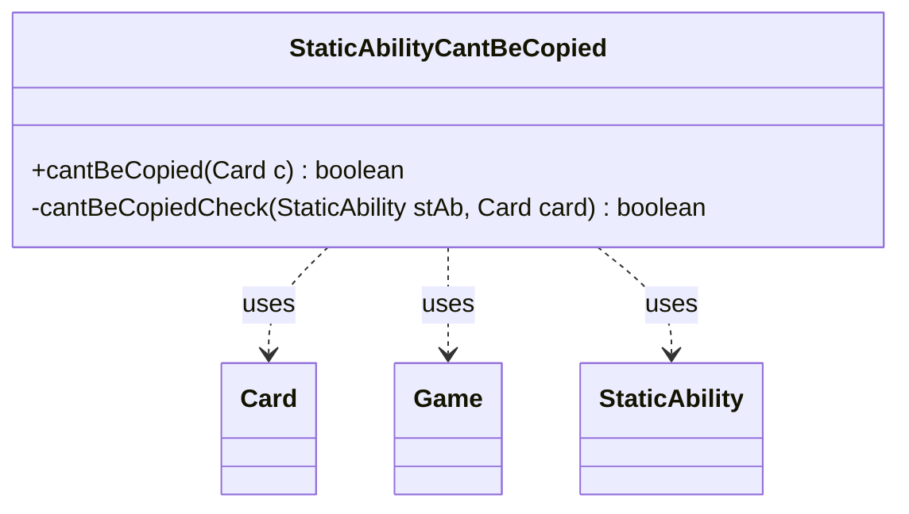

---
aliases:
  - StaticAbilityCantBeCopied
tags:
  - java/class
  - module/forge-game
  - pkg/forge/game/staticability
fqn: forge.game.staticability.StaticAbilityCantBeCopied
package: forge.game.staticability
module: forge-game
kind: Class
---

# StaticAbilityCantBeCopied

**Package:** `forge.game.staticability` &nbsp; **Module:** `forge-game` &nbsp; **Kind:** Class



## Relationships
**Uses:**
- [[forge.game.Game|Game]]
- [[forge.game.card.Card|Card]]
- [[forge.game.staticability.StaticAbility|StaticAbility]]

## Design Description

StaticAbilityCantBeCopied is a stateless utility that enforces Magic's "can't be copied" rules layer, determining whether a given card is prevented from being copied by any active static ability. Its public `cantBeCopied(Card)` entry point queries the card's Game for all cards in the static-ability source zones, iterates each card's StaticAbility list, filters to those whose conditions match the CantBeCopied mode, and delegates to the private `cantBeCopiedCheck` helper, which returns true when the candidate card matches the ability's `ValidCard` parameter.

Rather than implementing an interface or extending a supertype, the class collaborates purely through static methods over Card, Game, and StaticAbility, fitting Forge's pattern of one focused checker per static-ability mode. The design centralizes a single rule check, keeps no instance state, and relies on StaticAbility's condition and valid-parameter matching to remain data-driven against card definitions.

## Source
`forge-game/src/main/java/forge/game/staticability/StaticAbilityCantBeCopied.java`

```java
/*
 * Forge: Play Magic: the Gathering.
 * Copyright (C) 2011  Forge Team
 *
 * This program is free software: you can redistribute it and/or modify
 * it under the terms of the GNU General Public License as published by
 * the Free Software Foundation, either version 3 of the License, or
 * (at your option) any later version.
 *
 * This program is distributed in the hope that it will be useful,
 * but WITHOUT ANY WARRANTY; without even the implied warranty of
 * MERCHANTABILITY or FITNESS FOR A PARTICULAR PURPOSE.  See the
 * GNU General Public License for more details.
 *
 * You should have received a copy of the GNU General Public License
 * along with this program.  If not, see <http://www.gnu.org/licenses/>.
 */
package forge.game.staticability;

import forge.game.Game;
import forge.game.card.Card;
import forge.game.zone.ZoneType;

/**
 * The Class StaticAbility_CantBeCopied.
 */
public class StaticAbilityCantBeCopied {

    public static boolean cantBeCopied(final Card c) {
        final Game game = c.getGame();
        for (final Card ca : game.getCardsIn(ZoneType.STATIC_ABILITIES_SOURCE_ZONES)) {
            for (final StaticAbility stAb : ca.getStaticAbilities()) {
                if (!stAb.checkConditions(StaticAbilityMode.CantBeCopied)) {
                    continue;
                }
                if (cantBeCopiedCheck(stAb, c)) {
                    return true;
                }
            }
        }
        return false;
    }

    private static boolean cantBeCopiedCheck(final StaticAbility stAb, final Card card) {
        if (stAb.matchesValidParam("ValidCard", card)) {
            return true;
        }
        return false;
    }
}
```

## Python
`forge/game/staticability/StaticAbilityCantBeCopied.py`

```python
from forge.game.Game import Game
from forge.game.card.Card import Card
from forge.game.zone.ZoneType import ZoneType
from forge.game.staticability.StaticAbility import StaticAbility
from forge.game.staticability.StaticAbilityMode import StaticAbilityMode


class StaticAbilityCantBeCopied:

    @staticmethod
    def cantBeCopied(c: Card) -> bool:
        game = c.getGame()
        for ca in game.getCardsIn(ZoneType.STATIC_ABILITIES_SOURCE_ZONES):
            for stAb in ca.getStaticAbilities():
                if not stAb.checkConditions(StaticAbilityMode.CantBeCopied):
                    continue
                if StaticAbilityCantBeCopied.cantBeCopiedCheck(stAb, c):
                    return True
        return False

    @staticmethod
    def cantBeCopiedCheck(stAb: StaticAbility, card: Card) -> bool:
        if stAb.matchesValidParam("ValidCard", card):
            return True
        return False
```
