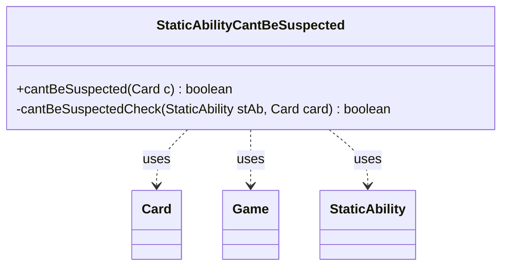

---
aliases:
  - StaticAbilityCantBeSuspected
tags:
  - java/class
  - module/forge-game
  - pkg/forge/game/staticability
fqn: forge.game.staticability.StaticAbilityCantBeSuspected
package: forge.game.staticability
module: forge-game
kind: Class
---

# StaticAbilityCantBeSuspected

**Package:** `forge.game.staticability` &nbsp; **Module:** `forge-game` &nbsp; **Kind:** Class



## Relationships
**Uses:**
- [[forge.game.Game|Game]]
- [[forge.game.card.Card|Card]]
- [[forge.game.staticability.StaticAbility|StaticAbility]]

## Design Description

StaticAbilityCantBeSuspected is a stateless utility class encapsulating the rule logic that determines whether a card can be prevented from being suspected (a Mystery/intrigue-style game mechanic). Its sole public responsibility, exposed through the static `cantBeSuspected(Card)` method, is to scan every static-ability source zone in the Game, iterate the StaticAbilities on each Card, and report whether any active ability with the CantBeSuspected mode applies to the given card.

Rather than extending StaticAbility, it acts as a focused helper that collaborates with Card (for game and ability access), Game (for zone-wide card enumeration), and StaticAbility (for condition checking and `ValidCard` matching). The private `cantBeSuspectedCheck` helper isolates the actual validity test, reflecting the package's consistent convention of one static-only resolver class per static-ability mode.

## Source
`forge-game/src/main/java/forge/game/staticability/StaticAbilityCantBeSuspected.java`

```java
package forge.game.staticability;

import forge.game.Game;
import forge.game.card.Card;
import forge.game.zone.ZoneType;

public class StaticAbilityCantBeSuspected {

    public static boolean cantBeSuspected(final Card c) {
        final Game game = c.getGame();
        for (final Card ca : game.getCardsIn(ZoneType.STATIC_ABILITIES_SOURCE_ZONES)) {
            for (final StaticAbility stAb : ca.getStaticAbilities()) {
                if (!stAb.checkConditions(StaticAbilityMode.CantBeSuspected)) {
                    continue;
                }
                if (cantBeSuspectedCheck(stAb, c)) {
                    return true;
                }
            }
        }
        return false;
    }

    private static boolean cantBeSuspectedCheck(final StaticAbility stAb, final Card card) {
        if (stAb.matchesValidParam("ValidCard", card)) {
            return true;
        }
        return false;
    }
}
```

## Python
`forge/game/staticability/StaticAbilityCantBeSuspected.py`

```python
from forge.game.Game import Game
from forge.game.card.Card import Card
from forge.game.zone.ZoneType import ZoneType
from forge.game.staticability.StaticAbility import StaticAbility


class StaticAbilityCantBeSuspected:

    @staticmethod
    def cantBeSuspected(c: Card) -> bool:
        game = c.getGame()
        for ca in game.getCardsIn(ZoneType.STATIC_ABILITIES_SOURCE_ZONES):
            for stAb in ca.getStaticAbilities():
                if not stAb.checkConditions(StaticAbilityMode.CantBeSuspected):
                    continue
                if StaticAbilityCantBeSuspected.cantBeSuspectedCheck(stAb, c):
                    return True
        return False

    @staticmethod
    def cantBeSuspectedCheck(stAb: StaticAbility, card: Card) -> bool:
        if stAb.matchesValidParam("ValidCard", card):
            return True
        return False
```
