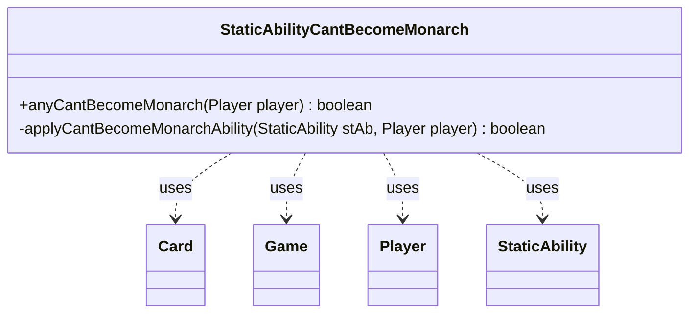

---
aliases:
  - StaticAbilityCantBecomeMonarch
tags:
  - java/class
  - module/forge-game
  - pkg/forge/game/staticability
fqn: forge.game.staticability.StaticAbilityCantBecomeMonarch
package: forge.game.staticability
module: forge-game
kind: Class
---

# StaticAbilityCantBecomeMonarch

**Package:** `forge.game.staticability` &nbsp; **Module:** `forge-game` &nbsp; **Kind:** Class



## Relationships
**Uses:**
- [[forge.game.Game|Game]]
- [[forge.game.card.Card|Card]]
- [[forge.game.player.Player|Player]]
- [[forge.game.staticability.StaticAbility|StaticAbility]]

## Design Description

StaticAbilityCantBecomeMonarch is a stateless utility that enforces continuous effects preventing players from becoming the monarch. Its single public entry point, `anyCantBecomeMonarch`, scans every Card in the zones that can source static abilities, filters those whose `StaticAbilityMode.CantBecomeMonarch` conditions currently hold, and returns whether any such ability applies to the given Player. The private helper isolates the per-ability matching logic, checking the `ValidPlayer` parameter against the candidate.

Rather than extending a common supertype, the class follows the package's convention of grouping one static-ability check into a class of static methods, collaborating with StaticAbility for condition and parameter evaluation, and with Game, Card, and Player to traverse game state. Returning early on the first match reflects an any-match short-circuit: a single qualifying restriction is enough to deny monarch status.

## Source
`forge-game/src/main/java/forge/game/staticability/StaticAbilityCantBecomeMonarch.java`

```java
package forge.game.staticability;

import forge.game.Game;
import forge.game.card.Card;
import forge.game.player.Player;
import forge.game.zone.ZoneType;

public class StaticAbilityCantBecomeMonarch {

    public static boolean anyCantBecomeMonarch(final Player player) {
        final Game game = player.getGame();
        for (final Card ca : game.getCardsIn(ZoneType.STATIC_ABILITIES_SOURCE_ZONES)) {
            for (final StaticAbility stAb : ca.getStaticAbilities()) {
                if (!stAb.checkConditions(StaticAbilityMode.CantBecomeMonarch)) {
                    continue;
                }
                if (applyCantBecomeMonarchAbility(stAb, player)) {
                    return true;
                }
            }
        }
        return false;
    }

    private static boolean applyCantBecomeMonarchAbility(final StaticAbility stAb, final Player player) {
        if (!stAb.matchesValidParam("ValidPlayer", player)) {
            return false;
        }
        return true;
    }
}
```

## Python
`forge/game/staticability/StaticAbilityCantBecomeMonarch.py`

```python
package: forge.game.staticability

from forge.game.Game import Game
from forge.game.card.Card import Card
from forge.game.player.Player import Player
from forge.game.staticability.StaticAbility import StaticAbility
from forge.game.zone.ZoneType import ZoneType


class StaticAbilityCantBecomeMonarch:

    @staticmethod
    def anyCantBecomeMonarch(player: Player) -> bool:
        game = player.getGame()
        for ca in game.getCardsIn(ZoneType.STATIC_ABILITIES_SOURCE_ZONES):
            for stAb in ca.getStaticAbilities():
                if not stAb.checkConditions(StaticAbilityMode.CantBecomeMonarch):
                    continue
                if StaticAbilityCantBecomeMonarch.applyCantBecomeMonarchAbility(stAb, player):
                    return True
        return False

    @staticmethod
    def applyCantBecomeMonarchAbility(stAb: StaticAbility, player: Player) -> bool:
        if not stAb.matchesValidParam("ValidPlayer", player):
            return False
        return True
```
