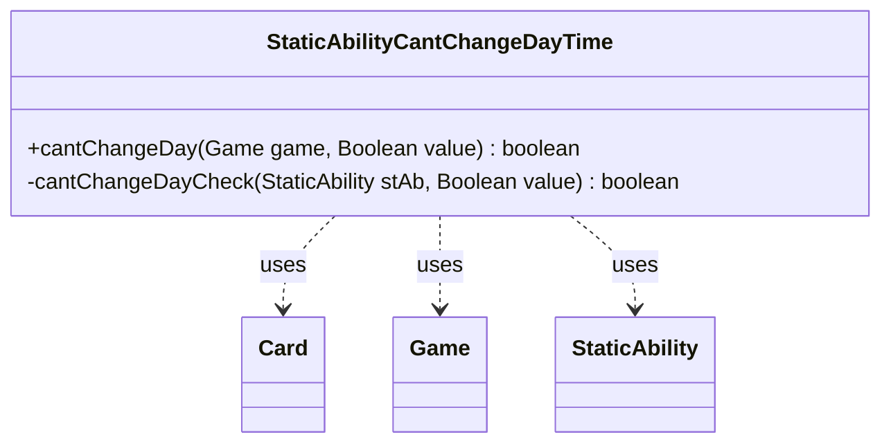

---
aliases:
  - StaticAbilityCantChangeDayTime
tags:
  - java/class
  - module/forge-game
  - pkg/forge/game/staticability
fqn: forge.game.staticability.StaticAbilityCantChangeDayTime
package: forge.game.staticability
module: forge-game
kind: Class
---

# StaticAbilityCantChangeDayTime

**Package:** `forge.game.staticability` &nbsp; **Module:** `forge-game` &nbsp; **Kind:** Class



## Relationships
**Uses:**
- [[forge.game.Game|Game]]
- [[forge.game.card.Card|Card]]
- [[forge.game.staticability.StaticAbility|StaticAbility]]

## Design Description

StaticAbilityCantChangeDayTime is a stateless utility that enforces "can't change day/night" replacement effects within Forge's day/night cycle. Its public `cantChangeDay` method scans every card in the static-ability source zones of the supplied Game, inspecting each Card's StaticAbility entries whose conditions match the `CantChangeDayTime` mode and delegating to the private `cantChangeDayCheck` helper to decide whether a proposed transition (the desired day-state `value`) is prohibited.

As a static-only helper, it holds no state and instead collaborates with Game (for zone/card enumeration), Card (for its static abilities), and StaticAbility (for condition checks and the optional `NewTime` parameter). It follows the package convention of one focused class per static-ability mode, keeping the prohibition logic isolated and parameter-driven so day-state restrictions are configurable per ability.

## Source
`forge-game/src/main/java/forge/game/staticability/StaticAbilityCantChangeDayTime.java`

```java
package forge.game.staticability;

import forge.game.Game;
import forge.game.card.Card;
import forge.game.zone.ZoneType;

public class StaticAbilityCantChangeDayTime {

    public static boolean cantChangeDay(final Game game, Boolean value) {
        if (value == null) {
            return false;
        }
        for (final Card ca : game.getCardsIn(ZoneType.STATIC_ABILITIES_SOURCE_ZONES)) {
            for (final StaticAbility stAb : ca.getStaticAbilities()) {
                if (!stAb.checkConditions(StaticAbilityMode.CantChangeDayTime)) {
                    continue;
                }
                if (cantChangeDayCheck(stAb, value)) {
                    return true;
                }
            }
        }
        return false;
    }

    private static boolean cantChangeDayCheck(final StaticAbility stAb, final Boolean value) {
        if (stAb.hasParam("NewTime")) {
            switch(stAb.getParam("NewTime")) {
            case "Day":
                if (value != false) {
                    return false;
                }
            case "Night":
                if (value != true) {
                    return false;
                }
            }
        }
        return true;
    }
}
```

## Python
`forge/game/staticability/StaticAbilityCantChangeDayTime.py`

```python
package: forge.game.staticability

The Java imports: forge.game.Game, forge.game.card.Card, forge.game.zone.ZoneType. Also uses StaticAbility, StaticAbilityMode (same package). Relationships lists Game, Card, StaticAbility.

Let me write the Python port.from forge.game.Game import Game
from forge.game.card.Card import Card
from forge.game.zone.ZoneType import ZoneType
from forge.game.staticability.StaticAbility import StaticAbility
from forge.game.staticability.StaticAbilityMode import StaticAbilityMode


class StaticAbilityCantChangeDayTime:

    @staticmethod
    def cantChangeDay(game: Game, value: bool) -> bool:
        if value is None:
            return False
        for ca in game.getCardsIn(ZoneType.STATIC_ABILITIES_SOURCE_ZONES):
            for stAb in ca.getStaticAbilities():
                if not stAb.checkConditions(StaticAbilityMode.CantChangeDayTime):
                    continue
                if StaticAbilityCantChangeDayTime.cantChangeDayCheck(stAb, value):
                    return True
        return False

    @staticmethod
    def cantChangeDayCheck(stAb: StaticAbility, value: bool) -> bool:
        if stAb.hasParam("NewTime"):
            newTime = stAb.getParam("NewTime")
            if newTime == "Day":
                if value != False:
                    return False
                if value != True:
                    return False
            elif newTime == "Night":
                if value != True:
                    return False
        return True
```
