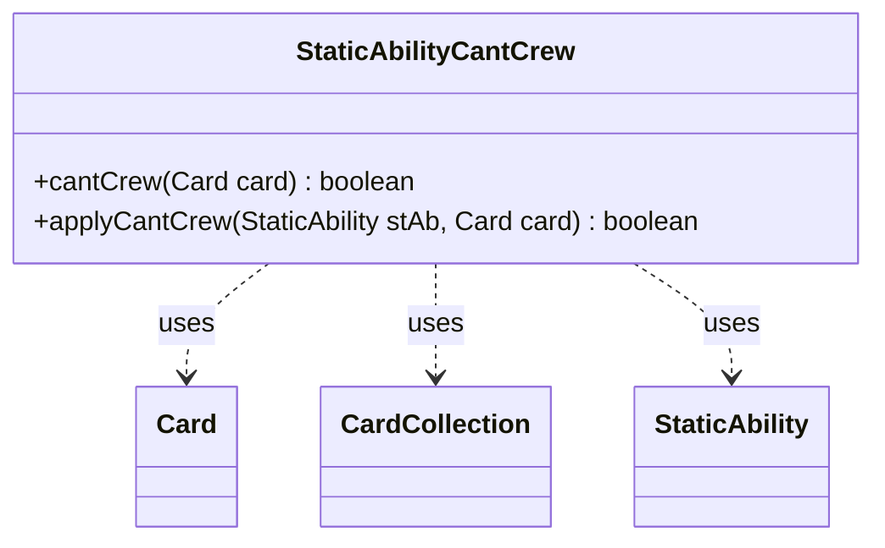

---
aliases:
  - StaticAbilityCantCrew
tags:
  - java/class
  - module/forge-game
  - pkg/forge/game/staticability
fqn: forge.game.staticability.StaticAbilityCantCrew
package: forge.game.staticability
module: forge-game
kind: Class
---

# StaticAbilityCantCrew

**Package:** `forge.game.staticability`   **Module:** `forge-game`   **Kind:** Class



## Relationships
**Uses:**
- [[forge.game.card.Card|Card]]
- [[forge.game.card.CardCollection|CardCollection]]
- [[forge.game.staticability.StaticAbility|StaticAbility]]

## Design Description

StaticAbilityCantCrew is a stateless utility that evaluates whether a given Card is prohibited from being used to crew a Vehicle, implementing the rules layer behind "can't crew" static abilities. Its `cantCrew` entry point gathers every active static-ability source — the cards in the relevant zones plus the candidate card itself, collected into a CardCollection — and scans each Card's StaticAbility list for any in CantCrew mode whose conditions are met, delegating the per-ability test to `applyCantCrew`, which simply checks the card against the ability's `ValidCard` parameter.

Following the package's convention, the class exposes only static methods and holds no state, acting as a focused helper that collaborates with Card and StaticAbility rather than extending them. This keeps the crew-restriction rule isolated and uniformly discoverable alongside the other `StaticAbility*` evaluators.

## Source
`forge-game/src/main/java/forge/game/staticability/StaticAbilityCantCrew.java`

```java
package forge.game.staticability;

import forge.game.card.Card;
import forge.game.card.CardCollection;
import forge.game.zone.ZoneType;

public class StaticAbilityCantCrew {

    public static boolean cantCrew(final Card card) {
        CardCollection list = new CardCollection(card.getGame().getCardsIn(ZoneType.STATIC_ABILITIES_SOURCE_ZONES));
        list.add(card);
        for (final Card ca : list) {
            for (final StaticAbility stAb : ca.getStaticAbilities()) {
                if (!stAb.checkConditions(StaticAbilityMode.CantCrew)) {
                    continue;
                }
                if (applyCantCrew(stAb, card)) {
                    return true;
                }
            }
        }
        return false;
    }

    public static boolean applyCantCrew(final StaticAbility stAb, final Card card) {
        if (!stAb.matchesValidParam("ValidCard", card)) {
            return false;
        }
        return true;
    }

}
```

## Python
`forge/game/staticability/StaticAbilityCantCrew.py`

```python
from forge.game.card.Card import Card
from forge.game.card.CardCollection import CardCollection
from forge.game.zone.ZoneType import ZoneType
from forge.game.staticability.StaticAbility import StaticAbility
from forge.game.staticability.StaticAbilityMode import StaticAbilityMode


class StaticAbilityCantCrew:

    @staticmethod
    def cantCrew(card: Card) -> bool:
        list = CardCollection(card.getGame().getCardsIn(ZoneType.STATIC_ABILITIES_SOURCE_ZONES))
        list.add(card)
        for ca in list:
            for stAb in ca.getStaticAbilities():
                if not stAb.checkConditions(StaticAbilityMode.CantCrew):
                    continue
                if StaticAbilityCantCrew.applyCantCrew(stAb, card):
                    return True
        return False

    @staticmethod
    def applyCantCrew(stAb: StaticAbility, card: Card) -> bool:
        if not stAb.matchesValidParam("ValidCard", card):
            return False
        return True
```
