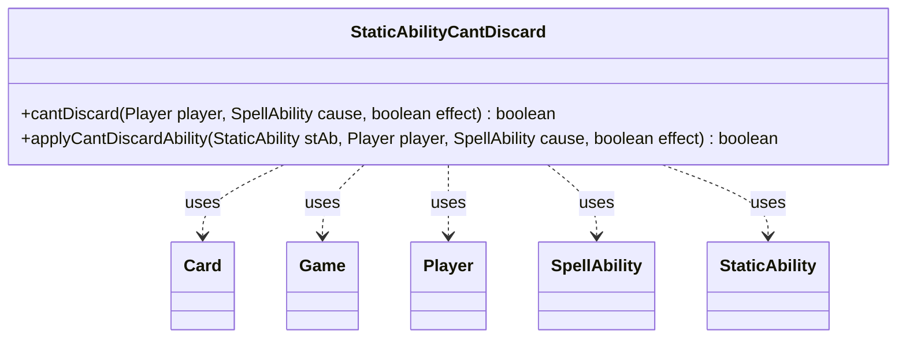

---
aliases:
  - StaticAbilityCantDiscard
tags:
  - java/class
  - module/forge-game
  - pkg/forge/game/staticability
fqn: forge.game.staticability.StaticAbilityCantDiscard
package: forge.game.staticability
module: forge-game
kind: Class
---

# StaticAbilityCantDiscard

**Package:** `forge.game.staticability` &nbsp; **Module:** `forge-game` &nbsp; **Kind:** Class



## Relationships
**Uses:**
- [[forge.game.Game|Game]]
- [[forge.game.card.Card|Card]]
- [[forge.game.player.Player|Player]]
- [[forge.game.spellability.SpellAbility|SpellAbility]]
- [[forge.game.staticability.StaticAbility|StaticAbility]]

## Design Description

StaticAbilityCantDiscard is a stateless utility class that resolves whether a given player is currently prevented from discarding cards by any active static ability. Its `cantDiscard` method scans every card in the zones that can host static abilities, filters those whose conditions match the `CantDiscard` mode, and delegates each candidate to `applyCantDiscardAbility`, returning true as soon as one applies. The helper evaluates a single `StaticAbility` against the player and triggering `SpellAbility`, checking the `ValidPlayer`, `ForCost`, and `ValidCause` parameters.

Holding only static methods and collaborating with `Game`, `Card`, `Player`, `SpellAbility`, and `StaticAbility`, it follows the engine's convention of one focused handler class per static-ability mode, keeping replacement-style discard restrictions isolated and data-driven through parameter matching rather than hard-coded rules.

## Source
`forge-game/src/main/java/forge/game/staticability/StaticAbilityCantDiscard.java`

```java
package forge.game.staticability;

import forge.game.Game;
import forge.game.card.Card;
import forge.game.player.Player;
import forge.game.spellability.SpellAbility;
import forge.game.zone.ZoneType;

public class StaticAbilityCantDiscard {

    public static boolean cantDiscard(final Player player, final SpellAbility cause, final boolean effect)  {
        final Game game = player.getGame();
        for (final Card ca : game.getCardsIn(ZoneType.STATIC_ABILITIES_SOURCE_ZONES)) {
            for (final StaticAbility stAb : ca.getStaticAbilities()) {
                if (!stAb.checkConditions(StaticAbilityMode.CantDiscard)) {
                    continue;
                }

                if (applyCantDiscardAbility(stAb, player, cause, effect)) {
                    return true;
                }
            }
        }
        return false;
    }

    public static boolean applyCantDiscardAbility(final StaticAbility stAb, final Player player, final SpellAbility cause, final boolean effect) {
        if (!stAb.matchesValidParam("ValidPlayer", player)) {
            return false;
        }
        if (stAb.hasParam("ForCost")) {
            if ("True".equalsIgnoreCase(stAb.getParam("ForCost")) == effect) {
                return false;
            }
        }
        if (!stAb.matchesValidParam("ValidCause", cause)) {
            return false;
        }
        return true;
    }
}
```

## Python
`forge/game/staticability/StaticAbilityCantDiscard.py`

```python
from forge.game.Game import Game
from forge.game.card.Card import Card
from forge.game.player.Player import Player
from forge.game.spellability.SpellAbility import SpellAbility
from forge.game.staticability.StaticAbility import StaticAbility
from forge.game.staticability.StaticAbilityMode import StaticAbilityMode
from forge.game.zone.ZoneType import ZoneType


class StaticAbilityCantDiscard:

    @staticmethod
    def cantDiscard(player: Player, cause: SpellAbility, effect: bool) -> bool:
        game = player.getGame()
        for ca in game.getCardsIn(ZoneType.STATIC_ABILITIES_SOURCE_ZONES):
            for stAb in ca.getStaticAbilities():
                if not stAb.checkConditions(StaticAbilityMode.CantDiscard):
                    continue

                if StaticAbilityCantDiscard.applyCantDiscardAbility(stAb, player, cause, effect):
                    return True
        return False

    @staticmethod
    def applyCantDiscardAbility(stAb: StaticAbility, player: Player, cause: SpellAbility, effect: bool) -> bool:
        if not stAb.matchesValidParam("ValidPlayer", player):
            return False
        if stAb.hasParam("ForCost"):
            if ("True".lower() == stAb.getParam("ForCost").lower()) == effect:
                return False
        if not stAb.matchesValidParam("ValidCause", cause):
            return False
        return True
```
