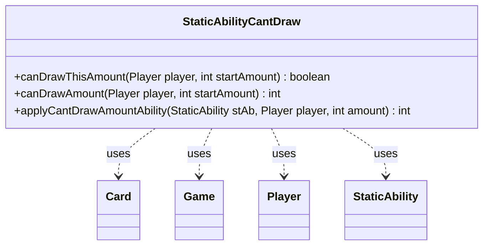

---
aliases:
  - StaticAbilityCantDraw
tags:
  - java/class
  - module/forge-game
  - pkg/forge/game/staticability
fqn: forge.game.staticability.StaticAbilityCantDraw
package: forge.game.staticability
module: forge-game
kind: Class
---

# StaticAbilityCantDraw

**Package:** `forge.game.staticability` &nbsp; **Module:** `forge-game` &nbsp; **Kind:** Class



## Relationships
**Uses:**
- [[forge.game.Game|Game]]
- [[forge.game.card.Card|Card]]
- [[forge.game.player.Player|Player]]
- [[forge.game.staticability.StaticAbility|StaticAbility]]

## Design Description

Forge's `StaticAbilityCantDraw` is a stateless utility that resolves how many cards a player may legally draw under active "can't draw" continuous effects. Its three static methods form a layered query: `canDrawThisAmount` answers a yes/no legality check, `canDrawAmount` computes the permitted total by scanning every static-ability source on the battlefield, and `applyCantDrawAmountAbility` evaluates a single `StaticAbility` against the player.

Rather than extending a base class, it acts as a self-contained helper alongside the `StaticAbility` system, collaborating with `Game` to enumerate `Card` sources, `Card` to expose their abilities, and `Player` to filter by `ValidPlayer` and track cards already drawn this turn. Notable design intent includes short-circuiting non-positive draw amounts, clamping each ability's `DrawLimit` against the turn's draw count via `Math.min`/`Math.max`, and using parameter-driven configuration so card-specific limits stay data-defined rather than hardcoded.

## Source
`forge-game/src/main/java/forge/game/staticability/StaticAbilityCantDraw.java`

```java
package forge.game.staticability;

import forge.game.Game;
import forge.game.card.Card;
import forge.game.player.Player;
import forge.game.zone.ZoneType;

public class StaticAbilityCantDraw {

    public static boolean canDrawThisAmount(final Player player, int startAmount) {
        if (startAmount <= 0) {
            return true;
        }
        return startAmount <= canDrawAmount(player, startAmount);
    }
    public static int canDrawAmount(final Player player, int startAmount) {
        int amount = startAmount;
        if (startAmount <= 0)
            return 0;
        final Game game = player.getGame();
        for (final Card ca : game.getCardsIn(ZoneType.STATIC_ABILITIES_SOURCE_ZONES)) {
            for (final StaticAbility stAb : ca.getStaticAbilities()) {
                if (!stAb.checkConditions(StaticAbilityMode.CantDraw)) {
                    continue;
                }
                amount = applyCantDrawAmountAbility(stAb, player, amount);
            }
        }
        return amount;
    }

    public static int applyCantDrawAmountAbility(final StaticAbility stAb, final Player player, int amount) {
        if (!stAb.matchesValidParam("ValidPlayer", player)) {
            return amount;
        }
        int limit = Integer.parseInt(stAb.getParamOrDefault("DrawLimit", "0"));
        int drawn = player.getNumDrawnThisTurn();
        return Math.min(Math.max(limit - drawn, 0), amount);
    }
}
```

## Python
`forge/game/staticability/StaticAbilityCantDraw.py`

```python
from forge.game.Game import Game
from forge.game.card.Card import Card
from forge.game.player.Player import Player
from forge.game.zone.ZoneType import ZoneType
from forge.game.staticability.StaticAbility import StaticAbility
from forge.game.staticability.StaticAbilityMode import StaticAbilityMode


class StaticAbilityCantDraw:

    @staticmethod
    def canDrawThisAmount(player: Player, startAmount: int) -> bool:
        if startAmount <= 0:
            return True
        return startAmount <= StaticAbilityCantDraw.canDrawAmount(player, startAmount)

    @staticmethod
    def canDrawAmount(player: Player, startAmount: int) -> int:
        amount = startAmount
        if startAmount <= 0:
            return 0
        game = player.getGame()
        for ca in game.getCardsIn(ZoneType.STATIC_ABILITIES_SOURCE_ZONES):
            for stAb in ca.getStaticAbilities():
                if not stAb.checkConditions(StaticAbilityMode.CantDraw):
                    continue
                amount = StaticAbilityCantDraw.applyCantDrawAmountAbility(stAb, player, amount)
        return amount

    @staticmethod
    def applyCantDrawAmountAbility(stAb: StaticAbility, player: Player, amount: int) -> int:
        if not stAb.matchesValidParam("ValidPlayer", player):
            return amount
        limit = int(stAb.getParamOrDefault("DrawLimit", "0"))
        drawn = player.getNumDrawnThisTurn()
        return min(max(limit - drawn, 0), amount)
```
