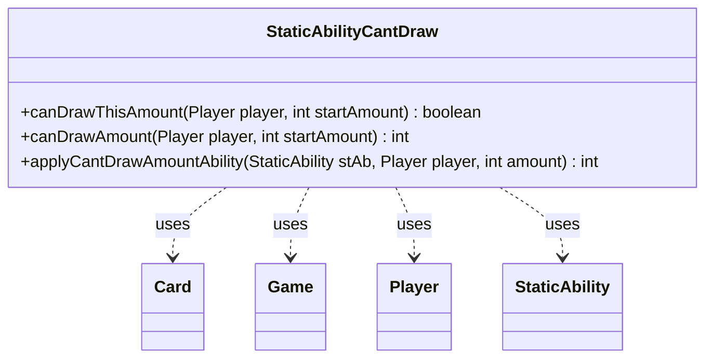

---
aliases:
  - StaticAbilityCantDraw
tags:
  - java/class
  - module/forge-game
  - pkg/forge/game/staticability
fqn: forge.game.staticability.StaticAbilityCantDraw
package: forge.game.staticability
module: forge-game
kind: Class
---

# StaticAbilityCantDraw

**Package:** `forge.game.staticability` &nbsp; **Module:** `forge-game` &nbsp; **Kind:** Class



## Relationships
**Uses:**
- [[forge.game.Game|Game]]
- [[forge.game.card.Card|Card]]
- [[forge.game.player.Player|Player]]
- [[forge.game.staticability.StaticAbility|StaticAbility]]

## Source
`forge-game/src/main/java/forge/game/staticability/StaticAbilityCantDraw.java`

```java
package forge.game.staticability;

import forge.game.Game;
import forge.game.card.Card;
import forge.game.player.Player;
import forge.game.zone.ZoneType;

public class StaticAbilityCantDraw {

    public static boolean canDrawThisAmount(final Player player, int startAmount) {
        if (startAmount <= 0) {
            return true;
        }
        return startAmount <= canDrawAmount(player, startAmount);
    }
    public static int canDrawAmount(final Player player, int startAmount) {
        int amount = startAmount;
        if (startAmount <= 0)
            return 0;
        final Game game = player.getGame();
        for (final Card ca : game.getCardsIn(ZoneType.STATIC_ABILITIES_SOURCE_ZONES)) {
            for (final StaticAbility stAb : ca.getStaticAbilities()) {
                if (!stAb.checkConditions(StaticAbilityMode.CantDraw)) {
                    continue;
                }
                amount = applyCantDrawAmountAbility(stAb, player, amount);
            }
        }
        return amount;
    }

    public static int applyCantDrawAmountAbility(final StaticAbility stAb, final Player player, int amount) {
        if (!stAb.matchesValidParam("ValidPlayer", player)) {
            return amount;
        }
        int limit = Integer.parseInt(stAb.getParamOrDefault("DrawLimit", "0"));
        int drawn = player.getNumDrawnThisTurn();
        return Math.min(Math.max(limit - drawn, 0), amount);
    }
}
```
