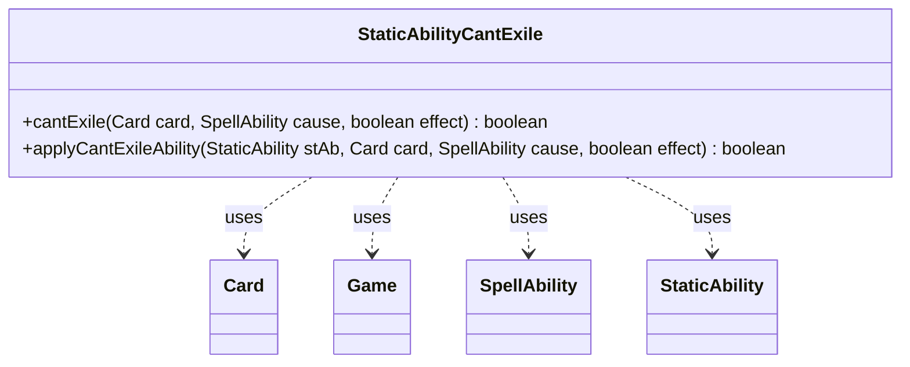

---
aliases:
  - StaticAbilityCantExile
tags:
  - java/class
  - module/forge-game
  - pkg/forge/game/staticability
fqn: forge.game.staticability.StaticAbilityCantExile
package: forge.game.staticability
module: forge-game
kind: Class
---

# StaticAbilityCantExile

**Package:** `forge.game.staticability` &nbsp; **Module:** `forge-game` &nbsp; **Kind:** Class



## Relationships
**Uses:**
- [[forge.game.Game|Game]]
- [[forge.game.card.Card|Card]]
- [[forge.game.spellability.SpellAbility|SpellAbility]]
- [[forge.game.staticability.StaticAbility|StaticAbility]]

## Design Description

StaticAbilityCantExile is a stateless utility that resolves the "can't be exiled" replacement rule for the Forge game engine. Its static `cantExile` method scans every card in the zones that can host static abilities, filters those whose conditions match the `CantExile` mode, and delegates to `applyCantExileAbility` to test a specific ability against the target card, the triggering cause, and an `effect` flag; a single match short-circuits to forbid the exile. The helper performs the matching by validating the `ValidCard` and `ValidCause` parameters and honoring an optional `ForCost` qualifier.

Rather than implementing an interface or extending a supertype, the class follows the package's convention of grouping a single static-ability rule into purely static methods. It collaborates with Card (its game and static abilities), StaticAbility (condition checks and parameter matching), Game and SpellAbility, keeping the exile-prevention logic centralized and side-effect free.

## Source
`forge-game/src/main/java/forge/game/staticability/StaticAbilityCantExile.java`

```java
package forge.game.staticability;

import forge.game.Game;
import forge.game.card.Card;
import forge.game.spellability.SpellAbility;
import forge.game.zone.ZoneType;

public class StaticAbilityCantExile {

    public static boolean cantExile(final Card card, final SpellAbility cause, final boolean effect)  {
        final Game game = card.getGame();
        for (final Card ca : game.getCardsIn(ZoneType.STATIC_ABILITIES_SOURCE_ZONES)) {
            for (final StaticAbility stAb : ca.getStaticAbilities()) {
                if (!stAb.checkConditions(StaticAbilityMode.CantExile)) {
                    continue;
                }

                if (applyCantExileAbility(stAb, card, cause, effect)) {
                    return true;
                }
            }
        }
        return false;
    }

    public static boolean applyCantExileAbility(final StaticAbility stAb, final Card card, final SpellAbility cause, final boolean effect) {
        if (!stAb.matchesValidParam("ValidCard", card)) {
            return false;
        }
        if (stAb.hasParam("ForCost")) {
            if ("True".equalsIgnoreCase(stAb.getParam("ForCost")) == effect) {
                return false;
            }
        }
        if (!stAb.matchesValidParam("ValidCause", cause)) {
            return false;
        }
        return true;
    }
}
```

## Python
`forge/game/staticability/StaticAbilityCantExile.py`

```python
from forge.game.Game import Game
from forge.game.card.Card import Card
from forge.game.spellability.SpellAbility import SpellAbility
from forge.game.zone.ZoneType import ZoneType
from forge.game.staticability.StaticAbility import StaticAbility
from forge.game.staticability.StaticAbilityMode import StaticAbilityMode


class StaticAbilityCantExile:

    @staticmethod
    def cantExile(card: Card, cause: SpellAbility, effect: bool) -> bool:
        game = card.getGame()
        for ca in game.getCardsIn(ZoneType.STATIC_ABILITIES_SOURCE_ZONES):
            for stAb in ca.getStaticAbilities():
                if not stAb.checkConditions(StaticAbilityMode.CantExile):
                    continue

                if StaticAbilityCantExile.applyCantExileAbility(stAb, card, cause, effect):
                    return True
        return False

    @staticmethod
    def applyCantExileAbility(stAb: StaticAbility, card: Card, cause: SpellAbility, effect: bool) -> bool:
        if not stAb.matchesValidParam("ValidCard", card):
            return False
        if stAb.hasParam("ForCost"):
            if ("True".lower() == (stAb.getParam("ForCost") or "").lower()) == effect:
                return False
        if not stAb.matchesValidParam("ValidCause", cause):
            return False
        return True
```
