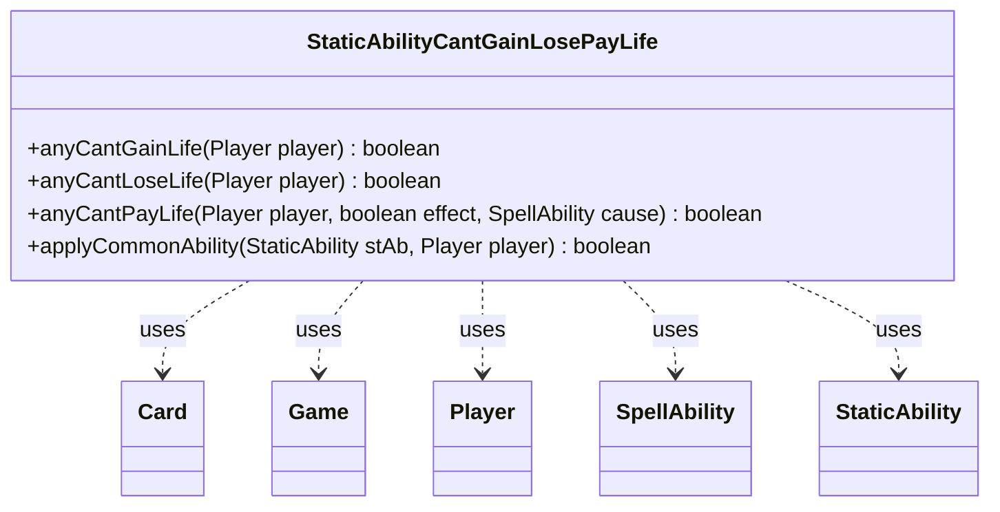

---
aliases:
  - StaticAbilityCantGainLosePayLife
tags:
  - java/class
  - module/forge-game
  - pkg/forge/game/staticability
fqn: forge.game.staticability.StaticAbilityCantGainLosePayLife
package: forge.game.staticability
module: forge-game
kind: Class
---

# StaticAbilityCantGainLosePayLife

**Package:** `forge.game.staticability`   **Module:** `forge-game`   **Kind:** Class



## Relationships
**Uses:**
- [[forge.game.Game|Game]]
- [[forge.game.card.Card|Card]]
- [[forge.game.player.Player|Player]]
- [[forge.game.spellability.SpellAbility|SpellAbility]]
- [[forge.game.staticability.StaticAbility|StaticAbility]]

## Design Description

StaticAbilityCantGainLosePayLife is a stateless utility class that centralizes the engine's enforcement of continuous "can't gain/lose/pay life" replacement effects. Its static query methods—`anyCantGainLife`, `anyCantLoseLife`, and `anyCantPayLife`—scan every Card in the game's static-ability source zones, filter their StaticAbility instances by the relevant StaticAbilityMode (with `CantChangeLife` acting as a superset, and `CantPayLife` subsuming life-loss restrictions), and verify each ability's conditions before delegating to the shared `applyCommonAbility` helper for the `ValidPlayer` check.

Rather than implementing an interface or extending a supertype, the class collaborates with Game, Card, Player, SpellAbility, and StaticAbility purely procedurally, mirroring Forge's family of `StaticAbilityCant*` helpers. Notable design intent includes the `ForCost`/`effect` distinction and `ValidCause` matching in `anyCantPayLife`, which let life-payment prohibitions discriminate between costs and effects and target specific causing abilities.

## Source
`forge-game/src/main/java/forge/game/staticability/StaticAbilityCantGainLosePayLife.java`

```java
package forge.game.staticability;

import forge.game.Game;
import forge.game.card.Card;
import forge.game.player.Player;
import forge.game.spellability.SpellAbility;
import forge.game.zone.ZoneType;

public class StaticAbilityCantGainLosePayLife {

    public static boolean anyCantGainLife(final Player player) {
        final Game game = player.getGame();
        for (final Card ca : game.getCardsIn(ZoneType.STATIC_ABILITIES_SOURCE_ZONES)) {
            for (final StaticAbility stAb : ca.getStaticAbilities()) {
                if (!(stAb.checkMode(StaticAbilityMode.CantGainLife) || stAb.checkMode(StaticAbilityMode.CantChangeLife))) {
                    continue;
                }

                if (!stAb.checkConditions()) {
                    continue;
                }

                if (applyCommonAbility(stAb, player)) {
                    return true;
                }
            }
        }
        return false;
    }

    public static boolean anyCantLoseLife(final Player player)  {
        final Game game = player.getGame();
        for (final Card ca : game.getCardsIn(ZoneType.STATIC_ABILITIES_SOURCE_ZONES)) {
            for (final StaticAbility stAb : ca.getStaticAbilities()) {
                if (!(stAb.checkMode(StaticAbilityMode.CantLoseLife) || stAb.checkMode(StaticAbilityMode.CantChangeLife))) {
                    continue;
                }

                if (!stAb.checkConditions()) {
                    continue;
                }

                if (applyCommonAbility(stAb, player)) {
                    return true;
                }
            }
        }

        return false;
    }

    public static boolean anyCantPayLife(final Player player, final boolean effect, final SpellAbility cause)  {
        final Game game = player.getGame();
        for (final Card ca : game.getCardsIn(ZoneType.STATIC_ABILITIES_SOURCE_ZONES)) {
            for (final StaticAbility stAb : ca.getStaticAbilities()) {
                if (!(stAb.checkMode(StaticAbilityMode.CantPayLife) || stAb.checkMode(StaticAbilityMode.CantLoseLife) || stAb.checkMode(StaticAbilityMode.CantChangeLife))) {
                    continue;
                }

                if (!stAb.checkConditions()) {
                    continue;
                }

                if (stAb.hasParam("ForCost")) {
                    if ("True".equalsIgnoreCase(stAb.getParam("ForCost")) == effect) {
                        continue;
                    }
                }

                if (!stAb.matchesValidParam("ValidCause", cause)) {
                    continue;
                }

                if (applyCommonAbility(stAb, player)) {
                    return true;
                }
            }
        }
        return false;
    }

    public static boolean applyCommonAbility(final StaticAbility stAb, final Player player) {
        if (!stAb.matchesValidParam("ValidPlayer", player)) {
            return false;
        }
        return true;
    }
}
```

## Python
`forge/game/staticability/StaticAbilityCantGainLosePayLife.py`

```python
from forge.game.Game import Game
from forge.game.card.Card import Card
from forge.game.player.Player import Player
from forge.game.spellability.SpellAbility import SpellAbility
from forge.game.staticability.StaticAbility import StaticAbility
from forge.game.staticability.StaticAbilityMode import StaticAbilityMode
from forge.game.zone.ZoneType import ZoneType


class StaticAbilityCantGainLosePayLife:

    @staticmethod
    def anyCantGainLife(player: Player) -> bool:
        game = player.getGame()
        for ca in game.getCardsIn(ZoneType.STATIC_ABILITIES_SOURCE_ZONES):
            for stAb in ca.getStaticAbilities():
                if not (stAb.checkMode(StaticAbilityMode.CantGainLife) or stAb.checkMode(StaticAbilityMode.CantChangeLife)):
                    continue

                if not stAb.checkConditions():
                    continue

                if StaticAbilityCantGainLosePayLife.applyCommonAbility(stAb, player):
                    return True
        return False

    @staticmethod
    def anyCantLoseLife(player: Player) -> bool:
        game = player.getGame()
        for ca in game.getCardsIn(ZoneType.STATIC_ABILITIES_SOURCE_ZONES):
            for stAb in ca.getStaticAbilities():
                if not (stAb.checkMode(StaticAbilityMode.CantLoseLife) or stAb.checkMode(StaticAbilityMode.CantChangeLife)):
                    continue

                if not stAb.checkConditions():
                    continue

                if StaticAbilityCantGainLosePayLife.applyCommonAbility(stAb, player):
                    return True

        return False

    @staticmethod
    def anyCantPayLife(player: Player, effect: bool, cause: SpellAbility) -> bool:
        game = player.getGame()
        for ca in game.getCardsIn(ZoneType.STATIC_ABILITIES_SOURCE_ZONES):
            for stAb in ca.getStaticAbilities():
                if not (stAb.checkMode(StaticAbilityMode.CantPayLife) or stAb.checkMode(StaticAbilityMode.CantLoseLife) or stAb.checkMode(StaticAbilityMode.CantChangeLife)):
                    continue

                if not stAb.checkConditions():
                    continue

                if stAb.hasParam("ForCost"):
                    if ("True".lower() == stAb.getParam("ForCost").lower()) == effect:
                        continue

                if not stAb.matchesValidParam("ValidCause", cause):
                    continue

                if StaticAbilityCantGainLosePayLife.applyCommonAbility(stAb, player):
                    return True
        return False

    @staticmethod
    def applyCommonAbility(stAb: StaticAbility, player: Player) -> bool:
        if not stAb.matchesValidParam("ValidPlayer", player):
            return False
        return True
```
