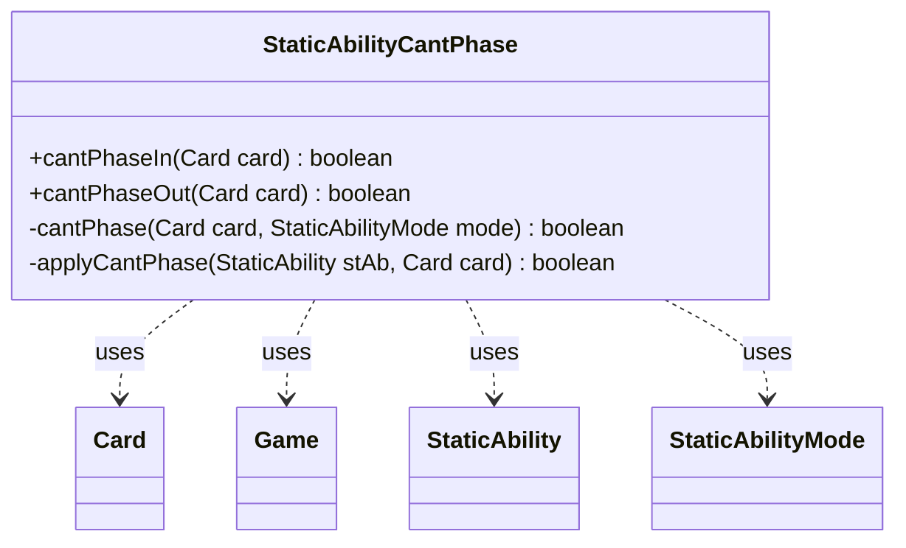

---
aliases:
  - StaticAbilityCantPhase
tags:
  - java/class
  - module/forge-game
  - pkg/forge/game/staticability
fqn: forge.game.staticability.StaticAbilityCantPhase
package: forge.game.staticability
module: forge-game
kind: Class
---

# StaticAbilityCantPhase

**Package:** `forge.game.staticability` &nbsp; **Module:** `forge-game` &nbsp; **Kind:** Class



## Relationships
**Uses:**
- [[forge.game.Game|Game]]
- [[forge.game.card.Card|Card]]
- [[forge.game.staticability.StaticAbility|StaticAbility]]
- [[forge.game.staticability.StaticAbilityMode|StaticAbilityMode]]

## Source
`forge-game/src/main/java/forge/game/staticability/StaticAbilityCantPhase.java`

```java
package forge.game.staticability;

import forge.game.Game;
import forge.game.card.Card;
import forge.game.zone.ZoneType;

public class StaticAbilityCantPhase {
    static public boolean cantPhaseIn(Card card) {
        return cantPhase(card, StaticAbilityMode.CantPhaseIn);
    }

    static public boolean cantPhaseOut(Card card) {
        return cantPhase(card, StaticAbilityMode.CantPhaseOut);
    }

    static private boolean cantPhase(Card card, StaticAbilityMode mode) {
        final Game game = card.getGame();
        for (final Card ca : game.getCardsIn(ZoneType.STATIC_ABILITIES_SOURCE_ZONES)) {
            for (final StaticAbility stAb : ca.getStaticAbilities()) {
                if (!stAb.checkConditions(mode)) {
                    continue;
                }
                if (applyCantPhase(stAb, card)) {
                    return true;
                }
            }
        }
        return false;
    }

    static private boolean applyCantPhase(StaticAbility stAb, Card card) {
        return stAb.matchesValidParam("ValidCard", card);
    }
}
```
