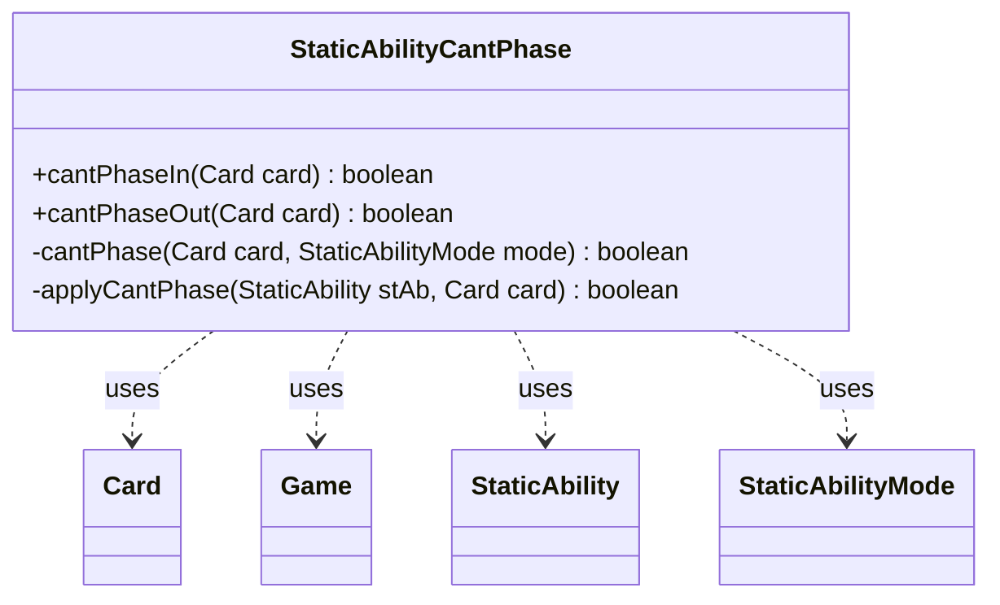

---
aliases:
  - StaticAbilityCantPhase
tags:
  - java/class
  - module/forge-game
  - pkg/forge/game/staticability
fqn: forge.game.staticability.StaticAbilityCantPhase
package: forge.game.staticability
module: forge-game
kind: Class
---

# StaticAbilityCantPhase

**Package:** `forge.game.staticability` &nbsp; **Module:** `forge-game` &nbsp; **Kind:** Class



## Relationships
**Uses:**
- [[forge.game.Game|Game]]
- [[forge.game.card.Card|Card]]
- [[forge.game.staticability.StaticAbility|StaticAbility]]
- [[forge.game.staticability.StaticAbilityMode|StaticAbilityMode]]

## Design Description

StaticAbilityCantPhase is a stateless utility that evaluates whether a given Card is currently forbidden from phasing in or phasing out by any active static ability in play. Its public `cantPhaseIn` and `cantPhaseOut` entry points delegate to a shared private `cantPhase` routine that scans every Card in the game's static-ability source zones, checks each StaticAbility's conditions against the corresponding StaticAbilityMode, and applies a `ValidCard` match to decide if the restriction affects the card.

The class is a static helper rather than a subtype of StaticAbility itself, collaborating with Card, Game, StaticAbility, and StaticAbilityMode purely through their public interfaces. This mode-driven, short-circuiting design mirrors the engine's broader family of StaticAbility-prefixed checkers, centralizing one rule category behind a small, side-effect-free API.

## Source
`forge-game/src/main/java/forge/game/staticability/StaticAbilityCantPhase.java`

```java
package forge.game.staticability;

import forge.game.Game;
import forge.game.card.Card;
import forge.game.zone.ZoneType;

public class StaticAbilityCantPhase {
    static public boolean cantPhaseIn(Card card) {
        return cantPhase(card, StaticAbilityMode.CantPhaseIn);
    }

    static public boolean cantPhaseOut(Card card) {
        return cantPhase(card, StaticAbilityMode.CantPhaseOut);
    }

    static private boolean cantPhase(Card card, StaticAbilityMode mode) {
        final Game game = card.getGame();
        for (final Card ca : game.getCardsIn(ZoneType.STATIC_ABILITIES_SOURCE_ZONES)) {
            for (final StaticAbility stAb : ca.getStaticAbilities()) {
                if (!stAb.checkConditions(mode)) {
                    continue;
                }
                if (applyCantPhase(stAb, card)) {
                    return true;
                }
            }
        }
        return false;
    }

    static private boolean applyCantPhase(StaticAbility stAb, Card card) {
        return stAb.matchesValidParam("ValidCard", card);
    }
}
```

## Python
`forge/game/staticability/StaticAbilityCantPhase.py`

```python
package: forge.game.staticability → module forge/game/staticability/StaticAbilityCantPhase.py

from forge.game.Game import Game
from forge.game.card.Card import Card
from forge.game.zone.ZoneType import ZoneType
from forge.game.staticability.StaticAbility import StaticAbility
from forge.game.staticability.StaticAbilityMode import StaticAbilityMode


class StaticAbilityCantPhase:
    @staticmethod
    def cantPhaseIn(card: Card) -> bool:
        return StaticAbilityCantPhase.cantPhase(card, StaticAbilityMode.CantPhaseIn)

    @staticmethod
    def cantPhaseOut(card: Card) -> bool:
        return StaticAbilityCantPhase.cantPhase(card, StaticAbilityMode.CantPhaseOut)

    @staticmethod
    def cantPhase(card: Card, mode: StaticAbilityMode) -> bool:
        game: Game = card.getGame()
        for ca in game.getCardsIn(ZoneType.STATIC_ABILITIES_SOURCE_ZONES):
            for stAb in ca.getStaticAbilities():
                if not stAb.checkConditions(mode):
                    continue
                if StaticAbilityCantPhase.applyCantPhase(stAb, card):
                    return True
        return False

    @staticmethod
    def applyCantPhase(stAb: StaticAbility, card: Card) -> bool:
        return stAb.matchesValidParam("ValidCard", card)
```
