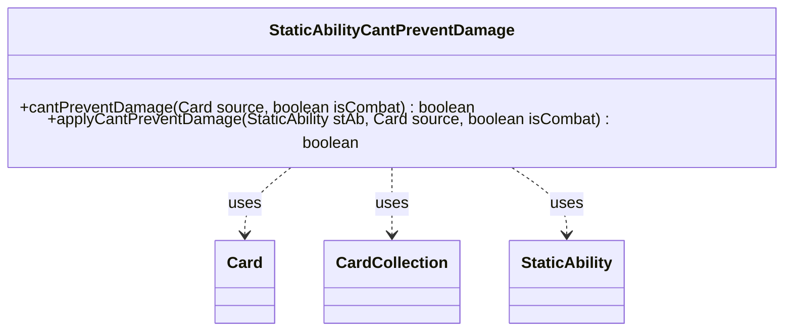

---
aliases:
  - StaticAbilityCantPreventDamage
tags:
  - java/class
  - module/forge-game
  - pkg/forge/game/staticability
fqn: forge.game.staticability.StaticAbilityCantPreventDamage
package: forge.game.staticability
module: forge-game
kind: Class
---

# StaticAbilityCantPreventDamage

**Package:** `forge.game.staticability` &nbsp; **Module:** `forge-game` &nbsp; **Kind:** Class



## Relationships
**Uses:**
- [[forge.game.card.Card|Card]]
- [[forge.game.card.CardCollection|CardCollection]]
- [[forge.game.staticability.StaticAbility|StaticAbility]]

## Design Description

StaticAbilityCantPreventDamage is a stateless utility that implements the "can't prevent damage" static-ability rule for the Forge game engine. Its two static methods resolve whether damage to a given source card may be prevented: `cantPreventDamage` gathers every relevant static-ability source on the battlefield (plus the source card itself) and scans each `StaticAbility` for one active in the `CantPreventDamage` mode, while `applyCantPreventDamage` evaluates a single ability against the source.

As a member of the `staticability` package, it collaborates with `Card` and `CardCollection` to enumerate candidates and with `StaticAbility` to check conditions and match parameters such as `IsCombat` and `ValidSource`. The purely static, side-effect-free design mirrors Forge's other static-ability handlers, centralizing one rule's logic in a focused helper rather than a stateful object, and short-circuits to `true` on the first matching ability.

## Source
`forge-game/src/main/java/forge/game/staticability/StaticAbilityCantPreventDamage.java`

```java
package forge.game.staticability;

import forge.game.card.Card;
import forge.game.card.CardCollection;
import forge.game.zone.ZoneType;

public class StaticAbilityCantPreventDamage {

    public static boolean cantPreventDamage(final Card source, final boolean isCombat) {
        CardCollection list = new CardCollection(source.getGame().getCardsIn(ZoneType.STATIC_ABILITIES_SOURCE_ZONES));
        list.add(source);
        for (final Card ca : list) {
            for (final StaticAbility stAb : ca.getStaticAbilities()) {
                if (!stAb.checkConditions(StaticAbilityMode.CantPreventDamage)) {
                    continue;
                }
                if (applyCantPreventDamage(stAb, source, isCombat)) {
                    return true;
                }
            }
        }
        return false;
    }

    public static boolean applyCantPreventDamage(final StaticAbility stAb, final Card source, final boolean isCombat) {
        if (stAb.hasParam("IsCombat")) {
            if (stAb.getParam("IsCombat").equals("True") != isCombat) {
                return false;
            }
        }

        if (!stAb.matchesValidParam("ValidSource", source)) {
            return false;
        }
        return true;
    }

}
```

## Python
`forge/game/staticability/StaticAbilityCantPreventDamage.py`

```python
package: forge.game.staticability
Output only Python.

from forge.game.card.Card import Card
from forge.game.card.CardCollection import CardCollection
from forge.game.zone.ZoneType import ZoneType
from forge.game.staticability.StaticAbility import StaticAbility
from forge.game.staticability.StaticAbilityMode import StaticAbilityMode


class StaticAbilityCantPreventDamage:

    @staticmethod
    def cantPreventDamage(source: Card, isCombat: bool) -> bool:
        list = CardCollection(source.getGame().getCardsIn(ZoneType.STATIC_ABILITIES_SOURCE_ZONES))
        list.add(source)
        for ca in list:
            for stAb in ca.getStaticAbilities():
                if not stAb.checkConditions(StaticAbilityMode.CantPreventDamage):
                    continue
                if StaticAbilityCantPreventDamage.applyCantPreventDamage(stAb, source, isCombat):
                    return True
        return False

    @staticmethod
    def applyCantPreventDamage(stAb: StaticAbility, source: Card, isCombat: bool) -> bool:
        if stAb.hasParam("IsCombat"):
            if (stAb.getParam("IsCombat") == "True") != isCombat:
                return False

        if not stAb.matchesValidParam("ValidSource", source):
            return False
        return True
```
