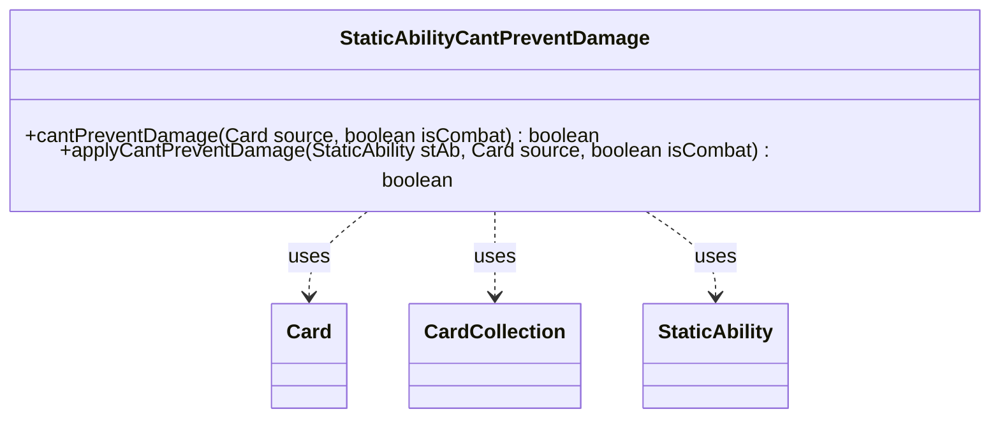

---
aliases:
  - StaticAbilityCantPreventDamage
tags:
  - java/class
  - module/forge-game
  - pkg/forge/game/staticability
fqn: forge.game.staticability.StaticAbilityCantPreventDamage
package: forge.game.staticability
module: forge-game
kind: Class
---

# StaticAbilityCantPreventDamage

**Package:** `forge.game.staticability` &nbsp; **Module:** `forge-game` &nbsp; **Kind:** Class



## Relationships
**Uses:**
- [[forge.game.card.Card|Card]]
- [[forge.game.card.CardCollection|CardCollection]]
- [[forge.game.staticability.StaticAbility|StaticAbility]]

## Source
`forge-game/src/main/java/forge/game/staticability/StaticAbilityCantPreventDamage.java`

```java
package forge.game.staticability;

import forge.game.card.Card;
import forge.game.card.CardCollection;
import forge.game.zone.ZoneType;

public class StaticAbilityCantPreventDamage {

    public static boolean cantPreventDamage(final Card source, final boolean isCombat) {
        CardCollection list = new CardCollection(source.getGame().getCardsIn(ZoneType.STATIC_ABILITIES_SOURCE_ZONES));
        list.add(source);
        for (final Card ca : list) {
            for (final StaticAbility stAb : ca.getStaticAbilities()) {
                if (!stAb.checkConditions(StaticAbilityMode.CantPreventDamage)) {
                    continue;
                }
                if (applyCantPreventDamage(stAb, source, isCombat)) {
                    return true;
                }
            }
        }
        return false;
    }

    public static boolean applyCantPreventDamage(final StaticAbility stAb, final Card source, final boolean isCombat) {
        if (stAb.hasParam("IsCombat")) {
            if (stAb.getParam("IsCombat").equals("True") != isCombat) {
                return false;
            }
        }

        if (!stAb.matchesValidParam("ValidSource", source)) {
            return false;
        }
        return true;
    }

}
```
