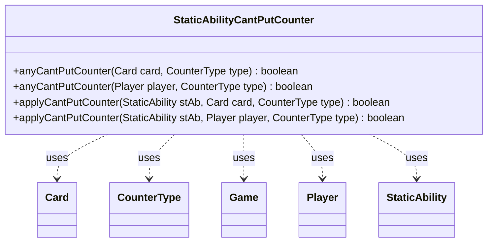

---
aliases:
  - StaticAbilityCantPutCounter
tags:
  - java/class
  - module/forge-game
  - pkg/forge/game/staticability
fqn: forge.game.staticability.StaticAbilityCantPutCounter
package: forge.game.staticability
module: forge-game
kind: Class
---

# StaticAbilityCantPutCounter

**Package:** `forge.game.staticability`   **Module:** `forge-game`   **Kind:** Class



## Relationships
**Uses:**
- [[forge.game.Game|Game]]
- [[forge.game.card.Card|Card]]
- [[forge.game.card.CounterType|CounterType]]
- [[forge.game.player.Player|Player]]
- [[forge.game.staticability.StaticAbility|StaticAbility]]

## Design Description

StaticAbilityCantPutCounter is a stateless utility that enforces "can't put counter" replacement/restriction static abilities within Forge's static-ability subsystem. Its static `anyCantPutCounter` methods scan every card in the game's static-ability source zones (obtained via the `Game` reached through a `Card` or `Player`), iterate each `StaticAbility`, filter by the `CantPutCounter` mode, and report whether any ability forbids placing a counter of the given `CounterType` on the target.

The paired `applyCantPutCounter` overloads evaluate a single ability against either a `Card` or a `Player`, matching the optional `CounterType` parameter and the `ValidCard`/`ValidPlayer` filters. As a package-level helper holding only behavior, it collaborates with `Game`, `Card`, `Player`, `CounterType`, and `StaticAbility` rather than extending any supertype—mirroring Forge's convention of one focused class per static-ability mode.

## Source
`forge-game/src/main/java/forge/game/staticability/StaticAbilityCantPutCounter.java`

```java
package forge.game.staticability;

import forge.game.Game;
import forge.game.card.Card;
import forge.game.card.CounterType;
import forge.game.player.Player;
import forge.game.zone.ZoneType;

public class StaticAbilityCantPutCounter {

    public static boolean anyCantPutCounter(final Card card, final CounterType type) {
        final Game game = card.getGame();
        for (final Card ca : game.getCardsIn(ZoneType.STATIC_ABILITIES_SOURCE_ZONES)) {
            for (final StaticAbility stAb : ca.getStaticAbilities()) {
                if (!stAb.checkConditions(StaticAbilityMode.CantPutCounter)) {
                    continue;
                }
                if (applyCantPutCounter(stAb, card, type)) {
                    return true;
                }
            }
        }
        return false;
    }

    public static boolean anyCantPutCounter(final Player player, final CounterType type) {
        final Game game = player.getGame();
        for (final Card ca : game.getCardsIn(ZoneType.STATIC_ABILITIES_SOURCE_ZONES)) {
            for (final StaticAbility stAb : ca.getStaticAbilities()) {
                if (!stAb.checkConditions(StaticAbilityMode.CantPutCounter)) {
                    continue;
                }
                if (applyCantPutCounter(stAb, player, type)) {
                    return true;
                }
            }
        }
        return false;
    }

    public static boolean applyCantPutCounter(final StaticAbility stAb, final Card card, final CounterType type) {
        if (stAb.hasParam("CounterType")) {
            CounterType t = CounterType.getType(stAb.getParam("CounterType"));
            if (t != null && !type.equals(t)) {
                return false;
            }
        }

        // for the other part
        if (!stAb.matchesValidParam("ValidCard", card)) {
            return false;
        } else if (stAb.hasParam("ValidPlayer")) {
            // for the other part
            return false;
        }
        return true;
    }

    public static boolean applyCantPutCounter(final StaticAbility stAb, final Player player, final CounterType type) {
        if (stAb.hasParam("CounterType")) {
            CounterType t = CounterType.getType(stAb.getParam("CounterType"));
            if (t != null && !type.equals(t)) {
                return false;
            }
        }

        // for the other part
        if (!stAb.matchesValidParam("ValidPlayer", player)) {
            return false;
        } else if (stAb.hasParam("ValidCard")) {
            // for the other part
            return false;
        }
        return true;
    }
}
```

## Python
`forge/game/staticability/StaticAbilityCantPutCounter.py`

```python
package forge.game.staticability

from forge.game.Game import Game
from forge.game.card.Card import Card
from forge.game.card.CounterType import CounterType
from forge.game.player.Player import Player
from forge.game.zone.ZoneType import ZoneType
from forge.game.staticability.StaticAbility import StaticAbility
from forge.game.staticability.StaticAbilityMode import StaticAbilityMode


class StaticAbilityCantPutCounter:

    @staticmethod
    def anyCantPutCounter(card: Card, type: CounterType) -> bool:
        game = card.getGame()
        for ca in game.getCardsIn(ZoneType.STATIC_ABILITIES_SOURCE_ZONES):
            for stAb in ca.getStaticAbilities():
                if not stAb.checkConditions(StaticAbilityMode.CantPutCounter):
                    continue
                if StaticAbilityCantPutCounter.applyCantPutCounter(stAb, card, type):
                    return True
        return False

    @staticmethod
    def anyCantPutCounter(player: Player, type: CounterType) -> bool:
        game = player.getGame()
        for ca in game.getCardsIn(ZoneType.STATIC_ABILITIES_SOURCE_ZONES):
            for stAb in ca.getStaticAbilities():
                if not stAb.checkConditions(StaticAbilityMode.CantPutCounter):
                    continue
                if StaticAbilityCantPutCounter.applyCantPutCounter(stAb, player, type):
                    return True
        return False

    @staticmethod
    def applyCantPutCounter(stAb: StaticAbility, card: Card, type: CounterType) -> bool:
        if stAb.hasParam("CounterType"):
            t = CounterType.getType(stAb.getParam("CounterType"))
            if t is not None and not type.equals(t):
                return False

        # for the other part
        if not stAb.matchesValidParam("ValidCard", card):
            return False
        elif stAb.hasParam("ValidPlayer"):
            # for the other part
            return False
        return True

    @staticmethod
    def applyCantPutCounter(stAb: StaticAbility, player: Player, type: CounterType) -> bool:
        if stAb.hasParam("CounterType"):
            t = CounterType.getType(stAb.getParam("CounterType"))
            if t is not None and not type.equals(t):
                return False

        # for the other part
        if not stAb.matchesValidParam("ValidPlayer", player):
            return False
        elif stAb.hasParam("ValidCard"):
            # for the other part
            return False
        return True
```
