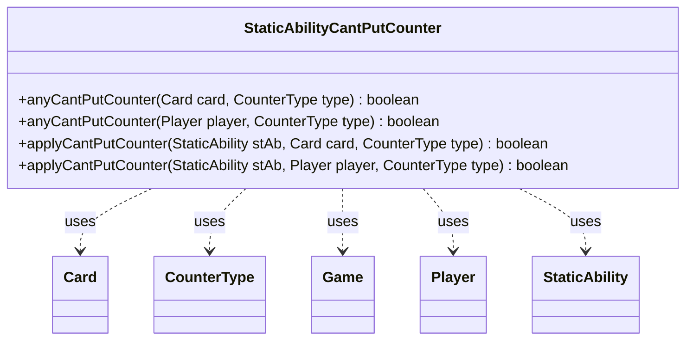

---
aliases:
  - StaticAbilityCantPutCounter
tags:
  - java/class
  - module/forge-game
  - pkg/forge/game/staticability
fqn: forge.game.staticability.StaticAbilityCantPutCounter
package: forge.game.staticability
module: forge-game
kind: Class
---

# StaticAbilityCantPutCounter

**Package:** `forge.game.staticability` &nbsp; **Module:** `forge-game` &nbsp; **Kind:** Class



## Relationships
**Uses:**
- [[forge.game.Game|Game]]
- [[forge.game.card.Card|Card]]
- [[forge.game.card.CounterType|CounterType]]
- [[forge.game.player.Player|Player]]
- [[forge.game.staticability.StaticAbility|StaticAbility]]

## Source
`forge-game/src/main/java/forge/game/staticability/StaticAbilityCantPutCounter.java`

```java
package forge.game.staticability;

import forge.game.Game;
import forge.game.card.Card;
import forge.game.card.CounterType;
import forge.game.player.Player;
import forge.game.zone.ZoneType;

public class StaticAbilityCantPutCounter {

    public static boolean anyCantPutCounter(final Card card, final CounterType type) {
        final Game game = card.getGame();
        for (final Card ca : game.getCardsIn(ZoneType.STATIC_ABILITIES_SOURCE_ZONES)) {
            for (final StaticAbility stAb : ca.getStaticAbilities()) {
                if (!stAb.checkConditions(StaticAbilityMode.CantPutCounter)) {
                    continue;
                }
                if (applyCantPutCounter(stAb, card, type)) {
                    return true;
                }
            }
        }
        return false;
    }

    public static boolean anyCantPutCounter(final Player player, final CounterType type) {
        final Game game = player.getGame();
        for (final Card ca : game.getCardsIn(ZoneType.STATIC_ABILITIES_SOURCE_ZONES)) {
            for (final StaticAbility stAb : ca.getStaticAbilities()) {
                if (!stAb.checkConditions(StaticAbilityMode.CantPutCounter)) {
                    continue;
                }
                if (applyCantPutCounter(stAb, player, type)) {
                    return true;
                }
            }
        }
        return false;
    }

    public static boolean applyCantPutCounter(final StaticAbility stAb, final Card card, final CounterType type) {
        if (stAb.hasParam("CounterType")) {
            CounterType t = CounterType.getType(stAb.getParam("CounterType"));
            if (t != null && !type.equals(t)) {
                return false;
            }
        }

        // for the other part
        if (!stAb.matchesValidParam("ValidCard", card)) {
            return false;
        } else if (stAb.hasParam("ValidPlayer")) {
            // for the other part
            return false;
        }
        return true;
    }

    public static boolean applyCantPutCounter(final StaticAbility stAb, final Player player, final CounterType type) {
        if (stAb.hasParam("CounterType")) {
            CounterType t = CounterType.getType(stAb.getParam("CounterType"));
            if (t != null && !type.equals(t)) {
                return false;
            }
        }

        // for the other part
        if (!stAb.matchesValidParam("ValidPlayer", player)) {
            return false;
        } else if (stAb.hasParam("ValidCard")) {
            // for the other part
            return false;
        }
        return true;
    }
}
```
