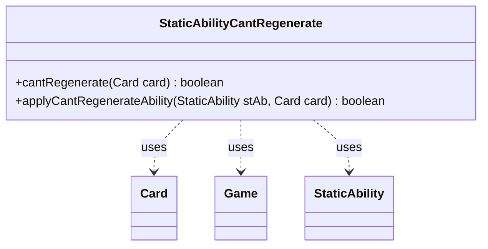

---
aliases:
  - StaticAbilityCantRegenerate
tags:
  - java/class
  - module/forge-game
  - pkg/forge/game/staticability
fqn: forge.game.staticability.StaticAbilityCantRegenerate
package: forge.game.staticability
module: forge-game
kind: Class
---

# StaticAbilityCantRegenerate

**Package:** `forge.game.staticability`   **Module:** `forge-game`   **Kind:** Class



## Relationships
**Uses:**
- [[forge.game.Game|Game]]
- [[forge.game.card.Card|Card]]
- [[forge.game.staticability.StaticAbility|StaticAbility]]

## Design Description

Static utility class that enforces Magic's "can't be regenerated" replacement effect. Its sole responsibility is to determine, for a given `Card`, whether any active static ability in the game prevents it from regenerating. The `cantRegenerate` method scans every card in the game's static-ability source zones, filters their `StaticAbility` instances to those whose mode and conditions match `CantRegenerate`, and delegates the per-card match test to `applyCantRegenerateAbility`, which validates the affected card against the ability's `ValidCard` parameter.

As a stateless collaborator, it holds no fields and exposes only static methods, reaching game state indirectly through `Card.getGame()` rather than maintaining references. This mirrors Forge's broader `StaticAbility*` family convention—each effect type isolated in its own helper that the central `StaticAbility` engine dispatches to—keeping the rules logic for one keyword cohesive and decoupled from the abilities it evaluates.

## Source
`forge-game/src/main/java/forge/game/staticability/StaticAbilityCantRegenerate.java`

```java
package forge.game.staticability;

import forge.game.Game;
import forge.game.card.Card;
import forge.game.zone.ZoneType;

public class StaticAbilityCantRegenerate {

    public static boolean cantRegenerate(final Card card)  {
        final Game game = card.getGame();
        for (final Card ca : game.getCardsIn(ZoneType.STATIC_ABILITIES_SOURCE_ZONES)) {
            for (final StaticAbility stAb : ca.getStaticAbilities()) {
                if (!stAb.checkConditions(StaticAbilityMode.CantRegenerate)) {
                    continue;
                }

                if (applyCantRegenerateAbility(stAb, card)) {
                    return true;
                }
            }
        }
        return false;
    }

    public static boolean applyCantRegenerateAbility(final StaticAbility stAb, final Card card) {
        if (!stAb.matchesValidParam("ValidCard", card)) {
            return false;
        }
        return true;
    }
}
```

## Python
`forge/game/staticability/StaticAbilityCantRegenerate.py`

```python
from forge.game.Game import Game
from forge.game.card.Card import Card
from forge.game.staticability.StaticAbility import StaticAbility
from forge.game.zone.ZoneType import ZoneType
from forge.game.staticability.StaticAbilityMode import StaticAbilityMode


class StaticAbilityCantRegenerate:

    @staticmethod
    def cantRegenerate(card: Card) -> bool:
        game = card.getGame()
        for ca in game.getCardsIn(ZoneType.STATIC_ABILITIES_SOURCE_ZONES):
            for stAb in ca.getStaticAbilities():
                if not stAb.checkConditions(StaticAbilityMode.CantRegenerate):
                    continue

                if StaticAbilityCantRegenerate.applyCantRegenerateAbility(stAb, card):
                    return True
        return False

    @staticmethod
    def applyCantRegenerateAbility(stAb: StaticAbility, card: Card) -> bool:
        if not stAb.matchesValidParam("ValidCard", card):
            return False
        return True
```
