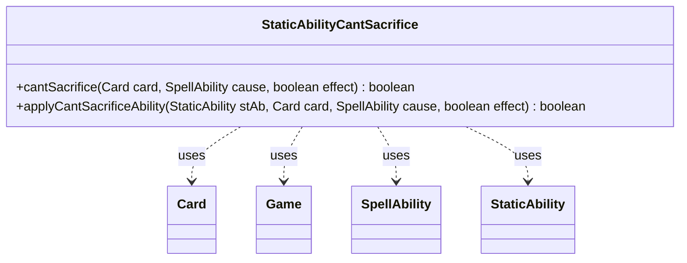

---
aliases:
  - StaticAbilityCantSacrifice
tags:
  - java/class
  - module/forge-game
  - pkg/forge/game/staticability
fqn: forge.game.staticability.StaticAbilityCantSacrifice
package: forge.game.staticability
module: forge-game
kind: Class
---

# StaticAbilityCantSacrifice

**Package:** `forge.game.staticability` &nbsp; **Module:** `forge-game` &nbsp; **Kind:** Class



## Relationships
**Uses:**
- [[forge.game.Game|Game]]
- [[forge.game.card.Card|Card]]
- [[forge.game.spellability.SpellAbility|SpellAbility]]
- [[forge.game.staticability.StaticAbility|StaticAbility]]

## Design Description

StaticAbilityCantSacrifice is a stateless utility that implements Magic's "can't be sacrificed" continuous static effect. Its static `cantSacrifice` method scans every card in the zones that can host static abilities, examining each card's static abilities for ones whose conditions match the `CantSacrifice` mode, and reports whether any forbids sacrificing the given card. The companion `applyCantSacrificeAbility` evaluates a single `StaticAbility` against the candidate card and triggering `SpellAbility` cause, checking the `ValidCard`, `ForCost`, and `ValidCause` parameters. Rather than extending `StaticAbility`, the class collaborates with it as an external rule evaluator, using `Card` to reach the `Game` and enumerate ability sources and `SpellAbility` to identify the sacrifice's cause. The purely static API and parameter-driven matching reflect Forge's data-driven approach, where card scripts declare restrictions that this class interprets uniformly.

## Source
`forge-game/src/main/java/forge/game/staticability/StaticAbilityCantSacrifice.java`

```java
package forge.game.staticability;

import forge.game.Game;
import forge.game.card.Card;
import forge.game.spellability.SpellAbility;
import forge.game.zone.ZoneType;

public class StaticAbilityCantSacrifice {

    public static boolean cantSacrifice(final Card card, final SpellAbility cause, final boolean effect)  {
        final Game game = card.getGame();
        for (final Card ca : game.getCardsIn(ZoneType.STATIC_ABILITIES_SOURCE_ZONES)) {
            for (final StaticAbility stAb : ca.getStaticAbilities()) {
                if (!stAb.checkConditions(StaticAbilityMode.CantSacrifice)) {
                    continue;
                }

                if (applyCantSacrificeAbility(stAb, card, cause, effect)) {
                    return true;
                }
            }
        }
        return false;
    }

    public static boolean applyCantSacrificeAbility(final StaticAbility stAb, final Card card, final SpellAbility cause, final boolean effect) {
        if (!stAb.matchesValidParam("ValidCard", card)) {
            return false;
        }
        if (stAb.hasParam("ForCost")) {
            if ("True".equalsIgnoreCase(stAb.getParam("ForCost")) == effect) {
                return false;
            }
        }
        if (!stAb.matchesValidParam("ValidCause", cause)) {
            return false;
        }
        return true;
    }
}
```

## Python
`forge/game/staticability/StaticAbilityCantSacrifice.py`

```python
from forge.game.Game import Game
from forge.game.card.Card import Card
from forge.game.spellability.SpellAbility import SpellAbility
from forge.game.zone.ZoneType import ZoneType
from forge.game.staticability.StaticAbility import StaticAbility
from forge.game.staticability.StaticAbilityMode import StaticAbilityMode


class StaticAbilityCantSacrifice:

    @staticmethod
    def cantSacrifice(card: Card, cause: SpellAbility, effect: bool) -> bool:
        game = card.getGame()
        for ca in game.getCardsIn(ZoneType.STATIC_ABILITIES_SOURCE_ZONES):
            for stAb in ca.getStaticAbilities():
                if not stAb.checkConditions(StaticAbilityMode.CantSacrifice):
                    continue

                if StaticAbilityCantSacrifice.applyCantSacrificeAbility(stAb, card, cause, effect):
                    return True
        return False

    @staticmethod
    def applyCantSacrificeAbility(stAb: StaticAbility, card: Card, cause: SpellAbility, effect: bool) -> bool:
        if not stAb.matchesValidParam("ValidCard", card):
            return False
        if stAb.hasParam("ForCost"):
            if ("True".lower() == stAb.getParam("ForCost").lower()) == effect:
                return False
        if not stAb.matchesValidParam("ValidCause", cause):
            return False
        return True
```
