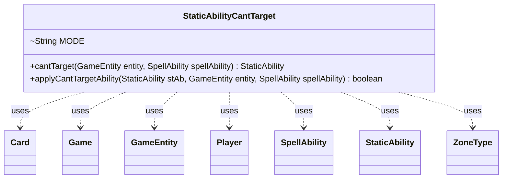

---
aliases:
  - StaticAbilityCantTarget
tags:
  - java/class
  - module/forge-game
  - pkg/forge/game/staticability
fqn: forge.game.staticability.StaticAbilityCantTarget
package: forge.game.staticability
module: forge-game
kind: Class
---

# StaticAbilityCantTarget

**Package:** `forge.game.staticability` &nbsp; **Module:** `forge-game` &nbsp; **Kind:** Class



## Relationships
**Uses:**
- [[forge.game.Game|Game]]
- [[forge.game.GameEntity|GameEntity]]
- [[forge.game.card.Card|Card]]
- [[forge.game.player.Player|Player]]
- [[forge.game.spellability.SpellAbility|SpellAbility]]
- [[forge.game.staticability.StaticAbility|StaticAbility]]
- [[forge.game.zone.ZoneType|ZoneType]]

## Design Description

StaticAbilityCantTarget is a stateless static-rules helper in Forge's `staticability` package that determines whether continuous "can't be targeted" effects (hexproof, shroud, and custom restrictions) prohibit a given `SpellAbility` from targeting a particular `GameEntity`. Its `cantTarget` method sweeps every `StaticAbility` on cards in the relevant zones of the `Game`, checks each one's conditions, and returns the first ability that forbids the target; `applyCantTargetAbility` evaluates a single ability against the entity and spell.

Like its sibling static-ability classes, it is a final-utility-style collection of static methods keyed by a `MODE` constant rather than an instantiated object, collaborating with `Card`, `Player`, `ZoneType`, and `StaticAbility` to interpret restriction parameters. Notable design intent includes zone-aware filtering (`AffectedZone`, battlefield default, Stack-special cases), delegation to `StaticAbilityIgnoreHexproofShroud` for hexproof/shroud exceptions, and bespoke `SourceCanOnlyTarget` logic that walks Charm sub-abilities to validate targeting clauses.

## Source
`forge-game/src/main/java/forge/game/staticability/StaticAbilityCantTarget.java`

```java
/*
 * Forge: Play Magic: the Gathering.
 * Copyright (C) 2011  Forge Team
 *
 * This program is free software: you can redistribute it and/or modify
 * it under the terms of the GNU General Public License as published by
 * the Free Software Foundation, either version 3 of the License, or
 * (at your option) any later version.
 *
 * This program is distributed in the hope that it will be useful,
 * but WITHOUT ANY WARRANTY; without even the implied warranty of
 * MERCHANTABILITY or FITNESS FOR A PARTICULAR PURPOSE.  See the
 * GNU General Public License for more details.
 *
 * You should have received a copy of the GNU General Public License
 * along with this program.  If not, see <http://www.gnu.org/licenses/>.
 */
package forge.game.staticability;

import java.util.Iterator;
import java.util.List;
import java.util.Set;

import com.google.common.collect.Lists;

import forge.game.Game;
import forge.game.GameEntity;
import forge.game.ability.ApiType;
import forge.game.card.Card;
import forge.game.keyword.Keyword;
import forge.game.player.Player;
import forge.game.spellability.SpellAbility;
import forge.game.zone.ZoneType;

/**
 * The Class StaticAbilityCantTarget.
 */
public class StaticAbilityCantTarget {

    static String MODE = "CantTarget";

    public static StaticAbility cantTarget(final GameEntity entity, final SpellAbility spellAbility)  {
        final Game game = entity.getGame();
        for (final Card ca : game.getCardsIn(ZoneType.STATIC_ABILITIES_SOURCE_ZONES)) {
            for (final StaticAbility stAb : ca.getStaticAbilities()) {
                if (!stAb.checkConditions(StaticAbilityMode.CantTarget)) {
                    continue;
                }

                if (applyCantTargetAbility(stAb, entity, spellAbility)) {
                    return stAb;
                }
            }
        }
        return null;
    }

    /**
     * Apply can't target ability.
     *
     * @param stAb
     *            the static ability
     * @param card
     *            the card
     * @param spellAbility
     *            the spell/ability
     * @return true, if successful
     */
    public static boolean applyCantTargetAbility(final StaticAbility stAb, final GameEntity entity, final SpellAbility spellAbility) {
        if (entity instanceof Card card) {
            if (stAb.hasParam("AffectedZone")) {
                if (ZoneType.listValueOf(stAb.getParam("AffectedZone")).stream().noneMatch(zt -> card.isInZone(zt))) {
                    return false;
                }
            } else if (!card.isInPlay()) { // default zone is battlefield
                return false;
            }
            Set<ZoneType> zones = stAb.getActiveZone();

            if (zones != null && zones.contains(ZoneType.Stack)) {
                // Enthralling Hold: only works if it wasn't already cast
                if (card.getGame().getStack().getSpellMatchingHost(spellAbility.getHostCard()) != null) {
                    return false;
                }
            }
        } else if (stAb.hasParam("AffectedZone")) {
            return false;
        }

        final Card source = spellAbility.getHostCard();
        final Player activator = spellAbility.getActivatingPlayer();

        if ((stAb.isKeyword(Keyword.HEXPROOF) || stAb.isKeyword(Keyword.SHROUD)) && StaticAbilityIgnoreHexproofShroud.ignore(entity, spellAbility, stAb)) {
            return false;
        }

        if (!stAb.matchesValidParam("ValidTarget", entity)) {
            return false;
        }

        if (!stAb.matchesValidParam("ValidSA", spellAbility)) {
            return false;
        }

        if (!stAb.matchesValidParam("ValidSource", source)) {
            return false;
        }

        if (!stAb.matchesValidParam("Activator", activator)) {
            return false;
        }

        if (stAb.hasParam("SourceCanOnlyTarget")) {
            SpellAbility root = spellAbility.getRootAbility();
            List<SpellAbility> choices = null;
            if (root.getApi() == ApiType.Charm) {
                choices = Lists.newArrayList(root.getAdditionalAbilityList("Choices"));
            } else {
                choices = Lists.newArrayList(root);
            }
            Iterator<SpellAbility> it = choices.iterator();
            SpellAbility next = it.next();
            while (next != null) {
                if (next.usesTargeting() && (!next.getParam("ValidTgts").contains(stAb.getParam("SourceCanOnlyTarget"))
                        || next.getParam("ValidTgts").contains(",")
                        || next.getParam("ValidTgts").contains("non" + stAb.getParam("SourceCanOnlyTarget")))) {
                    return false;
                }
                next = next.getSubAbility();
                if (next == null && it.hasNext()) {
                    next = it.next();
                }
            }
        }

        return true;
    }
}
```

## Python
`forge/game/staticability/StaticAbilityCantTarget.py`

```python
from forge.game.Game import Game
from forge.game.GameEntity import GameEntity
from forge.game.ability.ApiType import ApiType
from forge.game.card.Card import Card
from forge.game.keyword.Keyword import Keyword
from forge.game.player.Player import Player
from forge.game.spellability.SpellAbility import SpellAbility
from forge.game.staticability.StaticAbility import StaticAbility
from forge.game.staticability.StaticAbilityMode import StaticAbilityMode
from forge.game.staticability.StaticAbilityIgnoreHexproofShroud import StaticAbilityIgnoreHexproofShroud
from forge.game.zone.ZoneType import ZoneType


class StaticAbilityCantTarget:
    """The Class StaticAbilityCantTarget."""

    MODE = "CantTarget"

    @staticmethod
    def cantTarget(entity: GameEntity, spellAbility: SpellAbility) -> StaticAbility:
        game = entity.getGame()
        for ca in game.getCardsIn(ZoneType.STATIC_ABILITIES_SOURCE_ZONES):
            for stAb in ca.getStaticAbilities():
                if not stAb.checkConditions(StaticAbilityMode.CantTarget):
                    continue

                if StaticAbilityCantTarget.applyCantTargetAbility(stAb, entity, spellAbility):
                    return stAb
        return None

    @staticmethod
    def applyCantTargetAbility(stAb: StaticAbility, entity: GameEntity, spellAbility: SpellAbility) -> bool:
        """Apply can't target ability.

        :param stAb: the static ability
        :param entity: the card
        :param spellAbility: the spell/ability
        :return: true, if successful
        """
        if isinstance(entity, Card):
            card = entity
            if stAb.hasParam("AffectedZone"):
                if not any(card.isInZone(zt) for zt in ZoneType.listValueOf(stAb.getParam("AffectedZone"))):
                    return False
            elif not card.isInPlay():  # default zone is battlefield
                return False
            zones = stAb.getActiveZone()

            if zones is not None and ZoneType.Stack in zones:
                # Enthralling Hold: only works if it wasn't already cast
                if card.getGame().getStack().getSpellMatchingHost(spellAbility.getHostCard()) is not None:
                    return False
        elif stAb.hasParam("AffectedZone"):
            return False

        source = spellAbility.getHostCard()
        activator = spellAbility.getActivatingPlayer()

        if (stAb.isKeyword(Keyword.HEXPROOF) or stAb.isKeyword(Keyword.SHROUD)) and StaticAbilityIgnoreHexproofShroud.ignore(entity, spellAbility, stAb):
            return False

        if not stAb.matchesValidParam("ValidTarget", entity):
            return False

        if not stAb.matchesValidParam("ValidSA", spellAbility):
            return False

        if not stAb.matchesValidParam("ValidSource", source):
            return False

        if not stAb.matchesValidParam("Activator", activator):
            return False

        if stAb.hasParam("SourceCanOnlyTarget"):
            root = spellAbility.getRootAbility()
            if root.getApi() == ApiType.Charm:
                choices = list(root.getAdditionalAbilityList("Choices"))
            else:
                choices = [root]
            it = iter(choices)
            next_ = next(it, None)
            while next_ is not None:
                if next_.usesTargeting() and (stAb.getParam("SourceCanOnlyTarget") not in next_.getParam("ValidTgts")
                        or "," in next_.getParam("ValidTgts")
                        or ("non" + stAb.getParam("SourceCanOnlyTarget")) in next_.getParam("ValidTgts")):
                    return False
                next_ = next_.getSubAbility()
                if next_ is None:
                    next_ = next(it, None)

        return True
```
