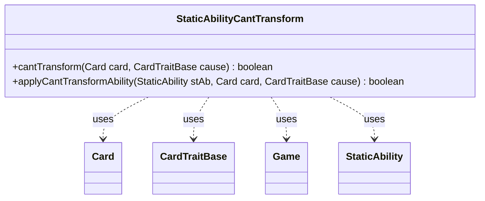

---
aliases:
  - StaticAbilityCantTransform
tags:
  - java/class
  - module/forge-game
  - pkg/forge/game/staticability
fqn: forge.game.staticability.StaticAbilityCantTransform
package: forge.game.staticability
module: forge-game
kind: Class
---

# StaticAbilityCantTransform

**Package:** `forge.game.staticability` &nbsp; **Module:** `forge-game` &nbsp; **Kind:** Class



## Relationships
**Uses:**
- [[forge.game.CardTraitBase|CardTraitBase]]
- [[forge.game.Game|Game]]
- [[forge.game.card.Card|Card]]
- [[forge.game.staticability.StaticAbility|StaticAbility]]

## Design Description

StaticAbilityCantTransform is a stateless utility that enforces "can't transform" continuous static effects within the game's rules engine. Its static `cantTransform` method scans every card in the active static-ability source zones, evaluates each `StaticAbility` whose conditions match the `CantTransform` mode, and reports whether the given `Card` is currently barred from transforming. The companion `applyCantTransformAbility` performs the per-ability match, checking the `ValidCard` filter and honoring an optional `ExceptCause` exemption tied to the originating `CardTraitBase`.

Rather than implementing an interface, the class follows the package's convention of grouping a single static-ability mode into a dedicated final-style helper, collaborating with `Card`, `Game`, and `StaticAbility` to resolve restrictions on demand. Threading `cause` through both methods lets callers exempt the effect that triggered the transformation, keeping the restriction logic centralized and side-effect free.

## Source
`forge-game/src/main/java/forge/game/staticability/StaticAbilityCantTransform.java`

```java
package forge.game.staticability;

import forge.game.CardTraitBase;
import forge.game.Game;
import forge.game.card.Card;
import forge.game.zone.ZoneType;

public class StaticAbilityCantTransform {

    static public boolean cantTransform(Card card, CardTraitBase cause) {
        final Game game = card.getGame();
        for (final Card ca : game.getCardsIn(ZoneType.STATIC_ABILITIES_SOURCE_ZONES)) {
            for (final StaticAbility stAb : ca.getStaticAbilities()) {
                if (!stAb.checkConditions(StaticAbilityMode.CantTransform)) {
                    continue;
                }
                if (applyCantTransformAbility(stAb, card, cause)) {
                    return true;
                }
            }
        }
        return false;
    }

    static public boolean applyCantTransformAbility(StaticAbility stAb, Card card, CardTraitBase cause) {
        if (!stAb.matchesValidParam("ValidCard", card)) {
            return false;
        }
        if (stAb.hasParam("ExceptCause")) {
            if (stAb.matchesValidParam("ExceptCause", cause)) {
                return false;
            }
        }
        return true;
    }
}
```

## Python
`forge/game/staticability/StaticAbilityCantTransform.py`

```python
from forge.game.CardTraitBase import CardTraitBase
from forge.game.Game import Game
from forge.game.card.Card import Card
from forge.game.zone.ZoneType import ZoneType
from forge.game.staticability.StaticAbility import StaticAbility
from forge.game.staticability.StaticAbilityMode import StaticAbilityMode


class StaticAbilityCantTransform:

    @staticmethod
    def cantTransform(card: Card, cause: CardTraitBase) -> bool:
        game = card.getGame()
        for ca in game.getCardsIn(ZoneType.STATIC_ABILITIES_SOURCE_ZONES):
            for stAb in ca.getStaticAbilities():
                if not stAb.checkConditions(StaticAbilityMode.CantTransform):
                    continue
                if StaticAbilityCantTransform.applyCantTransformAbility(stAb, card, cause):
                    return True
        return False

    @staticmethod
    def applyCantTransformAbility(stAb: StaticAbility, card: Card, cause: CardTraitBase) -> bool:
        if not stAb.matchesValidParam("ValidCard", card):
            return False
        if stAb.hasParam("ExceptCause"):
            if stAb.matchesValidParam("ExceptCause", cause):
                return False
        return True
```
