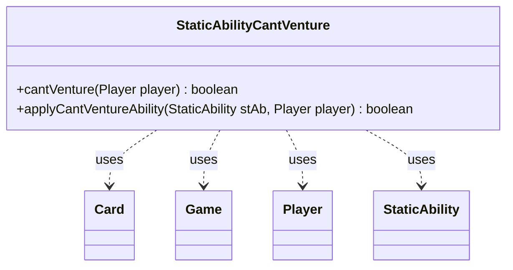

---
aliases:
  - StaticAbilityCantVenture
tags:
  - java/class
  - module/forge-game
  - pkg/forge/game/staticability
fqn: forge.game.staticability.StaticAbilityCantVenture
package: forge.game.staticability
module: forge-game
kind: Class
---

# StaticAbilityCantVenture

**Package:** `forge.game.staticability`   **Module:** `forge-game`   **Kind:** Class



## Relationships
**Uses:**
- [[forge.game.Game|Game]]
- [[forge.game.card.Card|Card]]
- [[forge.game.player.Player|Player]]
- [[forge.game.staticability.StaticAbility|StaticAbility]]

## Design Description

StaticAbilityCantVenture is a stateless utility class in the static-ability subsystem that determines whether a given Player is currently forbidden from performing the "venture" action. Its static `cantVenture` method scans every Card in the static-ability source zones, iterates each Card's StaticAbility instances, and—after filtering by the `CantVenture` mode condition—delegates to `applyCantVentureAbility` to test whether the ability's `ValidPlayer` parameter matches the target player; a single match short-circuits to true.

Rather than implementing an interface, the class follows the convention of its sibling `StaticAbility*` helpers, collaborating with Game and Card for zone traversal and with StaticAbility for condition checking and parameter matching. The all-static, no-state design keeps the rule evaluation a pure query, centralizing one continuous static effect in a focused, side-effect-free lookup.

## Source
`forge-game/src/main/java/forge/game/staticability/StaticAbilityCantVenture.java`

```java
package forge.game.staticability;

import forge.game.Game;
import forge.game.card.Card;
import forge.game.player.Player;
import forge.game.zone.ZoneType;

public class StaticAbilityCantVenture {

    static public boolean cantVenture(Player player) {
        final Game game = player.getGame();
        for (final Card ca : game.getCardsIn(ZoneType.STATIC_ABILITIES_SOURCE_ZONES)) {
            for (final StaticAbility stAb : ca.getStaticAbilities()) {
                if (!stAb.checkConditions(StaticAbilityMode.CantVenture)) {
                    continue;
                }
                if (applyCantVentureAbility(stAb, player)) {
                    return true;
                }
            }
        }
        return false;
    }

    static public boolean applyCantVentureAbility(StaticAbility stAb, Player player) {
        if (!stAb.matchesValidParam("ValidPlayer", player)) {
            return false;
        }
        return true;
    }
}
```

## Python
`forge/game/staticability/StaticAbilityCantVenture.py`

```python
from forge.game.Game import Game
from forge.game.card.Card import Card
from forge.game.player.Player import Player
from forge.game.staticability.StaticAbility import StaticAbility
from forge.game.zone.ZoneType import ZoneType


class StaticAbilityCantVenture:

    @staticmethod
    def cantVenture(player):
        game = player.getGame()
        for ca in game.getCardsIn(ZoneType.STATIC_ABILITIES_SOURCE_ZONES):
            for stAb in ca.getStaticAbilities():
                if not stAb.checkConditions(StaticAbilityMode.CantVenture):
                    continue
                if StaticAbilityCantVenture.applyCantVentureAbility(stAb, player):
                    return True
        return False

    @staticmethod
    def applyCantVentureAbility(stAb, player):
        if not stAb.matchesValidParam("ValidPlayer", player):
            return False
        return True
```
