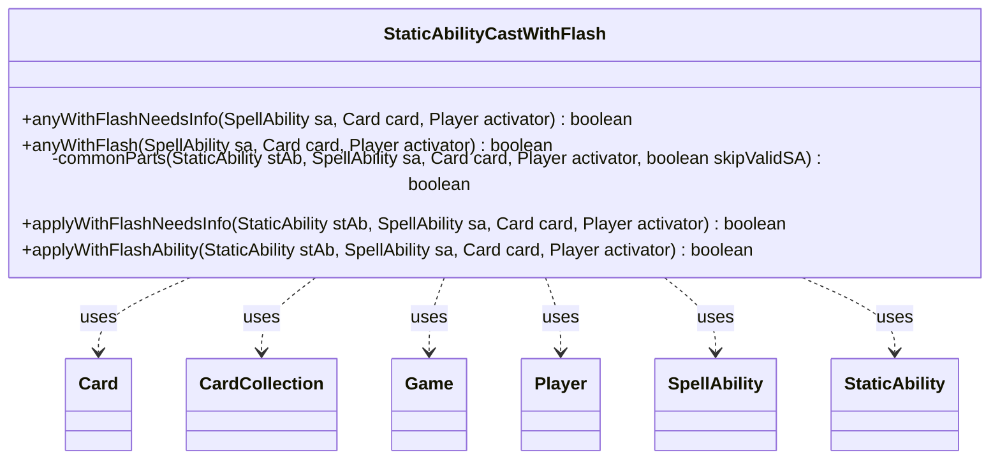

---
aliases:
  - StaticAbilityCastWithFlash
tags:
  - java/class
  - module/forge-game
  - pkg/forge/game/staticability
fqn: forge.game.staticability.StaticAbilityCastWithFlash
package: forge.game.staticability
module: forge-game
kind: Class
---

# StaticAbilityCastWithFlash

**Package:** `forge.game.staticability`   **Module:** `forge-game`   **Kind:** Class



## Relationships
**Uses:**
- [[forge.game.Game|Game]]
- [[forge.game.card.Card|Card]]
- [[forge.game.card.CardCollection|CardCollection]]
- [[forge.game.player.Player|Player]]
- [[forge.game.spellability.SpellAbility|SpellAbility]]
- [[forge.game.staticability.StaticAbility|StaticAbility]]

## Design Description

StaticAbilityCastWithFlash is a stateless utility class in the static-ability subsystem that determines whether a spell or ability may be cast with flash (at instant speed) by virtue of some active continuous static effect. Its static query methods, anyWithFlash and anyWithFlashNeedsInfo, scan every relevant Card across the game's static-ability source zones (plus the card in question), filter their StaticAbilities to those in CastWithFlash mode, and test each against the proposed SpellAbility, Card, and activating Player.

Unlike most members of the package, it does not extend StaticAbility but instead operates on those objects, collaborating with Game, CardCollection, Card, Player, and SpellAbility. The private commonParts helper centralizes the ValidCard/ValidSA/Caster predicate matching, while the parallel "NeedsInfo" path signals when targeting or X-cost details must be resolved before the permission can be decided—deferring evaluation that depends on not-yet-chosen information.

## Source
`forge-game/src/main/java/forge/game/staticability/StaticAbilityCastWithFlash.java`

```java
package forge.game.staticability;

import forge.game.Game;
import forge.game.card.Card;
import forge.game.card.CardCollection;
import forge.game.player.Player;
import forge.game.spellability.SpellAbility;
import forge.game.zone.ZoneType;

public class StaticAbilityCastWithFlash {

    public static boolean anyWithFlashNeedsInfo(final SpellAbility sa, final Card card, final Player activator) {
        final Game game = activator.getGame();
        final CardCollection allp = new CardCollection(game.getCardsIn(ZoneType.STATIC_ABILITIES_SOURCE_ZONES));
        allp.add(card);
        for (final Card ca : allp) {
            for (final StaticAbility stAb : ca.getStaticAbilities()) {
                if (!stAb.checkConditions(StaticAbilityMode.CastWithFlash)) {
                    continue;
                }
                if (applyWithFlashNeedsInfo(stAb, sa, card, activator)) {
                    return true;
                }
            }
        }
        return false;
    }

    public static boolean anyWithFlash(final SpellAbility sa, final Card card, final Player activator) {
        final Game game = activator.getGame();
        final CardCollection allp = new CardCollection(game.getCardsIn(ZoneType.STATIC_ABILITIES_SOURCE_ZONES));
        allp.add(card);
        for (final Card ca : allp) {
            for (final StaticAbility stAb : ca.getStaticAbilities()) {
                if (!stAb.checkConditions(StaticAbilityMode.CastWithFlash)) {
                    continue;
                }
                if (applyWithFlashAbility(stAb, sa, card, activator)) {
                    return true;
                }
            }
        }
        return false;
    }

    private static boolean commonParts(final StaticAbility stAb, final SpellAbility sa, final Card card, final Player activator, final boolean skipValidSA) {
        if (!stAb.matchesValidParam("ValidCard", card)) {
            return false;
        }

        if (!skipValidSA) {
            if (!stAb.matchesValidParam("ValidSA", sa)) {
                return false;
            }
        }

        if (!stAb.matchesValidParam("Caster", activator)) {
            return false;
        }
        return true;
    }

    public static boolean applyWithFlashNeedsInfo(final StaticAbility stAb, final SpellAbility sa, final Card card, final Player activator) {
        boolean info = false;
        String validSA = stAb.getParamOrDefault("ValidSA", "");
        if (validSA.contains("IsTargeting") || validSA.contains("XCost")) {
            info = true;
        }
        if (!commonParts(stAb, sa, card, activator, info)) {
            return false;
        }

        return info;
    }

    public static boolean applyWithFlashAbility(final StaticAbility stAb, final SpellAbility sa, final Card card, final Player activator) {
        if (!commonParts(stAb, sa, card, activator, false)) {
            return false;
        }

        return true;
    }
}
```

## Python
`forge/game/staticability/StaticAbilityCastWithFlash.py`

```python
from forge.game.Game import Game
from forge.game.card.Card import Card
from forge.game.card.CardCollection import CardCollection
from forge.game.player.Player import Player
from forge.game.spellability.SpellAbility import SpellAbility
from forge.game.staticability.StaticAbility import StaticAbility
from forge.game.staticability.StaticAbilityMode import StaticAbilityMode
from forge.game.zone.ZoneType import ZoneType


class StaticAbilityCastWithFlash:

    @staticmethod
    def anyWithFlashNeedsInfo(sa: SpellAbility, card: Card, activator: Player) -> bool:
        game = activator.getGame()
        allp = CardCollection(game.getCardsIn(ZoneType.STATIC_ABILITIES_SOURCE_ZONES))
        allp.add(card)
        for ca in allp:
            for stAb in ca.getStaticAbilities():
                if not stAb.checkConditions(StaticAbilityMode.CastWithFlash):
                    continue
                if StaticAbilityCastWithFlash.applyWithFlashNeedsInfo(stAb, sa, card, activator):
                    return True
        return False

    @staticmethod
    def anyWithFlash(sa: SpellAbility, card: Card, activator: Player) -> bool:
        game = activator.getGame()
        allp = CardCollection(game.getCardsIn(ZoneType.STATIC_ABILITIES_SOURCE_ZONES))
        allp.add(card)
        for ca in allp:
            for stAb in ca.getStaticAbilities():
                if not stAb.checkConditions(StaticAbilityMode.CastWithFlash):
                    continue
                if StaticAbilityCastWithFlash.applyWithFlashAbility(stAb, sa, card, activator):
                    return True
        return False

    @staticmethod
    def commonParts(stAb: StaticAbility, sa: SpellAbility, card: Card, activator: Player, skipValidSA: bool) -> bool:
        if not stAb.matchesValidParam("ValidCard", card):
            return False

        if not skipValidSA:
            if not stAb.matchesValidParam("ValidSA", sa):
                return False

        if not stAb.matchesValidParam("Caster", activator):
            return False
        return True

    @staticmethod
    def applyWithFlashNeedsInfo(stAb: StaticAbility, sa: SpellAbility, card: Card, activator: Player) -> bool:
        info = False
        validSA = stAb.getParamOrDefault("ValidSA", "")
        if "IsTargeting" in validSA or "XCost" in validSA:
            info = True
        if not StaticAbilityCastWithFlash.commonParts(stAb, sa, card, activator, info):
            return False

        return info

    @staticmethod
    def applyWithFlashAbility(stAb: StaticAbility, sa: SpellAbility, card: Card, activator: Player) -> bool:
        if not StaticAbilityCastWithFlash.commonParts(stAb, sa, card, activator, False):
            return False

        return True
```
