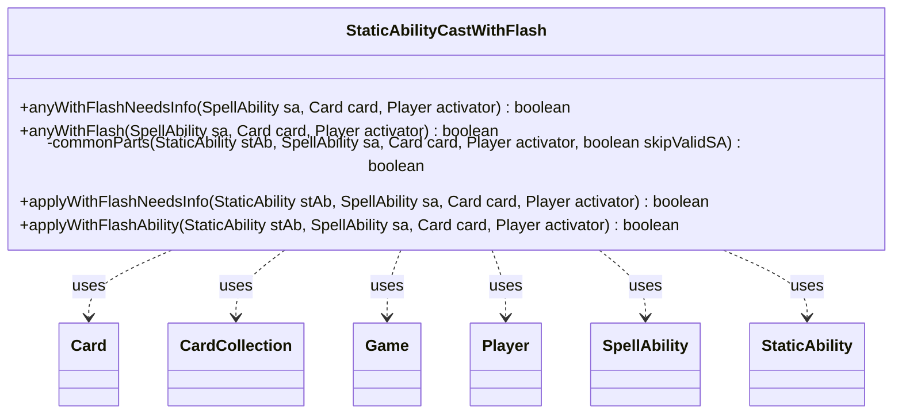

---
aliases:
  - StaticAbilityCastWithFlash
tags:
  - java/class
  - module/forge-game
  - pkg/forge/game/staticability
fqn: forge.game.staticability.StaticAbilityCastWithFlash
package: forge.game.staticability
module: forge-game
kind: Class
---

# StaticAbilityCastWithFlash

**Package:** `forge.game.staticability` &nbsp; **Module:** `forge-game` &nbsp; **Kind:** Class



## Relationships
**Uses:**
- [[forge.game.Game|Game]]
- [[forge.game.card.Card|Card]]
- [[forge.game.card.CardCollection|CardCollection]]
- [[forge.game.player.Player|Player]]
- [[forge.game.spellability.SpellAbility|SpellAbility]]
- [[forge.game.staticability.StaticAbility|StaticAbility]]

## Source
`forge-game/src/main/java/forge/game/staticability/StaticAbilityCastWithFlash.java`

```java
package forge.game.staticability;

import forge.game.Game;
import forge.game.card.Card;
import forge.game.card.CardCollection;
import forge.game.player.Player;
import forge.game.spellability.SpellAbility;
import forge.game.zone.ZoneType;

public class StaticAbilityCastWithFlash {

    public static boolean anyWithFlashNeedsInfo(final SpellAbility sa, final Card card, final Player activator) {
        final Game game = activator.getGame();
        final CardCollection allp = new CardCollection(game.getCardsIn(ZoneType.STATIC_ABILITIES_SOURCE_ZONES));
        allp.add(card);
        for (final Card ca : allp) {
            for (final StaticAbility stAb : ca.getStaticAbilities()) {
                if (!stAb.checkConditions(StaticAbilityMode.CastWithFlash)) {
                    continue;
                }
                if (applyWithFlashNeedsInfo(stAb, sa, card, activator)) {
                    return true;
                }
            }
        }
        return false;
    }

    public static boolean anyWithFlash(final SpellAbility sa, final Card card, final Player activator) {
        final Game game = activator.getGame();
        final CardCollection allp = new CardCollection(game.getCardsIn(ZoneType.STATIC_ABILITIES_SOURCE_ZONES));
        allp.add(card);
        for (final Card ca : allp) {
            for (final StaticAbility stAb : ca.getStaticAbilities()) {
                if (!stAb.checkConditions(StaticAbilityMode.CastWithFlash)) {
                    continue;
                }
                if (applyWithFlashAbility(stAb, sa, card, activator)) {
                    return true;
                }
            }
        }
        return false;
    }

    private static boolean commonParts(final StaticAbility stAb, final SpellAbility sa, final Card card, final Player activator, final boolean skipValidSA) {
        if (!stAb.matchesValidParam("ValidCard", card)) {
            return false;
        }

        if (!skipValidSA) {
            if (!stAb.matchesValidParam("ValidSA", sa)) {
                return false;
            }
        }

        if (!stAb.matchesValidParam("Caster", activator)) {
            return false;
        }
        return true;
    }

    public static boolean applyWithFlashNeedsInfo(final StaticAbility stAb, final SpellAbility sa, final Card card, final Player activator) {
        boolean info = false;
        String validSA = stAb.getParamOrDefault("ValidSA", "");
        if (validSA.contains("IsTargeting") || validSA.contains("XCost")) {
            info = true;
        }
        if (!commonParts(stAb, sa, card, activator, info)) {
            return false;
        }

        return info;
    }

    public static boolean applyWithFlashAbility(final StaticAbility stAb, final SpellAbility sa, final Card card, final Player activator) {
        if (!commonParts(stAb, sa, card, activator, false)) {
            return false;
        }

        return true;
    }
}
```
